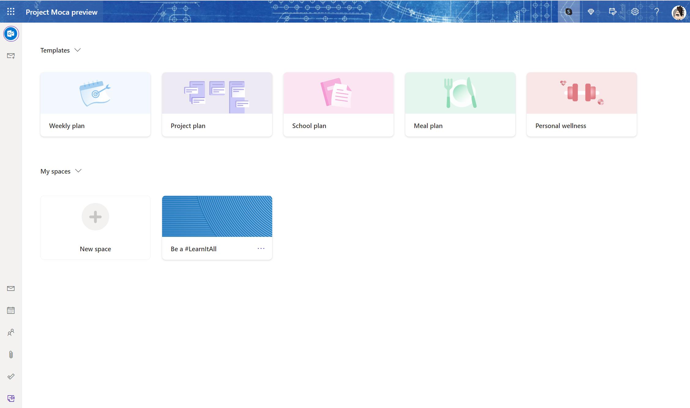
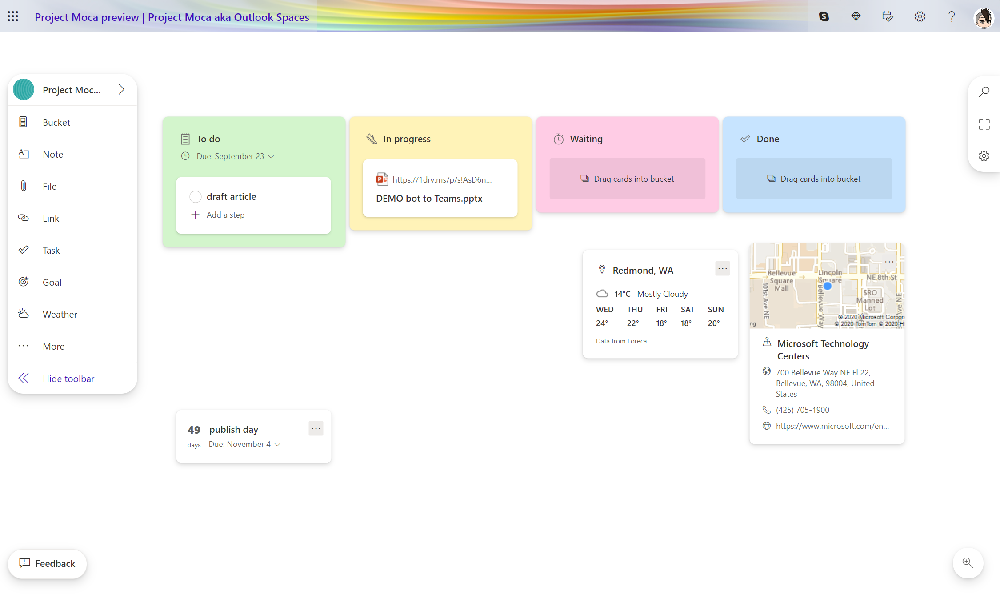

# Yet another Tool? Why you will probably love Project Moca aka Outlook Spaces

[!INCLUDE [content-disclaimer](includes/content-disclaimer.md)]

Outlook Spaces is now officially in preview and like many others, I wondered which place in Microsoft 365 it has and how users can benefit from it.

## What is Outlook Spaces

Outlook Spaces is a dynamic space in which you can aggregate information from your projects in a more visual way. It is a canvas similar to Microsoft Whiteboard, but without the ability to draw on. You can add notes, files, links, tasks, goals, emails and events, cards for weather, people and locations and organize all of that in buckets. Users, who are already familiar with Microsoft Planner will recognize this concept easily.

You can access Outlook Spaces in Outlook on the web. Right now it's likely that you will need to log in with your personal account to try it out as only a limited number of work accounts are enabled for that. Remember, it's still in preview but still worth a try. Find Spaces/Project Moca in the module switcher on the lower left hand corner of Outlook on the web. If you can’t see it, click on the '...' ellipsis.

Additional information for admins: This feature is shipped off by default. You can enable it via PowerShell. For reference check [Set-OwaMailboxPolicy](/powershell/module/exchange/set-owamailboxpolicy).

## Which use cases will Outlook Spaces serve

Following its purpose of making organizing all the different workloads a bit easier, Outlook Spaces is a nice feature of Outlook on the web that allows users to have one big overview to see the whole picture of their work in one place. Many users ask for that single pane of glass - we know this pretty well from years of discussion about the 'when to use what' question in Microsoft 365. Having a personal space to track and organize what matters to you without relying on different structures that others defined for you (e.g. in different Microsoft Teams teams) will take into account the unique needs of users. Project Moca enables people to group information, tasks, files, and more in a context that makes sense to them as an individual. This ensures that they build their own visual synopsis in a digital tool.

## Is it a project management tool

 Note that in the 'project management' template you get some predefined buckets called 'to do', 'in progress', 'waiting' and 'done', following the Kanban board methodology. Those buckets don't have any impact on the emails, events, and especially To Do tasks which you drag them into. This means that even if you move a task from the bucket 'in progress' to 'done', this won't change the status of the task from 'not started' to 'completed'. Seems pretty logical to me, as To Do tasks only have two status: 'not started' and 'completed'. My take on the approach of Spaces: Outlook Spaces is a visual aggregator of personal work content, not a project management tool.

## How does Outlook Spaces integrate with other apps & services

### Exchange Online

#### To Do tasks

Outlook Spaces integrates with Exchange Online, which is why you can add and manage Microsoft To Do tasks in your canvas.

#### Email & Events

You can add emails and events from your calendar and also set goals in Spaces, which will show up in your Outlook calendar across your devices.

#### Notes

Notes in Spaces will be stored as notes in Exchange Online as well and can be accessed via:

* Outlook Desktop Client
* Notes in Outlook on the web
* Sticky Notes app on Windows
* OneNote app for mobile

#### People

You can add people cards to Outlook to have the contact information of relevant people in place.

### OneDrive

You can add files from your OneDrive as well as from BOX, DROPBOX or GOOGLE DRIVE to your space which means that you don't have to make hard copies of files, but instead add a link to a document. This allows you to benefit from having a living document, regardless the platform. Please note that you can't add files that are shared with you but are stored in another users OneDrive. What you can do is add those files as a web link.

### Location & Bing weather

Spaces connects to Bing Maps in location and weather cards. If you add a location and later click on it, it will open Bing maps in a new tab of your browser. Via the ellipsis on the card, you can also use the get directions feature.

## How can people include this tool into their existing behavior and routines

The more advanced and mature Microsoft 365 gets, the more complex the answers to questions like:

* shall I use email, a Teams message, a Teams channel message, or a Yammer post to start a conversation
* shall I use To Do or Planner for managing tasks
* shall I use OneNote or Microsoft Whiteboard to take notes and ideate
* shall I use PowerPoint or Sway to present and tell stories

The response will always include an 'it depends' and then a more or less long explanation that different scenarios and goals will lead to different requirements and therefore a different set of tools that a user will use to accomplish his/her goals more easily than with others. Users often ask for that 'one tool to rule them all' and until now, the answer regarding task management was always Microsoft To Do, as it is an aggregator of:

* my own tasks
* my group tasks (that natively live in Planner boards)
* external tasks (that sit in emails)

The ability with Power Automate to add To Do tasks also for selected messages or for messages in which a user is @-mentioned extends and supports To Do's approach to not only be an easy to use personal task management tool, but also serve as an aggregated view on all tasks across Microsoft 365 a user has to deal with - regardless where the tasks live.

As Outlook Spaces lives in Outlook on the web which natively connects with To Do, users can now seamlessly create their canvas to get their personal overview.

### What about Microsoft Teams

We continue to try to move users from an email-based work behavior to a collaborative work style in Teams. Why would we now want them to make a step back to Outlook?

Outlook and email have been misunderstood for quite some time. It's not that email per se is something bad or old-fashioned. We just need to identify good use cases for email. Email is the least common denominator when it comes to exchanging information. It's meant to be the service that we use if we don't know which platform for collaboration our counterpart is using or if we don't share a platform to collaborate. Mostly, this applies to external people like customers, vendors, etc. If work items still exist in Outlook as events to work toward and emails to follow up with and (To Do) tasks to accomplish, it can be hard to get a transparent overview on your own workspace as there is no personal dashboard - until now.

In fact, there is no Microsoft Teams *or* Outlook question in general and of course no *Shall I use Outlook Spaces or a channel in Teams* question, specifically.

Teams channels are designed for teamwork, to securely collaborate and have all information, tasks and resources in a specific work context.

Outlook Spaces are a visual dashboard over a single person's work to help a specific user to see the big picture.

### Won't this confuse users

The official consultant answer to this question is a decent *it depends*. As always, if Microsoft 365 is deployed without caring for users, change management, adoption or training, Outlook Spaces will become *yet another tool*. This applies to all apps & services in which we don't take into account use cases. But if we first gather requirements or do some research, why people are using physical whiteboards, why they still print documents or still sometimes need to put cards with their tasks on big walls to get the big picture, we will notice, that there was something missing in Modern Workplace.

### What about sharing

There is no way to share an Outlook Space with others, because it is meant to be your personal canvas. If we shared this space, which is meant to be an aggregated view on your own workloads, we would get into conflict with Teams. Therefore I like the fact that a space is not shareable and that you can't invite others to it. Otherwise, we would add more confusion to users.

## Conclusion & Advice

As mentioned above, Outlook Spaces needs to be enabled for commercial users with PowerShell, but it could be that tech-savvy or digitally more interested users may have seen this feature with their personal account or already use it - to plan their lives. I'd strongly encourage you not only enable it but to make users understand how email, events, tasks, persons, and notes sit in Exchange Online and that Microsoft just added the ability to include files from OneDrive and links as well so that users can make their own visual dashboard.

Outlook Spaces is not in concurrence with To Do or Planner or to Teams; it's a valuable addition to services that we are already using for our personal work. We realize more and more that people's working behaviors are rather unique and that many users ask for more visual ways to manage their work and to ideate.

---

**Principal author**: [Luise Freese](https://www.linkedin.com/in/luisefreese/)

---
