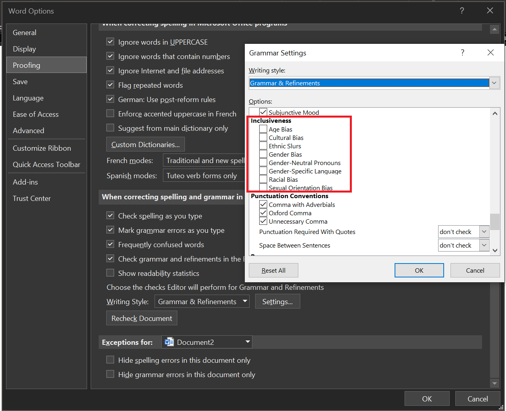

# Accessibility by Design

## Introduction

Recently, the topics inclusion and diversity have gained more and more attention. The tech community, in general, is very diverse and does a lot to include people from different backgrounds. But those topics are much bigger than many people realize. Way more people are affected than most of us assume.

At the same time there are a lot of positive statements, like "We don't want to exclude anyone!". This is a very good starting point, but when we get to the bottom of the statement and ask what is being done to include people from different backgrounds, the discussion often becomes difficult. Many people want to live inclusion actively but don't know how.

When we think of an accessible workplace, we often think of ramps, wide doors, and elevators. Few think about what they produce at work every day: documents, presentations, images, and much more. All this outstanding content is not accessible for many people, as we would like it to be.

That's why it's important to talk about the topic of "accessibility by design".

Let us take a step together towards a more accessible world.

## Reasons why we don't think about accessibility and inclusion / Our mental model

When thinking about inclusion and accessibility, we often think about a particular group of people that is excluded. But quite often, the actual group of people is far more significant than we anticipate.

Quite often, we read and repeat values like "include everybody", "sharing is caring" or "we're all in this together,". Most people don't want to be exclusionary on purpose. But there can be a gap between wanting to be inclusive and knowing what's necessary to be it.

Often it is a trade-off between effort and benefit. As already explained, many people do not know what to do, i.e., how significant the effort is. And when we turn to the benefit, we must, of course, be able to assess how great it actually is. How many people would actually benefit if we made our app, article, or report inclusive and accessible?

When we start to ask the question "Is it really worth it?" that can be a scary thought. The question of whether it is worthwhile should never be decisive, but it often is.

Do we only want to include people if we get a benefit from it? Or do we want to be accessible because it's the right thing to do, no matter how many people benefit from it?

Many of us have privileged lives with access to good education, a safe home, and resources. Many have a good job and a network of helpful people. We are so privileged that we can afford to take care of everyone.

This fact leads to a moral duty to do so!

Now, let's first talk about who is affected when we go for poorly accessible design. Why are there barriers, while thinking about inclusion and accessibility? Let's then see what we can do to design more accessible stuff, how much work it is, and what our target group looks like.

After we know all that, let's have a closer look at the benefits: what we might get out of it.

## Who is affected when we settle for poorly accessible design?

When we start to think about accessibility, we tend to start thinking about physical limitations. We all know people who use a wheelchair, who may be blind or deaf, or missing limbs like a hand, an arm, or a leg.

We all can see and recognize those things quickly; that's why they come to mind first. But actually, there are far, far more things we should think about.

- There are **physical impairments** that we can not recognize well, like poor vision, motor impairment, or challenges that affect our hearing. Just because we can't recognize them easily doesn't mean that those don't impact people's life and behavior.
- We all know a lot of **mental conditions** that have a considerable impact on our behavior: anxiety disorder, obsessive-compulsive disorder, or dyslexia, to name just a few of far over 200 different conditions that affect our behavior. Once again, we can't detect those conditions that easily but they have a massive effect on peoples' lives.
- Even if people are not diagnosed, that doesn't mean that they can't be affected. Many of these can also be **temporary afflictions**. If we lack sleep, our eyesight may suffer; if we're dehydrated, we may find it challenging to focus on a specific type of fonts. If we're calming our baby, we maybe realize how hard it is to complete even simple tasks with just one free hand.

All of these examples give us a sense that we often can't really tell who is affected in their daily lives. And this also makes it clear that the target group for accessible design is much larger than we initially anticipated.

## What can we do?

The first step of using accessible design is to recognize that there is a need to. Period. Once we have established that, progress can be made. But it always begins with recognition.

The second step is to spread the idea. It is not telling people to simply do it or asking people to do it. Nor to claim that it is necessary. It's not about arguing; it's about spreading the idea that there is a need.

The right arguments can follow as soon as we have the right mindset; instead of telling people what to do and what not, it is essential to appeal to their attitude. If we can set the core idea about including everybody and sharing is caring into people's mindset, the following steps will be a lot easier.

Let us have a look at some examples: what we can do.

Do we want to do more than just realize there is a need? Here are three simple steps we all can do right now:

1. Let's take the [Accessibility fundamentals learning path](/training/paths/accessibility-fundamentals/) provided by [Microsoft Learn training](/training/).
2. Let's start using the accessibility tools like the [Accessibility Checker](https://support.microsoft.com/topic/improve-accessibility-with-the-accessibility-checker-a16f6de0-2f39-4a2b-8bd8-5ad801426c7f) or [descriptive text for pictures](https://support.microsoft.com/topic/everything-you-need-to-know-to-write-effective-alt-text-df98f884-ca3d-456c-807b-1a1fa82f5dc2).
3. We can switch the grammar settings in Word for inclusiveness to become more aware of the language we are using.

This shows us that a first step requires little effort. And perhaps we can already simplify people's lives significantly. We can also make it possible for people to work with our solutions in the first place.

Once we get started, we can include accessibility in more areas of our work life. Get inspiration from the article [10 Habits to create accessible content](https://blogs.microsoft.com/accessibility/10-habits-to-create-accessible-content/) or include the idea of accessible content in our company by discussing the [Accessibility Evolution Model](https://blogs.microsoft.com/accessibility/accessibility-evolution-model/).

Many people assume that the effort is huge, because we are used to orienting ourselves to familiar patterns. As already explained, it is difficult to look for solutions when you do not even recognize the problem. The first step is not to build ramps and bigger doors, or to ask ourselves how we can include deaf people. In reality, the first steps look like this:

1. Realizing that we can do small and easy baby steps.
2. Embracing the fact that far more people are affected than we actually might think.

## What are the benefits of accessible design?

We have now seen that small steps can add great value. This added value can already make a big difference in many lives, so let's take a closer look at what we can gain by using accessible design.

First of all, we're doing a good thing by thinking about others. It doesn't feel good to be excluded. Psychologists even argue that rejection or feeling excluded is processed in our brain the same way, as if we get hurt physically. It hurts to feel excluded, and that leads to feeling sad and angry. Feeling excluded can cause people to lose self-confidence, feel a loss of control, or even feel they have nothing valuable to contribute.

Apart from that, we are making a better product. If it's an app, a piece of code, or a PowerPoint presentation, it will be better in the end because it is more complete. It's more versatile, and more people can have access to it.

And that means more people can buy or use our product. That in turn leads to us getting more and better feedback, which makes our product better as a whole.

## Iceberg model

Well-known slogans that convey values include "Sharing is Caring" or "Include Everybody." Many people are driven by these values, which are anchored in their mental model. Instead of telling other people how to behave, it can be helpful to start with the mental model. When that mental model is closely linked to an accessibility thought, change can happen much more easily.

There is the possibility to use the iceberg model for that [explanation of the iceberg model](why-m365-adoption-projects-fail.md#the-iceberg-model), and it might be beneficial to analyze accessibility by design with that model as a next step to get a clearer picture of what is happening right now.

## Conclusion

The first step of using accessible design is to recognize that there is a need to. Period.
Once there is realization, progress can occur because exclusion often happens unintentionally. Exclusive design affects far more people than meets the eye, and the effort to change it is tiny.

If we want to give more people a sense of community and belonging, we need to start thinking about accessibility. Then we can get people to contribute their knowledge and skills. That's how we grow as a community and as individuals.

## Additional Resources

- [Accessibility terms](/style-guide/a-z-word-list-term-collections/term-collections/accessibility-terms)- Write in a way that puts people first.
- [Bias-free communication](/style-guide/bias-free-communication).
- The Microsoft [Accessibility Blog](https://www.microsoft.com/accessibility).
- More details about the iceberg model in [Why Microsoft 365 adoption projects fail](why-m365-adoption-projects-fail.md)

---

**Principal author**: [Michael Roth](https://www.linkedin.com/in/michael-roth-handsomeguy/)

---
