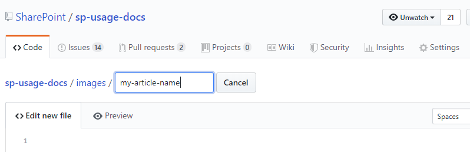

# Adding Content

## Contribution Guidelines

We'll be following the [contribution guidelines](https://docs.microsoft.com/contribute/) from docs.microsoft.com, as we hope the content here ends up there. It even includes a [style and voice quick start](https://docs.microsoft.com/contribute/style-quick-start).

For the full reference, read the [Microsoft Writing Style Guide](https://docs.microsoft.com/style-guide/welcome/). The style guide is the current iteration of what's been a standard in technical writing for more than 20 years: The Microsoft Manual of Style.

## Sign up for GitHub

If you don't already have a GitHub account, you won't be able to submit any comments, issues, etc., just like most Web sites and SharePoint itself. If you have an account - you get to skip ahead!

Simply click on the Sign up link at the top right of the page to create your account.

## Create Your Markdown

The next step is to gather the content. If you want to contribute something you've already written, it will probably require a bit of conversion. The documentation here is all written in markdown and there is a [great markdown cheatsheet](https://GitHub.com/adam-p/markdown-here/wiki/Markdown-Cheatsheet) you can use if you'd like to write new content or convert something you already have.

### Convert Word Documents

If you have your content in a Word document, you can use one of several Word to markdown conversion tools:

* [Word to Markdown Converter](https://word2md.com/)
* [Writage Markdown plugin for Microsoft Word](http://www.writage.com/)

### Convert from an existing blog post

If you're starting with an existing blog post, then you may be able to convert the HTML from the post to markdown.

* [Browserling - Convert HTML to Markdown](https://www.browserling.com/tools/html-to-markdown)
* [Digital Converter - HTML To Markdown](https://digitalconverter.azurewebsites.net/HTML-to-Markdown-converter)

### Write from scratch

If you're writing new content from scratch, you can choose whichever editor you like. The important thing is to write in markdown format.

* [Visual Studio Code](https://code.visualstudio.com/) is a free editor from Microsoft and is used primarily for code. It also allows you to write markdown with a preview.
* [Recommended Extension - Spell Checker - Spell Right](https://marketplace.visualstudio.com/items?itemName=ban.spellright) - Multilingual, Offline and Lightweight Spell checker for text and markdown files, to help check your files before submission

---

NOTE: Many of the tools mentioned above are developed by third parties, thus we cannot vouch for them. Let us know what issues or successes you have in the Issues.

## Add to the Repository

If you know how to work with GitHub, you probably don't need this section. You will have forked the repo, edited your fork, and issued a pull request. If that sounds like Greek to you, then here's the simple route to upload a piece of content.

### Navigate to the Appropriate Location

The repo is organized in a set of folders. The structure will undoubtedly change over time, but look for a folder which seems to correspond with the content you want to add. Just add your content to the [Community](https://github.com/MicrosoftDocs/microsoft-365-community/tree/master/Community) folder.

### Create the New File

Near the top of the screen, you'll see a button to Create new file. When you click that button you'll get a new file, which you can give a name and then start editing.

#### Name the file

There is only one requirement for the filename, and this is to give it an md extension. This indicates that it is a markdown document. It's just the file extension, like docx for Word docs. As for the name itself, try to use a name which is descriptive, but not too long. For portability, use a name which has dashes to separate the words, like: my-fantastic-article.md.

#### Edit the file

You can paste in the markdown from the previous steps or type directly into the text box. Note the Preview tab, which allows you to see what the file will look like once you've saved it.

##### Adding images

To add images to your article, you'll need to add them to the repository. This is easier if you get more familiar with GitHub and do pull requests, but here is how you can do it through the UI.

We store images in the images directory (folder). Each article should have its own directory underneath images named like the article's title, e.g., "known-folder-move-benefits-for-endusers". You then upload your images into that directory.

The first step is to create the directory. GitHub won't store empty directories, so you need to add a new file into the directory you want to create. Navigate into the images directory, and then click the `Create new file button`. Type the name of the directory, followed by a forward slash: `/`.

This will show your name as a directory. Add a file by finishing with `index.md`. You don't need to use this file, but it'll allow you to create the directory. At the bottom of the screen, click the green `Commit new file` button.

Now you will be in the directory you just created. Click `Upload files` to add your images and then `Commit changes`.

If you can't figure out how to add the images to your article, add a comment to your article with instructions explaining where you would like each one added.

##### Getting credit

If the content you are contributing is something you are repurposing from your blog or another location, you can add a section at the bottom of your article with information about you and the source. Here's an example:

---

**Principal author**: Susan Hanley, MVP

**LinkedIn**: [**http://www.linkedin.com/in/susanhanley**](http://www.linkedin.com/in/susanhanley)

**Website**: [**www.susanhanley.com**](http://www.susanhanley.com/)

**Blog**: [**http://www.computerworld.com/blog/essential-sharepoint**](http://www.computerworld.com/blog/essential-sharepoint)

---

#### Save the file

When you are done editing, scroll down to the **Commit new file** section. Add a title and comments about what you are submitting. This is information which becomes part of the "pull request" - basically you're talking to the people who work on the repo. At this point, you can leave the default option to **Commit directly to the master branch.**

Push the **Commit new file** button and your content will be on its way into the repo. However, your content will have to be accepted before it will be generally available. If there are any questions about what you've submitted, you'll get comments on the pull request. If you provided an email address when you signed up for your GitHub account, you'll get notifications.
