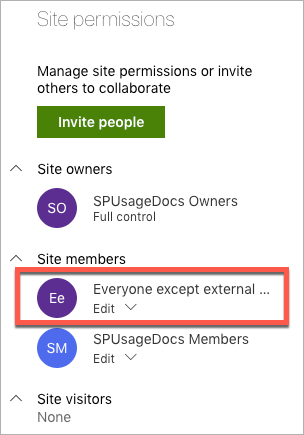
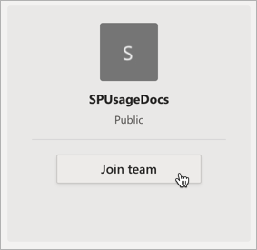

# Changing Microsoft Teams from Private to Public, what to expect in SharePoint?

[!INCLUDE [content-disclaimer](includes/content-disclaimer.md)]

## Privacy settings

As you may already know, when creating a [Microsoft Teams](https://products.office.com/en-gb/microsoft-teams/group-chat-software), you can choose the privacy settings to be:

- Private
- Public
- Org-wide

_Private_ means only the members added will be able to join the Teams, while _Public_ means that anyone with the link to the Teams can join the fun.
_Org-wide_ is pretty self explanatory :simple_smile:

## Relationship with SharePoint Online

Creating a Microsoft Teams will automatically provision/create a SharePoint site. And the privacy settings you've chosen (above) should be respected.

This means that if you've chosen your Team to be _Private_, added a few members, then the SharePoint site will only allow access to those members.

If you navigate to the site, click on the "number" of members on the top right corner of the page, you should see the **Group membership**, which is whoever you've added when creating the Team.

And **Site Permissions** should look like this:

## Change privacy from Private to Public

Let's change the privacy settings to Public (_Your Team -> ellipses -> Edit Team_), and go back to SharePoint. Can you spot what changed?

At the first glance, not much to be honest :neutral_face:

The Group membership is still the same, BUT if you have a look at the _Site permissions_, there's something new!

The "**_Everyone except external users_**" group just got added automatically.

### What does this mean?

This means that if a user (_with the correct licences_) knows the site URL, she/he can access the content, and will have **Edit** permissions.

If the user clicks on the "Conversations" tab in SharePoint, she/he is also part of the Office 365 group fun.

As for Teams, when the user opens the desktop app or browser version, clicks on **Join or create a Team** on the bottom left corner, the public team is showing up, and the user can join.

Changing the privacy settings should be thoughtfully decided, because Public means Public!

**Note:** _Joining a public Team doesn't require any approval. Therefore, the user(s) will automatically become Members in Teams and in SharePoint._

---

**Principal author**: [Veronique Lengelle, MVP](https://www.linkedin.com/in/veronique-lengelle-48a71b31)

---