# Content Type Propagation

[!INCLUDE [content-disclaimer](includes/content-disclaimer.md)]

Content types are a central part of SharePoint. This article will not go into deep details on how to use content types because it depends too much on the use case. This article will cover the backend "stuff" that propagates the content types to our end users.

* [Content type](glossary.md#metadata): At most basic level, Content types work as a "Template" for lists and libraries. When they are added to a list or a library upon new item or document creation, the item will then be created using the same list fields or file template.

Learn more: [What is a content type](/microsoft-365/community/what-is-content-type).

## Used in Lists

* We use content type in lists when we want to be able to create different list forms without the need of creating multiple lists.
* The content type will contain different fields based on the use case.
* Many 3rd party solutions for SharePoint are built with lists, and often rely on list content types.

## Used in Libraries

* This is often for different Office file templates.
* We use this when we want to provide easy access to document templates to our users.
* The content type will contain different fields based on the use case.

## In SharePoint and Teams

As mentioned Content Types are used in lists and libraries. This article will be focused on content types for libraries. When enabled and added to a document library, the content type (for example, "Company presentation") will be available through the "New" menu. If the SharePoint site is connected to Teams, the content type will also be available in Teams.

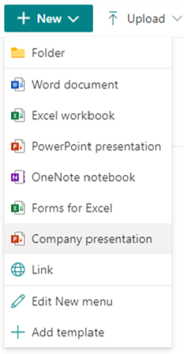

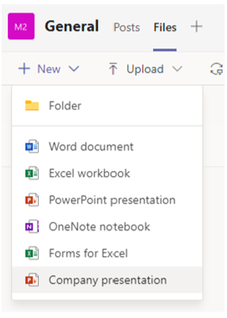

## How to create new content types

With the current Information Architecture in Microsoft 365, to make content types available for end users there are a couple of approaches:

1. Use the Content Type Gallery (this is the modern version of the "content type hub")
    * The content type will be propagated to all SharePoint sites in the tenant.
2. Manually create the content type in the sites as needed
    * Users can manually add the document template to the library, the new content type is only available in the current library.
    * Site owners can create a new content type at the site-level, this can be used by all libraries in the site and "sub-sites".
3. Automated creation of content type using:
    * [SharePoint Site Script](/sharepoint/dev/declarative-customization/site-design-json-schema#define-a-new-content-type)
    * [SharePoint PnP Provisioning engine](/sharepoint/dev/solution-guidance/introducing-the-pnp-provisioning-engine)
    * This technique creates content types locally to the site, requires technical competency, and should only be used with site governance/provisioning in place.

> [!NOTE]
> The option you choose will mainly depend on your internal technical competency, governance model, and your users needs.

## 1. The Content Type Gallery

Microsoft has revamped the Content Type Gallery during the last few years, in my humble opinion it's not where it should be yet, but it's way better than what we had a couple of years ago. You will need SharePoint Tenant admin rights to work with the Content Type Gallery.
Login to your **SharePoint Admin center** navigate to **Content Services | Content Type Gallery**.

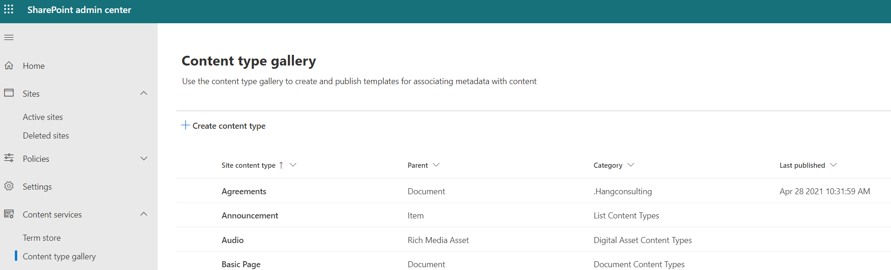

You will see a set of content types, and you will probably recognize many of these.

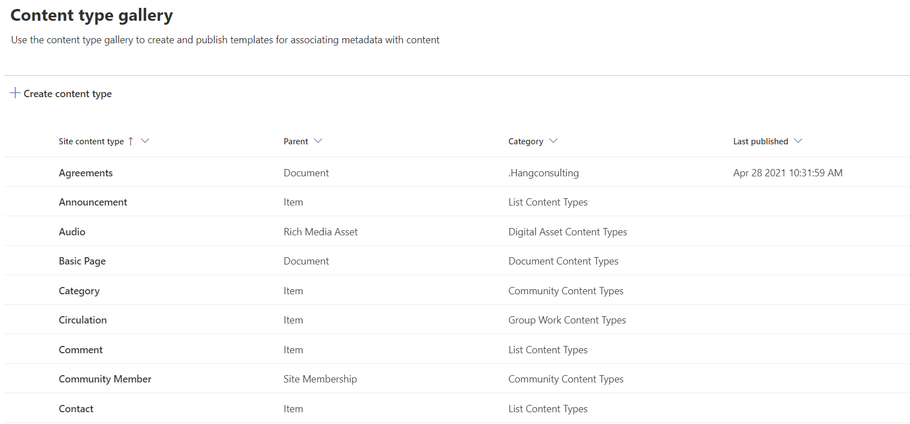

> [!IMPORTANT]
> When you are in the "Content Type Gallery", please don't modify or delete any of the standard content types, only work with your own custom content types.

As mentioned above we mainly work with two types of content type:

1. Document Content Types
2. List Content Types

Before you start to create your content type consider the following:

1. If it is a document content type, do you have the document template available, and does this content type need any metadata (built as site columns) associated with it?
2. If it is a list item content type, do you have the site columns it should contain?

> [!NOTE]
> Content types created in the Content Type Gallery, when published, will be available to all sites and libraries in your SharePoint tenant.

Click **"Create content type"** to start the dialog to create a new content type. Always make use of a custom category as this will make management of the content types easier in the future.

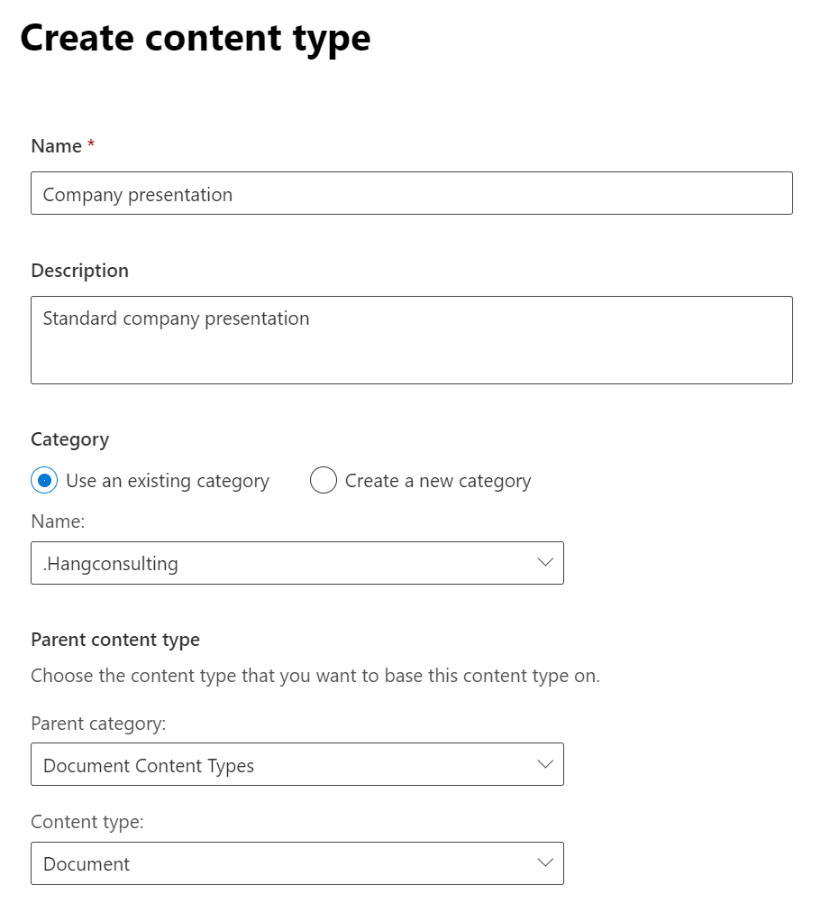

> [!NOTE]
> The **"Parent content type"** defines what your content type will be based on, we mostly use *Document Content Types* or *List Content Types*.

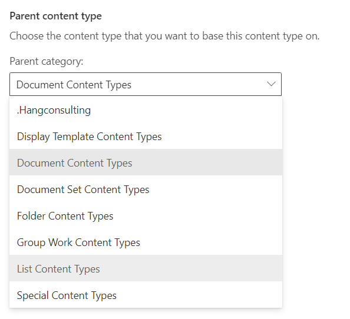

The *Company presentation* content type is created but it's not completed yet. On the content type page click **"Settings | Advanced settings"**.

This is where you will add your document template. We have two options:

1. Use an existing template, currently this options doesn't work in the Content Type Gallery, only with site content types.
2. Upload a new document template.

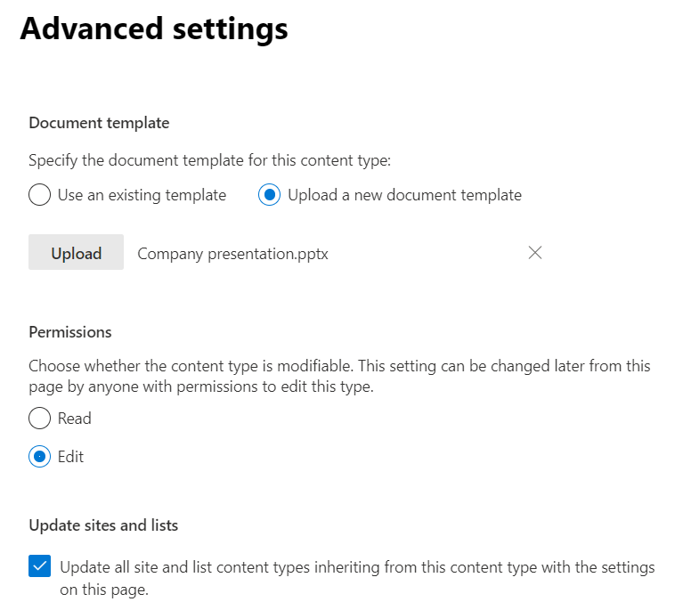

Use **"Upload"** to upload your Office template and choose save. This file is now saved "within" this content type and will be propagated (copied) to new document libraries when used.
When ready, use the **"Publish"** option to publish the content type to your users.

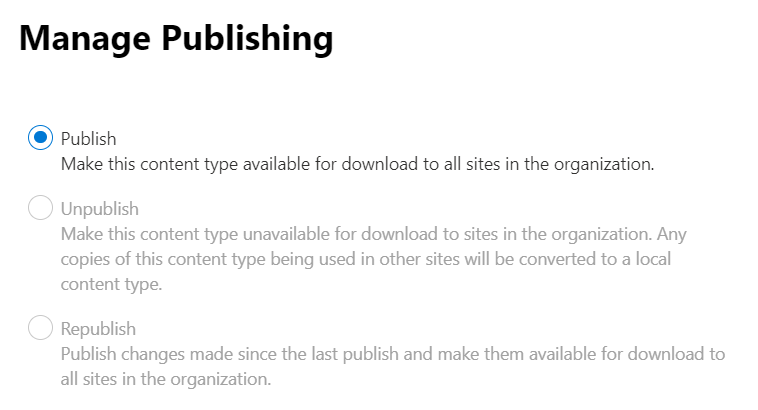

## Using the Content type

The publishing of the the content type should go pretty fast in Microsoft 365 now, compared to what it did a couple of years ago.
Before you can add the new content type to your library or list you need to make sure the **"Settings"** in **"Advanced Settings" | "Allow management of content types"** is set to **"Yes"**

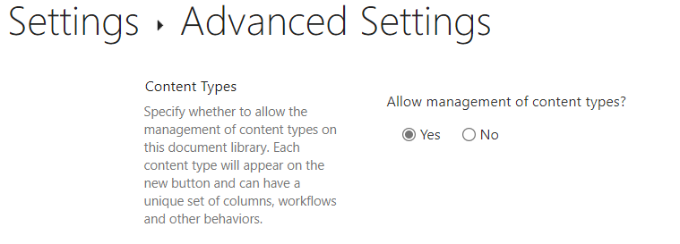

When ready navigate back to the **Document library | Add column | Content Type**.

> [!NOTE]
> Adding a new Content type can also be done in the document library settings page.

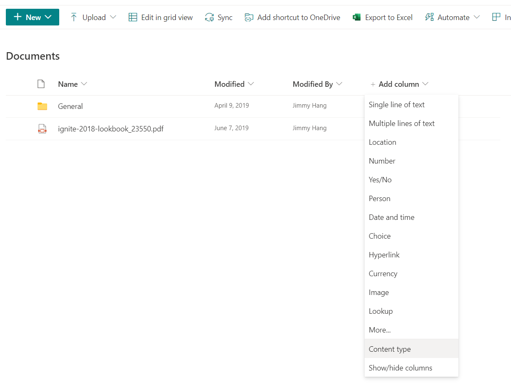

Choose your newly published **"content type"** and hit **"Apply"**.

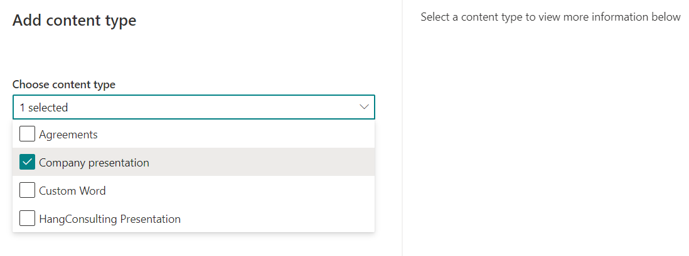

Your new content type is now ready to be used, repeat the process for any library where you want this content type to be available.
If you want to add back the standard empty Office templates, use **"Edit New menu"** to rearrange the options.

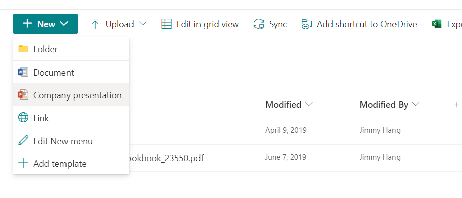

## 2. Create a new content type in your current site

The process of creating a new content type for a site or Teams is similar to the steps for the Content Type Gallery, just simpler. Content types created in the site will be available for all document libraries in the current site and sub-sites.

In your site, navigate to **Site Settings |  Site content types | Create content type**, and if you are creating a content type for Teams, then you need to first navigate to the *Teams SharePoint site*.

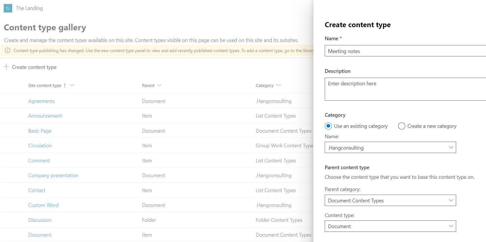

For site content types, you can use a file saved in the current site as a document template- all you need is the path to the file. Adding the content type to the document library is the same as above steps.

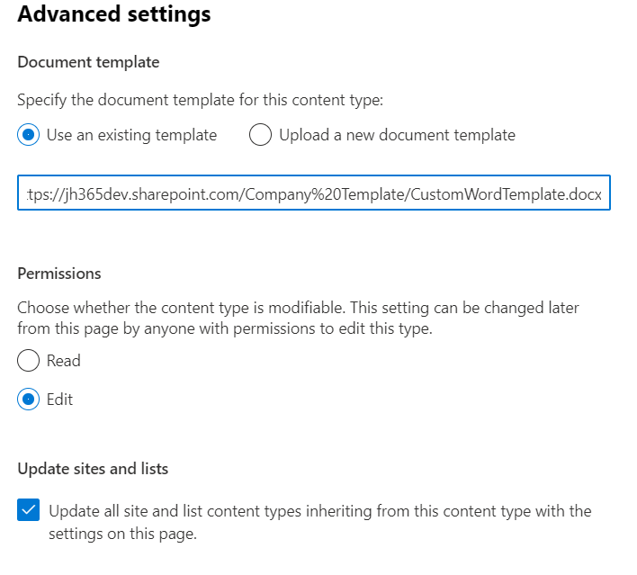

---

## Pros/Cons

Below is some pros/cons that should help you choose the right content type propagation method for your business scenario.

## Using "Content type gallery"

### Pros

* Easy to get started
* Content types are automatically propagated to all sites in the tenant
* SharePoint Online search can surface search content based on the content type across all sites
* Easy to update the content type if changes are required, update of template might take some time before auto updates, but can be manually updated by site owner if needed.
* Doesn't require much technical competency to manage

### Cons

* This requires SharePoint tenant administrator right to get started, might not be a good fit for small environments.
* Needs a strong central governance model, might not be a good fit for small environments.
* All content types might not be needed in all sites

> [!IMPORTANT]
> If a content type is deleted from the content type gallery the following happens:

> * If the content type is added to a library (in use), it will be converted to a site "local content type", and will be available for that site
> * If the content type is not added to a library, it will be removed from the site

## Using "Local Site Content type"

### Pros

* Can be created by site owner
* Content types can be used by all lists/library in the site
* Doesn't need a central governance model

### Cons

* Required that site owners "knows" what she/he's doing 
* Content type is not available to other sites
* Because it's not centrally managed, Office templates need to be managed separately

> [!IMPORTANT]
> If a content type is in use in a library or lists the content type cannot be deleted from the site. Meaning you need to manually change the contents(file or list item) to another content type before you can delete the content type.

## Using "PnP, Site scripts or similar methods"

### Pros

* This is very flexible way to propagate content types
* Combined with site provisioning you can create new sites with content types ready to be used
* You can manage creations/updates/deletions without the needs of manually clicking through the *Settings*, especially handy when cleaning up content types.
* This is a better choice for large environments, with need for lots of content types

### Cons

* Requires strong technical competency
* Needs a strong central governance model, might not be a good fit for small environments.

## Conclusion

Content types propagation are a *"way"* of making predefined Office templates, metadata, and/or list items available to all SharePoint sites in your tenant and because Teams is using SharePoint as a backend to store the templates which are also available in Teams files and lists.
If you don't have the technical resources to make use of "PnP Scripts" to auto propagate the content types to new SharePoint sites, then I recommended the use of **"Content Type Gallery"** to propagate your content types.

[Recommended reading: Designing solutions for scale](/microsoft-365/community/designing-solution-for-scale)

---

**Principal author**: [Jimmy Hang, MCT, MCSE: Productivity](https://www.linkedin.com/in/jimmyhang/)

---
