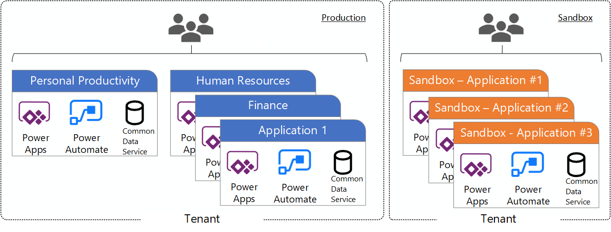

# Defining a Power Platform Environment Strategy

## What is a Power Platform environment?

[!INCLUDE [content-disclaimer](includes/content-disclaimer.md)]

The Power Platform is Microsoft’s answer to the growing need in business for a way to build and customize professional-grade business solutions quickly, with the ability to connect to over 200 data sources including, SharePoint Online, Azure SQL, Twitter and more.

## What type of environments are there?

Environments are containers that administrators can use to manage apps, automation, connections, and other assets; along with permissions to allow organization users to use the resources.

There are multiple types of environments. The type indicates the purpose of the environment and determines its characteristics.

## Why is the Default Environment special?

A single default environment is automatically created by Power Apps for each tenant and shared by all users in that tenant. Whenever a new user signs up for Power Apps, they're automatically added to the Maker role of the default environment.

The default environment is created in the region closest to the default region of the Microsoft Entra tenant.
There is specific guidance for the Default environment to call out because of its unique nature:

- It’s automatically created with the first user in the region closest to the Microsoft Entra tenant
- New users that sign up for Power Apps are automatically added to the Maker role
- Users are not automatically added to the Environment Admin role
- The default environment can’t be deleted, but you can rename it – e.g., Personal Productivity (do it now, if you haven't!)

## Why do I need to define a strategy?

Developing an environment strategy means configuring environments and other layers of data security (DLP) in a way that supports the productive development in an organization, while securing and organizing resources.

If you want to follow application lifecycle management (ALM) principles, you'll need separate environments for app development and production. Although you can perform basic ALM with only separate development and production environments, it's recommended that you also maintain at least one test environment that's separate from your development and production environments.

### Environment scenarios

- Scenario 1 - The ‘Out of the Box’, default environment.
- Scenario 2 - Scenario 1 + Dedicated departmental environments
- Scenario 3 - Scenario 2 + Dedicated application environments
- Scenario 4 - Multi-Tenant ALM environment separation.

### Scenario 1 – Personal Productivity (default environment)

Uses include: Personal Productivity Apps and Flows, Custom SharePoint Lists and Library forms.

### Scenario 2 – Departmental

Uses include: Personal Productivity Apps and Flows, Custom SharePoint Lists and Library forms and dedicated department environments.

### Scenario 3 – Departmental and Application

Uses include: Default environment, dedicated department environments and a dedicated environment(s) for a single application.

### Scenario 4 – Multi-Tenant ALM Approach

Uses include: Separating Power Platform environments across physical tenants. Could be used to separate Production, Staging and Development environments, or could be used for geo-location reasons.

## Recommendations / Best Practices

Based on successful experience with other customer engagements, below is a list of additional recommendations that can help make managing environments easier.

- Assign your admins the Power Platform service admin or Dynamics 365 service admin role.
- Restrict the creation of net-new trial and production environments to admins
- Rename the default environment to ‘Personal Productivity’
- Provision a new Production environment for non-personal apps/flows
- Define and implement your DLP policies for your environments
- When establishing a DLP strategy, you may need multiple environments for the same department
- When establishing your Power Platform environment strategy, based upon your licensing, you may find that you need to provision environments without a Dataverse (previously called Common Data Service) database and also use DLP policies to restrict the user of premium connectors.
- Establish a process for requesting access or creation of environments
- Dev/Test/Production environments for specific business groups or application
- Individual-use environments for Proof of Concepts and training workshops
- Use a service account to deploy production solutions
- Reduce the number of shared development environments
- Share resources with Microsoft Entra Security Groups.

## Further Reading

[Microsoft documentation](/power-platform/admin/environments-overview)

---

**Principal author**: [Aaron Rendell](https://www.linkedin.com/in/aaron-rendell/)

---
