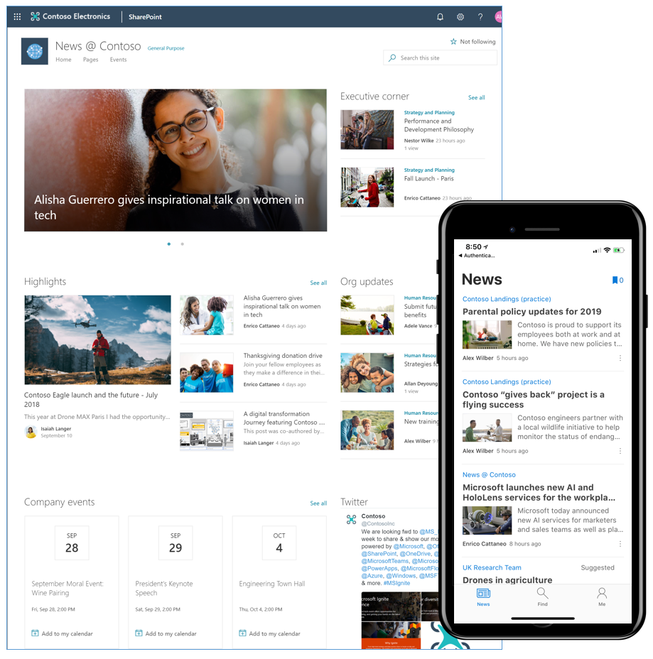
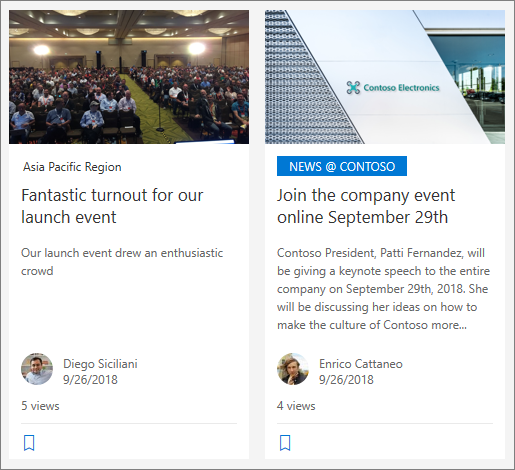
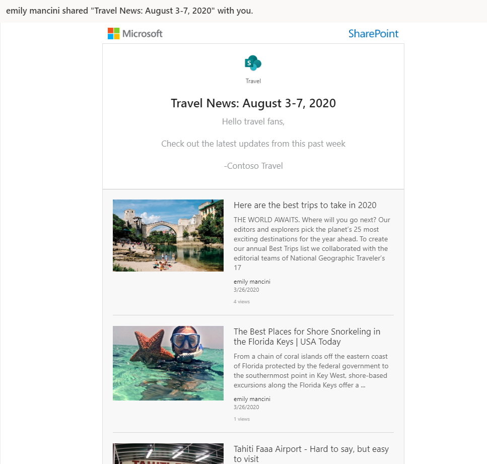

# The Evolution of Company-wide Email Communication to SharePoint News

[!INCLUDE [content-disclaimer](includes/content-disclaimer.md)]

Since the advent of email, the most common way most organizations have shared news and updates to the entire organization at once has been through emails to a org-wide distribution list. As Microsoft 365 continues to expand capabilities and offers us multiple communication channels to use, it may be time to shift your communication strategy to leverage alternate solutions like SharePoint news to increase employee engagement.

## Challenges of Communication via Email Only

Why is email so commonly the only communication channel people trust at an organization? It might be as simple as &quot;everyone is using it&quot;. Unfortunately, that does not necessarily mean it is the best option to support your message and drive the action or engagement you are seeking from the recipients.

- Email is not a great platform for collaboration as group conversations can quickly grow out of hand with superfluous messages of acknowledgment clogging your inbox from essential messages.
- Key messages might get lost in disjointed threads.
- Email notifications destroy our focus as they continually interrupt active work.
- Email is only as secure as the users sending it and critical messages can be forwarded outside the company.
- There is decreased engagement in an email from leadership. It feels like one-way communication, as we actively avoid the dreaded &quot;reply all&quot; which would spam our colleagues&#39; inboxes.
- New hires miss any communication sent out before their start date.
- It is incredibly challenging to find previous communication and sort in a logical order.
- You cannot fix errors, missed attachments, or add any additional value to an email after it is sent… unless you send another.

## SharePoint News to Enrich Your Communication

SharePoint news, available in SharePoint Online and SharePoint Server 2019, enables you to communicate company updates, announcements, personnel news, and more in rich layouts with graphics, links, and embedded content. The canvas allows for much richer communication than what you get out of the box with an email in Outlook. The ability to embed content directly into the news post reduces any friction for your audience to consume the content, removing the need for them to explore additional links and attachments. News allows for comments on the bottom of the page empowering colleagues to interact more without spamming the entire company with their replies. Even better, since SharePoint news is essentially a SharePoint page with some added capabilities, you can make corrections or add additional information as you begin to receive feedback on your communication. After creating the news post, you may also email the page itself to a company distribution list to deliver the same messaging into inboxes with the added benefit of the news being stored ad easily searchable on the intranet.

## SharePoint News for More Persistent Company Updates

In addition to all the value adds for improving the content of your communications, SharePoint news appears across the Microsoft 365 ecosystem ensuring it is front and center as employees navigate SharePoint and Teams to get their work done. News (that you have permission to access) is shown on the SharePoint start page, SharePoint mobile app, Microsoft Teams (once you add the connector) and can be added to team sites, communication sites, and hub sites with the news web part. This news web part can be configured to surface only that site&#39;s news, a filtered view of a site&#39;s news, or include news from other sites including a rollup of all sites part of a hub.

You can enable audience targeting on the news web part to target your messages to the right people. Everyone in a global company may not need to hear about a benefits update in Mexico, so you can target that news to just the employees in that country/region. Expanding the places your communication appears while better targeting it to the right audiences will naturally drive higher engagement as you lower the signal to noise ratio for your employees.

News is a page in the Site Pages library of a SharePoint site so new employees will no longer be limited in accessing company updates (sent only as email) based off their account creation date. Once a new employee receives permission to view a SharePoint site, they will have the ability to read all previous news. This enables new employees to get a deeper understanding of what has been happening across the company before their start date, speeding up the onboarding process.

Since news is a page within a library, this means it also falls within the Microsoft 365 search scope. Employees will have one place to search to find all current and historical company content.

## SharePoint News to Empower Communication Across the Organization

In the modern SharePoint world, your site architecture is flat with different site collections spanning the organization. Each department is managing their own sites and responsible for keeping content up to date. This access also enables site owners and members to take ownership of communicating updates and news to the company by creating news posts on their sites. The intranet homepage can have a web part showing all news from all sites increasing the visibility of these important departmental updates and removing Corporate Communications or IT as the roadblock to post on the homepage. Site owners benefit from the decentralized content ownership with immediate access to share updates and employees benefit from this centralization of updates by having one trusted place to check on the intranet homepage - just like they had when it was an email in the beloved inbox.

In organizations where news is heavily vetted before sharing across the company, you may want to create communication guidelines and style guides to ensure the messaging is consistent across departments. It is a shift for the teams managing news to coach-and-enable instead of gather-and-curate.

## Organizational News

While the expanded access for site owners to share their news is exciting, for some organizations it is still important to delineate what your organization considers the &quot;official&quot; or &quot;authoritative&quot; news. A site specified as organizational news will have a signifier in the site title - it appears in a highlighted box - helping these news posts to visually stand out as different.

## SharePoint News Digest to Replace Newsletters

Microsoft 365 improvements continually offer us the opportunity to see how we are doing business today and evaluate if that is still the best method. The traditional emailed newsletter requires a lot of administrative work from one person or a small team to gather updates, centralize, format, and share. These updates are becoming stale every minute it takes to follow this process and it requires a lot of manual work. Shifting to empowering your site owners to share news from their sites as the updates occur will provide information to your organization at the speed we are now used to receiving it in the outside world - near instantly.

As your organization shifts to sharing news as it happens, you may want to help the organization spot the top stories from the past week, month, etc. Once there are four or more stories in a news web part, you can send a news digest. A news digest is a selection of specific news stories, which can be across site collections, that you may order and add a personal message to. This news digest can be sent via email to a distribution list, Microsoft 365 Group or multiple people. The news digest also creates a SharePoint page which gives you a lasting artifact of that moment in time &quot;edition.&quot;

Your newsletter process now supports sharing news as it happens and following up with the most important updates via email to ensure key messages were not missed. Delivering this news digest to email inboxes also captures some your colleagues who may be transitioning to this new process for sharing company updates.

## SharePoint News Will Shift Your Communication for the Better

Embracing the capabilities in SharePoint news instead of traditional emails to share company updates will enrich your news posts, drive more engagement with the updates, allow for better targeting of your messaging across the company, and empower more people in your organization to share their updates. It will inherently shift the way many companies are communicating with the benefit of greater productivity.

## Resources

- [Create and share your news on SharePoint sites](https://support.microsoft.com/office/create-and-share-news-on-your-sharepoint-sites-495f8f1a-3bef-4045-b33a-55e5abe7aed7)
- [Create an organization news site](/sharepoint/organization-news-site)

---

**Principal author**: [Emily Mancini, MVP, UXMC](https://www.linkedin.com/in/eemancini)

---
