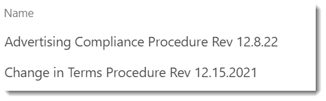

# File Naming on an Intranet

[!INCLUDE [content-disclaimer](includes/content-disclaimer.md)]

## Basic Idea

Over time, you'll want to keep the documents you offer the organization up to date. One problem you'll run into is SharePoint thinking files with different names are totally different, when in fact you want them to be considered versions of the same file.

## Examples of Bad Filenames

Here's an example of filenames which will cause issues over time:

Since the names contain the revision date, when the next iteration of the file is uploaded, SharePoint will see it as an entirely new file. This means any connection to the old file and its history (version history or metadata) is severed.

## Better practice

Instead, name your documents based only on what they are. For example, rather than **Change in Terms Procedure Rev 12.15.2021.PDF**, just use **Change in Terms Procedure.PDF**.

Anyone who finds the document shouldn't have to worry about whether it is current or not: only the most current version should be available on your Intranet. (There may be exceptions to this, but it is generally the case.) As a Site Owner, this is one of your resposibilities: keeping your content current and valid.

Each time you copy in a new version or upload one, it will become a new version of the same file and get the same metadata. This also guarantees any links to the document stay valid. You won't need to scour your own pages for links. Maybe someone in a different department linked to your document, and you don't want that to break.

## If revisions matter

If you need to keep older revisions, do that in your Team Site. If the revision date is important, then it should be a metadata column on the library, not embedded in the filename.

---

Principal author: [Marc D Anderson, MVP](https://www.linkedin.com/in/marcanderson)
