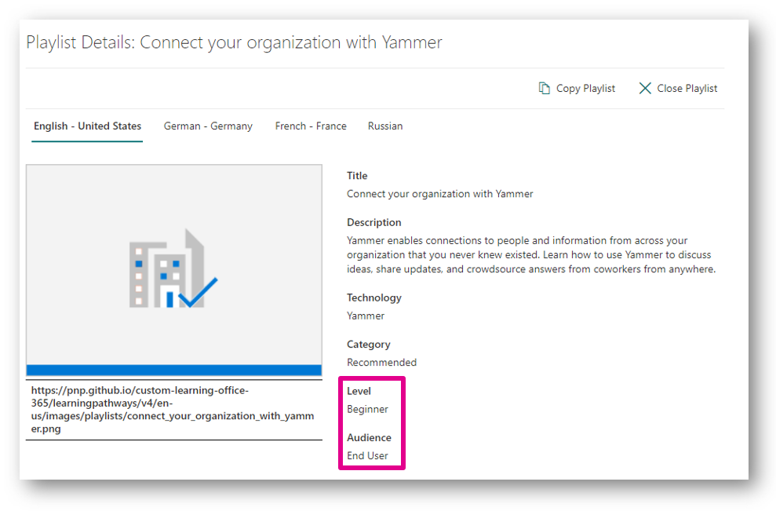

# How can I use Learning Pathways in my organization?

[!INCLUDE [content-disclaimer](includes/content-disclaimer.md)]

## Introduction

Learning Pathways is a [customizable](/office365/customlearning/custom_accessadmin), on-demand learning solution in Microsoft 365. Learning Pathways offers a fully customizable SharePoint Online communication site (that may be used as a training portal), easy provisioning from the [SharePoint Look Book](https://lookbook.microsoft.com/details/3df8bd55-b872-4c9d-88e3-6b2f05344239?source=default), the ability to make your own [training playlists with custom assets](/office365/customlearning/custom_addassets), [a custom web part](/office365/customlearning/custom_whereiswebpart) to surface training content across your SharePoint site collections, and up-to-date Microsoft documentation for Microsoft 365 solutions.

## Use Cases

### Centralized location for all training content

Learning Pathways comes with all Microsoft 365 documentation categorized into technologies and playlists which is an excellent start for most organizations. Even better, this takes the burden off the Information Technology, learning, or training departments to either create or gather this content.

If an organization creates their own custom training or has training for other technologies outside Microsoft 365, adding custom training to Learning Pathways creates a one-stop-shop for all training content across the organization.

While many companies still need or actively use a Learning Management System (LMS) to support requirements like role-based training assignments and reporting, many of these systems do not house the documents. Saving training documents and videos to Microsoft 365 can help support the enterprise LMS by integrating content into Learning Pathways and providing the ability to surface the training content in context on relevant sites through the custom web part.

For example, there is training content on the LMS for how to click through a procurement system to purchase goods. There is also a page on the procurement site talking about the business process. You can reduce the friction of getting all necessary content to the end users to complete a purchase by using the Learning Pathways web part to embed that specific playlist for purchasing goods on the same page where the rest of the business process is referenced. Learning Pathways helps shorten the steps across the intranet by having information to complete top tasks right where people need it.

### Raising the technical literacy of the organization

Whether it is training for a brand-new Microsoft 365 launch, supporting your [SharePoint Champions](/microsoft-365/community/empowering-your-sharepoint-champions) or advancing the finance department’s Excel skills, Learning Pathways supports creating self-service learning opportunities through curated playlists.

Each playlist offers dropdown menus for “Level” and “Audience,” helping end users determine where to begin. The order of the playlist can match which pieces are most important to the organization or follow a logical progression increasing in difficulty. Breaking training content into bite-sized chunks may also support your end users as they try to fit learning into already busy days.

For example, Contoso has decided to begin self-service SharePoint site creation. There are different types of governance for collaboration and communication sites. This governance exists in the intranet on the Information Technology site collection. The governance can now be added to a playlist for “Team Site Owners” and “Communication Site Owners” to ensure they are not only learning how to use the technology, but also following the better practices that supports a consistent user experience across Contoso’s environment as well as keeping content secure.

### Documentation for custom solution with training in context

 Microsoft 365 offers many opportunities for customizations to your environment. These custom solutions may have specific steps to follow and likely need training documentation to support their usage. Adding the training content to Learning Pathways and then embedding on the site where these custom applications live removes the friction for an end user to understand what they can do in your custom solution and how to complete their objectives.

### Consultant supporting an organization new to Microsoft 365

 When organizations work with external consultants for a Microsoft 365 implementation, they may find themselves drinking from a firehose with the volume of information that is shared throughout the project process. Consultants can better support these new organizations by capturing all recommendations, newly established governance, and training in one playlist for the Microsoft 365 product owners. The organization now has one place to look for all historical information as they continue on the intranet development journey after the engagement has ended. Since the content is in Learning Pathways with all other training content, even the power users have only one place to look for everything they need whether it is a basic action in SharePoint or custom development to an SPFx web part.

## Conclusion

Learning Pathways is immediately helpful to an organization as it comes with a SharePoint site collection with Microsoft documentation pre-loaded into playlists. The content is updated and released by Microsoft removing the burden from the organization to document training and keep it up to date. Organizations can now focus on extending learning pathways by customizing playlists, adding their own assets, and focusing on structuring their content to best support their end users.

---

Principal author: [Emily Mancini, MVP, UXMC](https://www.linkedin.com/in/eemancini)
