# How Do Site Columns Become Managed Properties - Thus Available for Search

[!INCLUDE [content-disclaimer](includes/content-disclaimer.md)]

Before we jump to the topic at hand, a little recap of the terminology involved:

* [Metadata](glossary.md#metadata): means information about something, in SharePoint usually information about documents, pages or list items
* [Site Column](glossary.md#site-column): is a metadata column that has been created for a whole site collection, thus available to be used by any list/library in that site.
* [Crawled Property](glossary.md#crawled-property): A crawled property is content and metadata that is extracted from an item, such as a document or a URL, during a crawl.
* [Managed Property](glossary.md#managed-property): Is a list of useful content and metadata included in the search index, we normally map useful crawled properties to managed properties to make search more easy.

For more details about the SharePoint search schema visit [Microsoft official documentation](/sharepoint/manage-search-schema) to learn more.

Also head over here to read more about [PnP Modern Search Solution](https://microsoft-search.github.io/pnp-modern-search/), I will be using this to show a quick usage of Site Columns in Search.

## How to create a site column

### Where

A Site Column can be created generally in two places:

1. In the [Content Type Hub](glossary.md#content-type-hub) - Using the Content Type Hub will make the column available to all sites in your SharePoint tenant.
2. In the [Site Collection](glossary.md#site-collection) (or modern site - which is a Site Collection) where you will be using the column

> [!NOTE]
> This article doesn't discuss in detail the Information Architecture decisions about when and where to create Site Columns.

### Using What

There are a lot of tools you can use to create a Site Column

1. Manually clicking in the SharePoint page, this is what we'll be using in this article
2. Using PnP PowerShell
3. Using Site Scripts & Site Designs
4. Using code

### How

In SharePoint, navigate to your Site Settings and choose Site Columns. The Site Columns page will contain all the metadata columns currently available in your site, except for hidden system columns.

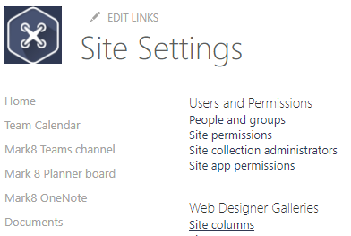

Choose **Create**

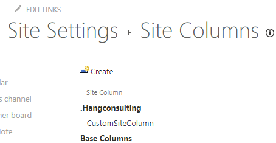

A Site Column can be created for many different information types, including: Single line of text, Number, Date and Time, etc. In fact, all the same column types you might add directly to a list or library are available to you.

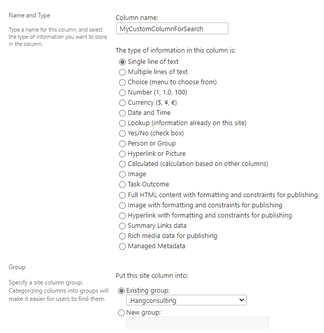

When you are done with the settings for you new Site Column, scroll down to the bottom of the page and choose **OK**. The new Site Column will be created and listed in the Site Columns page in the Group you have chosen.

> [!TIP]
> By putting your custom Site Columns into a group (or groups) preceded by "_" or ".", you'll see your own Site Columns at the top of the listing page.

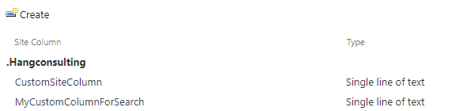

### Where to use Site Columns

Site Columns, are normally used in [Document Libraries](glossary.md#document-library) or [lists](glossary.md#list).

Locate your list or library and navigate to **List settings** or **Library settings**.

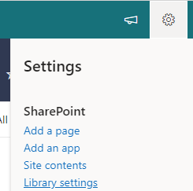

In the column section, choose to add a column from an existing Site Column.

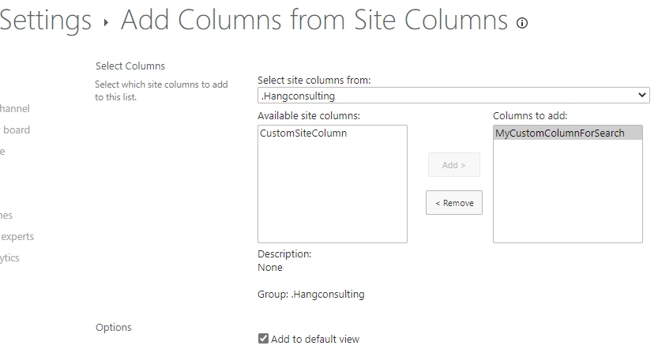

The Site Column is now ready to be used in the library, and you can now add values to the column in the list or library.

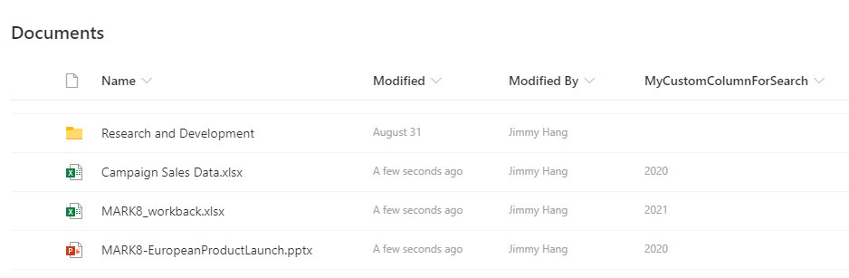

Next, you need to wait for SharePoint Online to do its magic. This magic takes the form of the search crawler indexing the column and its values. This generally takes only a few minutes in SharePoint Online, though it can take longer.

> [!IMPORTANT]
> Site Columns will become Crawled Properties automatically if:
>
> * You have created content using the Site Column. Just defining the Site Column is not sufficient; there must be content to crawl.
> * If the site is a Communication Site, the Site Columns should then become Crawled Properties.
> * If you are creating Site Columns in a modern Team Site (which has an associated Microsoft 365 Group), you must be a Site Collection Administrator *explicitly* for the crawled and managed properties to appear in the schema admin UX. The properties do exist and work for search, but makes it hard to do custom mapping. This means adding yourself as an *individual* to the Site Collection Administrators. It is *not* sufficient to be an Owner of the Team Site (and thus of the underlying Microsoft 365 Group).

In the meantime you can navigate to your tenant's Search Administration page: **SharePoint Admin Center** / **More features** / **Search** / **Manage search schema** (https://[TenantName]-admin.sharepoint.com/_layouts/15/searchadmin/TA_SearchAdministration.aspx) page to review the current settings. You will need the **SharePoint Administrator** role to be able to access this page.

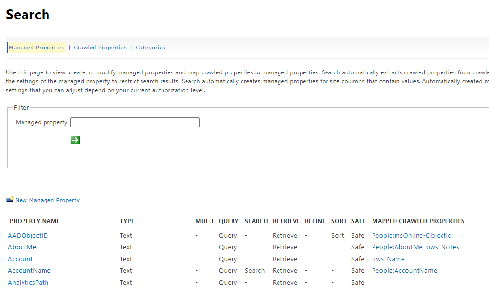

Navigate to **Crawled properties** and search for your custom column, if the search crawl has done it's job, you should see your site column as a crawled property.

> [!NOTE]
> Crawled Property names don't match the Site Column names exactly. Often, the Crawled Property will look like `ows_[SiteColumnInternalName]`, for example, `ows_MyCustomColumnForSearch`. Different column types will have different naming. Searching for a significant fragment of the Site Column's name should help you find it, such as "MyCustom" or "ForSearch" for the column above.

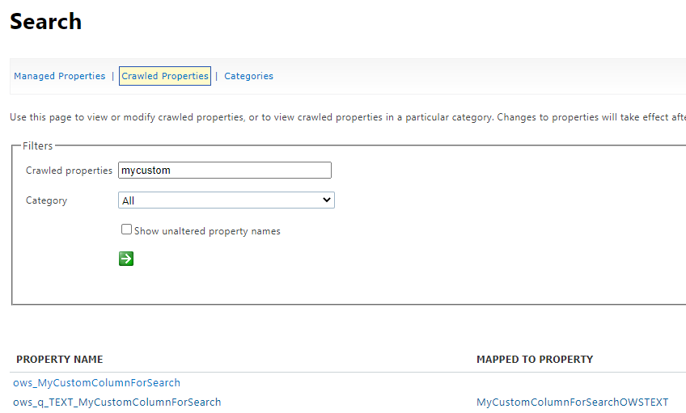

You may then find one or more crawled properties:

* `ows_MyCustomColumnForSearch` - This is the one we will *generally* use to map to our managed property for search.
* `ows_q_Text_MyCustomColumnForSearch` - This is automatically created by search and shouldn't be used.

In SharePoint Online, we're not allowed to create new Managed Properties in the search schema that are "Refinable" or "Sortable". Microsoft has created a number of Managed Properties that we can use in order to extend the search experience. These properties take the form:

"Refinable" + type of column + number -> RefinableString00 or RefinableDate03

In the managed properties page, search for "refinablestring" or "refinabledate". For example, use "refinabledate" if your Site Column is a Date and Time type column.

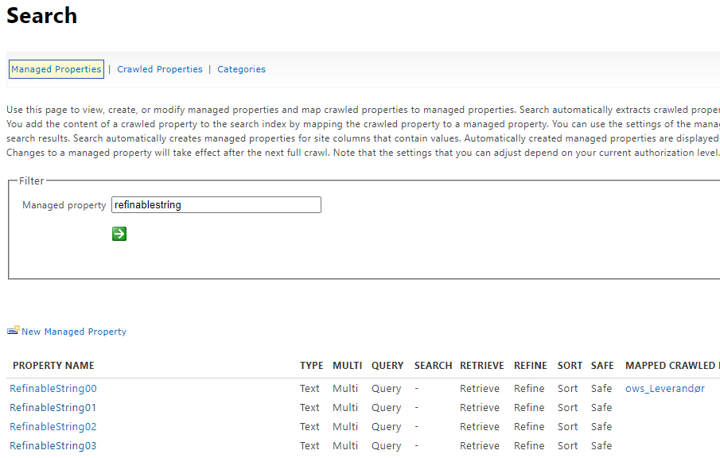

Pick a RefinableString Managed Property which is available, meaning not already mapped to other Crawled Properties, for example "RefinableString01". These Managed Properties have been pre-defined with everything turned on: Query, Refine, etc.

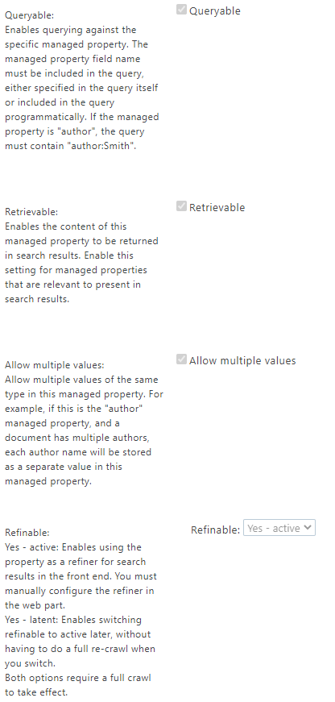

Scroll down to the bottom of the page, and map the Crawled Property to the Managed Property. You may also want to add an Alias to help you identify things in the Managed Property listing. For example: **MyCustomColumnForSearchRefinable**. These aliases don't show up in many places, but they can help you stay organized. Click **OK**.

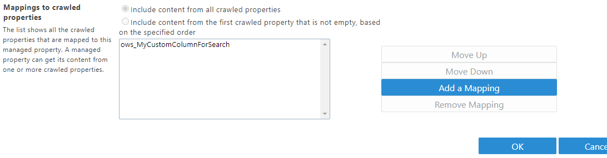

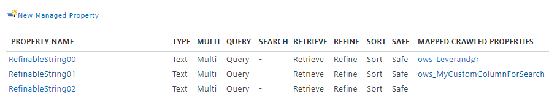

After this you will need to wait for the search index to be refreshed with the new Managed Property. Search crawls in Microsoft 365 are frequent, and this usually takes less than one hour, often only a few minutes.

To make sure that the index maps your Site Column and its content in the next search crawl, you can navigate back to your site, and in Site Settings, choose "Search and offline availability".

Click **Reindex site** then OK, then wait… [Insert patience here]

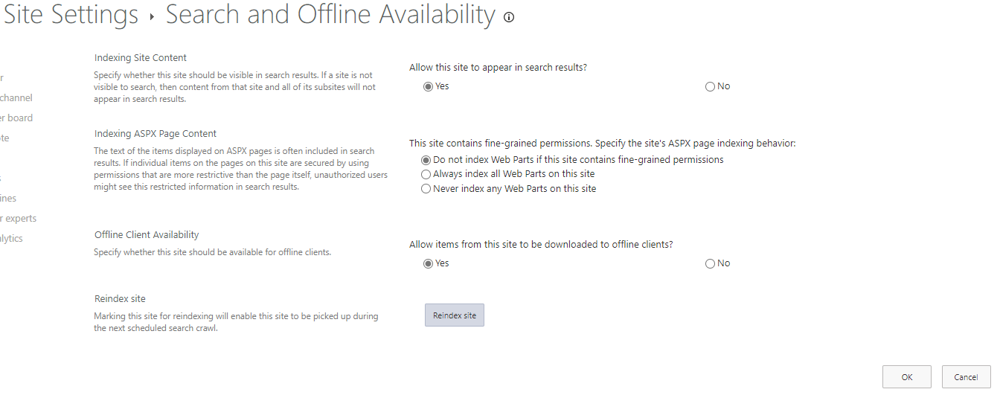

When the index has been updated you will be able to search for content that has your Site Column metadata as shown below.

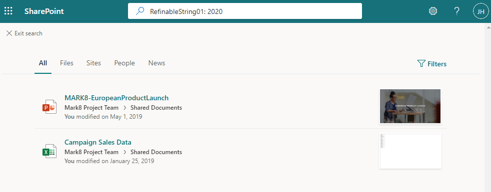

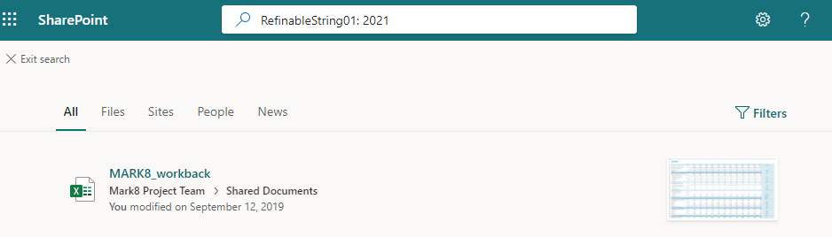

---

To extend the search experience you can use the [PnP Modern Search Web Parts.](https://microsoft-search.github.io/pnp-modern-search/) solution to build custom search page(s) with its powerful Web Parts:

* Search Box Web Part
* Search Vertical Web Part
* Search Refiner Web Part
* Search Results Web Part

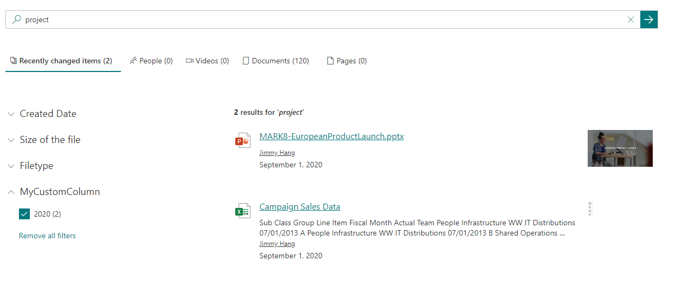

You can also embed a SharePoint search page in Teams as a personal app by following [this guide](/sharepoint/dev/features/embed-pages-to-teams)  

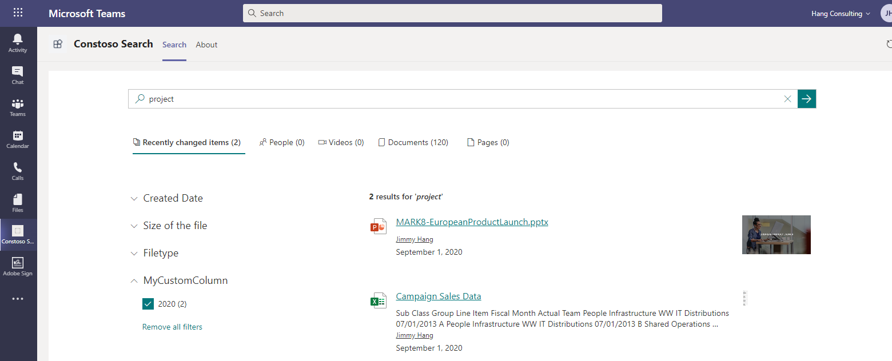

## Conclusion

This article has only scratched the surface of what is possible with Microsoft 365 Search. By creating Managed Properties specific to your content and processes, you'll be laying down an important foundation for more sophisticated search-driven solutions.

---

**Principal author**: [Jimmy Hang, MCT, MCSE: Productivity](https://www.linkedin.com/in/jimmyhang/)

---
