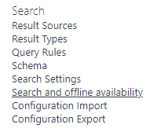

# How Do Site Columns Become Managed Properties - Thus Available for Search

[!INCLUDE [content-disclaimer](includes/content-disclaimer.md)]

Before we jump to the topic at hand, a little recap of the terminology involved:

* Metadata: means information about something, in SharePoint usually information about documents, pages or list items
* Site Column: is a metadata column that has been created for a whole site collection, thus available to be used by any list/library in that site.
* Search Crawled Properties: A crawled property is content and metadata that is extracted from an item, such as a document or a URL, during a crawl.
* Search Managed Properties: Is a list of useful content and metadata included in the search index, we normally map useful crawled properties to managed properties to make search more easy.

For more details about the SharePoint search schema visit [official documentation](https://docs.microsoft.com/sharepoint/manage-search-schema) to learn more.

Also head over here to read more about [PnP Modern Search Solution](https://microsoft-search.github.io/pnp-modern-search/), I will be using this to show a quick usage of Site Columns in Search.

## How to create a site column

### Where

A site column can be created generally in two places:

1. In the Content Type Hub - Using the Content Type Hub will make the column available to all sites in your SharePoint Online tenant.
2. In the Site Collection where you will be using the column

> [!NOTE]
> This article doesn't discuss in detail the Information Architecture of when and where to create the site columns.

### Using What

There are a lot of tools you can use to create a site column

1. Manually clicking in the SharePoint page, this is what we'll be using in this article
2. Using PnP PowerShell
3. Using Site Design & Site scripts
4. Using Code

### How

In SharePoint navigate to your Site Settings | choose Site columns, the site columns page will contain all metadata data columns currently available in your site, except for hidden system ones.

Choose "Create"

A SharePoint site column can be created for many different information types, text, numbers, date..ect.
You will need to plan your columns accordingly to your needs.

When done, scroll down to the bottom of the page and choose OK, the new site column will be listed in the "Site Columns" page in the Group you have choosen. I'm using a ".ABC" as a Group name for sorting purposes.

### Where to use site columns

Site columns, are normally used in document library or list.

Locate your library and navigate to "Library settings"

In the column section, choose to add a column from an existing site column

The Site column is now ready to be used in the library, and I'll be adding some numbers to the text column.

Next, you need to wait for SharePoint Online to do it's magic. This magic takes the form of the search crawler indexing the column and its values. This generally takes only a few minutes in SharePoint Online, though it can take longer.

In the mean time you can navigate to your tenant [Search Administration](https://tenant-admin.sharepoint.com/_layouts/15/searchadmin/TA_SearchAdministration.aspx) page to review current settings. You will need the SharePoint Administrator role to be able to access this page.

Navigate to Crawled properties and search for your custom column, if the search crawl has done it's job, you should se your site column  as a crawled property.

You will then find two crawled properties:

* ows_MyCustomColumnForSearch | this is the one we will use to map to our managed property for search
* ows_q_Text_MyCustomColumnForSearch | this is automatically created by SharePoint and shouldn't be used

In SharePoint Online, we're not allowed to create new "Managed Properties" in the Search Schema that are "Refinable" and "Sortable", but Microsoft has created a number of Managed Properties that we can use in order to extend the search experience.

In the managed properties page, search for "refinablestring" or "refinabledate". For example, use refinabledate if your site columns is a DateTime type column.

Pick the RefinableString that is available, meaning not already mapped to other crawled properties example: "RefinableString01". These managed properties have everything turned on: queryable, refinable, etc.

Scroll down to the bottom of the page, and map the crawled property to the managed property, then click OK.

After this you will need to wait for the search index to be refreshed with the new Managed Property. To make sure that the index maps your Site Column by the next run, navigate back to your site, and in site settings, choose "Search and offline availability"

Click "Reindex site" then OK, then wait…

When the index has been updated you will be able to search for content that has your site column metadata as shown below.

To extend the search experience you can use the [PnP Modern Search Web Parts](https://microsoft-search.github.io/pnp-modern-search/) mentioned above to build your custom search landing page:
The solution will contain mainly:

* Search box web part
* Search Vertical web part
* Search Refiner web part
* Search Results web part

You can also embed the SharePoint search page to Teams as a personal app by following [this guide](https://docs.microsoft.com/sharepoint/dev/features/embed-pages-to-teams)  

---

**Principal author**: [Jimmy Hang, MCT, MCSE: Productivity](https://www.linkedin.com/in/jimmyhang/)

---
