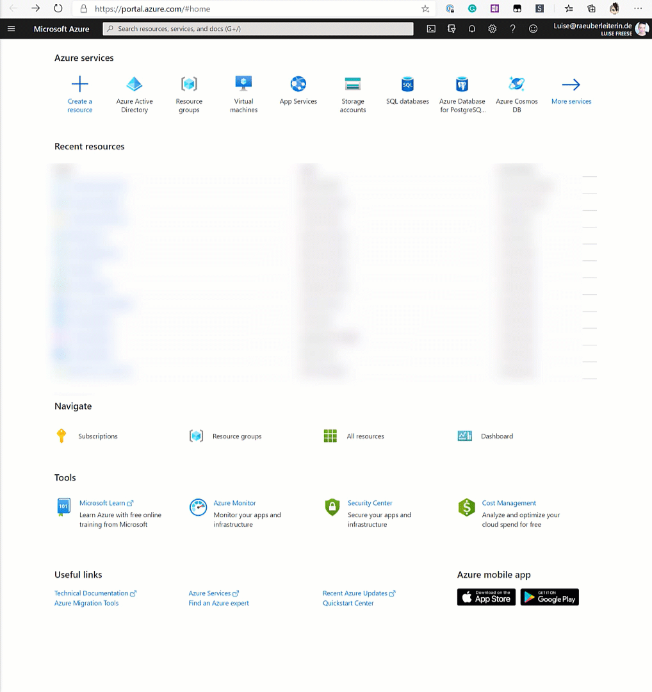
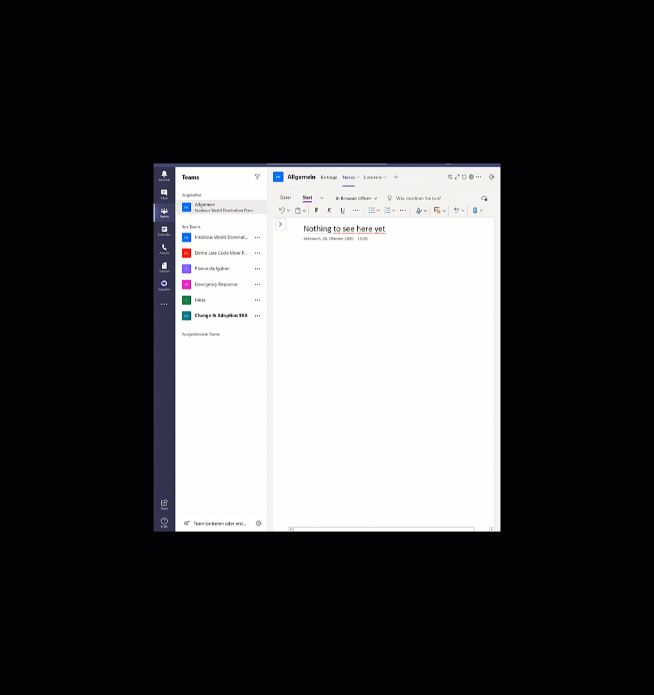

# How to deploy Teams App templates into your tenant

## Introduction

This blog post shall guide you through the process of App deployments with Microsoft Teams App templates.

Microsoft Teams is an excellent hub for collaboration, and the most fantastic thing about it is its extensibility. Custom development can close some gaps between out of the box features and specific business needs. But we do not always need to reinvent the wheel completely. You can find amazing ready-to-deploy app templates. Of course, as a developer, you may want to tweak those templates, but they are ready to use in production and, of course, it's great to understand how deployment works in Azure.

⚡ Please don’t test in your production environment. If you are new to this, get a free Microsoft 365 developer tenant: it’s way safer for you for testing.

As an example, I will use the [Group Activities App](/microsoftteams/platform/samples/app-templates#group-activities) to show the steps that we usually need to do to deploy an app in our tenant.

You can get the complete documentation, including all files, deployment guides, and architecture overview on [GitHub](https://github.com/OfficeDev/microsoft-teams-apps-groupactivities).

## Register an App in Azure AD

First, you will need to register an Application in Azure AD, create an app secret and enable Graph API permissions.

Remember to save your App secret immediately after creating it – you won’t be able to read or copy it once you click on something else in the Azure Portal. To understand which permissions you need, read the documentation for the specific app template. Don’t forget to grant admin consent for the permissions.

## Deploy template

As we deal with One-Click-Deployment, you will need to click that magic deploy to Azure button in the deployment guide and

create a new resource group
paste Tenant ID, AppID, App Secret into the form,
be a little bit patient. It can take a while. You don’t need to stay on that site. You can check later on as well.

## Add authentication

Azure AD can easily manage authentication, connect our bot with it, and set the scope as in our app registration.

## Package App

Now it’s already time to create our App package. For this, we will need the manifest.json file and two .png files as App icons which we will find in the GitHub repo.

In the manifest.json we will replace placeholders for

* developer name,
* URLs for
  * site,
  * privacy,
  * terms of use,
* BOT ID (our App ID),
* validDomains –> [BaseResourceName].azurewebsites.net,

and zip this `manifest.json` with `outline.png` and `color.png` from GitHub repo in a `GroupActivities.zip` file.

⚡ Watch out, sometimes the `outline.png` provided on GitHub are not transparent, and then your app won’t pass App validation. If this is the case for you, make it transparent, add it again to your .zip file.

## Publish

The easiest way to publish your app is via Microsoft Teams App Studio – but you can also do it with Visual Studio Code Teams Toolkit.

If you choose App Studio, upload your .zip file and select publish and then app catalog.

If you choose Teams Toolkit, you can see potential error even before trying to publish, and the error/warning notifications give you more detail about what was wrong, while App Studio just returns a ‘Something went wrong.’

Time for a happy dance!

---

**Principal author**: [LuiseFreese](https://www.linkedin.com/in/LuiseFreese)

---
