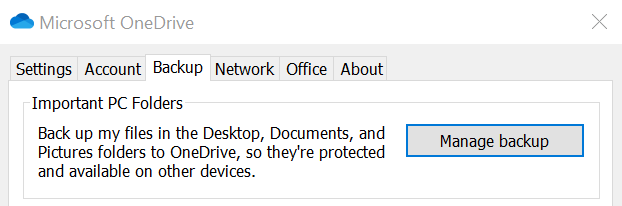
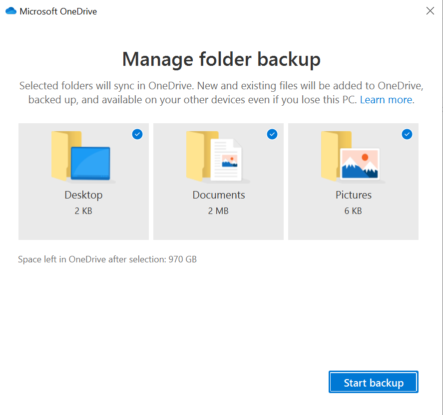

# OneDrive PC Folder Backup Benefits for End Users

[!INCLUDE [content-disclaimer](includes/content-disclaimer.md)]

OneDrive PC Folder Backup is a OneDrive sync feature that works with Windows 10 and 11. This feature allows business users to automatically backup/redirect their Windows clients Desktops, Documents and Pictures folders to OneDrive for Business.

> [!NOTE]
> OneDrive PC Folder Backup was previously known as Known Folder Mode (KFM)

## Benefits of OneDrive PC Folder Backup

* Automatic Backup of content on your device
* You really don't need to worry about uploading your content, as everything you put on the Desktop/Documents/Pictures is uploaded automatically
* Protection against ransomware attack on the device because OneDrive support in place file restore
* Seamless switching to another device and continue where you left your files
* Dependent on your licensing, you will get at least 1 TB of personal backup storage
* If your business are small without central IT, users can turn on this feature in a few easy steps
* If your business is bigger and has central IT, you can turn on this with GPOs
* If you have used Offline files before you might have experienced that it's a bit difficult to know if it has synchronized correctly with the file share you have been configured against. In my opinion it's a lot easier to catch synch issues with OneDrive and easier to fix.
* OneDrive PC Folder Backup is a killer feature when migrating personal file shares to OneDrive

## How you turn it on

Follow this [Guide](https://support.office.com/article/back-up-your-documents-pictures-and-desktop-folders-with-onedrive-d61a7930-a6fb-4b95-b28a-6552e77c3057) at Microsoft support.

## Tips & Tricks

Here are few things I've experienced with this feature that might help in case of troubleshooting:

1. OneDrive PC Folder Backup is similar to Windows Offline Files or folder redirection. Meaning they don't work well together so you need to turn of Offline files before using OneDrive PC Folder Backup.
2. OneDrive PC Folder Backup uses your OneDrive site as storage, meaning the user account in question have to be "Site Collection Owner" of that OneDrive site, this is normally the case but if not then OneDrive PC Folder Backup won't work.
3. .PST files is not supported. This is often the case when users have limited mailbox storage on premises, normally we export the mailbox as backup and stores this in the Documents folder leading to error when activating the feature.
4. OneNote files outside of OneDrive is not supported. This is the case if you have used OneNote locally before OneDrive PC Folder Backup normally the OneNote apps stores the files in the Documents folder. Move the OneNote files to OneDrive first.
5. Beware of the 100,000 items recommended limit, if you are using OneDrive PC Folder Backup while synching SharePoint libraries. Performance decreases as the total numbers goes up, this limit also depends on your client device performance.  

---

**Principal author**: [Jimmy Hang, MCT, MCSE: Productivity](https://www.linkedin.com/in/jimmyhang/)

---
