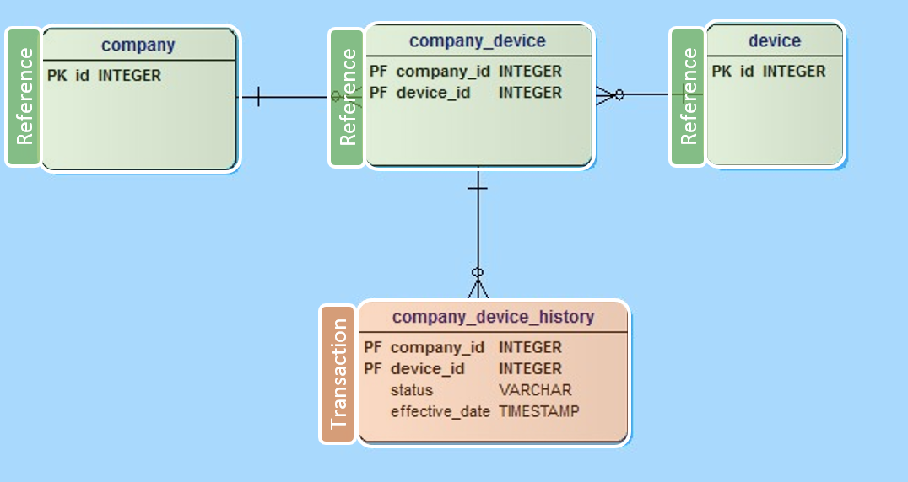

# Making Good Technology Decisions: Data Storage

* Part 1: [Microsoft 365 - Making Good Technology Decisions: Establishing Decision Criteria](making-good-technology-decisions--establishing-decision-criteria.md)
* Part 2: Microsoft 365 - Making Good Technology Decisions: Data Storage (this article)
* Part 3: [Microsoft 365 - Making Good Technology Decisions: Front End](making-good-technology-decisions--front-end.md)

[!INCLUDE [cc-data-platform-banner](includes/cc-data-platform-banner.md)]

Once you’ve thought through the decision criteria for your specific solution (as covered in part 1) – which ought to fit into the broader decision criteria for your portfolio of solutions – you can turn to the technical specifics. The next few parts of the series are probably where people argue the most about purity and “best fit”. Sometimes the best fit isn’t just a technical fit: you need to take those other criteria into account. The best technical solution isn’t always the same one for everyone. If you frame the technical decisions based on the decision criteria, you’ll be likely to make technical choices which have a higher potential for success. You may even find yourself arriving at different choices than you might otherwise expect.

## Data Storage Concepts

When we build a solution within the Microsoft 365 ecosystem, we almost always need to store some content which is generated during the use of the solution. I’ve always thought about that content as falling into several different, broad brush buckets. Caveat: there are bound to be readers who disagree with me on multiple levels. I may be over-simplifying or using terms in different ways than the norm. My goal is to get the concepts across without being too muddy; let’s see how I do.

### Reference Content

Reference content is the content which makes the transactions work. If we are recording outcomes of meetings, we want to know who was in the meeting; that content is provided from the set of users in our farm or tenant. If we want to track customer interactions, we need a consistent data set of customer information; that may be stored in a list or in Managed Metadata. If we want to process invoice documents, we’ll want to tag them with the appropriate metadata about which office or region is responsible for them; that may be stored in Managed Metadata or lists.

You can see the pattern. Before we can think about performing transactions, we must lay down the sets of reference data to support them. In many cases, this reference data needs to be consistent across a wide range of transactional content, so we turn to centralized storage services like the Managed Metadata Service. We get a service to manage Users and Groups for “free” from Active Directory (AD) or Azure Active Directory (AAD).

In other cases, the reference data is purely local, like perhaps the responsible party for a certain process step within a department. In those cases, we can build our own lists or libraries to contain the data.

Guess what: Each of the reference content sources may also need to support transactions. If you get a new customer, you need to add them to the customer list. If a new person joins your organization, they need an Office 365 license. And so on.

### Transactional Content

Usually transactional content is what gets the most attention when we are building solutions. When we create a list or library in SharePoint, each row represents at least one transaction: adding that item or document to the list or library. You perform hundreds or thousands of transactions daily, both at work and in your personal life.

Transactional content is that content which represents activity which occurs frequently, like creating a service ticket, checking out a resource, or filing a status report. Transactional content becomes meaningful because of its use of reference content as well as simpler fields like text fields.

Regardless of where you store reference data, you need to account for it before you perform your first real transaction. The relationships between transactional content and reference content is one reason why technical people focus on what’s called a data model. Data models show how all the different types of content fit together.

### Data Model

You may have seen a diagram that looked something like this sometime in your career. This is an example of a data model for a relatively simple system. (I found it in a StackOverflow post, and it seemed like a good example, so I’ve adapted it for this article.)

This data model shows a way you might store information about company devices in a simple device management solution. Don’t worry too much about the details – this data model is too simple to be of much practical use. The point is, we often have multiple, related tables (think SharePoint lists) in a data model.

The top row of tables can be considered reference lists. The bottom table can be considered the transactional table. In order to create items in the company_device_history table, we need the reference information in the other three tables: company, company_device, and device. As I mentioned above, you will also have transactions in the reference tables: you may need to add companies or devices in order to start tracking them. But the primary transactions will be managed in the company_device_history table.

Each of the boxes in the data model can be considered a data entity. A data entity is the mix of fields and their behaviors which make up the representation of a business object. In SharePoint, the structures of lists and libraries are dictated by the data entities we apply to them. Those data entities may be created directly in the list or library by adding columns or by enabling the use of Content Types on the list or library. Other data storage mechanisms provide different approaches and levels of rigor to managing the data entities they can contain.

The data we add to each table inherits the data entity’s structure and behavior. Each table is basically a rectangle of data, where the rows are items and the columns are fields. This rectangular construct is very familiar if you use Excel, or create shopping lists, or collect data to make it useful in many other ways.

Many times, we think of the different apps or screens we build from a table-centric view. For example, if we are adding a company_device_history item, it will probably be a different screen than if we are adding a new company. I’ll discuss these differences more in Part 3.

### Logging and Auditing

Most platforms record some information about how a transaction occurred. Most data storage mechanisms give you the basics: who did something and when. But in many cases, for statutory or regulatory reasons, or simply to keep track of who did what in more detail, you’ll need to build logging or auditing capabilities into your solution.

This usually means you explicitly create lists or some other data storage mechanisms to contain the detailed logging information. In many cases with SharePoint Designer workflows, the Workflow History list contained a log of the activity generated by the workflow. Over time, old items in those lists would be deleted. This is the case with the Office 365 Audit Log as well: the history is maintained for a rolling 90 days. If you need more tightly integrated logging or longer time horizons, you may decide to build your own mechanisms. More sophisticated data storage options may provide full-fledged logging and auditing as part of their transaction engines.

## Data Storage Options

Now that we’ve run though a little data theory, we can start thinking through the options we have in Microsoft 365. Here are some potential ways you can think about storing the data for your solutions from the simplest to the more complex. A lot of this is a grey area; while I think about this as a rough spectrum from top to bottom, others may see it as more discrete with several options being equivalent. In those cases, the framing above will help you to make the distinctions.

### Single SharePoint List

SharePoint lists (for the sake of this discussion, lists and libraries are equivalent) are far more powerful than many people think. In a list we can set up any data structure we choose, we get robust forms “for free”, we get data validation tools, and much more.

In many straightforward situations, a SharePoint list can be a solution unto itself. We may just need something like a list of activities for customers that we can refer to from time to time. In this case a simple SharePoint list may be more than adequate. This kind of single list solution is a very common use of SharePoint: a straightforward rectangle of data where we can record information which serves a useful purpose.

### Single SharePoint List with Enhancements

An out of the box SharePoint list gives us quite a bit, but we also have additional enhancements we can apply to that list. In modern SharePoint we can use column and view formatting that help us build solution-like functionality right into the list itself. This could allow us to display the items in the list as cards with multiple actions available in each card. It could allow us to add behaviors to the content in a column that allow us to trigger actions or notify other people of something important. We can also customize the forms with Power Apps, or even create mobile ready standalone Power Apps for the list. We can apply business logic with Power Automate flows as items are created or modified. (As of this writing, Power Apps for SharePoint content alone are covered by Office 365 licenses. Many people don’t know that, so one divergence from my “no licensing” rule.)

When we add these types of enhancements, we are giving the list various powers to provide us increased utility. While a list itself is useful, when we change the UI or add new behaviors to it, the list becomes more and like a bespoke solution. When we extend the list in these ways, we often need help from someone who has different skills and knowledge of the platform, but it’s not that unusual for savvy end users to get a list to this point.

### Multiple SharePoint Lists

If a single list is inadequate, many times we use multiple lists to accomplish what we need. For example, we may have a list which contains transactions with customers. To ensure that we have a common view of the customer, we might have a look up column inch which looks up from a customer list.

From a database design perspective, combining multiple SharePoint lists into a solution can seem crude, as we don’t have a lot of control over referential integrity, cascading deletes, and many of the other capabilities we’re used to in full-fledged database storage mechanisms. However, people have been building quite sophisticated solutions with SharePoint lists as the storage mechanism for many years, with some sort of front end which treats those lists almost like a database.

Each of the lists within our solution can have enhancements added to them, whether that list contains transaction content or reference content. Adding, editing, or deleting content in any of the lists may require different permissions, form structures based on the user’s role, business logic represented by a Power Automate flow, etc. By combining multiple lists – each of which can serve its own set of purposes – into a larger solution, we can build rather sophisticated applications.

It’s worth reiterating, however, that SharePoint lists are not database tables and SharePoint is not a database. The content in SharePoint lists ends up in a SQL database somewhere, but that doesn’t mean that the lists themselves are database tables. This is a common misconception about SharePoint, especially when technical people start working with it for the first time. Just because there’s an instance of SQL running somewhere, it doesn’t mean that you’re working with a database. We are separated from the underlying SQL databases by a layer of Application Programming Interfaces (APIs), and with Office 365 we cannot touch the SQL database directly.

### Microsoft Dataverse

The Dataverse is a part of the Power Platform. It also has a different licensing model then SharePoint does within Microsoft 365.

What Dataverse gives us is the ability to manage entities in a more sophisticated way. In the multiple SharePoint list section above, that’s essentially what we we’re doing, but we don’t have as many sophisticated capabilities we can bring to bear. For example, Dataverse allows us to create real references between entities, business rules, forms, views within and across entities, and more. Dataverse is in fact a layer of abstraction on top of SQL databases, so you get some of that sophistication without having understand how to design and maintain a database directly.

When we build entities in Dataverse and add relationships between them, we need to be more careful up front. Generally, the more sophisticated the data storage mechanism, the more up-front planning is required, as large-scale changes are difficult after the fact. Not impossible – just more difficult.

### Azure Tables

Azure Tables are like Dataverse in that they give us the ability to manage a set of entities, but the underlying technology is NoSQL. Choosing Azure Tables over Dataverse may well be driven by your available skills or determined by comparing licensing costs.

In many organizations, the fact that we even mention the word Azure means we need to interact with a different set of technical people in order to obtain access. This means that Azure Tables – while they may seem to hold more appeal from a technical perspective – may be out of reach in a larger organization, often due to security concerns.

### SQL Databases

SQL databases or what many technology people would call “real” databases. Looking at all the options above a database person would see them as highly inferior. SQL databases make sense when you’re building something that needs to have industrial strength, scale to any size, be fault tolerant, and even more importantly support highly complex data structures.

## Now what?

Once you’ve decided on your data storage mechanism – and it’s possible you may have arrived at a combination of these options for a more sophisticated solution – you can build out your data model. Depending on where in the spectrum you have landed, you’ll need to apply different level of rigor to the data model up front, as I’ve mentioned. With SharePoint lists, the 80/20 rule is in full force: you can easily make adjustments iteratively. If you’ve landed at the SQL database end of things, you’ll need to nail down the data model much more completely.

Next, you’ll start building out the user interface (UI) for your solution. I’ll tackle some of your options for the UI in the next article in the series: Building the Front End.

---

Principal author: [Marc D Anderson, MVP](https://www.linkedin.com/in/marcanderson)

This article was originally published as a part of the "Microsoft 365 - Making Good Technology Decisions" series, written by Microsoft MVP Marc D. Anderson for [CollabMagazine](https://www.collabmagazine.com/).

---
