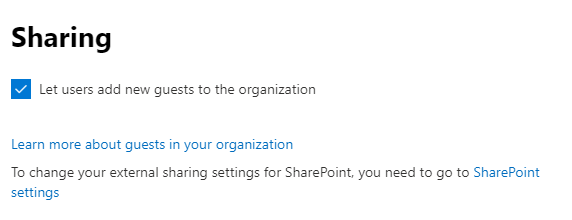
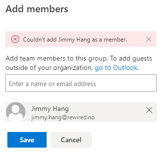
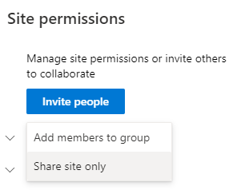
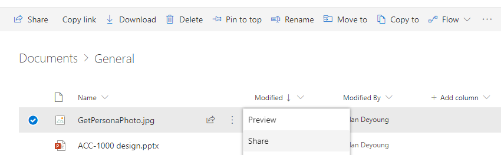
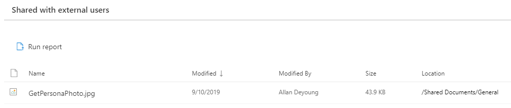

# Managing External Guests in SharePoint vs Teams

[!INCLUDE [content-disclaimer](includes/content-disclaimer.md)]

"Guest", such a beautiful word. In my humble opinion Guest Users is one of the most valuable assets we have, and learning how to best collaborate with Guest users is an essential skill set.

Lucky for us Microsoft with the continuous innovations in Office 365 makes the process more seamless everyday.

Guest User -> a user outside of your Office 365 organization.

## Enabling Guest Users

In the Office 365 Central Administration center:

1. Verify that Sharing is enabled for the tenant in the tenant Admin Center

    

2. Verify the Office 365 Group allows users to invite guest

    

3. Verify in SharePoint Admin Center guest sharing is on and set the way your governance dictates

    

## What is the differences in Permissions and Sharing

At basic level Office 365 Groups have two permissions settings:

1. Owner | Full control of the Group, and Site Collection Administrator of the backend SharePoint Site
2. Member | Edit permission to the Group, and member with "Edit" rights to the backend SharePoint Site  

SharePoint permission groups, on the other hand, provide more granularity:

1. Site Collection Administrator | Full control of the SharePoint site plus access to Site Collection settings
2. Site Owner | Owner permission to the site but cannot control some features in the Site Collection
3. Site Members | Edit permissions to the site, this allows the users to also modify lists
4. Site Visitors | Read only permissions to the site

Differences when in use

* It is easy to see who is a guest in Teams: all guests will have (Guest) appended to their user name
* In SharePoint you have to check the email address to verify a user is external (a guest)
* In Teams, guests can't be an owner of the Team
* In SharePoint, a guest can be promoted to Owner of the site
* In SharePoint (Groups) you can't add an external guest as a member of the O365 Group, this has to be done through the Outlook Web App (OWA), but you can share the SharePoint site only

    
    

What about "Permission Inheritance"

* Teams -> the only option to break inheritance in Teams is to create a #PrivateChannel in the Team
* SharePoint -> members and owners are allowed to break inheritance at any level: list/library, folder, or file/item

Currently there is a number of things you can't do in Teams that force users to "navigate to SharePoint"

1. File versioning, users can't see version history in Teams
2. Edit file metadata
3. Publish a file a major version if major/minor versioning is used
4. Start a Flow from a file
5. Sharing folders or files

## How does it work then?

In most of the use cases I've beeing dealing with lately I have to use a combination of both Teams and SharePoint's sharing features to make it works as it should.

### Use case #1

Imagine you have a "Private Project Team", that is restricted to members:

* You need owners and members, this can easily be managed by Teams
* If you have Guests that are members of the project, you can easily invite them to your Team

    

### Use case #2

Imagine you have a "Private Project Team", that is restricted to members but have some content that need to be reviewed by someone who is not a member of the project, and cannot be added as a member to the team for any reason.

* You use Teams to add/remove members as needed to your project, including guest users
* You then use SharePoint to share any content to any other users who is not a member, both internal and guest

    

### Use case #3

Imagine you have a "Private Project Team", that is restricted to members, and you need to add guests to the project to collaborate on all files but don't want them to have access to the Teams Conversations or other Teams connected apps.

* You use Teams to add/remove members as needed to your project, including guest users
* You then invite the "others" external guest to the SharePoint site only as members
* You can, of course, share the SharePoint site with visitors to allow read-only access to all content

    

## How to check if you have a lot of external users

* In Teams, just look at the members list, everyone with (Guest) is external
* In SharePoint, use the new "External user report" in Site Analytics to verify

## Block guest access to certain Teams 
Now and then you will need to make sure that Guest users can't be invited to a certain Team by accident, for example the HR or Finance Team. 

Folow the guide below to achive this, as pr. my knowledge you will need Global administrator right to achieve this.

* [Block guest accesss to Team](https://docs.microsoft.com/microsoft-365/admin/create-groups/manage-guest-access-in-groups?view=o365-worldwide#block-guest-users-from-a-specific-group)

## Useful resources

* [Manage guest access in Office 365 Groups](https://docs.microsoft.com/office365/admin/create-groups/manage-guest-access-in-groups?view=o365-worldwide)
* [Adding guests to Office 365 Groups](https://support.office.com/article/adding-guests-to-office-365-groups-bfc7a840-868f-4fd6-a390-f347bf51aff6)

------

**Principal author**: [Jimmy Hang, MCT, MCSE: Productivity](https://www.linkedin.com/in/jimmyhang)

