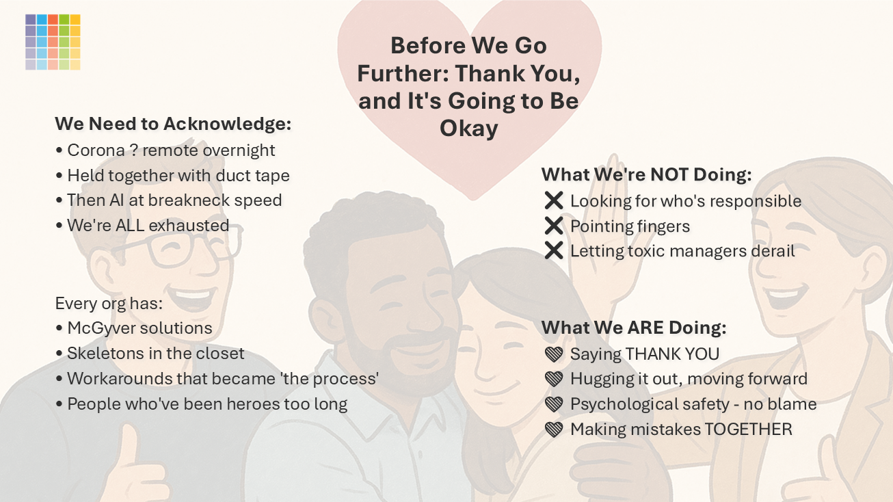

# Practical Scenarios – Implementing Microsoft 365 Copilot Organization-Wide

[!INCLUDE [content-disclaimer](includes/content-disclaimer.md)]

The [Maturity Model for Microsoft 365](microsoft365-maturity-model--intro.md) is a useful tool for considering high level business capabilities and competencies, providing benchmarking, and planning guidance. However, practical application of the Maturity Model to specific tasks and needs is not addressed in the Competency or Elevate documents. The Practical Scenarios documents seek to address this, providing easily digestible guidance and strategy for focused topics.

This Practical Scenarios document covers implementing Microsoft 365 Copilot across an entire organization. Microsoft 365 Copilot represents a significant shift in how knowledge workers interact with technology, moving from traditional interfaces to AI-assisted collaboration and productivity. Successful organization-wide implementation requires careful consideration of multiple competencies, particularly [People and Communities](microsoft365-maturity-model--people-and-communities-competency.md), [Staff & Training](microsoft365-maturity-model--staff-and-training.md), and [AI & Cognitive Business](microsoft365-maturity-model--cognitive-business.md).

## Introduction to Copilot Implementation

Microsoft 365 Copilot integrates AI capabilities across the Microsoft 365 suite, helping users create content, analyze data, summarize meetings, and discover information more efficiently. However, implementing Copilot organization-wide is not simply a technology deployment—it requires a holistic approach that addresses people, processes, culture, training, and governance.

Successful Copilot implementation requires coordination across multiple MM4M365 competencies, particularly [People and Communities](microsoft365-maturity-model--people-and-communities-competency.md), [Staff & Training](microsoft365-maturity-model--staff-and-training.md), [AI & Cognitive Business](microsoft365-maturity-model--cognitive-business.md), and [Management of Content](microsoft365-maturity-model--management-of-content.md).

## Applying the Maturity Model to Copilot Implementation

## Level 100 - Initial

At this level, organizations have not yet begun implementing Copilot, or have only minimal, uncoordinated usage.

- No organizational strategy or plan for Copilot implementation exists
- Individual users may experiment with Copilot on their own, but there is no organizational support or guidance
- No training, governance, policies, or guidelines for AI use are in place
- Content may not be properly organized or accessible for Copilot to leverage effectively
- Staff are unaware of Copilot capabilities or may have misconceptions
- No metrics or success criteria are defined

**Next Steps:** Conduct an organizational assessment, identify key stakeholders, review content organization, begin developing a strategy and roadmap, and identify pilot groups for initial testing.

## Level 200 - Managed

At this level, organizations have begun piloting Copilot with selected groups, but implementation is still ad hoc and lacks comprehensive planning. **This level feels like success, but it's actually a dangerous plateau that builds technical and organizational debt.**

> [!NOTE]
> Before we go further: Thank you, and it's going to be okay. We acknowledge that many organizations have been through rapid changes (remote work, AI adoption) and have been heroes for too long. This work is about moving forward together, not pointing fingers.

### Characteristics

- ✨ Pilot programs exist with selected user groups (often IT, executive assistants, or specific departments)
- ✨ Champions program exists, but champions are volunteers without formal structure or accountability
- Some people get licensed, but not everyone—licensing is inconsistent
- Basic training is provided to pilot users, but it may be informal or vendor-provided only (lunch and learns, occasional champions meetings)
- Some awareness of Copilot exists, but understanding is limited and may include misconceptions
- Executive awareness exists, but they mostly know buzzwords rather than actual business applications
- Some form of AI policy exists (e.g., "we won't share IP with AI"), but it's basic
- ✨ Some departments or projects are trying things, but efforts are siloed
- No formal governance framework, though basic guidelines may exist
- Content governance is inconsistent—some content may be properly organized while other areas are not
- ✨ Metrics focus on adoption rates and usage tracking (e.g., "who's using Copilot"), but these are the wrong metrics
- Communication about Copilot is limited to pilot participants
- Support is reactive—help is available when requested but not proactively provided

### Impacts

**The Honeymoon Phase:**
- Early adopters see productivity benefits, but these are not widely shared
- It feels like success because people are trying new things and having fun
- Champions are enthusiastic and engaged

**The Plateau:**
- ✨ Adoption gets stuck at 20-30% and doesn't scale
- Champions can't scale because they're still just volunteers without proper support
- Most of the organization remains in pilot mode
- Quality issues emerge: inaccurate AI output, outdated information, hallucinations
- Data problems surface: legacy data, weird access permissions, old documents
- Budget questions arise: "We spent so much time and energy—what are we getting in return?"
- People who have been learning move on because they want to be where they're not stuck
- Anyone who knows anything about AI is hot on the job market and may leave

**The Real Problem:**
- ✨ **This level feels like success, but it's actually building technical and organizational debt**
- Organizations think they have information management programs, but they don't have data classification and incident prevention
  - According to the [AvePoint 2025 AI Report](https://www.avepoint.com/shifthappens/reports/artificial-intelligence-report-2025), while 90% of organizations claim to have an information management framework, only 30% say it classifies and protects data effectively
- Data volume increases 25% year-over-year—AI creates data on top of data that AI has created (copy of a copy of a copy), and quality degrades
- 81.9% expect ROI in 12 months, but 85.7% have slowed rollouts ([AvePoint 2025 AI Report](https://www.avepoint.com/shifthappens/reports/artificial-intelligence-report-2025))
- ✨ **86% of organizations delayed AI deployments by up to a year** due to security and data quality concerns ([AvePoint 2025 AI Report](https://www.avepoint.com/shifthappens/reports/artificial-intelligence-report-2025))
- Risk of burning out champions if too much is put on them
- Serious risks: AI hallucination leading to legal issues (e.g., Air Canada case where AI hallucinated a policy and the court said they had to honor it)
- ✨ **75% experienced at least one AI-related breach in the past year**, primarily due to oversharing sensitive employee or customer data ([AvePoint 2025 AI Report](https://www.avepoint.com/shifthappens/reports/artificial-intelligence-report-2025))
- Data leaks due to lack of control over data and guardrails
- When users lose trust, they go back to old ways of working
- Bad information architecture compounds at artificial intelligence speed

### The Top Blockers to AI Rollout (According to Research)

According to the [AvePoint 2025 AI Report](https://www.avepoint.com/shifthappens/reports/artificial-intelligence-report-2025), the top blockers to AI rollout are:

1. **Inaccurate AI output, outdated, irrelevant information, and hallucinations** (68.7%) - not change management or training needs
2. **Data security concerns and unauthorized exposure of sensitive data** (68.5%) - lack of labels, guardrails, data protection
3. **Employees don't see the value of using AI in their work** (64.2%)

While 99.5% have invested in AI literacy training, inaccurate outputs and hallucinations still erode employee judgment and decision-making, demonstrating that training alone won't fix trust issues.

### Next Steps

**Critical Understanding:** Level 200 is a stepping stone, not a destination. Organizations must move to Level 300 to avoid building unsustainable debt.

- Document lessons learned from pilot programs and develop a more structured training program
- Create basic governance policies and guidelines for responsible AI use
- Expand content governance to ensure more organizational content is accessible
- **Stop measuring the wrong things** (licenses, prompts)—start measuring business process improvements
- **Recognize that three competencies must reach Level 300 for Copilot to succeed:** Business Process, Staff & Training, and Management of Content

## Level 300 - Defined

At this level, organizations have established processes, training, and governance for Copilot, with a clear plan for broader implementation. **This is the critical level where organizations must reach in three foundational competencies to enable successful Copilot adoption.**

### The Three Critical Competencies at Level 300

For Copilot to succeed organization-wide, these three competencies **must** be at Level 300:

#### 1. Business Process (Level 300)

**Key Shift:** From "Sam knows how to do this" to "the process is owned, documented, measured, and ready for systematic execution or automation."

**Characteristics:**
- ✨ Business processes are **assigned** (not just known by individuals)
-  ✨ Processes are **documented** (using tools like Visio, PowerPoint, process documentation)
- Processes are **measured** (clear metrics for how you know you've achieved what the business is supposed to achieve)
- Processes are **ready for automation** (understandable for people and AI)
- Clear understanding of: What are we calling things? What are the names of our things? How do we know we've achieved success?
- Business process owners, analysts, and architects document, measure, and prepare processes for automation

**Why This Matters:** You cannot automate and work with AI unless you know what you're doing. If core business processes are documented and great, then AI and agents can execute them effectively.

#### 2. Staff & Training (Level 300)

**Key Shift:** From volunteer-based learning to mandatory, structured training with HR responsibility.

**Characteristics:**
- ✨ **HR takes responsibility** for making training mandatory (not volunteers)
- HR doesn't nag individuals—they nag managers to ensure their teams complete training
- Managers must adopt AI **before their teammates** (critical for Level 400 when agents need managers)
- ✨ **Champions program has structure:**
  - Minimum 4 hours per month commitment
  - Manager must accept and support the commitment
  - Prevents champion burnout by setting clear expectations
  - Champions come prepared and accountable
  - Appointed champions from each leg of the business (not just tech-savvy people)
- Training is systematic, continuous, and includes testing
- ✨ **We can't buy or rent the knowledge anymore**—it's moving too fast. It's faster and more sustainable to train employees who know the business than to find AI experts who don't know the business
- Learning and development professionals work with HR to create structured programs
- Training focuses on what to use AI for to speed up processes and make them better

**Why This Matters:** If you get an AI expert, they're good at AI but not good at your business. If you don't have information architecture in place, that person will just sit and learn about your business, then know AI—but they can't use it effectively. You need to invest in the people you have right now.

#### 3. Management of Content (Level 300)

**Key Shift:** From ad hoc content storage to structured, governed, and lifecycle-managed content.

**Characteristics:**
- ✨ **Metadata and taxonomy** are actively managed (tagging, classification)
- ✨ **Legacy cleanup begins** using ROT framework:
  - **R**edundant (duplicate content)
  - **O**bsolete (outdated, no longer relevant)
  - **T**rivial (not business-critical)
- Content must be **structured, findable, and governed**
- ✨ **Information architecture is not something AI can help us with—it's something AI needs to be able to work**
- Clear ownership of content (not just "the author is the owner")
- Lifecycle management policies are in place
- Content is properly organized in Teams, SharePoint, blob storage, archives, records management
- Sensitive content is identified and protected (can't leak)
- Information architects, records management, and data governance specialists work together

**Why This Matters:** Bad information architecture compounds at artificial intelligence speed. This is the biggest reason why AI is hallucinating—there's too much irrelevant content out there. AI needs clean, well-organized, properly tagged content to work effectively.

### Integrated Approach

**These three competencies should NOT be three different projects—they should be in one program** because:

- Champions program works with business processes → champions give value they were missing
- Information architecture identifies sensitive content → champions get training on what's sensitive and what's correct to use
- As content moves to proper locations (Teams, SharePoint, archives), AI can push to the "truth" and ignore contradictory information
- All three competencies reinforce each other and create a foundation for Level 400

### Additional Characteristics at Level 300

- ✨ A defined Copilot implementation strategy exists with clear phases and milestones
- Governance policies are documented and communicated, including guidelines for content access, Responsible AI principles, and security requirements
- Communication strategy exists for sharing Copilot updates and best practices
- Support processes are defined, with clear escalation paths
- Governance group exists (IT, HR, Communication, Legal, Office) to ensure platform health

### Impacts

- More consistent adoption across pilot groups and early adopters
- Users begin to see measurable productivity improvements
- Organizational knowledge about effective Copilot use begins to accumulate
- Support burden decreases as users become more self-sufficient
- Business value becomes more apparent, supporting continued investment
- ✨ Foundation is laid for Level 400 where agents will need managers
- Quality issues decrease as content is better organized and processes are documented
- Data security improves as sensitive content is identified and protected

### Next Steps

- Expand rollout to additional departments or user groups
- Refine training based on user feedback and evolving Copilot capabilities
- Develop advanced use cases and scenarios for different roles
- Create communities of practice for Copilot users to share tips and best practices
- Integrate Copilot training into onboarding programs for new employees
- Begin measuring ROI and business impact more systematically
- **Prepare for Level 400:** Understand that agents will need managers (business managers, not IT)

## Level 400 - Predictable

At this level, Copilot is widely deployed with mature processes, comprehensive training, and strong governance. The organization treats Copilot as a strategic capability. **At this level, agents become part of the workforce and need managers—but not IT managers.**

### Characteristics

- ✨ Copilot is available to a significant portion of the organization (based on licensing and role requirements)
- Training is viewed as an ongoing program with regular updates as Copilot capabilities evolve
- Advanced training includes prompt engineering, role-specific use cases, Responsible AI, and business process integration
- Governance is comprehensive with regular audits, policies for custom configurations, and Responsible AI compliance
- Content governance ensures high-quality, well-organized content that Copilot can effectively leverage
- Success metrics are regularly reviewed and used to drive continuous improvement
- ✨ Copilot is integrated into business processes, not just used as a standalone tool
- Communities of practice exist where users share best practices
- ✨ **Agents need managers—but not IT managers:**
  - Business managers (not IT) manage AI agents for their domain (e.g., sales managers manage sales agents)
  - The work description for an agent becomes the instructions, tasks, and scope for that agent
  - Managers define guardrails, provide instructions, update prompts when processes change, and conduct performance reviews
  - **This is why managers had to go first in training at Level 300**—they need to understand AI to manage AI agents

### Impacts

- Widespread productivity gains across the organization
- Strong user adoption and satisfaction
- Clear business value demonstrated through metrics and anecdotes
- Organizational culture begins to shift toward AI-assisted work as the norm
- Innovation increases as users discover new ways to leverage Copilot
- Reduced time spent on routine tasks, allowing focus on higher-value work

### Next Steps

- Continue expanding to remaining user groups as appropriate
- Develop advanced scenarios and use cases for specialized roles
- Explore custom Copilot configurations and plugins for specific business needs
- Consider how Copilot can enable new business capabilities or processes

## Level 500 - Optimizing

At this level, Copilot is fully integrated into the organization's way of working. The organization continuously optimizes Copilot usage and explores advanced capabilities.

### Characteristics

- ✨ Copilot is considered a core strategic capability, integrated into job descriptions and performance expectations where appropriate
- Training is personalized and adaptive, using AI itself to deliver customized learning experiences
- Advanced use cases include custom Copilot configurations, line-of-business integration, and automated workflows
- Governance is mature with continuous monitoring, Responsible AI compliance reviews, and proactive risk mitigation
- Content governance is optimized for AI consumption with active management of content quality
- ✨ The organization actively contributes to Copilot's improvement through feedback and use case development
- Success metrics are sophisticated and tied to business outcomes, not just usage statistics
- ✨ Copilot usage patterns inform organizational learning and knowledge management strategies
- The organization explores cutting-edge Copilot capabilities and participates in preview programs

### Impacts

- Maximum productivity gains and competitive advantage from Copilot
- High user satisfaction and engagement
- Strong organizational culture of AI-assisted work and continuous learning
- Innovation is accelerated through effective use of AI capabilities
- The organization is recognized as a leader in AI adoption
- Business processes are transformed, not just enhanced, by Copilot

## Success Metrics

**Critical: Stop measuring the wrong things.**

According to the [AvePoint 2025 AI Report](https://www.avepoint.com/shifthappens/reports/artificial-intelligence-report-2025), 89.6% of organizations track usage, but far fewer measure human or business impact. This focus on the wrong metrics is a significant barrier to demonstrating AI value.

### Don't Measure (These Are Like Measuring How Many Emails You Send):
- Number of people with licenses
- Number of prompts being used
- Token consumption
- Usage rates alone (89.6% track usage—this is the best metric most organizations have, and it's insufficient)

### Do Measure (What Actually Matters):
- **Business Process Improvements**: Are our business processes running better and better?
- **Business Outcomes**: 
  - Can we pitch to 500 customers instead of 75? How much is that worth?
  - Are we hitting sales targets?
  - Are we delivering faster with higher quality?
- **Quality Metrics**: User satisfaction, accuracy of AI-generated content (with human verification), reduction in errors
- **Business Impact**: ROI, cost savings, revenue impact, innovation metrics
- **Training Effectiveness**: Training completion rates, user competency assessments, support ticket trends
- **Content Quality**: Reduction in ROT (Redundant, Obsolete, Trivial) content, improved findability
- **Process Metrics**: Time to complete business processes, process accuracy, process compliance

**Remember**: If you're measuring licenses or prompts, you're measuring the wrong thing. Measure what actually matters: business process improvements and business outcomes. For more insights on measuring AI success, see the [AvePoint 2025 AI Report](https://www.avepoint.com/shifthappens/reports/artificial-intelligence-report-2025).

## Common Challenges and Mitigations

### Challenge: Level 200 Plateau (The Dangerous Trap)

**Mitigation**:
- **Recognize that Level 200 feels like success but builds technical and organizational debt**
- **Move to Level 300 in three critical competencies: Business Process, Staff & Training, Management of Content**
- Stop measuring wrong things (licenses, prompts)—measure business process improvements
- Prevent champion burnout by setting minimum expectations (4 hours/month) with manager support

### Challenge: Budget and Licensing Decisions

**Mitigation**:
- **IT should not pay for business tools—business should pay for what enables them**
- Create business cases based on business process improvements (e.g., "If we can pitch to 500 customers instead of 75, how much is that worth?")
- **IT maintains standards and governance, but business makes business decisions**
- **Focus on the need, not the technology** ("What are you trying to achieve?" not "I want this button here")

## Conclusion

Implementing Microsoft 365 Copilot organization-wide requires a holistic, maturity-based approach that coordinates across multiple competencies. Organizations must reach Level 300 in Business Process, Staff & Training, and Management of Content to enable successful Copilot adoption. By applying the Maturity Model for Microsoft 365 framework, organizations can systematically progress from initial awareness to optimized usage, ensuring they realize maximum value from their Copilot investment while maintaining responsible and ethical use.

---

**Related Documents**

- [Maturity Model for Microsoft 365 – People and Communities Competency](microsoft365-maturity-model--people-and-communities-competency.md)
- [Maturity Model for Microsoft 365 – Staff & Training Competency](microsoft365-maturity-model--staff-and-training.md)
- [Maturity Model for Microsoft 365 – AI & Cognitive Business Competency](microsoft365-maturity-model--cognitive-business.md)
- [Maturity Model for Microsoft 365 – Management of Content Competency](microsoft365-maturity-model--management-of-content.md)

**External Resources**

- [AvePoint 2025 AI Report: The State of AI - Go Beyond the Hype to Navigate Trust, Security & Value](https://www.avepoint.com/shifthappens/reports/artificial-intelligence-report-2025) - Comprehensive research on AI adoption challenges, blockers, and success factors based on a study of 775 business leaders.

---

**Principal author**: [Pia Langenkrans, MVP](https://www.linkedin.com/in/pialangenkrans/)

---

