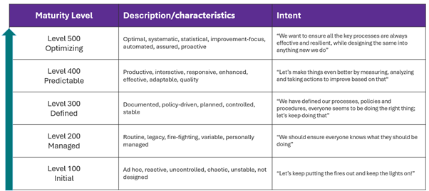
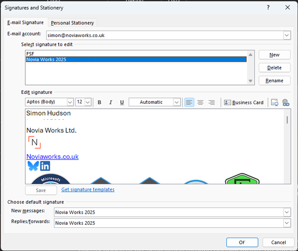
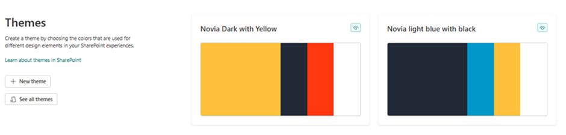
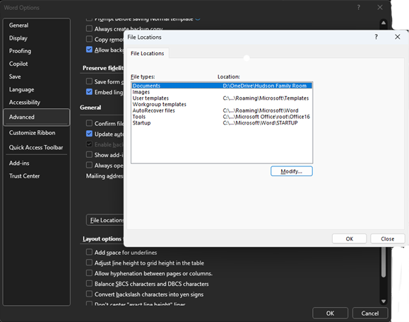
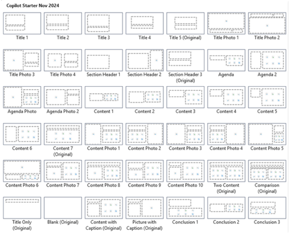

# Practical Scenario: Enhancing Brand Management

[!INCLUDE [content-disclaimer](includes/content-disclaimer.md)]

## Overview

This practical scenario uses the concepts and characteristics from appropriate [Maturity Model for Microsoft 365](/microsoft-365/community/index-mm4m365) competencies to address the specific development of brand management in organizations. It focuses on ensuring brand development, consistency and use across an organization. It uses the same underpinning criteria as elsewhere in the Maturity Model and allows organizations to decide how mature their approach to branding should be for them and what actions, policies and technologies should be used to reach that level.

## Understanding effective branding

Effective branding is far more than simply a logo and some colors. It should be a strategic tool that drives multiple business benefits and differentiators:

- **Identity and Recognition**: Branding helps create a memorable identity for a business, making it easily recognizable to customers. This includes visual elements like logos, colors, and typography.
- **Trust and Credibility**: A strong brand builds trust and credibility with customers, signaling reliability and quality.
- **Emotional Connection**: Effective branding creates an emotional connection with customers, fostering [loyalty and long-term relationships](https://brilliantio.com/what-is-the-purpose-of-branding/).
- **Competitive Advantage**: Branding differentiates a business from its competitors, highlighting unique values and benefits.
- **Consistency**: It ensures consistency in messaging and customer experience across all touch points.

### Principles of effective branding

1. **Understand Your Audience**: Know your target audience’s values, needs, and preferences to create relevant and resonant branding.
2. **Differentiation**: Stand out by being unique rather than just better. Offer a distinct brand experience or philosophy.
3. **Consistency**: Maintain a consistent brand message and visual identity across all platforms and communications.
4. **Authenticity**: Be genuine and true to your brand values and mission. Authenticity builds trust and loyalty.
5. **Emotional Appeal**: Connect with your audience on an emotional level through storytelling and brand values.
6. **Flexibility**: Adapt to changes in the market and customer preferences while maintaining core brand values.

### Challenges

1. **Maintaining Consistency**: Ensuring consistent use of brand elements across all channels and touch points can be challenging.
2. **Adapting to Market Trends**: Keeping the brand relevant in a rapidly changing market requires continuous adaptation.
3. **Building and Sustaining Trust**: Establishing and maintaining customer trust is crucial but can be difficult, especially in competitive markets.
4. **Standing Out in a Saturated Market**: Differentiating the brand in a crowded marketplace is a common challenge.
5. **Navigating Digital Landscapes**: Effectively managing the brand’s presence across various digital platforms and social media.
6. **Employee Alignment**: Ensuring all employees understand and embody the brand values and message.

## Applying the Maturity Model to Brand Management

### Level 100: Initial

**Scenario:** A small startup has a logo and a basic color scheme but lacks comprehensive brand guidelines. Each department creates its own marketing materials as a need arises, resulting in inconsistent use of fonts, colors, and messaging. The brand identity is weak and often confused with competitors; potential customers are unable to describe what the company purpose or differentiator is.

- Branding is not considered as a process or a strategic business differentiator.
- There is no brand guidance for staff. Logos, corporate colors, and other elements are ad hoc, naïve, and mostly evident only on the website.
- Some documents and slide decks have branding elements, added by the author, and using whatever assets they have or can find, often cut from the website.
- Such branding as there is lacks consistency.
- Little, if any, thought has been given to what the brand is intended to communicate.
- It is likely that the use of brand echoes weaknesses in company culture, governance and employee engagement.

#### 100 Development actions & activities

- **Awareness:** Introduce the basic concepts of brand identity to staff and management. Outline the core brand elements: logos, fonts, colors, imagery, tone of voice.
- **Brand definition**: Define organizational personality and values to be represented by the brand asset, based on thinking around:
  - Know Your Audience and identify your ‘tribe’, the people you really want as your supporters and influencers.
  - Define your story; what you want people to know about you and say about you.
  - Identify your key differentiators; what it is like doing business with you and why you offer the products and services you do. This is the basis for your brand promise.
  - Read more about [branding concepts](https://fabrikbrands.com/branding-matters/branding/branding-and-brand-essentials/)
- **Build brand assets:** Create core brand elements to support your brand. Review these to ensure they meet accessibility standards and work across digital and print. Create template documents and slide decks (Word .dotx and PowerPoint .potx files) and store these in the brand folder.
- **Share assets and brand:** Create a shared location for storing core brand assets. Upload essential brand assets (e.g., logos, primary color palette, etc.) to shared location.

### Level 200: Managed

**Scenario:** The company becomes aware that its brand is ineffective and starts to formalize the approach.

- Senior management have agreed what the organization brand is intended to communicate, which might include a vision, mission statement, business principles and public strategy.
- A basic brand guide is created and published for all staff, defining logos and their use, corporate fonts, corporate colors (with their RGB, Hex and Pantone codes), trademarks and their definitive use. Consideration is given to tone of voice.
- The brand guide is circulated to staff and published to the intranet.
- Brand assets, notably company logos and images in appropriate file formats, are created and stored for use by staff in all areas of the organization. This might be in (in increasing order of good practice): a shared server; shared folder on OneDrive; a brand library on SharePoint.
- Staff are briefed on the importance and use of the brand. This is supported by some documentation and brand related processes, including approvals for public facing communications.
- Management of the brand and brand assets are attached to defined roles and responsibilities.
- Staff are asked to review all their existing documents and collateral and update them to the new standard.
- A core set of company templates (Word documents and PowerPoint slide decks) are created for the most common needs and staff are told to use these as the basis for their documents.
- Signage and other physical representations of the brand are updated to be consistent with the new approach.
- Staff are told to create and use email signatures in a standard ‘on-brand’ format.

#### 200 Development actions & activities

- **Asset Organization:** Categorize types of brand assets (e.g., Logos, Templates, Fonts) and how/where they should be used (internal, external, social media, formal reports, and articles, etc.).
- **Guideline Development:** Draft basic brand guidelines covering logo usage and primary colors to describe why, how, and where to use the brand. Publish for staff use.
- **Communicate:** Ensure the availability of these resources is promoted to all departments and explain that they must use the official versions.
- **Protect assets and Intellectual Property**: Register logos and other visual devices as trademarks.

### Level 300: Defined

**Scenario:** The organization has developed detailed brand guidelines that include logo usage, color palettes, typography, and tone of voice. These are accessible to all employees, and training/refresher sessions on the brand and intellectual property are held to drive understanding and compliance. The brand reflects the company culture and ethics and is consistently represented across all marketing materials and customer touch points. Core elements are established as trademarks.

- Senior management are _united_ around the organization brand and the vision, mission, and business principles. Staff understand the value of the brand and respect the purpose and application. Brand training is available.
- Brand guidelines have been refined and evolved to be impactful, consistent, and flexible; they are shared across the organization and well used. It clearly defines logos and their use, corporate fonts, corporate colors (with their RGB, Hex and Pantone codes), and differentiates between primary and secondary colors and offers examples of use. Tone of voice is described, with examples. It offers guidance and some flexibility.
- Logos and trademarks are actively managed, registered and actively managed with national intellectual property administration. A range of suitable sizes, formats, and variants for dark and light mode, physical and digital, with and without transparency are provided.
- [SharePoint Brand Center](https://noviaworks.co.uk/2024/10/10/unlocking-sharepoints-brand-centre-for-your-organisation/) has been implemented. Logos, corporate images, and other brand assets are stored in Brand Center libraries, within appropriate folders. The brand guidelines and other brand related documents are published to a library here; these are supplemented with further information using SharePoint pages, exposing the key content of the brand guidelines.
- Marketing/ Comms are responsible for managing the backend of Brand Centre and have set up brand colors and fonts. Core themes have been produced from these to define the intranet look and feel and site owners are requested to use these themes.

- Staff have reviewed and updated their day-to-day documents and collateral to the brand standard. They use templates as the basis for new documents and articles, adding further brand elements as required and considering tone of voice.
- Organization templates (Word documents and PowerPoint slide decks) are published to Brand Center and staff are shown how to make the location a default in Office applications.

- There is a process for reviewing and maintaining trademarks.
- High impact external and internal communications are reviewed for being on-brand and compliant with guidelines.
- Email signatures are standardized ‘on-brand’ and tools for central management are being introduced.

#### 300 Development actions & activities

- **Expand:** extend the range and flexibility of templates. Add branding to other tools, such as Teams meeting lobby, Planner, SharePoint site (via themes)
- **Deploy Asset libraries**: Define templates and images for use as [organizational Assets](https://noviaworks.co.uk/2024/10/10/unlocking-sharepoints-brand-centre-for-your-organisation/#Asset-Libraries)
- **Continuing training and awareness**: Host training sessions and workshops to educate employees on brand usage. Develop step-by-step guides and video tutorials for using brand assets.
- **Enhance processes**: Add governance and lifecycle management to brand activities. Scan for inappropriate trademark use internally and externally.
- **Extend accountability**: Assign brand and communication managers to oversee brand asset usage.

### Level 400: Quantitatively Managed

**Scenario:** A large corporation has a dedicated brand management team that oversees all aspects of branding. The brand guidelines are not only comprehensive but also regularly updated to reflect market trends and company evolution. Advanced analytics tools are used to track brand perception and performance, and the company actively creates customer engagement to mould the brand experience. The brand is strong, recognizable, and trusted globally.

- Branding is well integrated into the company culture and all communication and marketing processes. Staff and management effectively use the assets and can verbally communicate the brand, picking appropriate tone of voice and on-brand messaging.
- Brand Centre becomes a key tool in internal and external communications, forming a component of the overall communication strategy.
- Additional libraries are created in the SharePoint Brand Centre, including key staff photographs with a consistent house style, categorized organization photography (e.g. sites, equipment and plant, product marketing imagery). Video content and audio content is added, as appropriate.
- Sub-brands are developed related to products, services, geographies, and markets.
- Elevator pitches for the organizational brand and for sub-brands are published.
- [Storytelling](https://www.indeed.com/career-advice/career-development/corporate-storytelling) becomes a tool for sharing brand values and reinforcing culture.
- Brand training is included in staff onboarding and reinforced through multiple communication and training channels. Spokespeople are trained in these and coached in media awareness; [Viva Learning](/viva/learning/) supports this.
- The organization uses advanced tools and metrics to monitor brand performance, including internal and external surveys and Net Promoter Score analysis. There is a continuous feedback loop for improving brand strategies and adapting to market changes.
- [Viva Engage](/viva/engage/overview) is used to communicate and share insights into the brand and brand usage and to discuss its evolution with the changes in the company and market.
- [Viva Amplify](/viva/amplify/overview-viva-amplify) is used to centralize campaign management, publishing, and reporting for corporate communications, providing creation, management, and analysis of communication campaigns to engage employees across multiple channels like Outlook, Teams, and SharePoint
- Cross-functional teams working together on campaigns and branding projects, using Microsoft Teams and Viva Engage to communicate and collaborate.
- The brand guide is a controlled document with similar impact and governance as other policies and operating procedures, e.g. subject to review and updates.

#### 400 Development actions & activities

- **Monitoring:** Implement a system to monitor the use of brand assets, ensure compliance and assess impact of storytelling. Collect and analyze feedback from employees to improve the Brand Center.
- **Feedback Mechanism:** Establish a feedback loop for continuous improvement of multiple aspects of the brand.
- **Embed governance**: Regularly review and update brand assets and guidelines.
- **Enable AI**: Introduce the standard ‘golden’ template into all PowerPoint templates (Read [guidance](https://techcommunity.microsoft.com/blog/microsoft365insiderblog/keep-your-presentations-on-brand-with-copilot-in-powerpoint/4295913); download the [template master slides here](https://techcommunity.microsoft.com/t5/s/gxcuf89792/attachments/gxcuf89792/Microsoft365InsiderBlog/559/5/Copilot%20PowerPoint%20Starter%20Template%20Nov%202024.pptx))

### Level 500: Optimizing

**Scenario:** A multinational corporation has both central and regional/national brand management teams who proactively ensure the brand and associated assets and processes anticipate market trends and company evolution. Analytics tools are used to track brand perception, and the company actively engages with customers to gather feedback and improve the brand experience. The brand is recognizable and trusted.

- Branding is deeply integrated into the company culture and all business processes encompassing all means of communication and marketing. Staff effectively and consistently use branding in their day-to-day activities.
- Feedback loops, horizon scanning and AI supported analytics drive continuous innovation in branding strategies and processes at all levels.
- The organization is recognized for both adopting and defining best practices.
- Brand processes are highly optimized and efficient through automation and analysis.
- Organizational tools and customer-facing experiences are integrated with the evolution of the brand; automation ensure changes smoothly roll out.

---

**Principal authors**:

- [Simon Hudson, MVP](https://www.linkedin.com/in/simonjhudson)

---

[!INCLUDE [mm4m365-core-team](includes/mm4m365-core-team.md)]
