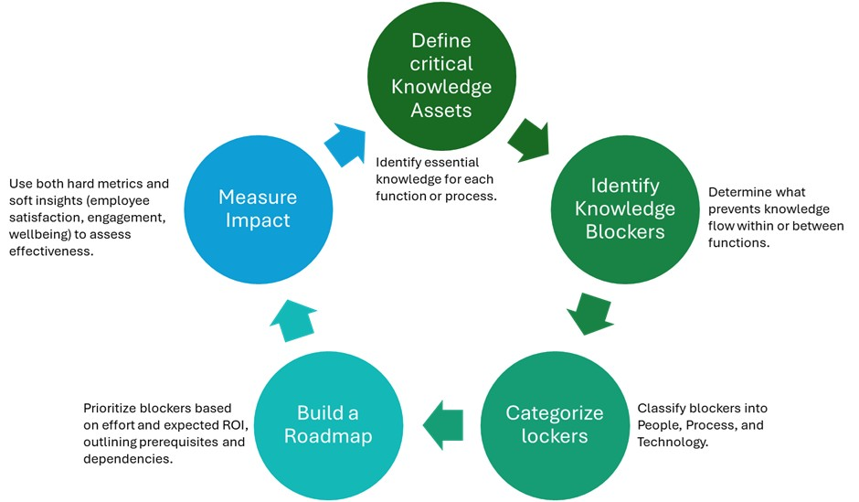

# Maturity Model for Microsoft 365 Practical Scenarios – Knowledge Management

[!INCLUDE [content-disclaimer](includes/content-disclaimer.md)]

## Overview

This practical scenario uses the concepts and characteristics from the appropriate Maturity Model for Microsoft 365 competencies to allow organizations to assess and improve their approach to Knowledge Management ("KM"). It uses the same underpinning criteria and format as the Maturity Model broad Competency articles, however the emphasis in practical scenarios is to address and mature specific business processes, needs, and activities. As such, Practical Scenarios generally span concepts and characteristics from multiple competencies. The intention is to let organizations define what the role of Knowledge Management is for them and what actions, policies and technologies should be used to reach their desired level of maturity.

### Principles of Knowledge Management  

Knowledge is a strategic asset in any organization, essential for executing critical tasks across divisions, geographies, and functions. While silos are often seen as barriers, they can exist for valid reasons such as policies, regulations, and information security. Instead of breaking silos, it's more effective to connect them where necessary, ensuring relevant knowledge flows, perhaps through managed channels or people, while safeguarding sensitive information. This approach is known as the "zero-trust mentality," where individuals access only the knowledge needed for their roles.

**Steps to Effective Knowledge Management:**

- **Define Critical Knowledge Assets:** Identify essential knowledge for each function or process.
- **Identify Knowledge Blockers:** Determine what prevents knowledge flow within or between functions.
- **Categorize Blockers:** Classify blockers into People, Process, and Technology.
- **Build a Roadmap:** Prioritize blockers based on effort and expected ROI, outlining prerequisites and dependencies.
- Measure Impact: Use both hard metrics and soft insights (employee satisfaction, engagement, wellbeing) to assess effectiveness.

Effective KM relies on a collaborative culture where people feel safe to share and leverage each other's work. Start with a cultural assessment, considering:

- People's understanding of leadership's mission and vision?
- Is there a sense of belonging within teams and the organization?
- Do people feel seen, heard, and understood in their various teams/activities?
- Is recognition for contributions to others' success given?
- Do people feel comfortable sharing innovative ideas or suggesting improvements?
- What is the nature of "team collaboration" versus "internal competition"?
- Are work-life balance, individual health, and wellbeing monitored, and actions taken accordingly by the management team(s)?
- What patterns of attrition, both positive and negative, are being monitored or acted upon?

Establishing a cultural baseline is crucial before identifying knowledge assets and blockers, across three aspects of Knowledge Management: Content, Collaboration and Community engagement.

#### Knowledge Management sub-categories

Because KM is a complex area to address, spanning tacit and explicit knowledge, plus collaboration, this practical scenario is organized across the three categories of KM:

- Content (Management)
- Collaboration
- Community [of Practice]

Each of "the 3 Cs of KM", **C**ontent, **C**ollaboration and **C**ommunity, are described for each maturity level (L100 - L500), to enable organizations using this as an assessment and guide, to select the area of KM most relevant to them.

You may address most, many, or just one of these, depending on your organization, its adoption and maturity in M365, and circumstances (i.e. business objectives and business problems sought to be addressed).

## Applying the Maturity Model to Knowledge Management

### Level 100: Initial

#### Organizational Culture and Knowledge Flows - Level 100

At this initial level, there is no concerted effort to cultivate a unified organizational culture. Business functions and team cultures develop organically, heavily influenced by their respective leadership and personnel. The organization operates in silos, with minimal interaction between different business functions or teams. Processes that span multiple functions are undefined, and knowledge flows are not prioritized. Manual hand-offs, based on exceptions and ad-hoc requests for knowledge, are the norm.

**Microsoft 365 Services may or may not be available, but are not applied consistently, or third-party solutions are used in lieu of Microsoft 365 at random.**  

##### Content Management (Level 100)

- Content governance is absent. Content is stored inconsistently, often locally, with no central repositories or RBACs.
- Most content is kept locally, or in unshared or unstructured cloud storage, without any guidelines for central repositories or Role-Based Access Controls (RBACs).
- Tagging and lifecycle management are not practiced.
- SharePoint and OneDrive may be available but are not mandated or governed; third-party solutions (e.g., Dropbox, Google Drive) are commonly used at users' discretion.

##### Collaboration (Level 100)

- Collaboration is not prioritized; individual achievements are valued over teamwork.
- Most collaboration occurs via email (Outlook) rather than Teams or other platforms.
- If Microsoft Teams is used, it is mostly for meetings and lacks governance and lifecycle management, leading to inconsistent team and channel creation. 1:1 or small group chats are common, and third-party tools (e.g., Slack, Google Meet) are used ad hoc.

##### Communities/Expertise (Level 100)

- Communities are undefined or form spontaneously, with random tool selection.
- No formal Subject Matter Expert (SME) model or expertise support exists.
- Engage and Viva Learning are not used and Learning & Development is not leveraged to identify or recognize expertise.

#### Key Success Metrics - Level 100

- No metrics for content usage, collaboration, or community engagement.  
    Performance is tracked only through traditional KPIs.
- Viva Insights, M365 Adoption Scores, and Admin Center reports are not used.
- Lack of measurement limits visibility into knowledge sharing and collaboration.
- Lack of measurement limits visibility into collaboration effectiveness and content findability.

#### Development actions & activities (L100 à L200)

##### Content **(L100 à L200):**

- Designate SharePoint as the official repository for organizational content, starting with policy documents and forms.
- Begin migrating content from local drives and third-party tools to SharePoint and OneDrive, with guidance on what goes where, with particular emphasis on when to use SharePoint and when to use OneDrive.
- Create appropriate Site, libraries, and folders for the content. Do not put everything in a single SharePoint library.
- Introduce basic governance for content storage and sharing, including early taxonomy and access control principles, and why this is important.
- Raise awareness of Microsoft Purview capabilities, even if not yet enforced, to prepare for future classification and compliance efforts.
- Encourage cross-team visibility by reducing silos and promoting shared spaces for work-in-progress and deliverables.

##### Collaboration **(L100 → L200):**

- Introduce basic governance for Microsoft Teams: set naming conventions, lifecycle rules, and channel creation guidelines to reduce tool sprawl.
- Encourage collaborative behaviors through informal recognition and storytelling, even if not yet tied to performance metrics.
- Promote Microsoft 365 tools as preferred platforms: guide users toward Teams, Loop, Planner, and Lists over email and third-party apps.
- Support early adoption with light training and peer sharing to build confidence in using productivity tools.
- Monitor usage patterns to identify gaps and opportunities for shifting collaboration from email and chat to more structured channels.

##### Communities**/Expertise (L100 à L200):**

- Encourage organic community formation by promoting Viva Engage and Teams as starting points, even without a formal strategy.
- Support early experimentation with Viva Learning and begin identifying potential use cases for readiness and training content.
- Enable self-managed profiles in Microsoft 365, allowing users to tag their own skills while preparing for more structured expertise mapping.
- Raise awareness of the value of communities and SMEs, laying the groundwork for future role definitions and recognition models. Openly recognize the role and importance of subject matter experts (SMEs).

### Level 200: Managed

#### Organizational Culture and Knowledge Flows - Level 200

Work has begun to align and adopt a common organizational culture and core values. Leadership is aspiring to share and communicate their vision, and team scorecards are gradually being aligned with overarching business objectives.

The organization is perceived as siloed, with little knowledge flowing across business processes or between functions. Finding knowledge (content or expertise) is highly dependent on who you know, rather than what you know or where to search for it.

**Microsoft 365 Services are preferred, and work is ongoing to drive adoption and consumption, but not yet fully implemented.**

- **Microsoft Viva**: Some Viva Services are being used by Leadership teams but are not yet part of the organizational fabric or consistently applied for e.g. broad Employee Communications, All-hands meetings, or Town Halls.
- **Microsoft Teams**: Teams is being positioned as the meeting tool of choice, and on-line meetings are scheduled in Teams.
- **SharePoint**: Intranets and file shares are being migrated to a common SharePoint instance, but the structure is not yet well defined or standardized.  

##### Content Management (Level 200)

Content management processes are beginning to take shape, but they are not yet standardized or uniformly applied. Leadership is working to align content management practices with organizational objectives. However, the organization remains siloed, and finding knowledge is still highly dependent on personal connections rather than structure and systematic search methods.

**Content Management is starting to become more structured.**

- **SharePoint**: Selected as the main intranet platform and repository for official resources, such as policy documents and forms; these are being moved into SharePoint. Working documents and other work deliverables are stored across multiple SharePoint sites or remain unmanaged in Teams SharePoint sites.
- **OneDrive:** Much content that is considered Work in Progress (WIP) is still stored in private or shared folders on individual's OneDrive.
- **Microsoft Purview:** Content classification, sensitivity labelling or records management are not turned on or enforced.

##### Collaboration (Level 200)

Collaborative behaviors, such as contributions to others' success, are encouraged, but not yet integrated into performance management systems at individual or team levels. This results in variable collaboration practices across the organization and great variance in what productivity tools are used and for what purpose.

**Examples of Microsoft 365 Services:**

- **Microsoft Teams**: Asynchronous collaboration still happens more in chat than Teams and/or Channels, and meetings are mostly scheduled through Outlook, not from channels.
- **Outlook**: Collaboration over email is more common than collaboration in Teams.
- **Microsoft Loop, Planner, To Do and Lists**: Some users are starting to experiment with personal productivity tools, but there is no active change management effort in place to standardize use of personal productivity tools or features.

##### Communities/Expertise (Level 200)

Communities are starting to form and grow organically but are not yet formalized with defined community roles or appointment of Subject Matter Experts (SMEs).

**Examples of Microsoft 365 Services:**

- Viva Engage: Some communities are forming organically in Viva Engage, but there is not a defined strategy or plan for adoption in place. Hence, some communities are also being set up in Teams instead.
- **Expertise Location**: No formal process for identifying or appointing official subject matter experts has been defined. Users manage their own Microsoft 365 profile and can select any skill or expertise area of their choice.
- **Microsoft Viva Learning**: Some teams have started testing and experimenting with Microsoft Viva Learning, but there is no roadmap in place for moving courses or readiness content over to it.

#### Key Success Metrics - Level 200

Metrics are emerging but not yet standardized or consistently applied across teams or business units.

- Content usage, community engagement, and collaboration behaviors are tracked sporadically, often ad hoc or upon request.
- **Microsoft 365 Adoption Score** is reviewed occasionally by IT, primarily for budgeting and licensing purposes.
- **Microsoft Teams Analytics & Reporting** is used inconsistently, with limited insights into collaboration patterns.
- **Microsoft 365 Admin Center** data (service health and usage) is accessed on demand but not part of regular reporting or decision-making.

#### Development actions & activities (L200 → L300)

##### Content (L200 à L300)

- Standardize governance practices by aligning taxonomies, RBACs, and lifecycle policies with compliance requirements, even if not yet fully enforced.
- A content management model is published to guide what should be stored where and is monitored for compliance.
- Drive adoption of Microsoft Purview for classification, sensitivity labelling, and records management through targeted awareness and training.
- Reduce content sprawl by promoting SharePoint over OneDrive for collaboration and evaluating third-party governance tools like Orchestry or Atlas.
- Support consistent tagging by educating users and exploring automation options, such as SharePoint Premium, to ease manual burden.
- Monitor compliance risks and begin addressing over-sharing and orphaned sites through proactive governance efforts.

###### Example content management model

##### Collaboration (L200 **à** L300)

- Integrate collaborative behaviors into performance management to reinforce team success and shared outcomes.
- Standardize tool usage by promoting Microsoft Teams for both synchronous and asynchronous collaboration, supported by templates for consistency.
- Shift internal collaboration away from Outlook to Teams and Channels, reserving email for external communication.
- Actively promote personal productivity tools like Loop, Planner, To Do, and Lists during team formation and project kick-offs to drive consistent adoption.

##### Communities/Expertise (L200 **à** L300)

- Formalize communities by defining roles, creating charters, and promoting respectful engagement across Viva Engage and Teams.
- Align SME recognition with job roles and career stages and begin documenting expertise systematically.
- Centralize internal communications through Viva Engage, using campaigns and live events to boost visibility and leadership engagement.
- Develop a strategy for Viva Learning, led by HR, to consolidate skills development and career pathways into a unified learning experience.
- Encourage knowledge community participation.

### Level 300: Defined

### Organizational Culture and Knowledge Flows - Level 300

Organizational culture is defined, and work is ongoing to drive behavioral changes that align with cultural values and business objectives around collaboration, content re-use, and community engagement.

Knowledge flows mostly across divisions and business functions but still relies on too many manual steps and hand-offs. Formal knowledge and expertise repositories exist, but awareness and adoption are not consistent across the organization. SMEs remain a vital source of information and know-how. Efforts are underway to identify and address knowledge blockers, such as process or system gaps and overlaps.

**The organization has selected Microsoft 365 as the approved Content, Collaboration and Community platform, and strategic Adoption and Change Management initiatives have been formally launched and communicated across the organization.**

- **Microsoft Viva**: There is a strategic roadmap of which Microsoft Viva products are being rolled out.
- **SharePoint**: Work is ongoing to consolidate SharePoint instances and migrate content from other repositories and/or SharePoint on-premises instances.
- **Microsoft Teams**: There is a plan to put Teams Governance and Lifecycle Management in place and applying RBACs to support the Information and Collaboration governance model and work implementation has started.

#### Content Management (Level 300)

Content governance, taxonomies, and RBACs have been defined, and aligned with applicable legislative and policy guidelines but not strictly enforced.

Managing content and access rights, and content lifecycles, is challenging, and the process is managed manually and largely dependent on end-users tagging content. Over-sharing and orphaned sites are still a challenge. There is awareness at appropriate levels of compliance requirements or areas at risk of being non-compliant.

**Examples of Microsoft 365 Services:**

- **SharePoint**: Governance, Taxonomies and Meta Data capabilities are enabled, and work is ongoing to inform and educate end-users. Third-party SharePoint provisioning and governance solutions, like Orchestry or Atlas by ClearPeople are being considered.
- **OneDrive**: Still used more than recommended, although efforts are ongoing to centralize content sharing via SharePoint, and in accordance with Content Governance model and RBACs.
- **Microsoft Purview**: Content classification, sensitivity labelling and records management requirements have been defined, and work is ongoing to drive adoption and consistency across Microsoft 365.
- **SharePoint Premium**: For organizations with large content volumes, or extensive site sprawl, SharePoint Premium is being evaluated for its auto-tagging, classification, and automation features.

#### Collaboration (Level 300)

Collaborative behaviors are a core part of individual and team performance management systems. Team success is shared, showcased, and celebrated. Work has begun to drive adoption and encourage usage of common productivity tools for specific activities, e.g. projects.

**Examples of Microsoft 365 Services:**

- **Microsoft Teams**: Collaboration happens in Teams, for synchronous and asynchronous work and templates are being defined and deployed, to help ensure consistent collaboration across teams.
- **Outlook**: Email and calendar in Outlook are mostly used for external collaboration with suppliers, clients, or partners, not for internal cross-team or team collaboration.
- **Microsoft Loop, Planner, To Do and Lists**: Personal productivity tools are actively promoted and consistently applied as new teams form, or new projects are launched. Adoption and consumption of these tools is steadily growing.

##### Communities/Expertise (Level 300)

Communities are established and managed, but adoption is not consistent across business functions and geographies, and they are not fully sponsored by management, or considered vital for the organization's success.

Subject Matter Expertise is aligned with job roles and career stages and documented accordingly.

**Examples of Microsoft 365 Services:**

- Viva Engage: The platform of choice for Community building and engagement. Internal Communications and live events, e.g. Ask Me Anything, Town Hall meetings, are planned and executed centrally, and Campaigns are starting to get traction from the leadership team. Community Values and/or a Community Charter has been developed and widely communicated to ensure constructive conversations, and a respectful tone is always used.
- **Microsoft Viva Learning**: There is a strategy in place, and HR is driving initiatives to move all Skills development and formal Career Paths/Learning Pathways into Viva Learning.

#### Key Success Metrics - Level 300

Metrics on content usage, collaboration, and community engagement are actively tracked and incorporated into individual and team performance reviews. These metrics are not yet consistently used for strategic planning or given equal weight to traditional KPIs.

- **Team leaders use Microsoft Viva Insights** to monitor behavioral trends and identify risks to employee wellbeing.
- **Microsoft 365 Adoption Score** is actively monitored, with corrective actions taken to improve service usage.
- **Microsoft Teams Analytics & Reporting** is used to track collaboration patterns and guide improvements.
- **Microsoft 365 Admin Center** data is regularly reviewed by IT to monitor service health and usage.

#### Development actions & activities (L300 à L400)

##### Content (L300 à L400)

- Apply governance and lifecycle policies consistently across all content types, ensuring metadata tagging and access controls are standard practice.
- Centralize content repositories and reinforce SharePoint as the primary collaboration and storage platform, with OneDrive limited to personal or limited work files, in accordance with the content management model.
- Deploy Microsoft Purview controls across the organization, integrating classification and retention policies into daily workflows.
- Leverage automation tools like SharePoint Premium to streamline tagging, reduce duplication, and manage semi-structured content at scale.
- Ensure compliance awareness is embedded in content practices across geographies and business units.

##### Collaboration (L300 à L400)

- Reward collaborative behaviors by embedding recognition into performance reviews and celebrating cross-team success openly.
- Promote open sharing and learning from both successes and failures to strengthen trust and team resilience.
- Expand use of Teams features like Engage Storyline and Praise to foster a culture of appreciation and visibility.
- Embed productivity tools like Loop, Planner, To Do, and Lists into collaborative workflows, making them a natural part of project execution.

##### Communities/Expertise (L300 à L400)

- Formalize community governance with clear roles, lifecycle processes, and leadership appointment models across all Viva Engage communities.
- Recognize communities as strategic assets, with leadership sponsorship and integration into business planning and success metrics.
- Appoint and acknowledge SMEs within communities, linking expertise to HR systems and career development frameworks.
- Use advanced Viva Engage features like Answers to systematically capture and reuse community knowledge, while monitoring behavior to uphold community values.
- Integrate Viva Learning with community goals, ensuring skills development and learning pathways reflect individual aspirations and contributions.

### Level 400: Managed (Capable)

#### Organizational Culture and Knowledge Flows - Level 400

Organizational culture is mature, managed, and measured through annual employee satisfaction surveys. Actions are taken if deviations occur, and exemplary behaviors are recognized. There is a common sense of belonging and employees trust, and feel trusted by, management and their peers.

Knowledge blockers have been identified and eliminated or mitigated, and knowledge flows consistently across business functions and between teams. Continuous improvements and adjustments are made as the organization changes or evolves.

**Microsoft 365 Services to measure Organizational Culture adoption and Employee Satisfaction, or detect gaps that should be addressed, have been put in place and data in place:**

- **Viva Engage** and **Viva Connections**: Used for cross-organizational communications and engagement between leadership teams and individual contributors, across knowledge- and/or front-line workers.
- **Viva Pulse:** Designed for managers and project leads to quickly capture feedback through brief surveys at critical moments and applied for continuous improvement and immediate course corrections.
- **Viva Glint:** Used for annual employee satisfaction surveys, or driven by leadership for organization-wide objectives, such as cultural change or strategic direction.

##### Content Management (Level 400)

Content governance, taxonomies, and Role-Based Access Controls (RBACs) are well-defined, and lifecycle management is applied, including access to knowledge. Knowledge and content repositories are centralized; applying meta data is the norm, as well as records management and retention policies for compliance.

**Microsoft 365 Content Management Services have been implemented across all geographies and/or business divisions but are mostly applied manually and dependent on end-users to adhere to policies and processes.**

- **SharePoint**: Used for all content collaboration and storage, with clear guidelines for what roles can create, edit, or retire sites, and what sharing controls and lifecycle management guidelines should be applied for different content sets.
- **OneDrive**: Only used in accordance with published content management model.
- **Microsoft Purview**: Content classification, sensitivity labelling and records management controls are deployed and integrated in governance models and lifecycle management processes.
- **SharePoint Premium**: For organizations with high volumes of content, SharePoint Premium has been used for content migration to automate content classification, duplication removals, and auto-tagging. Also used for semi-structured or unstructured content classification and tagging, or archiving/purge for compliance reasons.

##### Collaboration (Level 400)

Collaborative efforts and cross-team success are acknowledged and rewarded. People are comfortable sharing their work openly and understand the importance of giving recognition, celebrating joint success, and learning from others' lessons, including failures.

**Examples of Microsoft 365 Services:**

- Microsoft Teams: Additional features in Teams, like Engage Storyline, are widely used, and Praise is given to peers and collaboration partners to recognize exemplary behaviors and celebrate each other's successes.
- **Outlook**: No internal collaboration happens in Outlook, which is used as an exception, predominantly when managing communications with external contacts.
- **Microsoft Loop, Planner, To Do and Lists**: These productivity tools have been incorporated into project work and other applicable collaborative efforts and are a natural part of team collaboration.

##### Communities/Expertise (Level 400)

Communities are flourishing with clear governance, including formal Community leader roles, and lifecycle management processes in place. New communities form as business needs arise, and the organization evolves, and Communities are recognized by leadership as valuable to the organization and key to business success.

Subject Matter Experts are appointed in Communities, and expertise is reflected in HR/Performance Management systems and Career Development processes.

**Examples of Microsoft 365 Services:**

- Viva Engage: All Communities are run in Viva Engage, have a formal governance model in place, and a process for managing appointment of Community Leaders and Subject Matter Experts. Advanced features like Viva Engage Answers are being used and knowledge harvested systematically from Communities. Controls are in place to foster and nurture a culture of trust and community member behavior is being monitored by Community Leads and SMEs, to ensure that Community Values and Charters are being adhered to.
- **Microsoft Viva Learning**: Skills development and formal Career Paths/Learning Pathways are all managed in Viva Learning. Expertise and community contributions are recognized and rewarded, and individual Community aspirations and objectives are integrated into learning plans.

#### Key Success Metrics - Level 400

Metrics are fully integrated into individual and team performance management systems and carry equal weight to traditional KPIs.

- **Individuals and managers actively use Microsoft Viva Insights** to monitor collaboration, productivity, and wellbeing. Team-level insights are rolled up for leadership to detect trends and coach accordingly.
- Engagement and wellbeing metrics are part of the organization's balanced scorecard and used alongside operational KPIs.
- **Microsoft 365 Adoption Score** and **Teams Analytics & Reporting** are monitored on an exception basis to detect usage drops or setbacks.
- **Microsoft 365 Admin Center** is proactively monitored by IT, with service issues managed through formal channels.

#### Development actions & activities (L400 à L500)

##### Content (L400 à L500)

- Automate governance and lifecycle management using SharePoint Premium and/or third-party tools to reduce manual effort and ensure consistency.
- Appoint Information Owners accountable for content lifecycle, including archiving and deletion aligned with governance policies.
- Apply RBACs and metadata tagging automatically across repositories to support zero-trust principles and minimize over-sharing risks.
- Fully deploy Microsoft Purview to automate classification, retention, and encryption, reducing human error and enhancing compliance.
- Use SharePoint Premium for intelligent content processing, including OCR, auto-tagging, and content assembly to streamline document creation and management.

##### Collaboration (L400 à L500)

- Normalize collaboration by coaching individuals who default to solo work, reinforcing shared success and continuous learning.
- Systematize lessons learned to inform process improvements and foster a culture of openness and growth.
- Standardize tool usage across teams, with clear governance, templates, and lifecycle management for Teams and shared content.
- Monitor and manage Outlook use, limiting it to external communication and notifications.
- Continuously evaluate and integrate new tools from Microsoft 365 into collaboration workflows, ensuring alignment with organizational processes.

##### Communities/Expertise (L400 à L500)

- Embed communities into organizational culture, with leadership actively recognizing their role in innovation, problem-solving, and continuous improvement.
- Reward Community Leaders and SMEs through performance management and incentive systems, aligning contributions with career growth.
- Harvest best practices and lessons learned from communities to inform business processes and drive ideation.
- Leverage Viva Engage features like Answers, Viva Engage Best Answer, and SME-approved responses to capture and reuse knowledge systematically.
- Integrate Viva Learning fully with performance and development systems, ensuring community contributions shape learning plans and skills assessments.

### Level 500: Optimizing-Efficient

#### Organizational Culture and Knowledge Flows - Level 500

Organizational culture is assessed annually, and core values and vision are adjusted to align with business objectives and evolution.

Knowledge flows are fully integrated and monitored within and across Business Processes, and initiative-taking measures are taken to avoid new blockers when the organization changes; novel solutions are implemented, and new hires are onboarded.

**Microsoft 365** services roadmaps are monitored, and the organization works proactively ensure planning and deployment of new services, prepare for adoption activities and, when applicable, participate in private and public previews to assess and incorporate new products and services across teams and processes.

##### Content Management (Level 500)

Governance models and taxonomies are applied through automation and intelligent system usage. Role-Based Access Controls (RBACs) are in place, and access rights are maintained over content, community, and employee lifecycles. Information Owners are appointed and accountable for ensuring lifecycle management, including archiving or deletion of sites and content on the sites.

Where applicable SharePoint site templates are managed centrally and site provisioning and governance have been automated, using SharePoint Premium and/or third-party solutions, to ensure consistency and avoid that end-users are tasked with applying policies, security permissions, and access rights manually. End of life and archiving of sites and content is automated as well.

**Examples of Microsoft 365 Services:**

- **SharePoint**: Fully automated governance and RBAC provisioning processes in place, including auto-tagging of meta data, minimizing risk of over-sharing and ensuring that zero-trust approaches are always applied.
- **OneDrive**: Actively monitored and managed in terms of content volumes and activity, and controls in place to enforce retention policies.
- **Microsoft Purview**: Content classification, sensitivity labelling, records management, retention policies, and encryption are automated as much as possible, restricting certain actions to minimize risk of human error, information leaks, and/or over-sharing.
- **SharePoint Premium**: Fully deployed and used for all types of content understanding, processing, and tagging, based on Company policies, governance policies, and taxonomy, including image OCR. Content assembly is widely used to generate new documents, such as contracts or vendor agreements more effectively.

##### Collaboration (Level 500)

Collaboration is the norm, and individuals attempting to work alone are coached by peers and managers through positive reinforcement. Lessons learned are systematically gathered and evaluated to adjust processes and systems proactively. Productivity tools are widely adopted, and usage standardized across team and individual activities and tasks.

**Examples of Microsoft 365 Services:**

- **Microsoft Teams**: Teams governance is clear and with clear roles and responsibilities and Team templates for repeatable collaborative efforts. Lifecycle Management for Teams and the content shared in Teams and channels is enforced, so that work products are purged, and final deliverables harvested and stored appropriately in designated SharePoint locations.
- **Outlook**: Only used for pushing information or notifications, or when external parties are involved.
- **Microsoft Loop, Planner, To Do and Lists:** All personal productivity, and team collaboration tools, available in the Microsoft 365 license are widely adopted. New products and services are continuously evaluated and incorporated in the organization's processes, templates, and procedures, as new Services are added to Microsoft 365.

##### Communities/Expertise (Level 500)

Communities are integral to the organization's DNA and are highly valued by managers and leadership. Community leaders and Subject Matter Experts (SMEs) are recognized and rewarded as a natural part of the performance management process.

Communities are seen as a vital part of assessing lessons learned, celebrate project and team success, and solutions to business problems. Best practices are harvested, and Communities are considered a funnel for continuous improvement of business processes and a source of ideation, innovation, problem solving and creativity.

All learning & Development, and Expertise management is managed by Viva Learning and is fully integrated into the Performance Management and Incentive Compensation systems.

**Examples of Microsoft 365 Services:**

- **Viva Engage**: The only Community platform in use. Features like Viva Engage Answers, Viva Engage Best Answer and Viva Engage SME-approved answers are leveraged to harvest knowledge, source ideas, and solve problems. All Communities have appointed Leads and SMEs. Microsoft Teams: Harvesting lessons learned from projects or other cross-team collaboration initiatives is part of lifecycle management and used for continuous learning and process improvements.
- **Microsoft Viva Learning**: Rewards and recognition for Community Contributions are part of skills assessments, learning plans and the performance management system.

#### Key Success Metrics - Level 500

Content, collaboration, and community engagement metrics are core components of the organizational scorecard and inform fiscal year planning and budgeting.

- A modern balanced scorecard includes both hard KPIs (e.g., cost savings, efficiency, revenue) and soft metrics (e.g. engagement, wellbeing, happiness).
- **Microsoft Viva Insights** is used to correlate behavioral patterns (e.g., after-hours work, multitasking, meeting overload) with outcomes like sick leave, attrition, and productivity.
- **Pulse surveys and employee satisfaction data** are integrated with telemetry and behavioral trends to detect risks early and enable proactive coaching.
- **Microsoft 365 telemetry** supports leadership in identifying scheduling trends, remote work patterns, and collaboration health across teams.

---
**Principal authors**:

- [Rebecka Isaksson, MVP](https://www.linkedin.com/in/rebeckaisaksson/)
- [Simon Hudson, MVP](https://www.linkedin.com/in/simonjhudson)

---
