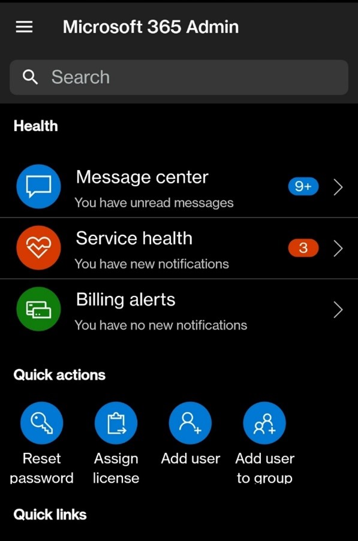

# Practical Scenarios – Microsoft 365 Service Change Management

[!INCLUDE [content-disclaimer](includes/content-disclaimer.md)]

The [Maturity Model for Microsoft 365](microsoft365-maturity-model--intro.md) is a useful tool for considering high level business capabilities and competencies, providing benchmarking, and planning guidance. However, practical application of the Maturity Model to specific tasks and needs is not addressed in the Competency or Elevate documents. The Practical Scenarios documents seek to address this, providing easily digestible guidance and strategy for focused topics.

This Practical Scenarios document covers service change management as surfaced in the [Microsoft 365 Admin Center](https://admin.cloud.microsoft/?source=applauncher#/homepage), specifically in the Message Center. Frequent review of Message Center Messages should be a key practice in operational management of all Microsoft 365 products/services as well as Windows endpoints (client *and* server) and Power Platform).

Note that we distinguish Service *Change* Management from Service *Health* Management.  Service *Change* Management is about planned change, including the arrival of new features and capabilities and the departure via deprecation of exisitng features and communication about these changes. Service *Health* Management is about unplanned service failures and outages and communication about service health incidents as well as planned maintenance events.  All service health status and service health incidents are displayed in the Service Health Dashboard (SHD).  Planned maintenance events (such as a Power Platform service update) are usually communicated via the Message Center.

## Introduction to Service Change Management

There are many ways to learn about upcoming changes.  There is the M365 Product Roadmap, there are blogs, there are announcements at conferences, press releases, press releases tied to conferences (Microsoft Ignite's Book of News for example),  there are podcasts and webinars, and more! The most direct communication, however, about what changes are coming to your specific tenant and approximately when is via [Message Center](https://admin.cloud.microsoft/?source=applauncher#/MessageCenter).  Message Center lives in the Microsoft Admin Center web app and the mobile Microsoft 365 Admin app. Both are accessible only to users [who have been granted access](/microsoft-365/admin/manage/message-center?view=o365-worldwide&preserve-view=true#frequently-asked-questions). 

Microsoft makes planned service changes to the M365 services daily, resulting in over 1400 change announcements per year. Effective IT operations will maintain awareness of current and future changes and assess their impacts on the organization and its people and processes. These changes are primarily announced via the [Message Center](https://admin.cloud.microsoft/?source=applauncher#/MessageCenter), with support from the [Microsoft 365 roadmap](https://www.microsoft.com/microsoft-365/roadmap) and supporting Microsoft official blogs, usually on the [Microsoft Technical Community site](https://techcommunity.microsoft.com/).

Service Change management for Microsoft 365 involves triaging the change announcements (messages in the Message Center) and determining what action is required, if any. In organizations with sufficient IT staff tasked with managing their Microsoft products, this is a team activity.

## Applying the Maturity Model to Service Change Management

## Level 100 - Initial

- No-one in the organization is explicitly responsible for reviewing these messages and they are ignored.
- Announced changes take the organization by surprise.
- New features and capabilities are not taken advantage of.
- Unexpected deprecations disrupt business processes and harm the business.

## Level 200 – Managed

- Someone in the organization reviews the message services on an infrequent, reactive basis.
- Changes are communicated, acted upon and tracked inconsistently. Communication is not always timely or effective and many staff do not review, understand or act on the information provided.
- Little or no planning takes place to introduce or mitigate the effects of changes organizationally, though some teams may be effective at taking local action.

## Level 300 – Defined

- Relevant staff review Message Center updates. This may be via email or by scheduled reviews of Message Center messages in Message Center 
- Messages about relevant services are filtered via Preferences in Message Center.
- Relevant IT staff meet regularly, perhaps weekly, to discuss the latest Message Center messages. 
- For tasks identified from that review, task status (Not started, in progress, or closed) is tracked in some basic way, perhaps a spreadsheet. At this level, accountabiliy for task completion may be weak.
- End users may be notified of changes.  Effectiveness of communication is not measured.
- Change announcements that are unclear or have a negative impact are given a Thumbs Down feedback in Message Center. Support tickets with Microsoft may be opened as a result of Message Center posts.
- Reviewed and acted on messages may not be consistently archived.

## Level 400 - Managed (Capable)

- Message Center is configured (using [Planner Sync](/planner/track-message-center-tasks-planner)) to pump announcements to Planner as Tasks. Each week, relevant IT staff meet to review the new tasks and assess if action is required or not.
- Task status (Not started, in progress, or closed) is monitored and reprioritized and impact of actions taken is reviewed.
- As a result of the tasks identified, meetings take place between relevant IT staff and selected business staff.  For example, IT staff might meet with the business owner of the intranet, department representatives, roles responsible for employee experience, internal communications, and/or learning and professional development.
- The length of time that tasks remain open and the effect of actions taken is tracked and reported on.
- Effectiveness of change communications is measured.
- Change announcements that are unclear or have a negative impact are given a Thumbs Down feedback in Message Center. Support tickets may be opened as a result of Message Center posts. If the organization has the benefit of a having a dedicated proactive support team (sometimes refered to as a support pod) from Microsoft as part of their support agreement with Microsoft, message center announcements that cause concern or question are brought to that team weekly for investigation.
- Selected changes are brought into the organization's existing change management processes, such as being brought before a Change Review Board. Bringing changes from Message Center or Planner into the enterprise change management tool that the Change Review Board and Change Owners use is often a manual process at this level. 
- Other sources of change information such as the following are also reviewed at an appropriate (weekly, bi-weekly, monthly, or annually) cadence, including:
  - The Book of News published on the first day of the Microsoft Ignite and Microsoft Build conferences
  - Posts about product announcements from Microsoft staff and Microsoft MVPs on social networks such as X or LinkedIn 
  - The monthly Technical Update Briefing that Microsoft can provide to its customers that have paid for access to a proactive support team
  - The [product roadmap](https://www.microsoft.com/microsoft-365/roadmap) for Microsoft 365
  - The [Message Center Show on YouTube](https://www.youtube.com/@365MCS) 
  - Internal business conditions, projects, and priorities

  For more information on using Planner Sync in Message Center, also see the slides from [session THR586 at Microsoft Ignite 2024](https://www.slideshare.net/slideshow/what-s-new-in-copilot-in-your-tenant-ignite-2024-thr586-pptx/273606182) and the video [What's New in Copilot in YOUR Tenant](https://www.youtube.com/live/ppJrA64hznE}.

## Level 500 - Optimizing (Efficient)

At Level 500, the organization has invested in a change management solution that goes beyond what Planner can offer. Characteristics of a level 500 maturity of service change management processes are:
- This solution is aware of who in the organization is responsible for managing what workload and is designed to streamline all processes for managing these changes.
  - This process may be enterprise-wide, so that its scope is to manage application change announcements across all applications in use in the enterprise, not just M365 applications.
  - Alternatively, the process may be specific to Microsoft applications but heavily customized and automated, such as with custom workflows that automate a variety of dependent business processes such as submitting tasks into the enterprise change control system so they get reviewed by the Change Review Board or submitting communication support requests to the internal communications team. 
  - Or it could be a combination thereof.
- This can be a homegrown or 3rd party solution.
- If an organization operates more than one tenancy, effort is spent on automatically deduplicating Message Center announcements in order to eliminate the effort needed to triage the same post in different tenants. 
- Workflows and communications processes are in place to automatically notify appropriate staff of forthcoming changes. Communications are as targeted as possible.   Effectiveness of communications is measured and feeds into continuous improvement efforts. 
- Some staff across the business are engaged in preview activities such as Insider programs and use these to assess the impact of upcoming changes and make recommendations. These feed into strategic technology management, employee experience management, and business change activities.
- Impacts of changes are actively monitored, and new ways of working are introduced and updated in response to feedback and analysis.
- The organization actively provides feedback to Microsoft around the changes and requests changes via the Microsoft Feedback portal and their Microsoft acount team (if they have one).
- Support staff actively maintain their knowledge of current and forthcoming technologies and are prepared when incidents or support needs arise from these.
---

This model is intended to give you a reference and some inspiration for improving your service change management processes. Feedback is always welcome.

**Principal author**: [Michael Blumenthal](https://www.linkedin.com/in/michaelbblumenthal/)

---
