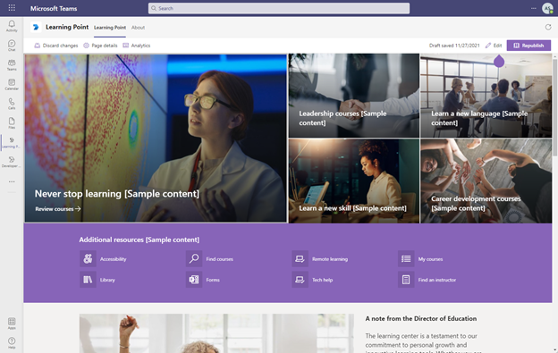
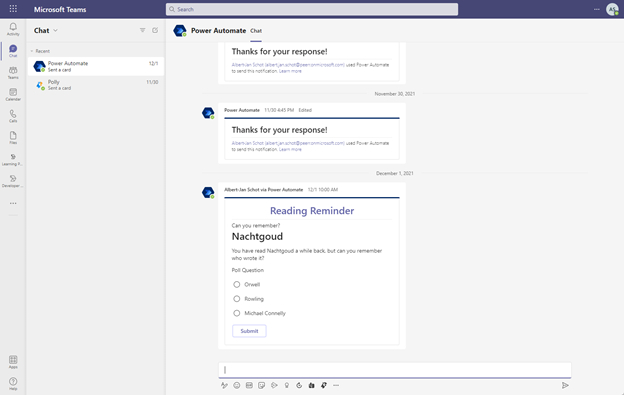
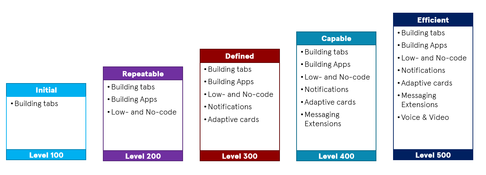

# Maturity Model for Microsoft 365 and Teams Development

[!INCLUDE [content-disclaimer](includes/content-disclaimer.md)]

Working as a developer on Microsoft Teams solutions you might not have heard about the [Microsoft 365 Maturity Model](/microsoft-365/community/microsoft365-maturity-model--intro). Yet it is a great resource to get familiar with! The model is based on the [Capability Maturity Model](/microsoft-365/community/microsoft365-maturity-model-origin-story#underpinnings-the-capability-maturity-model) and with some imagination you can apply the same logic for the building blocks of Microsoft Teams.

## Microsoft Teams Development

The Microsoft Teams platform provides different development opportunities:

- **Tabs**: Teams-aware webpages (did anyone say iframes?)
- **Bots**: chatbot that can interact with you through natural language.
- **Message extensions**: interact with your solution when writing a message in Microsoft Teams
- **Meeting extensions**: apps that are part of the meeting experience
- **Personal apps**: a dedicated tab
- **Webhooks & Connectors**: communication options for external apps
- **Microsoft Graph**: work and interact with the Microsoft Teams data in any other solution
- **Adaptive cards**: organize information and provide users with interaction options without leaving their chat experience.
- **Task modules**: Modal pop-up experience in the Microsoft Teams Client

Some of those different scenario’s  have a different developer experience and might require different components in Azure as well. If you are new to Microsoft Teams Development a great place to start is the [getting started overview](/microsoftteams/platform/overview-explore). If you have been building Teams solutions you might recognize some of the options. If you are new to the game be aware that a Teams solution can consists of several different opportunities and you can combine multiple components into a single solution.

## Teams Development sample

Considering a straight forward solution presenting information in Microsoft Teams with a tab. If you are already using SharePoint you can expose this information with minimal code. The advantage of this scenario is that you can walk through all App package components without having to write Microsoft Teams specific code. And there are a few great SharePoint samples out there so things look good straight away.

You can find a detailed blog with all steps to achieve this by [Bob German -Building Microsoft Teams apps with SharePoint Pages – Part 1, Get Started](https://bob1german.com/2020/01/06/teams-apps-with-sharepoint1/)

Or you can use Power Automate to send messages, including adaptive cards and build more complex processes. With a flow you can both send these adaptive cards and add additional business logic. A loved building a [Reading Reminders solution and demo](https://www.selectedtech.show/using-logic-apps-reading-reminders/) with that approach, combining both adaptive cards to gather user input and Power Automate to respond. A great way to quiz myself on books I have read and hopefully still can remember.

Adaptive cards can also be used in Teams itself and send from custom applications. It does require some additional configuration and some code, but you will have more control over the experience. I wrote a sample to [recognize active team members with the CLI for Microsoft 365](https://www.cloudappie.nl/recognize-active-team-members-cli-microsoft-365/) that you can run anywhere. But you can obviously implement any other scenario that requires you to notify a user or team.

## Using the Maturity Model

But while building all these solutions it got me thinking about the different options. Each option has its pros and cons and a whole bunch of technical requirements. But when focussing on those you might lose track of the business side of things. Building any solution starts with a business case and that is most likely dependant on the maturity of the organization. So typically when designing any Microsoft 365 solution I love the [Maturity Model for Microsoft 365](/microsoft-365/community/microsoft365-maturity-model--intro). They describe in detail how to design tools for different competencies within your organization. With that in mind it struck me that one could use a similar approach for designing and building for Microsoft Teams. While Microsoft Teams is being part of both Collaboration and Communication competencies the Microsoft Teams solution can be a bit of a weird duck. However conceptually speaking each component you develop requires a certain level of maturity in your organization. Showing a tab requires less IT experience from a typical end user compared to a chatbot they can interact with. With that fact we took the idea of different maturity levels and plotted the capabilities for Teams Development on those maturity levels.

Now I am the first to admit it is not an exact science: some companies might require you to shuffle some of the capabilities to another maturity level. Yet it is a great image to discuss development opportunities in Microsoft Teams. We use it just to start discussions to make sure what we are building is the correct way. If your users are not using the Teams chat experience and are spending their day in Outlook it might not be the best investment to build a solution that leverages a message extension. On the other hand that same message extension could potentially bring new users to Teams. Our main goal of discussing these types of topics is to better understand where an organization lives and how the technical solution fits best.

---

**Principal author**: [Albert-Jan Schot](https://www.linkedin.com/in/albertjanschot)

---
