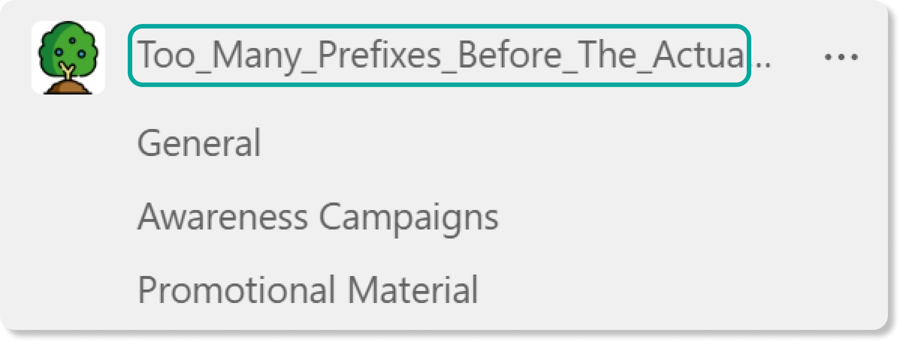

# The importance of a Teams naming convention

[!INCLUDE [content-disclaimer](includes/content-disclaimer.md)]

Names are important as they imply meaning, and in many experiences such as Microsoft Teams, names serve as a key navigational aid for end users in locating the correct Team quickly and easily. However, with many organizations, it is difficult – if not impossible – to enforce consistent Microsoft Teams naming standards, even if Team and Group creation is limited to a small number of individuals. While this enforcement cannot be completely overcome without a third-party tool, the first step is to define a single or set of consistent naming standards that will enable better adoption and success when it comes to its usage of Microsoft Teams.

## Why are Team names important?

The name of a Team and its channels is hugely important as it serves as the primary mechanism by which users can currently navigate and browse their list of workplaces in the Teams application. Studies in information-seeking behavior tell us that things like a Team’s labels are used by the human brain to quickly assess and estimate (via scanning) what this label represents.

The method by which users decide which link to select is often referred to as information scent, which can be understood as the “user’s imperfect estimate of the value that source will deliver” – which in our case is whether the team they open is in fact the team they are looking for. As described by the Nielsen Norman group, the user considers a link based on its label and any contextual information available to them. Within Microsoft Teams, this boils down to two things: the Team Name and the Team Logo – not a lot to go on. This underlines how essential good naming can be.

Without consistent Microsoft Teams naming standards, this process becomes taxing and inaccurate as end users have no reliable “memory” from which to draw to assist in accurately identifying whether certain information is the information they are seeking.

## The consequences of bad names

The consequences of poor or inconsistent naming boil down to two main problems: findability and redundancy. A variety of studies have shown that these are huge problems in the digital workplace:

- **Findability:** Multiple studies have shown that users spend a huge part of their day (some suggesting as much as 2.5 hours a day) simply searching for information. In the context of Teams, especially in organizations with a high volume of Teams workspaces, bad naming can seriously hamper the findability of Teams which creates friction and irritation for end users trying to jump quickly between tasks.
- **Redundant Effort:** Poor naming can also lead to duplication of Teams and effort, as end users who cannot find the object of their query will quickly abandon a search, sometimes creating a new space for this information and replicating content that may already exist elsewhere.

Not only does this problem occur in Microsoft Teams, but the same name used when creating the Team is also carried throughout the Microsoft 365 ecosystem and applied to several related objects (e.g., SharePoint Site, email address, etc.) which essentially serves to multiply the problems shared above.

## Naming convention considerations

### Prefixes

Adding consistent prefixes to the beginning of Microsoft Teams team names can be a useful way to add organization, structure, and consistency to your Teams. In western cultures, our eyes have a tendency to scan left to right reading the first 11 characters so a prefix can be valuable as it creates a column of essential information down the left-hand side of the Teams experience.

#### Recommendations - Prefixes

- Prefixes can be useful but do not make these overly long as they can lead to the Team name being cut off. Generally, limit yourself to acronyms or prefixes no longer than 12 characters.
- While emojis can be tempting to utilize, keep in mind that these can cause issues for search and are not supported in all the areas where a Team’s name gets applied.

### Spaces

Spaces are proven to make names more scannable while improving overall readability for end users, which further aids with finding the right name in Microsoft Teams. They should, however, also be used with some thought, especially when considering prefixes and suffixes you may choose to implement.

#### Recommendations - Spaces

- When using prefixes or suffixes, we are now combining different “components” into the name, and it is typically helpful to aid users in differentiating the delineation between these segments. One way to do this is to keep spaces within a Team’s Workspace name but use another delimiter (such as a dash or underscore) for the prefix or suffix. This allows the brain to quickly assess the Team’s category from the Team’s name.

### Length

An understandable response to remedying a Teams' findability is to add more detail to the Team name, ultimately adding more length to each name – but this can lead to other problems. Microsoft Teams only allows a certain team name length before it becomes truncated (trimmed). The length available depends on the case of the characters and therefore the maximum length falls within a range of **between 30 and 36 characters**.

#### Recommendations - Length

- Keep your team names to 30 characters or less as a rule to ensure they are fully visible

### The Result

The result of applying a naming convention can be powerful. Observe the immediate difference in scannability between the two sides below:

---

**Principal author**: [David Francoeur](https://www.linkedin.com/in/dfrancoeur/)

---
