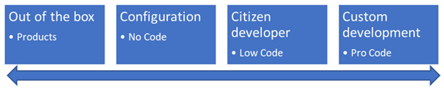

# The Microsoft 365 Maturity Model - Customization and Development Competency

## Overview of the Concepts [tl;dr]

Traditionally, there has been a reliance on "deep" development to build business solutions. Any gaps in availability of these skills have commonly been filled by "shadow IT" approaches and unmanaged applications.

Over the years, as platforms have evolved, it became increasingly possible for viable business applications to be delivered without code. Today there is a continuum from out of the box, through configuration (No Code), to citizen developer (Low Code) and finally "proper" development (Pro Code). The separation between these stages can be highly porous; artificially segregating them is frequently meaningless and often counter-productive. Management tools traditionally associated with Pro Code development are gradually providing an opportunity to wrap development rigor around the No Code and Low Code approaches and to introduce many of the effective development operations (Dev ops) techniques and tools.

At the same time, even nominally out-of-the-box products and services often support options for customization and extension. The ways of achieving this vary widely, including interaction via APIs, "overlay" coding of UI, deep configuration, Add-ins and more.

Increasingly, Machine Learning and AI based solutions operate in the same way as software solution development, also providing a continuous path through configuration, Low Code and Data Science driven professional development. As such, this competency applies equally to this technology.

## Definition of this competency

This competency considers the management and governance processes required for different approaches to solution development and also how to blend those different approaches effectively

The concepts of customization and development have evolved over the lifespan of Microsoft 365 and the IT landscape in general. In the early days of SharePoint, for example, almost all organizations found themselves developing Pro Code solutions to make the platform work well for them. Fast forward to today, and Microsoft 365 offers a wide variety of apps and services that meet many needs right out of the box.

Our ability to extend the platform has changed significantly as well. Rather than writing server-side code, almost all custom development for Microsoft 365 is done using client-side tools. The SharePoint Framework allows us to build solutions for SharePoint and now Microsoft Teams. The toolsets to build extensions on the Office applications use similar approaches.

These days, the question is as much \*whether\* to customize as it is \*how\* to customize. Custom coding absolutely has its place in Microsoft 365, but in many case the platform provides robust tools which only require some configuration to meet your needs.

The reality is that there has always been a dynamic equilibrium between what can be delivered with different technologies by people with a range of skill sets. Perhaps unexpectedly, increasing maturity is less about a progression from Out-of-the-box &amp; No Code through to Pro Code; it is more about how organizations coordinate and integrate this continuum.

## Common Microsoft 365 Toolsets

- Microsoft Graph
- Microsoft Azure
- SharePoint Framework
- Power Apps
- Power Automate
- Power BI
- Power Virtual Agent
- Dataverse for Teams
- Microsoft Teams App Source
- Azure Logic Apps
- Azure Functions
- Azure API Management
- Azure Dev Ops
- Azure Cognitive Services
- Github
- React
- .NET Core
- Microsoft Search Connectors
- Web API
- TypeScript
- Microsoft PnP Frameworks
- Microsoft Graph Toolkit

Customizable products and services

- Microsoft Teams
- SharePoint
- Forms
- Project
- Dynamics
- Microsoft Office apps
- Outlook/Exchange Server
- Visio
- Microsoft Lists
- Power BI

## Evolution of this competency

### Level 100

_This is the starting level for a new or untried process. As with all 100 level characteristics, practices may be somewhat effective, but they don"t take advantage of the power of the platform, nor do they take into account the multiple use cases which exist in even the smallest and simplest organization. Typically, they are undocumented and in a state of dynamic change, tending to be driven in an ad hoc, uncontrolled and reactive manner by users or events. This provides a chaotic or unstable environment for the processes._

The customization and development continuum is poorly understood, unmanages and chaotic. Staff are frustrated with poor functionality but have no mechanism for requesting or implementing change. Development is characterized by _build to live_

**Initial level**** Customization and Development** characteristics include:

#### No Code

- Configurable platforms and products are generally used in their default state
- There is little appreciation of the capabilities of platforms to meet business needs more closely
- There is no systematic review of platform capabilities, feature roadmap and application of features sets to unaddressed business needs

#### Low Code

- Individuals use the skills and tools they have, developing solutions to local needs without oversight, review or recognition of the impact or interaction with wider strategic needs and activities
- The solutions are not backed up, documented, publicized or resilient
- People creating solutions use hacks and inefficient approaches
- No security or governance design or impact assessment
- Solutions are not backed up in source control.
- Solutions are not documented.

#### Pro Code

- Developers don"t know the platform, so write code instead of using native features. Code is written to build components which reinvent the wheel due to lack of understanding of what is available out of the box with the platform.
- IT are insular and internally focused. There is little support for department or process driven needs
- The IT function often has no development capability at all. Equally, IT may be inflexible in their approach, all developments are treated as "enterprise-level" activities, making many solution-needs non-viable (too expensive, too slow, overly technical expectations from stakeholders)
- No development tools, such as Source Control and test methodologies are in use
- Written to build components which reinvent the wheel due to lack of understanding of what is available out of the box with the platform.
- Systems are developed which use Microsoft 365 services as a data store but the user interface is held outside of Microsoft 365.
- Systems are designed and built with little thought, on the Microsoft 365 services that can be glued together to deliver the system.

#### Management &amp; Governance

- There are no agreed development platforms, tools, languages, etc.
- There is a lack of ownership of developments on behalf of the organization as a whole
- Most development is ad-hoc, undocumented and invisible
- No standards have been considered or published. User Interfaces, branding, coding standards and quality, platforms and security are left to the knowledge and skill of staff members.
- There is no capture of development needs at a granular level and no visibility of (local) solutions that have been put in place.
- The development continuum is chaotic, fragmented and siloed.
- Teams and departments commission their own developments with 3rd party contractors and developers, without procurement standards, contract reviews and data and security agreements
- No source control is used to hold the code repository.
- Development is frequently performed on the live environment, with no release management
- Systems are delivered with no documentation of how they are administered or used. User Guides and Admin Guides.
- There are no separate environments, such as Dev, QA, Production. So, changes are made to Production/Live.
- Systems that run in the organization are not known about by IT. These shadow systems are discovered when things go wrong.
- Each solution is built in isolation – little or no code or approach reuse.
- No Dev Ops
- Systems are built without thinking of how the system will be supported and maintained.

#### Impacts

At this level you can expect the following:

- Inconsistent looking systems and solutions.
- The organization risks that systems break due to misconfiguration and/or setup problems.
- The organization risks not being able to rebuild a solution if it is corrupted.
- Money is wasted on development when other approaches using lo-code or no-code could be used to achieve similar results.

### Level 200

_Processes are documented or widely understood to enable (but not enforce) the preferred ways of doing them. Some processes are repeatable, possibly with consistent results. Process discipline is unlikely to be rigorous, but where it exists it may help to ensure that existing processes are maintained during times of stress._

Different types of development are recognized as occurring, but there are tensions between parts of the organization adopting different approaches. Shadow development continues to occur or is prohibited without providing alternatives.

Staff are frustrated with poor functionality but have no mechanism for requesting or implementing change

- Development is characterized by _build to live_

**Repeatable level**** Customization and Development** characteristics include:

#### No Code

- Customized business solutions are developed using no-code technologies; however, these are done with limited knowledge of good practice. Solutions are modelled on existing practice, using superficial capabilities and generally avoid use of deeper platform features.
- Solutions tend to be built "on-the fly", without a clear deliverable and specification. There is no documentation around the design and build process.
- Users are shown how to use the system and core documentation may exist, within the process or procedure documents.
- Updates and changes are ad-hoc. There is no equivalent of source control.
- A small number of people have some expertise with configuring the platform. Maintenance and support of the solutions are dependent on the availability of these people. The "experts" maintain their knowledge of platform capabilities, roadmap etc. out of personal interest.

#### Low Code

- Some Power Platform projects have consistent color standards and make use of components.
- Some low-code solutions are exported to basic source control.
- Some low code solutions have separate environments for development, user acceptance testing and production.

#### Pro Code

- Source Control is used for some projects. However, the source control system is not standardized across the organization. There are multiple repositories and multiple source control systems in use.
- Projects start to use Microsoft 365 components when delivering systems.
- Development approaches and best practice start to be understood and are adopted by members of the project team. However, they are not enforced.

#### Management &amp; Governance

- Developers don"t know the platform, so write code instead of using native features.
- Some projects deliver systems with user guides and administration guides.
- Release Management is considered, and the delivery of a system and its upgrades are announced before deployment. However, there are no testing environments which the deployment is released to first.
- The organization"s Microsoft 365 community start to share wins and stories via ad hoc discussions.
- There are no development standards shared between projects.
- The Power Platform is implemented without thought of impact or management.
- Basic Source Control maybe used, with multiple source control systems in use.
- Some projects make use of Cloud platforms such as Microsoft Azure.
- There are little in the way of Dev Ops Practices

#### Impacts

At this level you can expect the following:

- Money is wasted on development when other approaches using lo-code or no-code could be used to achieve similar results.
- Inconsistent delivery approaches.
- The quality of development is low.
- There are issues when deployments occur as deployments are not repeatable and cannot be practiced.

### Level 300

_The process is well defined and agreed as a standard business process. There are sets of defined and documented standard processes established, signed off and subject to some degree of improvement over time. These standard processes are in place. The processes may not have been systematically or repeatedly used to the extent needed for their users to become fully competent or the process to be validated in a range of situations. This could be considered a developmental stage - with use in a wider range of conditions and user competence development the process can develop to next level of maturity._

**Defined level**** Customization and Development** characteristics include:

#### No Code

- Steps to create customized business solutions are captured with some form of specification, setup is documented, and a final solution description exists.
- Legacy approaches are modified to take advantage of platform capabilities and some business processes are actively redesigned to deliver improvement based on these.
- Updates and enhancement should be scheduled, planned and executed, but exceptions to this are frequent.
- User documentation and training is appropriate to the system, though tends to lag updates.
- Solutions considered important to the business are recognized and some level of support has been implemented. Support staff are skilled up to maintain the platform and any solutions, reducing the reliance on "solution experts".
- There is some consolidation of no-code platforms; roadmaps and updates for standard platforms are actively tracked.
- Customization of live platforms is only carried out after consideration of impact on staff and other systems.

#### Low Code

- Rigor is put in place around the documentation of low code solutions such as solutions built on the Power Platform.

- Low code solutions are backed up as solutions and stored in source control.
- Low code solutions have separate environments for development, user acceptance testing and production.

#### Pro Code

- Source control is used for all projects.
- Systems are deployed mainly through manual processes but augmented with scripts for some of the steps.
- Solutions have separate environments for development, user acceptance testing and production.
- Continuous Integration and Continuous Deployment may be introduced alongside other approaches.
- Pro Code developers appreciate when not to develop solutions, only writing code when it is necessary and can make a difference. They begin to hand off to Low Code and configuration alternatives.

#### Management &amp; Governance

- There is an appreciation of the limits of the no-code approach and low-code and pro-code approaches. Needs to that trigger a transition from one approach to another are often identified and options for delivering extended needs/features with pro code etc are understood.
- Some elements and solutions are created as scripts, under basic source control. This is generally retrospective: build –\&gt; deploy –\&gt; define and document.
- Good practice is understood by a core of experts and is used to guide solution development.
- The decision to customize and/or develop is actively thought through before any code is written.
- There is a recognition of the roles of no-code and low-code alongside pro-code approaches. The 80/20 rule is increasingly applied, using out of the box functionality that"s good enough to provide utility, often adapting a process to accommodate Out Of the Box (OOB) functionality rather than build customer solutions.
- Build solution which represent the organization"s &quot;special sauce&quot;, delivering the highest impact
- Understanding when to create solutions vs waiting for native features to be developed.
- Understand technical debt (and how to service it)
-
- Systems are delivered which can be managed, maintained, and supported.
- Systems are delivered with documentation such as user guides and admin guides.
- The pro development team and citizen developer community understand how to build solutions on the Microsoft 365 platform. Resources from Microsoft and the community are used to enhancing their knowledge.
- Some of the development team start taking exams to achieve certifications such as the Microsoft 365 Developer Associate.
- Release Management processes are put in place which provide manual deployment approaches.
- Standards for UI, Themes and Styling are created and shared. Design standards are published and allow a consistent approach for UI and functional behavior. Existing solutions may be updated in line with these.
- Source Control is standardized but not enforced or used consistently across all development approaches.
- Dev Ops Practices are being introduced, though non-Pro-code often are not included
- User research employed to define requirements for some systems; there is some attempt to standardize approaches to capturing and defining requirements, such as User Stories etc.
- There is an emergence of a community of M365 Champions. This supports the need for governance, documentation, training and development process to support alignment of their solutions to the strategic plan. Community members may meet periodically to discuss problems the citizen developers are trying to solve. These meet ups are part tech therapy and part continued training as M365 is continually changing. There is management appreciation and support for this.
- There is an emergence of a community of M365 Champions. This supports the need for governance, documentation, training and development process to support alignment of their solutions to the strategic plan. Community members may meet periodically to discuss problems the citizen developers are trying to solve. These meet ups are part tech therapy and part continued training as M365 is continually changing. There is management appreciation and support for this.
- Separate environments are available for Development, Test and Production for Pro Code and, often to a limited extent, for other approaches.

#### Impacts

At this level you can expect the following:

- Proponents of different development approaches appreciate each other and openly discuss how to work together. Solutions emerge that combine customization, low code and pro code to create more capable, supportable solutions.
- Processes are introduced to encourage management, governance and standardization, leading to easier development, adoption and support.
- The organization has a forum for sharing systems and solutions that have been built.
- Improved release of systems as the structure, processes and rigor for deployment is put in place, simplifying the IT estate and reducing support burden and corporate risk.

### Level 400

T_he process is actively managed in accordance with agreed processes and has tracked metrics. Effective achievement of the process objectives can be evidenced (using metrics) across a range of operational conditions. The suitability of the process in multiple environments and scenarios has been tested and the process refined and adapted with corresponding updates to documentation, policy and training. Process users have experienced the process in multiple and varied conditions and are able to demonstrate competence. Adaptions to particular projects or new scenarios can occur without unexpected, measurable losses of quality. Process Capability is established from this level._

**Managed level**** Customization and Development** characteristics include:

#### No Code

- Configurations are well documented and used as the basis for scripts and templates to automate recreate and updates. These are well managed and maintained via source control.
- Solutions are developed and tested against a set of good practice guidelines that include common layout based on good UI/UX approaches, incorporating company branding and standards.
- No code developers have good knowledge of the platform and are supported to maintain and extend their knowledge. They also know when to reach out for advice and guidance from colleagues with complementary development skills.
- Solution design and information architecture are carefully considered; constraints are understood and approaches to avoid these are implemented, including inclusion of or switch to low-code and pro-code development.
- Security, governance, manageability and integration are considered as part of solution design and are included in the specification for important business solutions. These are therefore tested as part of the development lifecycle.
- The purpose, impact and anticipated lifecycle and scale of the solution are considered and appropriate development methodologies are applied accordingly.
- Solutions are reviewed to ensure they remain fit for purpose. Changes are managed appropriately.
- Changing platform capabilities are proactively applied to existing solutions.
- Important business solutions are actively managed and supported.
- The organization invests in a full range of platform skills against a broad development strategy that includes no-code, low code and pro-code standards and an integrated design and development approach.

#### Low Code

- Solution design is carefully considered; constraints are understood and approaches to avoid or mitigate these are implemented.
- Low code solutions make use of source control to help manage the release process. The release process includes metrics which can be shared within the organization to show the benefit of the low code solutions.
- Low code solutions use metrics from tools such as Application Insights to measure adoption. This allows decisions to be made as to where to focus effort on successful applications and cancel or rework unsuccessful applications. These metrics are published and shared within the organization.
- There is an active process for testing and for user evaluation and feedback, which is used to drive a roadmap for ongoing enhancements.
- Lifecycle of the solutions is anticipated, and the solution considered.
- Standardized User-Centric-Design processes are to ensure that the solution meets the needs of the users and is designed appropriately for the audience.
- The organization continues to invest in Training for the Citizen developers and in the tools to support them.
- The organization has invested in the licensing to ensure that there is low friction and decisions are easier to make when building low code solutions.
- Pro-Code components are developed to extend Low Code solutions, as part of a well-understood "systems" approach.
- Pro Code methodologies are adopted wherever appropriate.

#### Pro Code

- Pro code solutions make use of source control to help manage the release process. The release process includes metrics which be shared within the organization to show the benefit of the pro code solutions.
- Pro code solutions use metrics from tools such as Application Insights to show many users/applications are using them each day. This allows decisions to be made on the success of an application. A decision can be made as to which applications should be focused on. These metrics are shared within the organization.
- Lessons learnt from the development of Pro code solutions are shared within the organization.
- APIs are proactively developed to allow No Code and Low Code to easily access sophisticated data sources, functions and business automations.

#### Management &amp; Governance

- Application usage is measured using tooling such as Application Insights.
- Applications are instrumented to detect errors and events using tools such as Application Insights.
- Development integration occurs across the code-continuum, Pro Code component and solutions are built to be consumed by Low Code and No Code solutions. Libraries of these "extensions" and registers of where they are employed published and maintained.
- Statistics on the number of deployments and releases are provided by release management tools such as Azure Dev Ops.
- User research employed to define requirements and provide metrics on usability, enhancements, and productivity.
- Design standards are applied consistently to ensure all applications meet staff expectations for UI and behavior.
- Source control is used effectively and consistently, some automated testing is in place.

#### Impacts

At this level you can expect the following:

- Higher quality applications and systems are delivered.
- Design standards mean that users can pick up the application more easily and this boosts adoption.
- Applications meet the needs of their users due to the user centered design approach.

### Level 500

_Management of the process includes deliberate and systematic process improvement/optimization. There is focus is on continually improving process performance through both incremental and innovative technological changes/improvements. Management of the processes are concerned with addressing statistical common causes of process variation and changing the process to improve process performance, using techniques such as Statistical Process Control (SPC). Level 500 is likely to include automation, reduction in human input and associated variability, strong governance and compliance interventions as well as optimization for user interactions and productivity._

**Optimizing level**** Customization and Development** characteristics include:

#### No Code

- The repository for customizations and templates which promotes solution reuse is actively maintained by the business and enhanced based on emerging technologies and business needs.
- Sophisticated No Code solutions are easily created by extending them with Low Code and Pro Code extensions that operate in a similar way to the No Code platform staff are familiar with.
- Management processes actively look for opportunities to use No Code in order to reduce costs and take advantage of platform feature roll out. The impact of these is assessed on an ongoing basis and used to refine the code transition points.

#### Low Code

- The repository for components, modules and templates which promotes solution reuse is actively maintained by the business and enhanced based on emerging technologies and business needs.
- Low Code Citizen developers use the hooks and extension points built by the Pro Code developers, and also provides enhancements to No Code. These are standardized, with defined integration points and embedded monitoring elements.
- Compliance with standards is routinely assessed and used to improve the quality of the solution and the developer.

#### Pro Code

- A Package Management feed such as internal NuGet or NPM feed for managing and promoting the reuse of components and patterns.
- Pro code develops extension points and components for No code/Low code citizen developers to use. Examples include custom connectors for Power Platform or SPFX web parts for SharePoint and Teams.
- Analytics on the use of APIs for data sources, functions and business automations is used to optimize their use and performance.

#### Management &amp; Governance

- Development is proactively managed across the code-continuum; a dynamic equilibrium is maintained between the different code approaches, shifting to take advantage of changes in the technology and platform landscape. Active monitoring of the source technologies allows these changes to be anticipated and included in the development roadmaps.
- There is granular insight into the developed solution estate and code-continuum, with understanding of origination costs, technical debt, support costs and benefits. These are integrated with user metrics. These are used to direct development strategies and investments.
- Application Insights metrics are used to measure adoption and are shared with the organization.
- Application insights funnels, user flows used to see how people are behaving and using the solutions.
- A2B Testing using metrics to work out usability and make improvements.
- Source control provides robust and highly automated testing, CI/CD.
- A Centre of Excellence and Steering Committee is established to help build a roadmap to guide the extensibility points built with Pro code for the No/Low code citizen developers.
- Designing and publishing solutions into the Organisation"s App Stores such as SharePoint and Microsoft Teams.

#### Impacts

At this level you can expect the following:

- Innovation within the Organization.
- An ability to rapidly develop solutions to new business needs at a pace that creates business advantage and then mature these to ensure compliance and supportability.
- A more productive workforce with users having the tools and information that they need when they need them.
- Seamless and invisible coordination of different approaches, leading to rapid staff adoption and improved productivity through consistency and standardization.
- Improved ROI as solutions can be reused throughout the organization.
- Promoting best practice and lessons learnt so the organization does not suffer the same problem time and time again.

## Scenarios

- Customer service representatives can easily answer common questions by customers to improve customer service levels.
- An electrical engineer can perform a site survey. They capture the required information with their mobile device so that the installation of the electricity point can be planned and executed successfully and minimize the cost.
- A salesperson can produce and send a quote to a customer in a consistent way which meets the quality standards of the organization.
- Employees can submit their ideas and suggestions to a panel via the corporate Intranet.
- A manufacturer can produce the required certificates and documentation to support the release of a new product in a managed way.
- Using Machine Learning to improve the efficiency in how a logistics company routes its delivery drivers.

## Cost &amp; benefit

When we talk about benefits of customization and development, it is easier to see the benefit and the ROI. Often the time savings are used to quantify the ROI. When development enables a new capability within a business then the revenue that is realized with the new capability can be used to for ROI.

Examples of benefit include:

- Reducing the time to achieve a common task.
- Reducing the error rate when copying information from one system to another system manually.
- Enabling insights to be gained by pulling data from one system and integrating it with another.
- Enhancing productivity by enabling the business to process more for less.
- Improving consistency when delivering content to customers.
- Enabling innovation within the organization.
- Increased employee happiness (employees get to work on the tasks that provide the most value that computers cannot deliver).
- Reducing corporate risk

The cost of development is expensive and can be controlled by only embarking on projects that really need it and provide value. Additionally, moving development from Pro-code to Low-code when appropriate will help increase the value and innovation.

## Resources to learn more

Learn how to design awesome UIs by yourself using specific tactics explained from a developer"s point-of-view: [Refactoring UI](https://refactoringui.com/).

Microsoft Developer Portal, [https://developer.microsoft.com/](https://developer.microsoft.com/)

## Conclusion

Traditionally, organizations have treated No Code and Low code approaches as "second class citizens" to Pro Code; maturing organizations, however, recognize that each has a part to play and seeks to create an integrated approach to addressing business using a code-continuum. As silos and "code-snobbery" are reduced, opportunities to improve standardization, development efficiency/assurance and to provide increased rapidity or cadence on delivery of solutions to the business improve.

Customization and Development is an essential ingredient to get the most value from Microsoft 365. However, it is important that customization and development is not entered to lightly and an understanding of the commitment that is taken on. When customization and development is performed there will be a level of management and support required. This is to ensure the solutions continue to work as the platform evolves and there will be unforeseen issues which need to be resolved.

Organizations should minimize customization and development. It should be used for essential business functions where the platform does not provide the required feature set. The activity should be measured and ensure that it provides significant return on investment.

When development is performed it needs to be done in a way which reduces the risk to the organization. So, implementing source code repositories to backup code and ensure that the developers are productive. This is important as too often there are stories where an organization has a solution which is used but they have lost the source code.

---

Principal authors:

- [Simon Doy](https://www.linkedin.com/in/simondoy)
- [Simon Hudson](https://www.linkedin.com/in/simonjhudson/)
- [Emily Mancini, MVP, UXMC](https://www.linkedin.com/in/eemancini/)
- [Marc D Anderson, MVP](https://www.linkedin.com/in/marcanderson)
- [Sadie Van Buren](https://www.linkedin.com/in/sadalit/)
