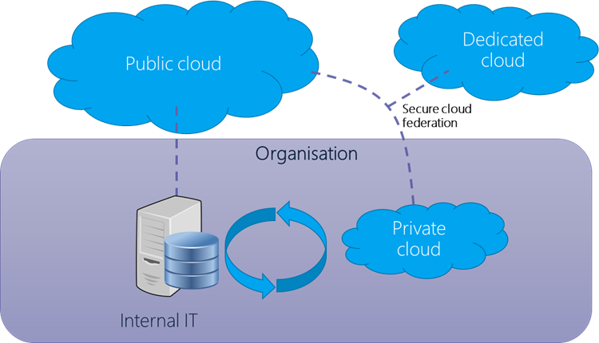

---

title: Maturity Model for Microsoft 365 – Infrastructure Competency

ms.date: 11/11/2022
author: SimonJHudson
ms.reviewer: daisyfeller
manager: pamgreen-msft
ms.topic: article
ms.author: daisyfeller
ms.service: o365-solutions
localization_priority:
description: Maturity Model for Microsoft 365 – Infrastructure Competency
ms.collection: M365Community

---

# Maturity Model for Microsoft 365 - Infrastructure Competency

[!INCLUDE [content-disclaimer](includes/content-disclaimer.md)]

## Overview of the Concepts [tl;dr]

Infrastructure is still infrastructure, despite the evolution of the cloud. The principles remain, though the roles and accountability for much of the 'physical' interaction has been handed off to the cloud platform providers. It's important to remember that infrastructure was always about more than the tin and wires, infrastructure encompasses disciplines including networking, security, enterprise architecture, planning, and governance.

Despite claims to the contrary, the Admin or IT Pro job does not go away when an organization moves to the cloud. There are still administrative decisions to be made and tasks to be accomplished. How well those are performed will impact how much value an organization gets out of their cloud platform.

It's equally true that organizations still have their own infrastructure, whether in the form of hybrid environments, highly diffused remote workers' technology, and the necessary core infrastructure for connecting to the cloud at all.

## Definition of this competency

The Modern Infrastructure Competency focuses on tasks that are traditionally carried out by IT Pros or administrators. These are tasks that are normally executed during the setup and configuration of a tenant, when new functionality is introduced to the platform, or as part of the process when organization is moving from one level of the Maturity Model to another. They generally impact all users in the tenant and all like objects in the tenant.

Desktop devices are not covered by this competency, though it should be remembered that these interact with infrastructure and have not been handed off to the cloud provider and need to be managed in order to connect to the organization resources.

## Evolution of this competency

See the [Maturity Model for Microsoft 365 - Introduction](/microsoft-365/community/microsoft365-maturity-model--intro) for definitions of the Maturity Model levels.

### Level 100 - Initial

Organizations at this level are usually at the very beginning of their journey into the cloud. They are likely in the middle of, or have recently, migrated into the cloud. They may also be a new smaller business starting out as cloud first. They may be a small business without a dedicated IT staff. Cloud technologies are probably in use since they are easier to provision than on premises technologies to get to the "good enough to do the job" state. It is common for a company to get enough cloud functionality put into place so they can start working on core business and never leave Level 100 and continue to operate with a minimal IT team or have just functional external IT support.

There may continue to be servers under staff desks, portable hard drives in drawers and a file server for organizational files.

[**Initial level**](/microsoft-365/community/microsoft365-maturity-model--intro#level-100---initial) characteristics include:

#### 100 Process

- There is often no one responsible for infrastructure management; there may be external support used on an ad hoc/break fix-basis. Resources are provisioned ad-hoc, when requested. Staff and leadership are unaware of good practice, the importance of this and the impact of their current practices.
- Process changes that are performed are manual, ad hoc, undocumented and done 'in the moment'. Changes are made in a reactive fashion when something breaks, or something is needed.
- Changes are purely application-feature driven and any infrastructure changes are driven by 'having' to do something vs. 'needing' to do something.
- The organization may be using a single environment for development and production but are unaware that there is a difference.
- There may be some use of resource groups, such as distribution lists and security groups, however these lack governance, standardization, granularity, and naming standards.
- Object-like sites, mailboxes, and users are created without a formal request process and with no consideration of how they fit into the wider information architecture.
- User processes are not defined. There are no official onboarding or offboarding processes. User access to shared resources is assigned ad-hoc without a formal request and review process.
- No company-wide business processes are defined.
- No consideration has been given to backup, data recovery, and business continuity.
- Software is largely installed locally and manually, mostly by users.
- Directory services are often not used (AD and/or AAD for example), with staff able to use local or unmanaged identities.

#### 100 Technology

- There is no planned network design or management.
- Devices are commonly directly connected to computers rather than via a network.
- There is no device management.
- The organization is unaware of the need to do patch management.
- Single production environment, or small set of static test machines, if any.
- Different hardware, standards, and software are in use.
- There is no disaster recovery plan, so recovery of servers, devices, networks, etc. are rebuilt manually based on memory and Google searches.
- Tools used for admin are based on individual preferences/knowledge, without standardization of organization fit.
- Configurations of sites, applications, etc. created and used with out-of-the-box functionality or based on individual adjustments or knee-jerk lock down. Templates are not used, and provisioning processes are not employed.
- If virtual machines are used at all, these are ungoverned, with no management of resources, event logs, standards, etc.

#### 100 Storage 

- There is no knowledge of storage used across the organization (until they get a bill). This extends to types and location of storage. Storage frequently includes use of removable drives, DVDs, personal storage, and isolated PCs.
- There is no control, management, or standards of storage devices.
- Access control to storage is largely absent; people have access to things they shouldn't and don't have access to things they should.
- No backup for significant proportions of the storage. Backup strategies have not been developed, implemented, or tested.

#### 100 Governance, Risk, Compliance and Security

- No governance is in place for lifecycle management. Objects of all types (files, platforms, services, users, etc.) that are created will exist until they are manually deleted by an administrator.
- Admin access is provided as needed and generally not revoked after use. There are many live admin roles. All Administrators are Global Admins.
- There is no understanding of identity and role-based access.
- Basic security exists but has not been shaped to address the actual business risks.
- Firewall rules are not configured beyond defaults.
- There is no understanding or monitoring of technical risks and hence no programmatic management.
- RDP/SSH access over the Internet is unmanaged.
- Staff devices are able to connect to any networks without policies. Equally, devices can expose resources to other networks and/or devices.
- A single login is used for servers and other resources and shared amongst users and contractors.
- Root account access is available to users.
- Platform security functionality is not leveraged. The focus is on providing access, not securing resources.
- Staff with global level access are not assessed, vetted, or broadly trained (though an effective onboarding process); their contract of employment does not reflect the significant levels of access they have.

#### 100 Impacts

When operating at Level 100, processes are not defined so there is little consistency for users. Similar types of data may be stored in different ways throughout the company or duplicated in several places. It is also difficult to get users and other resources created as there is no defined process. Users do not make efficient use of their time when using cloud technologies as they are constantly looking for things and reinventing processes that others have already done but are not published as standards.

There are also likely security vulnerabilities as authentication and authorization isn't standardized, and platform security functionality is not likely to be taken advantage of. Files are routinely duplicated, file storage lacks effective structure, search is ineffective.

### Level 200 - Managed

Processes are documented or widely understood to enable (but not enforce) the preferred ways of doing them. Some processes are repeatable, possibly with consistent results. Process discipline is unlikely to be rigorous, but where it exists, it may help to ensure that existing processes are maintained during times of stress.

[**Repeatable level**](/microsoft-365/community/microsoft365-maturity-model--intro#level-200---repeatable) characteristics include:

#### 200 Process

- There is a person or small team of developers responsible for infrastructure management, possibly with external support. There is an attempt to actively manage environments. They may have a basic knowledge of DevOps principles and good practice, though this is weakly implemented. There has been an attempt to document basic requirements, including basic security principles and operating constraints. These are not reviewed and updated routinely.
- The organization may be using a single environment for development and production but are attempting to mature the approach; or there may be separate environments, however these are not always used as intended.
- Infrastructure management is intended to be proactive but frequently falls back to break-fix with limited proactive intervention.
- Resources provisioning is nominally defined which includes good practice, deviations are frequent and in-the-moment changes increasingly erode the standard build. Staff and leadership continually push infrastructure management person/team to prioritize expediency and performance over good practice and stability. These changes are not reliably documented or updated to better practice subsequently.
- Resource groups, such as distribution lists and security groups, are in use and there is an attempt to maintain these; processes for this are intermittent (typically a monthly, quarterly or annual clean up) and neither comprehensive nor error free.
- Processes for object creation exist, but exceptions to the process frequently arise and there remains a lack of overarching information architecture.
- Onboarding or offboarding processes tend to be manual and are often overlooked or delayed. Role Based Access is attempted, but not well designed. These can lead to inappropriate or absent user access to resources.
- Backup, data recovery and business continuity are in place, but are not routinely tested and do not take future needs into account. Applications can be recovered manually from scheduled backups or redeployed via manual intervention if a failure happens, in the event of a total loss in a region the application and its dependent virtual infrastructure can be recovered from backup, backups are tested occasionally in isolation but falls short of a full business continuity test.
- Updates and changes are batched up into monolithic releases applied periodically, however the impacts of downtime and user productivity are not carefully considered.
- Directory services are in use (Active Directory and/or Azure Active Directory for example).
- There is basic usage of monitoring and alerting, but this is not acted on promptly or reviewed proactively.

#### 200 Technology

- Separate production and test environments exist, manually maintained, manual releases from dev to test to prod
- A basic network design has been established and the devices involved are understood, though often not remotely managed. There may be use of VPNs private vNets. Directory services are implemented.
- Admin tools are mostly harmonized across the technical team. PowerShell and other automation are used to a limited extent, with some manual housekeeping and extensive use of admin portal interfaces employed in parallel. Scripts mostly are used 'as found' rather than knowledgably crafted for purpose in-house.
- There has been some attempt to standardize hardware, often through selection of preferred suppliers, possibly with support contracts. Most devices are networked connected, but legacy connections exist, especially directly connected printers etc. Centralized device management is not comprehensive.
- A core set of applications and subscriptions is defined; these are implemented on new hardware, but older devices are not necessarily updated.
- Centralized software distribution and patch management exists for core applications/systems. As with other infrastructure aspects, some staff bypass this. The 'standard' installs do not accommodate specific user/role needs, resulting in dark IT and other workarounds.
- Proactive patching is looked at with nervousness in case it introduces instability that is difficult to troubleshoot and isolate.
- There is a basic disaster recovery plan, but this is not well tested or actively maintained, partly due to the wide variety of hardware and software in use.

#### 200 Storage

- There is an intent to store content appropriately on central file stores, whether local file servers or cloud storage; in practice there is limited compliance with the plan and little enforcement. Removable storage is actively discouraged.
- Attempts are made to manage central storage, including controlling access, monitoring capacity and encouraging removal of content. This is met with some resistance by staff and effectiveness is limited.
- Backup is in place for managed devices; testing is sporadic however and the processes for file ad hoc recovery are not clearly defined.

#### 200 Governance, Risk, Compliance and Security

- Lifecycle management is understood in principle, but weakly applied and without automated processing for retention or disposal. Status flags are used, but content is frequently found past its review, expiry and other control dates. Users do not actively engage in management of content lifecycles.
- Admin access is generally revoked after use, but exceptions frequently occur. There are attempts to limit live admin roles and apply granular roles where possible.
- Identity and role-based access is understood in principle, but real-world implementation of it continues to be a challenge.
- Security is in place but exhibits either or both over-zealous and over-permissive approaches. This includes remote access, mobile device use and other non-office-based modern approaches. The business runs at risk, this is not fully appreciated by leadership.
- Understanding, monitoring and management of technical risks is limited.
- There are holes in network connection policies, sometimes due to active workarounds by staff or at the demand of leadership.
- Log ins for servers and other resources are not robustly managed.
- Platform security functionality is used but is not sophisticated or well understood in scope or depth. Policies are often inconsistent, conflicting or use the defaults.
- Some effort is made to limit and assess staff with global level access; contracts of employment and general staff policies set out appropriate behaviors.

#### 200 Impacts

At this level you can expect the following:

When operating at Level 200, processes are beginning to emerge but are likely not documented or enforced so users may be frustrated with inconsistent experiences.

Data is growing and somewhat organized, but no defined, enforced, or automated policies means that there is a lot of manual time spent sorting, moving, and deleting unwanted or unneeded information. Search is beginning to be used more to find things, and duplication increases as the simple navigation experience used at the 100 level is no longer sustainable.

Regular processes are beginning to follow a regular routine and many of them are documented and repeatable. However, they are still specific to the person doing the task, and communication is not governed or enforced holistically.

Security becomes more of a concern as user adoption grows, custom features and functionality increases, and citizen development enters the mix. Passwords are stored in some way and service accounts are beginning to be used for processes that cross boundaries.

### Level 300 - Defined

The process is well defined and agreed as a standard business process. There are sets of defined and documented standard processes established, signed off and subject to some degree of improvement over time. These standard processes are in place. The processes may not have been systematically or repeatedly used to the extent needed for their users to become fully competent or for the process to be validated in a range of situations. This could be considered a developmental stage - with use in a wider range of conditions and user competence development the process can develop to the next level of maturity.

[**Defined level**](/microsoft-365/community/microsoft365-maturity-model--intro#level-300---defined) characteristics include:

#### 300 Process

- Most infrastructure requirements, including security, proactive management, operating constraints, patch management and updates are documented and implemented using standard tools. Processes ensure these are reviewed and updated, though not in response to external threats or opportunities. Exceptions and gaps exist but are mostly of low impact.
- Appropriate environments exist for development, testing and production. Processes for moving between these are often manual, though they are actively managed. The team responsible are competent and adequately supported, allowing them to deliver proactive management and create an acceptable level of trust in the organization's systems.
- Processes for the breadth of resource provisioning, resource group availability etc. are consistent with good practice. Exceptions are limited, new systems are piloted and ultimately brought into the overarching process management.
- Staff and leadership respect the role the infrastructure team play, some have attended formal training and achieved industry certifications, however sometimes they expect too much and have limited understanding of the constraints and technological limits. There is some frustration with how long things take and the lack of flexibility.
- Onboarding or offboarding processes are generally effective, with some scripts, notifications and trigger points established. Clean-up tends to occur periodically rather than as a continuous process. Role Based Access is generally effective and access breaches or complaints are infrequent.
- Backup, data recovery and business continuity are in place, tested and are reviewed annually for changes or investments required. Recovery is at least partly automated, allowing reasonably rapid response to issue. The strategy extends beyond recovery into resilience.
- Updates and changes are actively managed, with releases able to accommodate out-of-sequence updates and allow flexibility to accommodate impacts on users and business operations. The business is advised of this in advance and a mechanism for feedback is in place.
- Directory services are well designed, leveraged and mostly up to date. Advanced features, including profiles, hierarchies and extended use of business entities etc. are partly adopted.
- Active monitoring and alerting are employed at processes analyze this data and promptly act on alerts and issues.

#### 300 Technology

- The network design is well established and updated in response to changes. Analysis and monitoring allow targeted upgrades and design improvements to be acted on, subject to budgets/investment decisions. Most of the network and associated infrastructure can be remotely managed.
- PowerShell and other automation are used extensively, though manual interventions still occur until scripts etc. can be developed.
- Legacy technologies and devices are deprecated or moved to end-of-life in a managed way.
- Centralized software distribution and patch management are effective and offer a degree of adaptability to business and user needs. Changes are typically batched into monolithic releases monthly and require manual QA/UAT activity; basic use of telemetry reduces the risk of the release causing degradation to services etc.
- Most hardware, software, tools etc. are standardized and updated as appropriate. There is a residual tendency to use 'proven' technologies and processes for adopting newer options are somewhat slow, such that the organization is behind the curve for some things that might have provided competitive advantage. Standard configurations and templates are widely used and provide a degree of variation according to different business needs. They are updated sufficiently often so that newer capabilities are available to staff.
- Staff generally are content to use the standard facilities provided and can request exceptions in a managed way.
- Virtual machines use is well managed, with orchestration and resilience.

#### 300 Storage

- Content storage is well understood, with the architecture reflecting performance, resilience, security, access, and content type needs. Legacy content continues to cause pain and duplicates, superseded and unnecessary content persisting despite multiple attempts to address the issue. Access control is similarly in place but not perfect.
- The content strategy responds to current needs and future needs are considered. This encompasses storage volumes, governance and compliance and other known considerations.
- Content and application data backup is effective in most cases.

#### 300 Governance, Risk, Compliance and Security

- Lifecycle management is applied to important content, with some use of retention and disposal flagging. Notifications may alert staff to content approaching and past review, expiry, and other control dates. Some staff are responsible for management of specific content lifecycles.
- Admin access is actively managed, granular, and granted following an effective (but not always timely) process.
- Identity and role-based access (RBAC) is applied, but exceptions exist.
- Security is generally well understood and applied, though unusual use cases may not be accommodated effectively or without 'friction'. The business uses tracking metrics and platform features to assess / benchmark the security profile and work on improvements. Technical risks are broadly understood and have leadership oversight. A broad approach to security using embedded tools in applications, platforms and systems is in place, through the depth of knowledge and ability to maintain this are often limited.
- There are robust processes and contracts in place for staff, contractors, suppliers, and others that may interact with the organization's infrastructure.

#### 300 Impacts

At this level you can expect the following:

When operating at Level 300 processes are documented and enforced. Automation, audit, and testing are a regular part of each process allowing for bandwidth to create proactive processes and tasks.

Data is more organized by area or application and most likely is being accessed via some sort of enterprise master data management architecture. Data governance is beginning to emerge organically and more advanced features such as compliance, DLP, and eDiscovery are being used to identify and manage data.

Process management is becoming well defined, documented, and enforced. Users know what to expect and how to interact with each process. Repetitive tasks and ongoing processes are automated and error handling is part of that process.

Security is a priority and regular testing leads to proactive tasks to ensure that vulnerabilities are minimal and managed.

### Level 400 - Predictable

The process is actively managed in accordance with agreed processes and has tracked metrics. Effective achievement of the process objectives can be evidenced (using metrics) across a range of operational conditions. The suitability of the process in multiple environments and scenarios has been tested and the process refined and adapted with corresponding updates to documentation, policy, and training. Process users have experienced the process in multiple and varied conditions and are able to demonstrate competence. Adapting to new projects or scenarios can occur without unexpected, measurable losses of quality. Process Capability is established from this level.

[**Managed level**](/microsoft-365/community/microsoft365-maturity-model--intro#level-400---managed-capable) characteristics include:

#### 400 Process

- There are formalized lists of requirements, including security requirements, operating constraints and defined and enforced Service/Operating Level Agreements (SLA/OLA) and a basic control framework where evidence of meeting requirements is evidenced manually, via documentation and reviewed and audited periodically.
- There is a formalized and appropriately sized (perhaps medium to large) team of developers and Site Reliability Engineers (SRE) supporting multiple and diverse applications following a DevSecOps model overseen by a Chief Technology Officer (CTO) or Chief Information Officer (CIO) and dedicated representation from an accountable security function overseen by a Chief Information Security Officer (CISO).
- Developers / SRE submit pull requests for small changes that are batched up to implement on a daily or weekly basis during an agreed and well communicated change window after being successfully tested and reviewed.
- Infrastructure is managed with the same rigor as application code and managed through source control and Infrastructure as Code principles with several exceptions where it is very complex to automate and is quicker to do as a 1-off manual configuration.
- Automated subscription lifecycle (automation) is used as much as possible where appropriate.
- Synthetic user-journeys from quorum nodes outside platform feed into application telemetry.
- Applications are architected in a distributed fashion and use retries and caching layers to work around transient failures with short or minimal outages or impact to end-users, this process is tested at least annually via a planned outage.

#### 400 Technology

- Consistent deployment is achieved via pipeline tooling.
- There is widespread use of scripted configuration checks for common faults and with scripted remediations (e.g. restart/redeploy VM, container).
- Just in Time access for VMs has been implemented and tooling is used to configure and control VMs.
- VMs are treated as ephemeral resources and frequently re-deployed from a known-good state via Infrastructure as Code rather than upgraded, patched etc.
- Auto-remediation of security vulnerabilities is in place.
- Ephemeral environments are a core part of the strategy. The organization can spawn as many environments as required (VM, PaaS or container) based on a Continuous Deployment pipeline; these have basic automated release tests with staff doing final QA and UAT activities.

#### 400 Storage

- Content storage is fully managed. Legacy content has been largely eliminated and tools, policies and processes are effective at preventing or remediating duplicate, superfluous and superseded content. Content labelling, retention and sensitivity scanning occurs across most content. Access control is effective; updates and changes, especially related to personnel role changes, are timely.
- The content strategy anticipates future needs, analyzing future needs, actively anticipating governance and compliance obligations and technology capabilities; horizon scanning, and scenario modelling are used to anticipate possible future needs and impacts.
- Disaster recovery, business continuity and content protection are planned, implemented, tested, and enhanced as a continuous cycle.

#### 400 Governance, Risk, Compliance and Security

- Role Based Access Control is well implemented, with custom roles and sitting alongside a 'least-privilege' approach using tools such as APIM to automatically audit and enforce any admin elevations required.
- Conditional access is fully adopted. A 'break-glass' access process is in place for extreme situations, to allow access to senior executives and key staff as a fall back.
- A dedicated security team ensures policies and processes are automated and regularly enforced across the organization. Tools are in place for security information and event management (SIEM).
- Zero-trust architecture exists between elements of applications and internal users through access control and centralized firewalls.
- The Internet perimeter is secured and tightly controlled; it extends to selected 3rd parties over private interconnects or the Internet.

#### 400 Impacts

At this level you can expect the following:

Processes are defined, documented, group or role-based, and completely automated. Manual intervention is only needed for unexpected situations and exception handling. Regular auditing and testing result in enterprise level initiatives to invest in more effective strategies.

Data is documented, architected, and managed at the enterprise level. All source data is governed and backed up automatically on a regular basis. Records management, sensitivity labels, and data governance are part of an enterprise strategy to ensure the right information is being managed, disposed of, and archived according to corporate and regulatory requirements.

Process management is completely automated and is reliable. Users know what to expect and how to interact with each process. Repetitive tasks and ongoing processes are automated and error handling is part of that process.

Security is a priority and regular testing leads to proactive tasks to ensure that vulnerabilities are minimal and managed.

### Level 500 - Optimizing

Management of the process includes deliberate and systematic process improvement/optimization. There is focus is on continually improving process performance through both incremental and innovative technological changes/improvements. Management of the processes are concerned with addressing statistical common causes of process variation and changing the process to improve process performance, using techniques such as Statistical Process Control (SPC). Level 500 is likely to include automation, reduction in human input and associated variability, strong governance and compliance interventions as well as optimization for user interactions and productivity.

[**Optimizing level**](/microsoft-365/community/microsoft365-maturity-model--intro#level-500---optimizing-efficient) characteristics include:

#### 500 Process

- Dedicated teams proactively prioritize infrastructure project needs in alignment with business initiatives driven by corporate leadership.
- Team members are cross trained, certified, and follow a consistent methodology.
- Existing processes and lessons learned are regularly reviewed to create improvement tasks.
- Changes are proactively planned and automated to minimize disruption and avoid outages.
- In addition to defined non-production and production environments, sandboxes and demo environments are available for additional R&D planning and testing.
- Architecture, hardware, and software needs all follow best practice including defined roles/groups and policy management.
- Processes are all well-defined and documented for public reading and review at any time.
- DevOps/SREs submit pull requests frequently through the day to make changes to components in the environment which are automatically tested and deployed immediately if they pass.

#### 500 Technology

- Hardware/software is inventoried, managed, and all versions are the latest "accepted" version.
- Network design and management is defined, documented, and managed.
- VMs are treated as ephemeral resources and frequently re-deployed from a known-good state via Infrastructure as Code rather than upgraded, patched etc.
- Auto-remediation of security vulnerabilities is in place.
- Ephemeral environments are a core part of the strategy. The organization can spawn as many environments as required (VM, PaaS or container) based on a Continuous Deployment pipeline; these have basic automated release tests with staff doing final QA and UAT activities.
- Applications are architected in a truly decoupled, microservice fashion and make extensive use of retries and caching layers to work around transient failures without impacting service.
- Changes are small, incremental, and simple to rollback.

#### 500 Storage

- Storage is defined and strategic. Processes and policies manage what is stored where and minimized for maximum ROI.
- Storage is treated cross functionally as an enterprise level shared resource.
- Storage management effort is minimized and instead data is governed and managed by SRE and DevOps with an enterprise MDM strategy and available API libraries.

#### 500 Governance, Risk, Compliance and Security

- Formalized list of requirements, including security requirements, operating constraints and an SLA/OLA expressed as code (Policy as Code) and an advanced control compliance framework where evidence of meeting requirements is automatically evidenced by deployment pipelines or programmatic checking and auditing of configurations. This is reviewed and audited continually via an automated process with the results published, for example to a compliance dashboard.
- All access is managed via PIM with MFA via peer-approvals for privilege escalation.
- Dedicated DevOps/SRE roles supporting multiple, diverse and complex applications following a global-scale DevSecOps practice overseen by CIO, CTO, CISO and IT risk management roles; servicing multiple customers (internal or external).
- Infrastructure is viewed exactly the same as application code and managed through source control and Infrastructure as Code principles exclusively.
- Absolutely no manual changes allowed, all driven through infrastructure as code.
- Guard-rails block all non-best practice configurations.
- End-end deployment from development to production automated, with prescheduled automated test-cases for everything.
- A/B (blue/green) releases for new features.
- Automated failover or expansion of service instances between Azure regions to route around failures, redeploying or scaling-out application instances where required in regions that see a significant uptick in traffic.
- True Zero-trust architecture between elements of applications and internal users through access control and de-centralized firewalls - identity really is the security perimeter and possibly spans multiple hyperscale cloud providers over the Internet.

#### 500 Impacts

At this level you can expect the following:

Mature processes are part of everyday culture, completely automated, and self-correcting, if possible. Changes are proactive based on strategic decisions and innovative so as to create a market differentiator when implemented. Leaders are trained, certified, and regularly sharing successes with peers and assisting with growth of best practices within their industry.

Data is seen as a valuable resource and management of it is seen as a strategic investment. It has a dedicated lifecycle management that is carefully nurtured and cared for as much by the people who use it as those who are responsible for maintaining it.

Processes are consistently reviewed and improved with qualitative and quantitative benefits being proudly recognized by leadership. A culture of education, innovation, and stewardship is observed and shared publicly through articles, white papers, and presentations.

Security is well documented and understood and risk is easily identified and managed via well documented and defined controls within each part of the business all rolling up to the enterprise level.

## Common Microsoft 365 Toolsets

- Identity, Access Protection, and Management
  - Azure Active Directory
  - Microsoft Entra Identity Governance
  - Microsoft Entra Verified ID
  - Microsoft Entra Workload Identities
  - Azure Key Vault: Cryptographic Key and Secret Management
- Security Information and Event Management (SIEM) & Extended Detection and Response (XDR)
  - Microsoft Sentinel: Intelligent Security Analytics
  - Microsoft Defender for Cloud
  - Microsoft Defender for Endpoint
  - Microsoft Defender for Office 365
  - Microsoft Defender for Identity
  - Microsoft Defender for Cloud Apps
  - Microsoft Defender for Vulnerability Management
  - Microsoft Defender Threat Intelligence
- Cloud Security
  - Microsoft Defender for Cloud
  - Microsoft Defender for Cloud Security Posture Management
  - Microsoft Defender for DevOps
  - Microsoft Defender External Attack Surface Management
  - Azure Firewall
  - Azure Web App Firewall
  - Azure DDos Protection
  - GitHub Advanced Security
- Endpoint Security
  - Microsoft 365 Defender for Endpoint
  - Microsoft 365 Defender for IoT
  - Microsoft 365 Defender Business
  - Microsoft 365 Defender for Vulnerability Management
  - Microsoft Intune: Device Management
- Risk Management & Privacy
  - Microsoft Purview Insider Risk Management
  - Microsoft Purview Communication Compliance
  - Microsoft Purview eDiscovery
  - Microsoft Purview Compliance Manager
  - Microsoft Purview Audit
  - Microsoft Priva Risk Management
  - Microsoft Priva Subject Rights Request
- Information Protection
  - Microsoft Purview Information Protection
  - Microsoft Purview Data Lifecycle Management
  - Microsoft Purview Data Loss Prevention
  - Azure API Manager: Hybrid, Multi-cloud API Management
  - Azure Key Vault: Cryptographic Key and Secret Management
- Organizational Compliance Enforcement
  - Azure Policy
- RDP/SSH Connectivity for VM to Azure
  - Azure Bastion
- System Monitoring
  - Azure Monitor: Network, Applications, and Infrastructure Monitoring
  - Microsoft System Center: Deployment, Configuration Management, and Monitoring
- Intelligent Security Analytics
  - Azure Sentinel
- Cross Platform Task Automation Solution
  - PowerShell

## Resources

[Maturity Model for Microsoft 365 - Introduction](/microsoft-365/community/microsoft365-maturity-model--intro)

[Infrastructure and development security best practices](/azure/cloud-adoption-framework/secure/security-best-practices-introduction)

[Microsoft Cloud Adoption Framework for Azure](/azure/cloud-adoption-framework/overview)

[Microsoft cloud security benchmark](/security/benchmark/azure/introduction)

---

**Principal authors**:

- [Simon Hudson, MVP](https://www.linkedin.com/in/simonjhudson/)

- [Sharon Weaver](https://www.linkedin.com/in/sharonweaver/)

- [Mark Williams](https://linkedin.com/in/m2kw6s)
