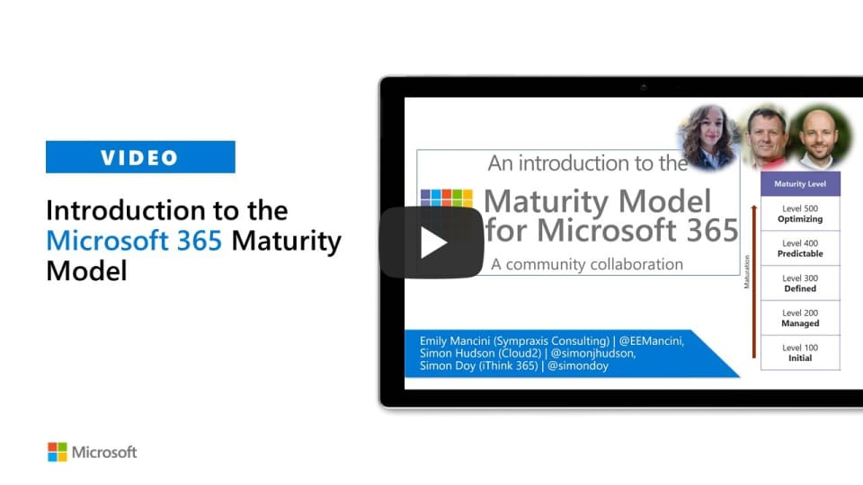

# Maturity Model for Microsoft 365 - Introduction

[!INCLUDE [content-disclaimer](includes/content-disclaimer.md)]

## Purpose

We often hear from people in the community that they know they aren't using Microsoft 365 capabilities as fully or as efficiently as they would like. Sometimes this can be an existential dread rather than a specific set of clear ideas about what is missing or what to do to work smarter.

Taking a holistic view of the technology through the lens of the Maturity Model for Microsoft 365 and gaining an understanding of current state vs. desired state can help organizations in these important ways:

- Understand and compare options for solving business problems
- Focus time, energy, and resources on the right priorities
- Identify the budget and resources needed to move ahead
- Establish a baseline to show improvement over time

## Maturity Model for Microsoft 365 summary

The Microsoft 365 platform is vast and changes rapidly, but business needs are common and slower. The Maturity Model for Microsoft 365 concentrates on defining a set of business competencies, that resonate with Microsoft 365 yet underpin real business activities. Together, the documents create a set of tools, not just information. These should allow organizations to figure out where they are in any function or department and what ‘better’ entails. Not only should the Maturity Model for Microsoft 365 not be about features, but it shouldn't be just about IT either; so we it uses common language that all sorts of business roles can understand so that everyone can use the model.

In developing a maturity model for Microsoft 365 we aimed to create a toolkit which follows a set of principles:

- Non-partisan, i.e. informed by but not driven by today’s features in any specific platform
- Led by business needs rather than technology features
- Identifies key business *and- technical competencies
- Enables organizations to evaluate the current state in a systematic and consistent way
- Applicable to various roles in the organization

## Competencies

### Published

- [Business Process](microsoft365-maturity-model--business-process.md)
- [Collaboration](microsoft365-maturity-model--collaboration.md)
- [Communication](microsoft365-maturity-model--communication.md)
- [Customization & Development](microsoft365-maturity-model--customization-and-development.md)
- [Governance, Risk, and Compliance](microsoft365-maturity-model--governance-and-compliance.md)
- [Infrastructure](microsoft365-maturity-model--infrastructure.md)
- [Management of Content](microsoft365-maturity-model--management-of-content.md)
- [People & Communities](microsoft365-maturity-model--people-and-communities-competency.md)
- [Search](microsoft365-maturity-model--search.md)
- [Staff & Training](microsoft365-maturity-model--staff-and-training.md)

### In progress

- Data & Analytics

## Maturity Levels

The 5 levels within the Maturity Model for Micorosft 365 can be summarized as:

### Level 100 - Initial

- Default, starting/exploratory state
- People driven processes, lacking documentation and discipline
- Many ways of doing the same thing (with variable results)
- Characterized by inefficient legacy approaches and pockets of un-managed innovation

#### Level 100 - Keywords

Ad hoc, reactive, uncontrolled, chaotic, unstable

### Level 200 - Managed

- Key processes defined but not standardized, uniformly or strongly applied
- Some ability to demonstrate  consistent outcomes
- Limited buy-in from staff and management
- Widespread inconsistency and resistance

#### Level 200 - Keywords

Routine, legacy, firefighting, variable, personally managed

### Level 300 - Defined

- Defined and standardized
- Signed off, managed process
- Limited validation of effectiveness, doesn’t include edge cases
- Process users demonstrate familiarity
  
#### Level 300 - Keywords

Documented, policy-driven, planned, controlled, stable

### Level 400 - Predictable

- Actively managed in accordance with agreed processes and has tracked metrics
- Effective achievement can be evidenced across a range of operational conditions
- Process has been tested and refined
- Process users demonstrate competence

#### Level 400 - Keywords

Productive, interactive, responsive, enhanced, effective, adaptable, quality

### Level 500 - Optimizing

- Deliberate and systematic process improvement/optimization
- Focus is on continually improving process performance
- Management of the processes are concerned with addressing statistical common causes of process variation and changing the process to improve process performance

#### Level 500 - Keywords

Optimal, systematic, statistical, improvement-focus, automated, assured, proactive

## What's next?

The goal of expanding the SPMM to the Microsoft 365 level is to help practitioners in the community think through how they can improve their capabilities or decide which capabilities matter most to them. These decisions should be based not just on the technology capabilities themselves, but driven by specific outcome objectives derived from the organizational strategy, possibly at a reasonably granular level as well as at the over-arching organization level.

Our goal is to apply the same core competencies that were the core of the original SharePoint Maturity Model, updated and extended to reflect the current business and technical environment. As Microsoft 365 is a much deeper and wider toolkit, the project is creating a guidance document for each competency, in a consistent format. Although these are clearly linked to Microsoft 365, we have deliberately avoided detailing particular features and functions, focusing on the business needs and processes in the competency documents. We will continue to expand the document set to drill into the technologies; provide a ‘how to’ for achieving different levels with the tools Microsoft 365 provides; and highlight some practical scenarios.  

## Resources

[Origin of the Maturity Model for Microsoft 365](microsoft365-maturity-model-origin-story.md)

[!INCLUDE [mm4m365-practitioners](includes/mm4m365-practitioners.md)]

---

**Principal authors**:

- [Marc D Anderson, MVP](https://www.linkedin.com/in/marcanderson)
- [Simon Doy](https://www.linkedin.com/in/simondoy)
- [Simon Hudson, MVP](https://www.linkedin.com/in/simonjhudson)
- [Emily Mancini, MVP, UXMC](https://www.linkedin.com/in/eemancini)
- [Sadie Van Buren](https://www.linkedin.com/in/sadalit)

---

[!INCLUDE [mm4m365-core-team](includes/mm4m365-core-team.md)]
