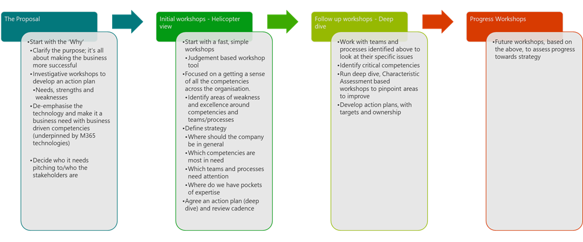
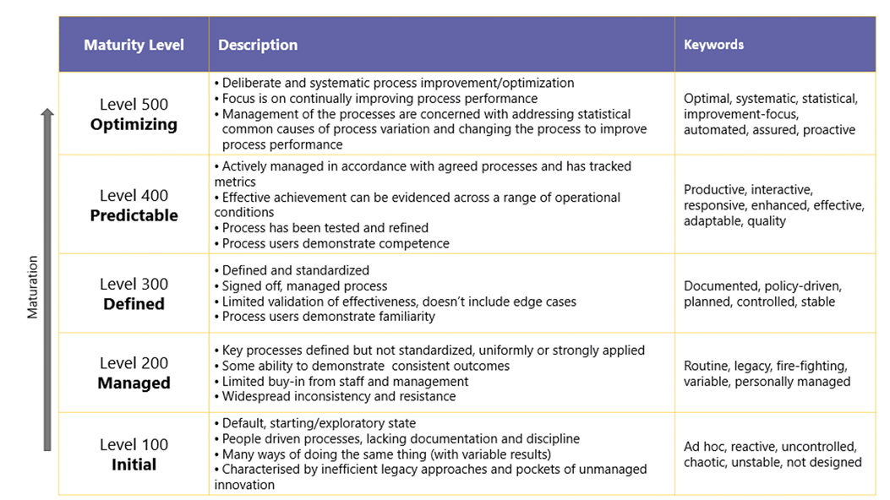

# How to run a Maturity Model for Microsoft 365 workshop

[!INCLUDE [content-disclaimer](includes/content-disclaimer.md)]

## Introduction

The Maturity Model for Microsoft 365 offers a wide set of tools, approaches and insights into the platform, allowing organizations to:

* Understand the benefit and impact that Microsoft 365 can have on their business.
* Support building a holistic view of the organization to gain an understanding of current state vs. desired state to help
* Understand and compare options for solving business problems
* Focus time, energy, and resources on the right priorities
* Establish a baseline to measure improvement over time

However, introducing the Maturity Model into an organization is often a significant challenge, requiring executive support, stakeholder buy-in and user engagement.

There are many possible approaches to doing this successfully, just as there are many approaches to the MM4M365 itself. This article describes a multi-level workshop approach that has been used successfully. It is designed to provide both a 'quick and dirty' assessment of the current and desired maturity and a more analytical and granular assessment, with an option to use either or both in your organization or practice. These are supported by tools developed for that purpose.

## Challenges when planning and running a workshop

Introducing the MM4M365 approach in any organization is a complex undertaking. It is worth bearing the following in mind:

* Microsoft 365 is HUGE, complex and addresses many different needs across different parts of the organization.
* It's difficult to know where to start, both with the platform and with the organizational needs.
* Doing everything, everywhere, if that's what your intention is, will take a long time and substantial commitment. It's a strategic change management process, not a technological first-aid dressing (though it can help with emergency improvements when needed).
* Because of the above, people can easily become overwhelmed, lose faith or lack commitment. This is compounded by an individual and/or organizational desire to run before learning to walk.
* Not everyone sees the benefit in thinking it through, establishing a base line and assessing your current position and future target before jumping in – the “Can't we just do it?” and “How hard can it be” mindset needs to be headed off before you even begin with workshops. Equally, there are those who may ask, “Wouldn't it be better to focus on what the technology can do?” instead of defining what the organization and its departments or teams need.
* Different levels of seniority/different roles and skills will have a different view. People identify needs and solutions through the lens of their own role and experience. Also be aware that staff will often defer to managers and managers to directors, rather than expressing their view.
* Some people think it's ITs job to make the company more mature (Hint. It's not)
* Every business and culture are different. This approach may work brilliantly for some and not at all for others.
* It's hard to get everyone together to do the deep dive analysis (and keep them on mission if you do).
* You don't need to be great at everything. A good rule of thumb is to be level 300 for all the functions that really matter (because they impact quality, profitability or liability), higher for critical functions (400) and allow low impact or early stage activities to start low (200) and mature when needed.

There are probably others…

## An approach

The suggested approach is to gain executive support for doing something, then run a few of simple, rapid, qualitative assessment workshops to confirm where the biggest needs are and the quickest benefits. Follow these up with deep dive workshops targeting specific competencies in particular parts of the organization. It can be helpful to think of these like an Agile sprint, where you do an assessment and action the findings, review and either repeat or move on to a different workload (a different competency or area). Where resources allow, you can run parallel 'sprints'. Keep these going until you run out of resources (or have achieved everything you desire!).

Six or 12 months later, review progress and set new goals by running some of the process again.

The diagram provides and overview and some further detail.

### Get approval and buy-in

Some thoughts on getting that important executive support and key stakeholder support:

* Start with the 'Why'. What is the purpose and vision for the change program being undertaken.
  * A good way to phrase a Purpose statement is “We will do X in order to achieve/deliver/improve Y'
  * A good way to phrase a Vision statement is “We imagine a world/organization/future where…”; for example, “We imagine our company having elegant business processes that improve the experience and effectiveness of our teams and our clients”
  * Emphasize how it makes life better for individuals in the company, how it removes the 'grit in the machine' and how it protects the organization (and thereby the execs) from financial, compliance and legal risks.
  * Carefully review the MM4M365 Introduction and the definitions of each competency. Now ensure you understand what each Competency Level signifies.

### Run investigative workshops to develop an action plan

The workshop process should start with a few quick sessions across the company, using the Quick Assessment tool.

Once you have completed these and gathered some insights, you may need to drill in deeper, using one of the Characteristic-based Deep Dive tools. This could be to:

* Help a team or department that has immature processes (200 or below)
* Upgrade a team or process that needs especially mature processes (400 or even 500)
* Address organizational weaknesses in particular competencies
* Accelerate change in some areas in response to strategy, opportunity or threat.

If you have the buy-in you could do these in multiple departments, however it's also fine to have multi-disciplinary or interdepartmental groups participate.

It is often a good plan to separate decisions makers (managers and executives) into a different group from staff and colleagues. People often are less forthright in front of senior staff.

Aim to have between 5 and 10 people in each group.

* Brief attendees in advance and ask them to bring examples of content, artifacts, issues and opportunities that they would like to have considered. Ask them to think about needs, strengths and weaknesses in their area and what they see in other areas of the organization. In their experience, what takes too long, is annoying, costly or annoys the team or their (internal and external) customers.
* De-emphasize the technology and ensure they understand it's about laying out business needs and business-driven competencies (which will later be underpinned by M365 technologies).
* Think about who you want at the sessions. There is no right or wrong approach; a blend is frequently helpful.
* Set the expectations for attendees. You want everyone to participate and be open; impress on them that there are no wrong answers or views, that it's about consensus not seniority and that you aren't promising to fix everything all at once.

### Overview Workshops

These workshops are about getting a representative group of staff to say what maturity level they think the organization is at for each Competency. It is based on the judgement of participants rather than detailed analysis if individual characteristics in each competency (as that would take far too long), and should provide a 'helicopter' or 'fifty thousand fot' view of the organization that can be used to prioritize next steps.

Aim to have at least two sessions, up to half a dozen can be instructive.

The approach is to:

* Ensure everyone understands what the maturity levels definitions and characteristics are.
* Clarify what each Competency covers.
* For each competency, discuss and reach consensus on what the overall level the company is at, by scoring each between 100 and 500.
  * It is unlikely that an absolute consensus can be reached; it is suggested that you allow fractions of a level, probably in multiples of 10. So if everyone things Collaboration is better than 200, but not quite at 300 then they can settle on 280, for example. Don't get hung up on 20 or 30 points either way.
  * It is likely that some departments are outliers, being especially mature or immature. It is suggested that you capture these outliers with an individual Competency maturity score and then put that exception to one side and try to achieve consensus again.
  * Typically, this will take a while!
* Once you have completed the 'current status' for the full set of competencies, take the workshop group through it again, but this time get them to agree where the organization should be this time next year (or some other time scale if you prefer) for each Competency. Limit them to the proper levels (100, 200, 300, 400, 500); no in between scores are allowed, but it is OK to call out specific areas that should be different from the general target.

The [Workbook - MM4M365 workshop tool (Quick assessment) Excel tool](https://view.officeapps.live.com/op/view.aspx?src=https://raw.githubusercontent.com/MicrosoftDocs/microsoft-365-community/main/Community/media/microsoft365-maturity-model--run-workshop/Workbook%2520-%2520MM4M365%2520workshop%2520tool%2520-%2520Quick%2520assessment.xlsx&wdOrigin=BROWSELINK) includes the definitions and links to the Competency documents. The Data Capture tab allows you to capture the consensus scores for each competency and allows you to run the workshop with different groups and/or focus on specific teams. It takes care of presenting the data in a set of 'radar' charts and highlights high and low performers. It also highlights and maturity improvements that should be addressed in a couple of phases. It includes further instructions on using the tool.

Take care, as the facilitator, not to impose your view on the discussion, be impartial and support the group in reaching a consensus even if it isn't one you agree with (you can comment on that in the report/action plan).

You could even run something similar with suppliers and clients if you can get them on board.

When it is complete you should do some analysis and prepare an executive summary highlighting issues, opportunities, quick wins and any insights or concerns that arise. You should give some thought to how the M365 platform could be used to address these and be ready to offer an Action Plan that could include Deep Dive workshops that might be needed.

### Deep Dive Workshops

These workshops are far more intense than the Overview workshops and are about getting very specific insights into a narrow-focused team or competency. It is impractical to run them for every competency across the entire organization.

Running these workshops can be challenging. Participants should be ready for several hours of concentration; as a facilitator you will need to keep things moving along, avoiding the debate getting bogged down on particular issues. You should elevate the discussion back to a general case any time it is in danger of getting stuck or generating significant dissent.

These sessions require review of the individual characteristic described in each Competency article to assess how mature each sub-competency is.

There are a set of workbooks that include 4 thematically related competencies each; it is not practical to put all the competencies and sub-competencies into a single sheet. They function in broadly the same way as the Quick Assessment tool; you should modify them by combining whichever competencies you need. Once again, scores are reached via consensus, but at a more granular level and you should drill into individual characteristics to confirm that the full spread of activities has been considered.

As before, outliers and comments should be captured and fed into an Action plan and report.

### Progress Workshops

It is very useful to review progress of the Action Plan and confirm that it is having the desired effect of shifting the Maturity Level. This can be done by repeating the Overview or Deep Dive workshops after an appropriate period of time, using the same workbook tools. There are radar charts that will allow progress to be visualized.

It is not essential (or even likely) that you have the same participants.

As before, use these to refine the action plan, redirect focus onto new areas of the organization, or even to celebrate success!

## Resources

* [All MM4M365 workshop tools](https://symp.info/MM4M365Tools)
* [Workbook - MM4M365 workshop tool - Content Set](https://view.officeapps.live.com/op/view.aspx?src=https://raw.githubusercontent.com/MicrosoftDocs/microsoft-365-community/main/Community/media/microsoft365-maturity-model--run-workshop/Workbook%2520-%2520MM4M365%2520workshop%2520tool%2520-%2520Content%2520Set.xlsx&wdOrigin=BROWSELINK)
* [Workbook - MM4M365 workshop tool - Hardcore Set](https://view.officeapps.live.com/op/view.aspx?src=https%3A%2F%2Fraw.githubusercontent.com%2FMicrosoftDocs%2Fmicrosoft-365-community%2Fmain%2FCommunity%2Fmedia%2Fmicrosoft365-maturity-model--run-workshop%2FWorkbook%2520-%2520MM4M365%2520workshop%2520tool%2520-%2520Hardcore%2520Set.xlsx&wdOrigin=BROWSELINK)
* [Workbook - MM4M365 workshop tool - People Set](https://view.officeapps.live.com/op/view.aspx?src=https%3A%2F%2Fraw.githubusercontent.com%2FMicrosoftDocs%2Fmicrosoft-365-community%2Fmain%2FCommunity%2Fmedia%2Fmicrosoft365-maturity-model--run-workshop%2FWorkbook%2520-%2520MM4M365%2520workshop%2520tool%2520-%2520People%2520Set.xlsx&wdOrigin=BROWSELINK)
* [Workbook - MM4M365 workshop tool - Quick Assessment](https://view.officeapps.live.com/op/view.aspx?src=https%3A%2F%2Fraw.githubusercontent.com%2FMicrosoftDocs%2Fmicrosoft-365-community%2Fmain%2FCommunity%2Fmedia%2Fmicrosoft365-maturity-model--run-workshop%2FWorkbook%2520-%2520MM4M365%2520workshop%2520tool%2520-%2520Quick%2520assessment.xlsx&wdOrigin=BROWSELINK)

---

**Principal authors**:

* [Simon Hudson, MVP](https://www.linkedin.com/in/simonjhudson/)

---

[!INCLUDE [mm4m365-core-team](includes/mm4m365-core-team.md)]
