# Performing guests reviews with Azure Identity Governance

[!INCLUDE [content-disclaimer](includes/content-disclaimer.md)]

For most organizations using Microsoft 365, guest management is simply not a "manageable" task with the tools they have. Most administrators feel ill-equipped to get a full understanding of the extent of guest access within their tenant, let alone make decisions on whether current guests and their access are still legitimate, or not. As collaboration scenarios grow in complexity, organizations mature in their usage patterns of the Microsoft 365 platform, and digital security becomes an increasingly scrutinized part of the enterprise – the challenge of managing guests is reaching a tipping point where it can no longer be ignored.

## Why review guests?

There are a host of reasons justifying the need to review an organization’s guest accounts. Some of these reasons include:

- Guests are easily "forgotten" and retain lingering access to Teams, sites, apps, and content long after they need it. This presents a significant potential security risk, especially as new users join the sites or Teams and begin to add content to sites or Teams they assumed were private.
- We often know little to nothing about guest accounts, meaning it is easy for users to share the wrong content with the wrong person. This again presents a significant possible security risk.
- Many organizations do not archive or decommission sites or Teams that are no longer active. For internal users, this amounts to noise, but for guest users who retain their access, this can have more serious consequences.
- Many guests never even redeem their invitation to collaborate with your tenant, but by virtue of being invited, they exist in your Azure Active Directory and can be selected again as a guest via search.
- Lack of controls and governance policies at the tenant or Microsoft 365 Group levels may have led guests to be inadvertently granted access to more than the sender realized.
- In the vast majority of cases, there is a lack of a "reporting structure" for guests, meaning no one within an organization is assigned the role of managing/sponsoring/overseeing a particular guest. This general lack of responsibility and accountability often means disorder.
- Even once guest policies are put in effect (e.g., Guest Group Setting in PowerShell, or Sensitivity Labels), existing guest users are left behind in these sites or Teams.

## What is required to set up a guest review process

The features discussed below require Azure Active Directory Premium P2 licenses. See the [Resources](#resources) section for more details.

## How to set up a guest review process

1. Navigate to [Portal.Azure.com](https://portal.azure.com/).

2. Under services, navigate to **Identity Governance**.  

3. Navigate to **Access Reviews** and click **New Access Review**.  
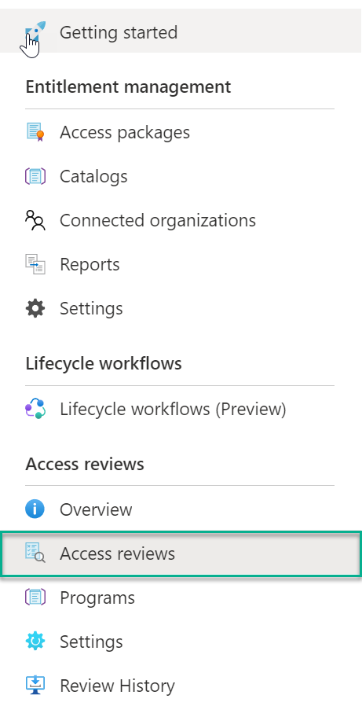

4. Under the *Review Type* tab, select the Type of Review being created (Teams + Groups, or Applications).  
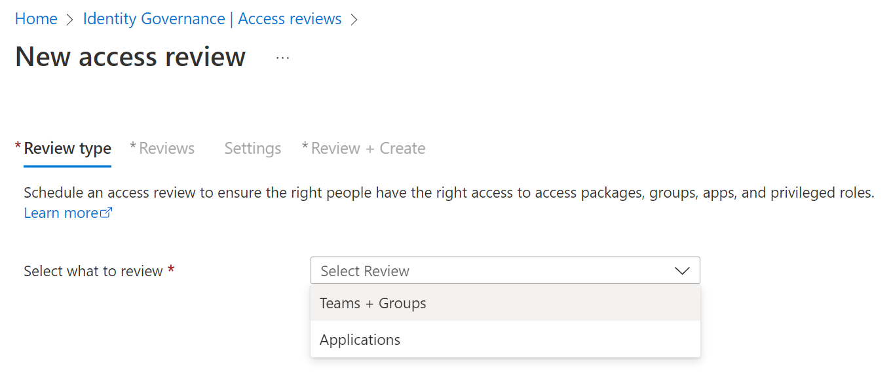

5. Configure the **Review Scope** and if desired, choose whether to include only Inactive Users and specify an inactivity day threshold (e.g., 30 days).
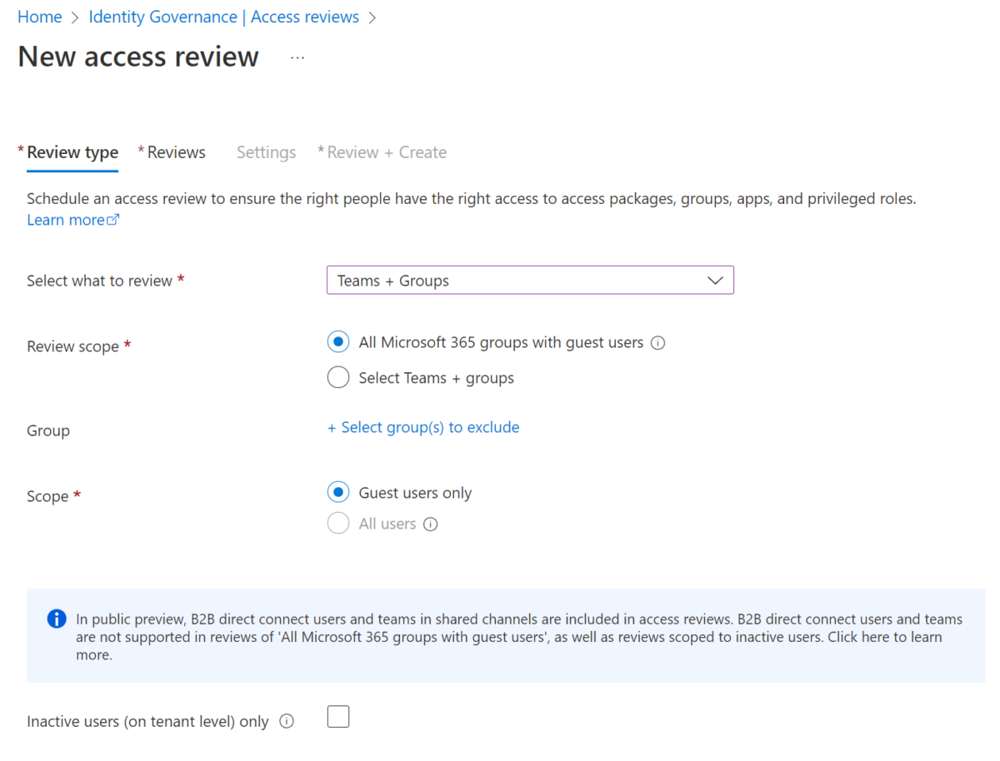

6. Under the *Reviews* tab, select the way the Reviews shall be carried out. The options below show a review beginning immediately, on all sites or Teams with Guests, and subsequently, repeat the process on a Quarterly basis. We've opted for a multi-stage review (Note: Multi-Stage access reviews are currently in Preview) where our first stage will ask Guests to perform a Self-Review, followed by a second stage performed by Team Owners. We also specify a Fallback Reviewer (Adele Vance) if a Team Owner cannot be found. You should create the review based on your governance rules.
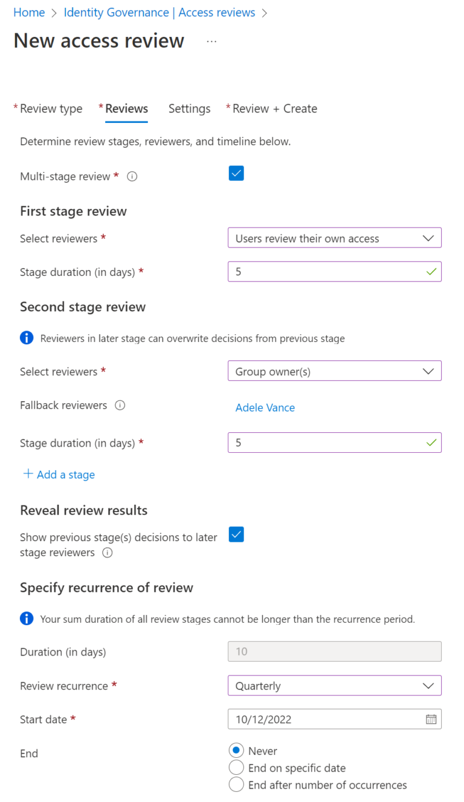

7. At the bottom of the tab, select the scenarios that can progress from Stage 1 to Stage 2. In this case, any guest who has decided during the self-review that their access can be removed need not continue to the second stage – only guests who believe they still need access or did not provide an authoritative answer should proceed to the second stage.
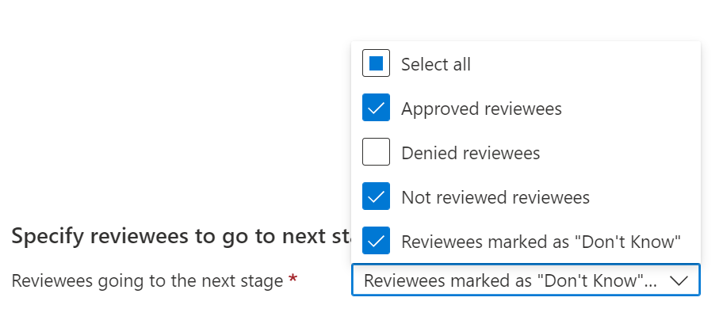

8. Under **Settings**, determine whether you wish to use 'Decision Helpers' and what should occur if reviewers do not respond to the process.
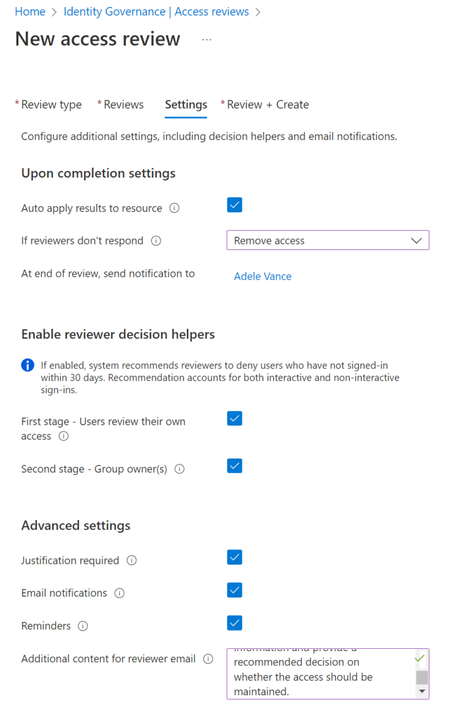

9. On the Confirmation Screen, confirm and Create the Access Review.

## What participants will receive

Participants in a guest review process will receive an email from Microsoft and direct them to the My Access portal to review the action. The user experience is not bad, but may require some adoption and change management efforts to be successful.
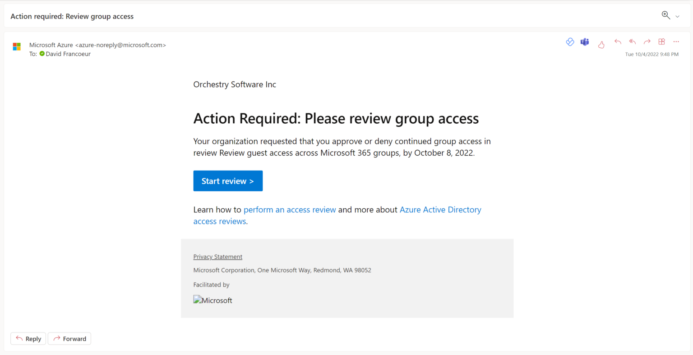
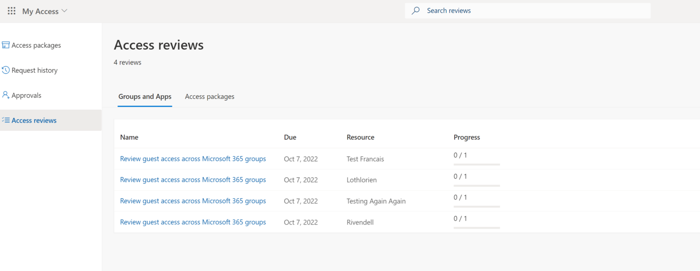
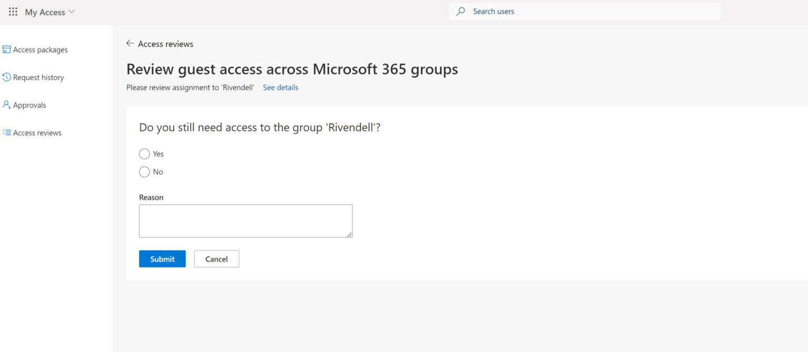
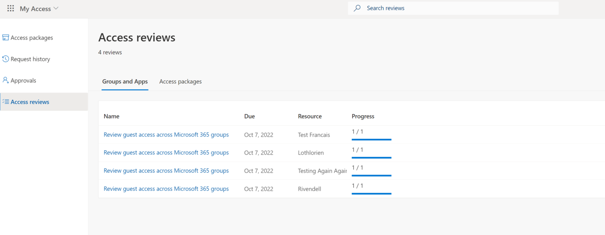

## Monitoring a guest review process

To monitor an ongoing Access Review, the Access Review can be opened, and individual groups can then be expanded. This can be cumbersome when done at scale and it is difficult to get an overall sense of individual guests and their current access reviews across the environment.
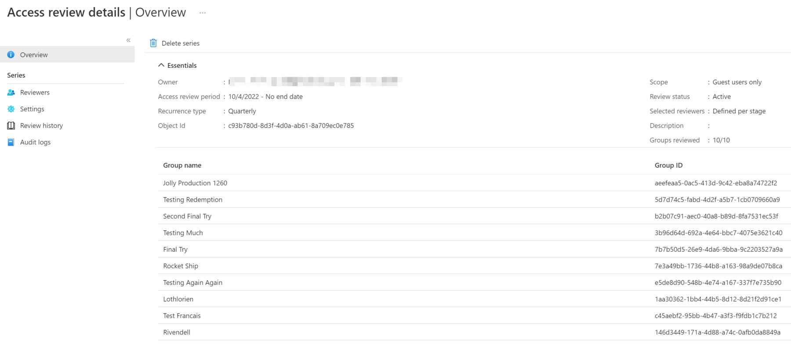
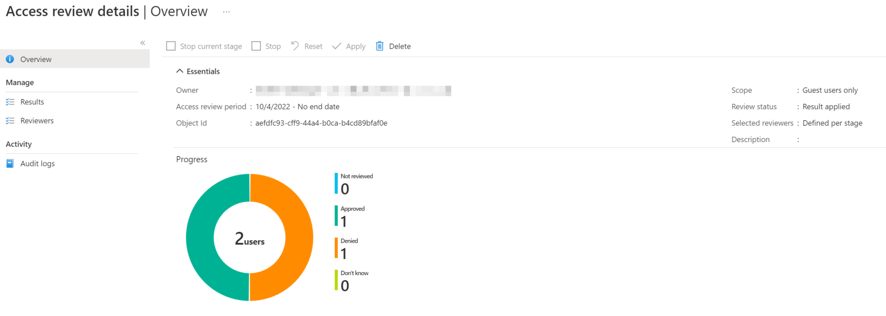
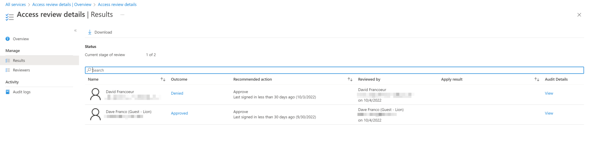
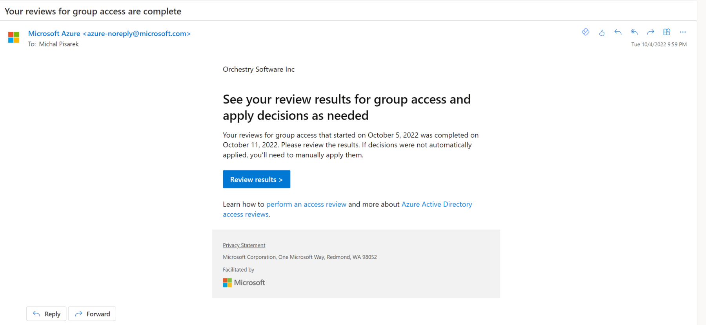

## Resources

- [What are access reviews | Microsoft Learn](/azure/active-directory/governance/access-reviews-overview)
- [MAU billing model for Azure AD External Identities | Microsoft Learn](/azure/active-directory/external-identities/external-identities-pricing).

---

**Principal author**: [David Francoeur](https://www.linkedin.com/in/dfrancoeur/)

---
