# Power Automate - Send SharePoint files as attachments

[!INCLUDE [content-disclaimer](includes/content-disclaimer.md)]

## Scenario

We have a library with a number of folders, and each of the folders contains multiple files. These files need to be sent out as attachments, when needed. There are many use cases for this capability, but the example in this article is related to contract management. As you might have guessed, these documents need to be sent as attachments outside of the company.

## What do you need

* Power Automate, standard M365 license
* SharePoint library - this could of course be a Teams connected library
* Mailbox in Exchange Online

> [!NOTE]
> If you are new to Power Automate head over to the [official documentation](/power-automate/) to learn more.

## The Steps

1. The flow is started by the user
2. The user inputs the recipient's details
3. Flow will locate the correct folder
4. Flow will collect all the files
5. Flow will add the files to an attachment array
6. Flow will send the email with the attachments

In our SharePoint team site we have a Contracts folder and inside this folder we have our partners and customers as sub-folders.

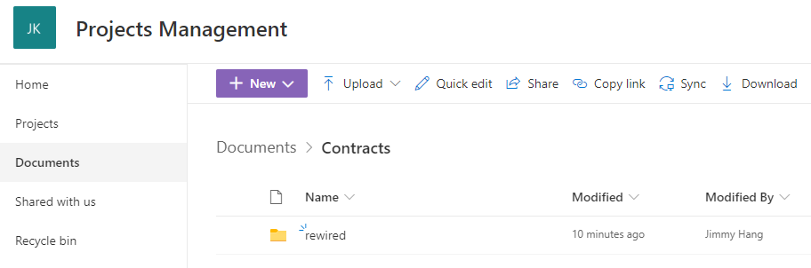

The contract files are located inside the customer/partner folder as below

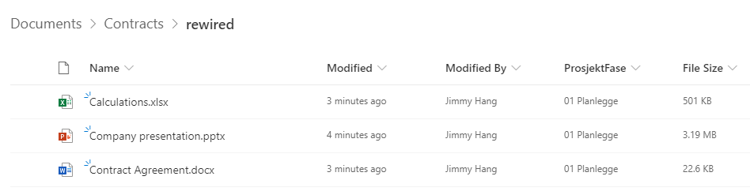

Using the library menu | click Automate | Power Automate | Create a flow

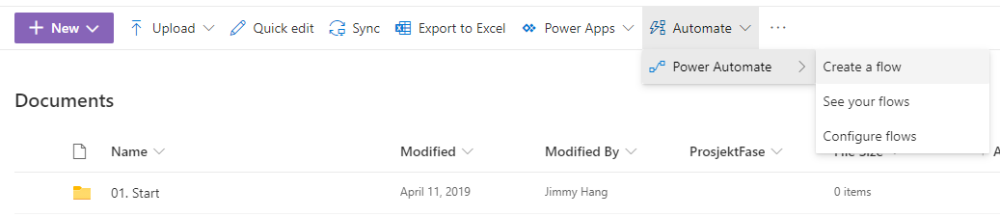

The flow we are building is an Instant Flow, so in the dialog click "See your flows" to navigate to the Flow editor page.

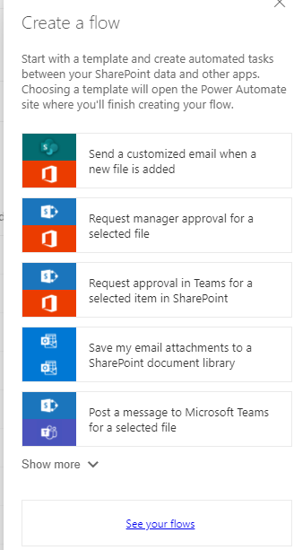

Choose to create a new flow | Instant-from blank.

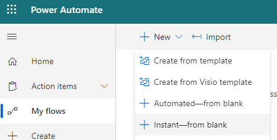

Name your flow, choose to "For a selected file" as trigger, and then click Create.

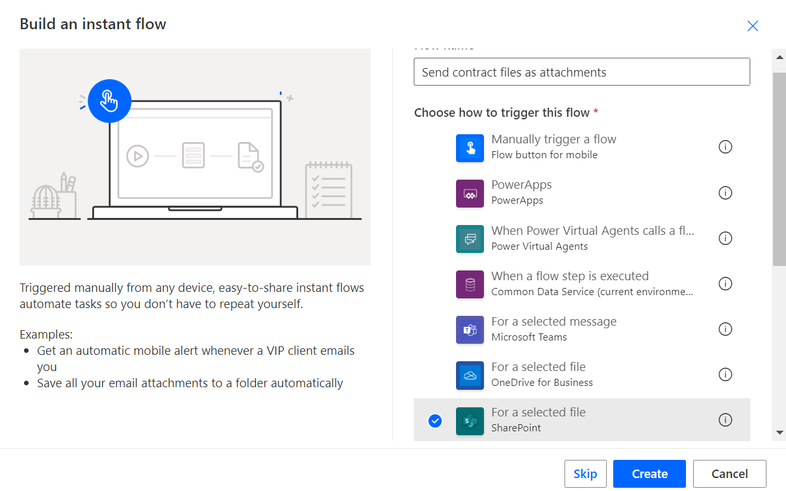

Whenever the flow runs we need some data from the end user. In this case "Recipient Name" and "Recipient Email". We will create two variables:

* Recipient Name
* Recipient Email
* FolderName | this is the folder we will grab the files from
* AttachmentsArray | this is the array where we will put all files to be sent

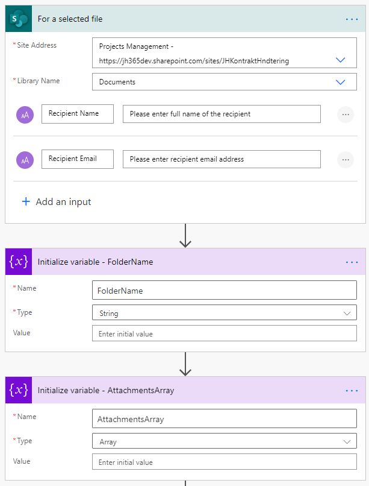

The next step is to grab the data for the item that started the flow. That way we can verify if the "item" that started the workflow is a file or a folder.

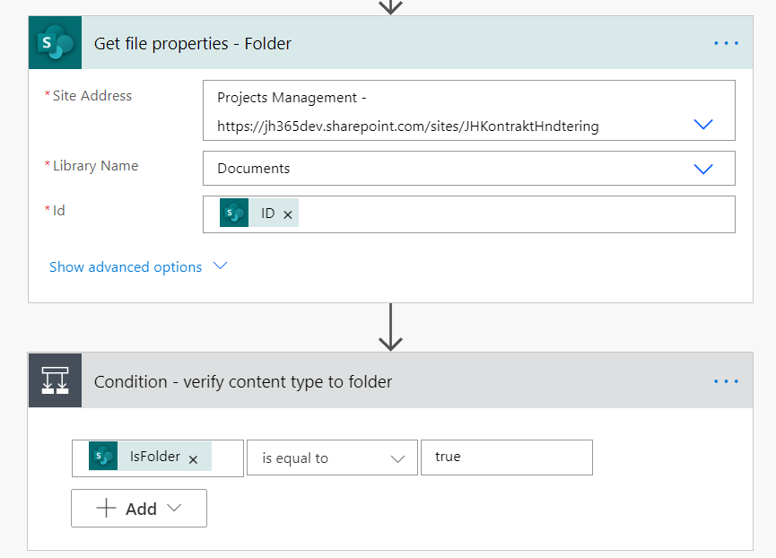

If folder is "true", we will then append the folder name to our variable "FolderName", and use this in the next action to grab all the files properties in the current folder.


We will then use "Apply to each" to append the files' content to our Attachment array variable. The trick here is to append the right content. Thanks to [this guide](https://flow.microsoft.com/blog/multiple-attachments-single-email/) at the Flow forums by Sunay Vaishnav, I finally managed to get this working.

As of this writing, the best way to append SharePoint files to an attachment array is:

``` javascript
{
  "Name": @{items('Apply_to_each')?['{FilenameWithExtension}']},
  "ContentBytes": @{body('Get_file_content')?['body']}
}
```

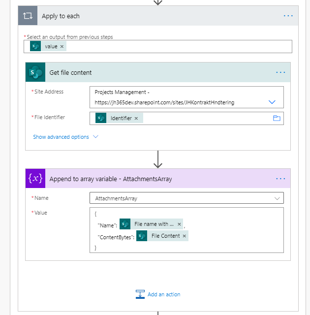

The final action is the "Send email (V2)" action. You will need to populate the action with the following inputs:

* Recipient email | user input
* Recipient name | user input
* AttachmentArray | attachments form previous step
* From (send as) | user who started the flow

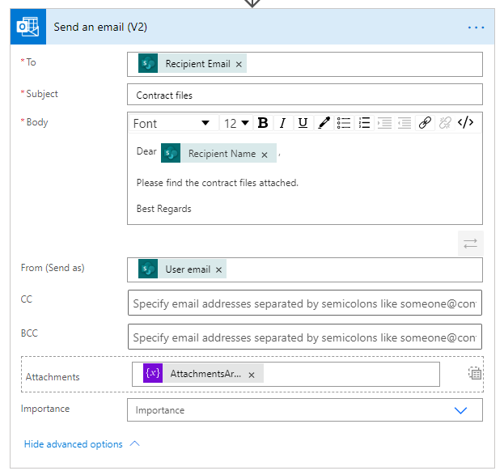

The whole Flow should look something like this:

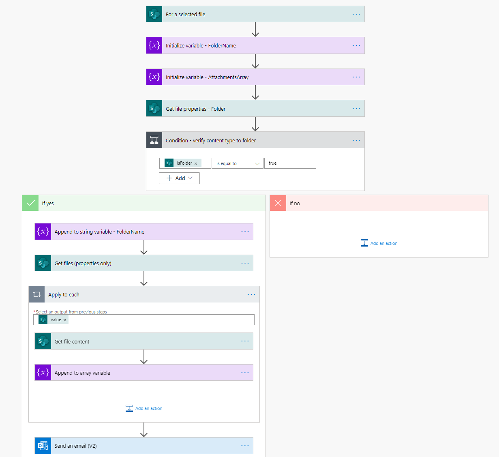

When you are all done, click Save, Test, and Share with your users

The recipient should receive an email with the files attached.

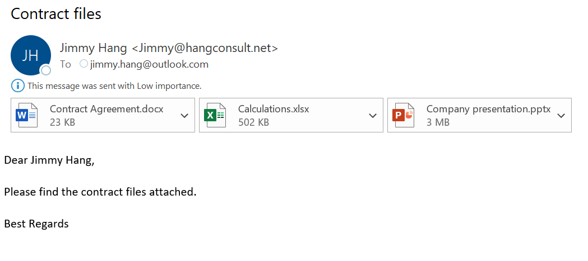

---

**Principal author**: [Jimmy Hang, MCT, MCSE: Productivity](https://www.linkedin.com/in/jimmyhang/)

---
