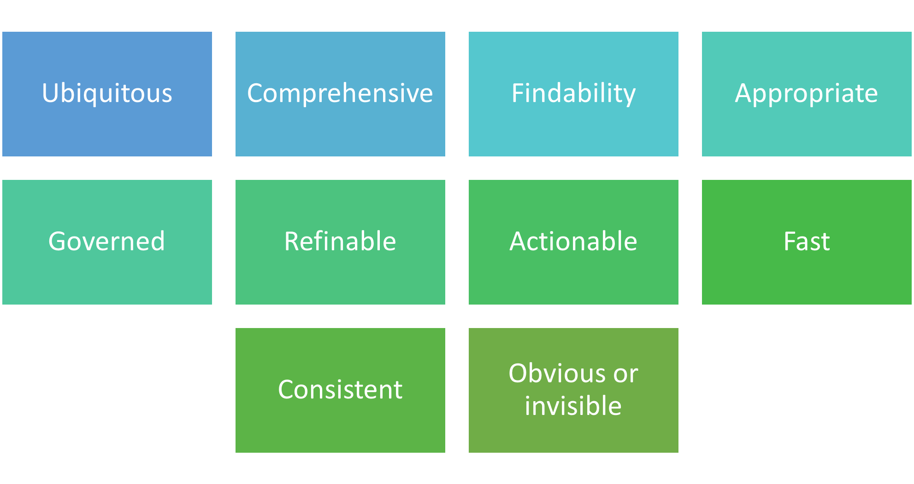

---

title: The Principles of Search – supporting the Microsoft 365 Maturity Model
ms.date: 8/25/2020
author: SimonJHudson
ms.reviewer: daisyfeller
manager: pamgreen-msft
ms.topic: article
ms.author: daisyfeller
ms.service: mssearch
localization\_priority:
description: Principles of Search as used to inform the Search Competency within the Microsoft 365 Maturity Model
ms.collection: SPCommunity

---

# Introduction - The Principles of Search

[!INCLUDE [content-disclaimer](includes/content-disclaimer.md)]

Great search should be at the heart of all corporate information systems and digital workspaces. The reason is simple, in this information age we all need far more information than any individual can hope to know about. While the human mind is a marvelous thing, it has its limitations and our memory capacity isn't so much limited as adapted for certain types of knowledge retention.; Meanwhile our organizations, industry, and society as a whole are creating new information at a rate far faster that it is possible to absorb. Not only can we not know and recall everything that is important to us, but we often don't know what we we don't know.

The paradox is that personal and organizational productivity is reliant on rapid access to current, authoritative information we need in order to make decisions or work through processes. We know we need it but we don't necessarily know _what_ it is, _where_ it is or even _if_ it exists. Good search fills in this deficiency by providing discovery tools for users; _great_ search does it by removing the burden on users to know how to search or where to search. As others have observed,

"_Great search should work like magic_"

Search relies heavily on several other competencies including cCollaboration and mManagement of cContent; without these being well managed search cannot be highly effective; mature search capabilities within the organization are built on a foundation of mature business processes.

## Why search

People search for many reasons:

- Find answers: they need to answer a question they have.
- Locate things: they know something exists, but don't know where it is. Sometimes they need to find out if information exists or what information exists; or even that something doesn't exist.
- Clarify things: they know something exists, but don't know how to adequately describe it.
- Find expertise: they need to find someone who can offer advice or skills or can do something for them.
- Simplify things: sometimes its quicker to use search to filter large amounts of 'stuff' than to browse. Sometimes pre-defined filters don't provide the options or nuances needed.
- Accelerate activities: search is frequently a more efficient of rapid means of completing a task or process.

## Search strategies

There are a wide variety of search strategies and technologies and these are evolving all the time in response to increasing diversity and volume of content in order to manage the complexity that come with these. Some strategies become ineffective or disadvantageous as complexity grows. There is a constant 'arms race' between content creation and search technology.

The human-machine interface also evolves in response to the changing nature of business and content.

## History of Search

Search, as a concept, has been around for as long as people have been storing knowledge in the form of written words. The [Pinakes](https://en.wikipedia.org/wiki/Pinakes) may well have been the 1st library index, based on the contents of the library of Alexandria around 300 BCE. With around half a million papyrus scrolls stored in the library, the great repository of knowledge already far exceeded ability of even a team of librarians to know the content. Today, even the smallest organizations have vast quantities of internal information, supplemented by externally accessible knowledge. Since the dawn of the computing age around 80 years ago, [machines have assisted](https://en.wikipedia.org/wiki/Search_engine_technology#History_of_Search_Technology) us with finding the information we need. With the advent of digitization, digital search has become the only realistic way of accessing the internal and external information at our disposal, and has become a critical capability since the turn of the Millennium. Web search started in the early 90s, arguably culminating with the release of Google. [Enterprise search](http://intranetfocus.com/a-history-of-enterprise-search-starting-out/#:~:text=Any%20history%20of%20enterprise%20search%20is%20intrinsically%20linked,written%20by%20Mark%20Sanderson%20and%20W%20Bruce%20Croft.) actually precedes this; Microsoft became active around 2001, adding search capabilities to Microsoft Office SharePoint Server, which it later spun out as the stand alone Search Server in 2008. This marked the start of Microsoft's vision for search, to break down information silos and provide a single point to search for all content across the enterprise. Even their first engine was able to search through multiple content sources including SharePoint, Exchange, Lotus Notes and File servers.

As SharePoint gained popularity so did the amount of content stored in the system. As the amount of content grew, a more sophisticated search engine was needed. In 2008, Microsoft acquired FAST, a true enterprise search product When they integrated the technology into SharePoint 2013, organizations were provided with powerful enterprise search, able to scale to large volumes of information. Further development of search integrated it into Windows desktop, many desktop and server applications and ultimately into online services, including The Bing web search engine and the search capabilities embedded across the Microsoft Graph.

You can keep up to date with Microsoft search here: [https://resources.techcommunity.microsoft.com/microsoft-search/](https://resources.techcommunity.microsoft.com/microsoft-search/)

## Principles of Search

In our thinking about the maturity model for Microsoft 365 we identified common themes, which we have worked into guiding principles for making search magical. Making search magical involves adhering to all these principles.

## Ubiquitous

Great search should be available everywhere. People should be able to elect to search in any and every application they use, on every device, regardless of their location and circumstances. They shouldn't have to go to a different place or application to conduct the search they need. Search should generally occur invisibly, wherever people are doing their day to day tasks.

**Search should be omnipresent.**

## Comprehensive

Great search should have access to everything. Whatever people need to complete their task, continue their line of thinking or make a decision should be at their fingertips regardless of where the information is stored, what application is used to create that information and regardless of who owns or manages that information, with governance caveats. The search experience should enable searching across all content in the enterprise regardless of the system that it resides in. This allows the silos of information found in different systems to be broken down. Users can find what they want without having to know which system to search.

**Search should be all-**** embracing.**

## Findability

Great search should not actually be about search at all; It should be about delivering findability. People are deeply uninterested in the search process; they just want to find the information they need.

**Search should deliver the results.**

## 

## Appropriate

Great search should understand what people mean. As far as possible, search should infer what it is that people need when they start searching (or even before). To achieve this requires an understanding of several things: the user's explicit query and also the implied query derived from the user context. This can include many things such as their location, their role, the current activities, time of day and many other profile elements. Search should offer understanding, not just indexing. By doing this, the information returned can be personalised and relevant.

 Furthermore, the way the information is presented should also be personalised and prioritised to the person's needs. The results of search should be consumable by the searcher, readily understood, and presented in a way they can quickly scan, interpret and move ahead with. Regardless of what the user is searching on, relevant results should be returned.

Equally, great search should be current. For any given piece of information, search should have an understanding of how likely the information is to have changed, its periodicity or aging rate, and index that source of information at an appropriate frequency so that people are confident at what they are offered is up to date. As content changes it is important that returned results that are fresh and include the latest changes. Search needs to awareness of the searcher, the information and its sources.

**Search needs to understand.**

## Governed

Great search should be directed and supervised. There should be a strategy to ensure that it has direction that will support the organisation. The needs of the organisation and of the users should be considered and balanced. Processes should ensure that content, indexing, scopes and reach are maintained. Content duplication should be identified and minimised. Management of Content should occur to remove clutter, update tagging and labelling, confirm security and access. Search usage should be monitored as content and business needs change, updating keywords, search terms, taxonomies, synonyms, recommended results and more. Usage patterns should be reviewed and insights from this applied.

Changes to search experiences, result weightings and scopes should be carefully considered and delivered through an appropriate review process, in a timely fashion. Metrics should be in place and acted on for all search principles.

**Search should be assured.**

## Refinable

Great search should offer precision. Scopes should limit results to the most likely based on context, but provide a way to improve precision within the search activity, expanding or constraining the search to provide the sought after domain of results. Filters, refiners, results priority and suggested improvements, related searches, signposting and recommendations should guide the user to find what they seek, but allow the user to apply their insight and judgement to this.

**Search should be guidable.**

## Actionable

Great search should lead to success. There should be mechanisms to turn search results into completed tasks with minimal user intervention. Actions, such as copying links to content, sharing findings, previewing and interacting with content, updating tags or metadata and initiating or completing business processes should be supported directly from the search experience. Often this will occur in the context of a specific application or business process, though generalised search results should offer commonly needed actions. The transition between the search experience and concluding the task that triggered the search should be seamless to the user.

**Search should be productive.**

## Fast

Great search should be immediate. There should not be an unnecessary delay in providing results, to ensure that the searcher is quickly able to complete their activity without interruption, distraction or losing the thread of what they were doing. To achieve this, results should be presented within a couple of seconds, or even before the full question has been posed.

**Search should happen at the speed of thought.**

## Consistent

Great search should be reliable and familiar. Modes of interaction should be uniform in operation and expected output, given the context of the search experience. They should repeatably serve up the expected outputs as well as any refinements, recommendations and actions.

**Search must maintain trust and confidence in what it delivers and how it delivers it.**

## Obvious or invisible

Great search should be helpful. Staff should not have to learn complex search options, or spend time carefully considering the most effective search terms and options. In fact, search should be easier than the alternatives, which might include browsing, guessing, asking someone or using a web search engine. Everyone should be able to use search and it shouldn't be a training problem. Search results should be no more complex than necessary, easy to assimilate, free of irrelevant or useless information and functionality. Search must focus on those things that helps users find or do what's needed.

Great search shouldn't feel like search at all; great User Experience (UX) often occurs when there is no User Interface (UI); it is so natural and embedded in the process that it isn't something users do, it just happens.

**Search should be effortless**

## Characteristics of magical search

- All systems and tools provide a search option, or have it embedded in the workflow.
- Searching is across all content in the enterprise regardless of the system that it resides in. Silos occur due to planned control, not technical limitations.
- Search isn't limited to files; 'things', skills, people, places, and more are included.
- Users can find what they want without having to know which system to search.
- Search is scoped for the most likely need in the current context but allow a shift to different or edge case queries.
- The process of search is similar in all systems, with familiar options, UI elements and outputs.
- Presentation of results and 'findings' are appropriate to the content discovered, include previews, formatting, actions and more based on the context.
- Users can review and refine results to find the result they need. Document content is viewable within the search results page; People can refine the findings to improve precision and confirm they have the right result.
- Indexing frequency is matched to content fluidity; as content changes results are up-to-date and include the latest changes.
- Content and search findings are actively managed, reviewed, designed, optimised.
- Security and governance are deeply embedded; search reduces rather than exposes information governance risks and data loss.
- Searching feels immediate; users maintain their engagement during a search activity.
- Extraneous information is minimised, clutter is avoided cognitive load for users is minimised.
- Related content is exposed.

---

Principal authors:

- [Simon Hudson, MVP](https://www.linkedin.com/in/simonjhudson/)
- [Simon Doy](https://www.linkedin.com/in/simondoy)