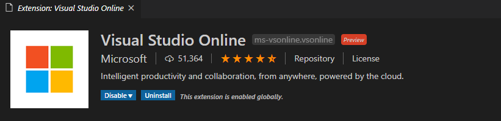
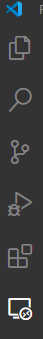
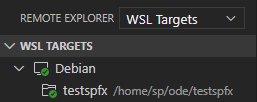

# Set up your SharePoint Framework development environment using WSL 2

[!INCLUDE [content-disclaimer](includes/content-disclaimer.md)]

The purpose of this guide is to help document the steps that are required to set-up your development environment for SharePoint Framework using WSL 2. Windows Subsystem for Linux (WSL) is a new Windows 10 feature that enables you to run native Linux command-line tools directly on Windows, increase file system performance, increase the build time of your projects and many more. 

Follow this Microsoft Docs to know what is [WSL](https://docs.microsoft.com/en-us/windows/wsl/faq)

Follow this Microsoft Docs to know about [WSL 2](https://docs.microsoft.com/en-us/windows/wsl/wsl2-about)

##### _Note_
> Follow [Installation Instructions for WSL 2](https://docs.microsoft.com/en-us/windows/wsl/wsl2-install) to install and start using WSL 2 to complete the following steps.

### Install WSL Distro from Microsoft Store

Open the Microsoft Store from your system and search for **WSL**, you will be listed with few of the Distros, choose any of the distros. Below are the most used distros

* Ubuntu 18.04 LTS
* Ubuntu 16.04 LTS
* Debian
* Alphine WSL

##### _Note_
> The steps mentioned in this guide will work for the above listed distros.

### Update and Install pre-requisites for SharePoint Framework

* Start the distro, and it will take a few minutes to complete all the initialization and updates for the first time.
* Give a username and password.
* Navigate to the root directory by typing **'cd ~'** to start the below installation.
* Execute the below command in the order to update, install curl, and bash for the SPFx setup.

```
sudo apt update

sudo apt install curl

curl -o- https://raw.githubusercontent.com/creationix/nvm/v0.34.0/install.sh | bash
```

### Install NodeJS

We will use **NVM** to install NodeJS specific, which is compatible with SharePoint Framework development and **build-essential**. Execute the below command in the given order

```
nvm install 10.18.0

sudo apt install build-essential
```

### Install Yeoman and Gulp

Yeoman provides a base template for the SPFx project with best practice and build tools.

Execute the following command to install yeoman and gulp

```
npm install -g yo gulp
```

### Install Yeoman SharePoint Generator

The SharePoint generator for yeoman will help you to create a project with a base project structure and toolchain.

Execute the following command to install yeoman SharePoint generator

```
npm install -g @microsoft/generator-sharepoint
```

### Next Steps

Visual Studio Code is mostly the open-source code editor used for SPFx development. Since we have configured WSL for our development environment, install the below extension to open the code from WSL



After the extension is installed, you can use the **WSL Targets** to choose your distro container and access the SPFx projects.





### Export and Import WSL Distro

Once the development environment is setup on the distro, you can take export the distro for the backup purpose by using the following command. 

##### Export WSL Ditro

```
wsl --export distro_name file_name.tar
```

##### Import WSL Ditro

```
wsl --import distro_name install_location file_name.tar
```

##### _Note_
> Update the following arguments before executing the above commands
> * distro_name
> * file_name
> * install_location

---

**Principal author**:[ Sudharsan K](https://windowssharepointserver.blogspot.com/)

---