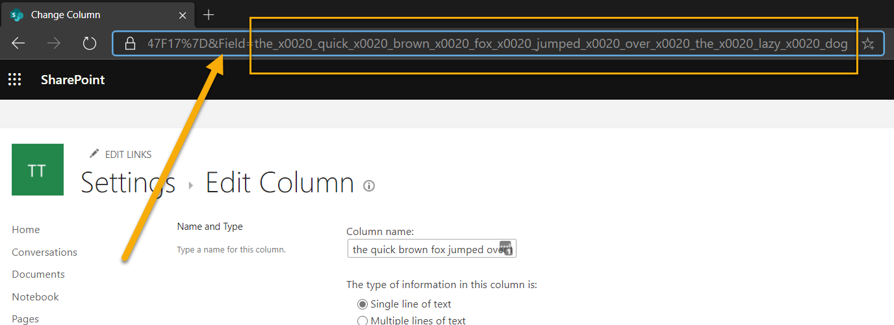
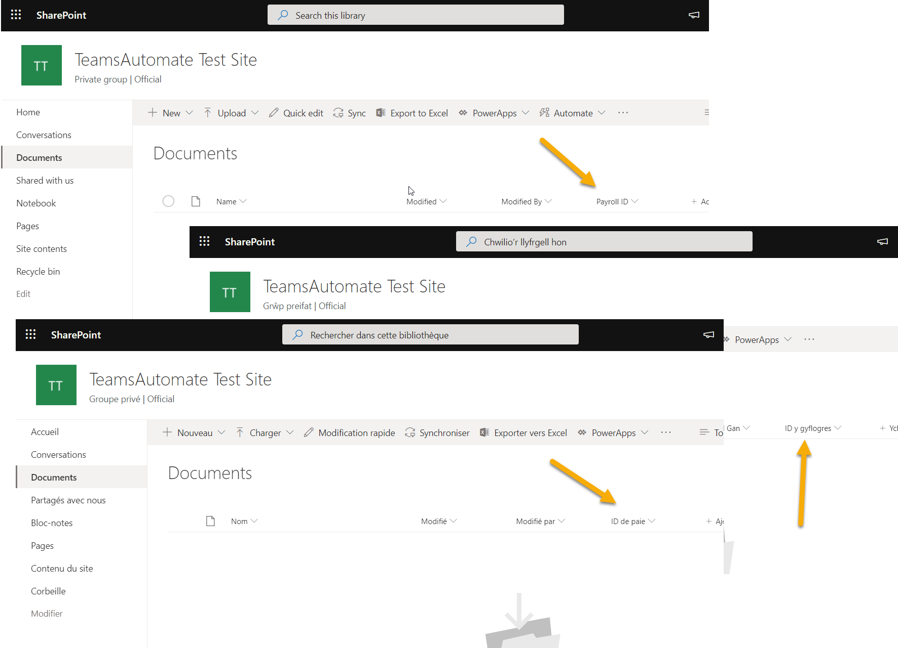
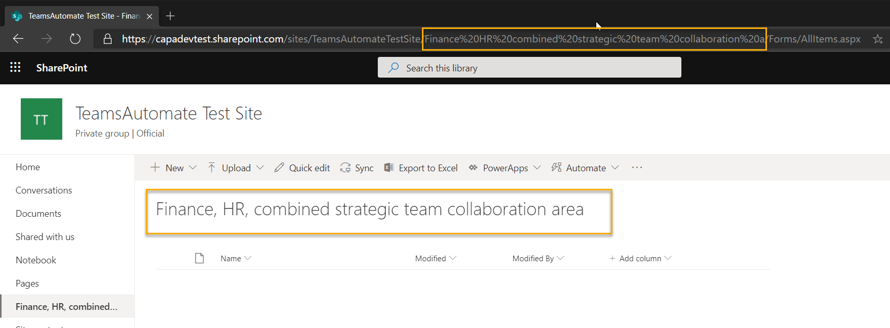

# SharePoint Naming Guidelines

[!INCLUDE [content-disclaimer](includes/content-disclaimer.md)]

This article describes some useful guidance in naming artifacts such as sites, lists, columns and content types; this helps to avoid issues later with either technical limits, adoption and best practice.

The article uses an example: an HR department requiring a SharePoint site with a set of libraries and metadata; from this, a set of examples uses this scenario.

## Basics

### Avoid highly generalized words

When naming artifacts, it is most helpful to be descriptive to the content that the artefact that is referring to on creation - this help users know what the site is for, what data they are expecting to populate, for example, avoid terms that are too generalized like "stuff", "other", "information". These words don't mean anything to the user because it lacks specific meaning and invites users to overuse or place unexpected content into the artefact.

### Use descriptions

For artifacts, there is the option to include a description; this can provide the users with more information about the location they are storing data and the type of data you require them to complete.

It might sound obvious, but this not often done, if the type of metadata isn't immediately apparent what kinds of information that might be stored, then these provide guidance to aid users to understand what this is for and what you expect them to complete - if possible provide an example.

## Column naming

Creating a column sets the following:

- Display name - when you enter a name, this is your input.
- Internal name - system reference to the column
- Multilingual alternatives for your display names.

### Display Names

Display names are the visual name that users see when working with list items or documents via forms and views. When working with these columns, on top of the basic recommendations list above, consider the following:

- Be clear on what this column represents; you know what you want to capture as metadata, the user of the item may not.
- If you use abbreviations, expand the meaning in the description to ensure the user understands the data
- If the title refers to the data type of the information, ensure the column data type reflects this, e.g. Number of Widgets, the data type is number not string.

### Internal Names

In SharePoint columns, typically have multiple representations of their name, typically the Display Name and the Internal Name are the most commonly used.

Internal names are set once at the point of creation; you cannot change them later. Additionally, Internal names encode special characters in your display name including spaces not in the same way as URLs, they use a combination of underscores and x0 numbers to represent the character, for example:

e.g **\_x0020\_** for " " or **\_x003a\_** for ":"

For example, "HR Department" would encode to "HR_x0020_Department". While this isn't necessarily essential for the end-user to know, it is essential to bear in mind when working with CAML or making API calls, as most often these are used to reference fields.

You can easily find out the internal name by editing an existing column and viewing the last parameter for the URL, e.g. &Field=the_x0020_quick_x0020_brown_x0020_fox...

In classic interfaces, I often create the column without spaces and special characters to avoid the encoding, then rename to a friendly format. On creating lookup fields, there are some unavoidable encoding for the colon and spaces between the field

Modern interfaces remove spaces when users with edit permissions add columns to lists or libraries.

Internal names are limited to a specific length up to 255 Characters in SharePoint Online.

### Multilingual Display Names

Multilingual display names are stored as title resources within the field. Under the hood, this sets the title resource for the current language in which you created this column, e.g. Payroll ID.

If you change your language preference by using the user profile service, to specify your preferred language and then rename the column, this sets this for that language. For example, in English Payroll ID becomes "ID y gyflogres" in Welsh, or "ID de paie" in French. Note: Bing Translator for illustration.

## List and Library Naming

With naming lists or libraries in the modern interface, be aware of the titles you are giving the libraries, for example, in the screenshot below, I have created a library called "Finance, HR, combined strategic team collaboration area", there are a few factors to consider:

- The URL gets encoded to: "Finance%20HR%20combined%20strategic%20team%20collaboration%20a"
- Without the encoding:"/sites/Team/**Finance HR combined strategic team collaboration a**/Forms/AllItems.aspx"
- There is a maximum length for the URL part of the library to be: 62 characters

`*https://test.sharepoint.com/sites/Tean/Finance%20HR%20combined%20strategic%20team%20collaboration%20a/Forms/AllItems.aspx*`

When naming your libraries, points to consider:

- Using short names or setting titles with characters and spaces in mind: **finance-hr-combined-strategic-team-collaboration-area**
- Remove any unnecessary or noise words such as area, team, combined; this keeps the URL shorter: **finance-hr-strategic-collaboration**
- Once created, you can rename the title to be in the originally descriptive manner with a clean URL.
- URL length is a premium, your tenant organization name, site URL, library URL all lower the amount of URL space remaining for folders and document titles.

---

**Principal author**: [Paul Bullock](https://www.linkedin.com/in/pkbullock)
