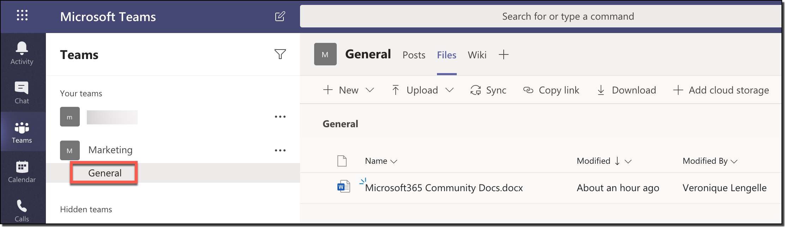
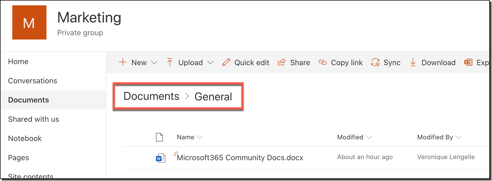

# Should I store my files in Microsoft Teams or in SharePoint? An understanding of behind the scenes

[!INCLUDE [content-disclaimer](includes/content-disclaimer.md)]

To use a product efficiently, it's important to understand a minimum about it. What it does, what can you do with it, what are the limitations, etc.

[Microsoft Teams](https://products.office.com/microsoft-teams/group-chat-software) is the hub for teamwork. It allows for collaboration, chat, calls, meetings, and so much more!
[SharePoint Online](https://products.office.com/sharepoint/collaboration) is _primarily_ a document management and intranet platform where you store, collaborate, and share information seamlessly across the organization, and is also part of Microsoft 365.

Note the key word here being **collaboration**. So it's no surprise that they would interact with each other in some way.

## What's the relationship between the two?

Every time you create a new _Team_, the following are also created in the background:

- Microsoft 365 Group (ex Office 365 Group)
- **SharePoint Online site**
- Exchange Online shared mailbox & calendar
- OneNote notebook
- Other services like Power BI, Planner.

As you can see above, a site is created to store your documents. Meaning that each time you share files in a Team, they are stored in the associated site in SharePoint! **Not** in Microsoft Teams.

> _Note: Files shared in private chats will be stored in the sender's OneDrive for Business._

## But where are my files exactly?

The exact location depends on which Team channel you share(d) them in. By default, there's a _General_ channel (which can't be deleted), and the files shared in this channel will be stored in the SharePoint site, in the _Documents_ library, within the _General_ folder. If you create a Team channel called "Project A", files shared in this channel will be stored in SharePoint under the folder called "Project A", and so on...

_This applies to 'Standard' channels. Private channels have a different architecture which consists in having a separate site with different permissions from the Team. More information is available on the official Microsoft documentation: [Private Channels in Microsoft Teams](/microsoftteams/private-channels)_.

>_Terminology is also important. A **channel name** in Microsoft Teams will have the same **folder name** in the associated SharePoint site under the 'Documents' library_.

## How do I access my files?

There are different ways to access your files. Within Microsoft Teams, or via SharePoint Online. All depends on which interface you feel the most comfortable with. Of course, if you need to do more with your files (i.e.: advanced settings) then you'll need to go into SharePoint.

**Accessing via Microsoft Teams**
You can access your files by navigating into the channel, on the tab at the top called _Files_. Here, will be listed all the files, folders, and other documents.
The interface is "almost" similar to SharePoint. At the top, you can create new files, upload files, download files, etc.

Another way from Microsoft Teams would be to open the associated site directly.
If you are in the _Posts_ tab of a channel, click on the ellipses (...) on the top right corner under your profile picture, and select **Open in SharePoint**. You'll then be redirected to the folder containing your files/documents.

In case you only want to open a specific file, this is also possible.
This time, navigate to the _Files_ tab of the channel, click on the ellipses (...) next to the file itself, and select **Open in SharePoint**. Although you'd think it would filter the view for only that document, but unfortunately it doesn't.

**Accessing via SharePoint Online**
If you feel comfortable in using the SharePoint Online interface, feel free to go directly to the site. The common URL is structured like this: `https://<tenant-name>.sharepoint.com/sites/<Team-name>/Shared%20Documents/<channel-name>`

The site should also appear in your SharePoint home page, along with all the other sites you have access to.

## Who can access or see my files?

As with all content in Microsoft 365, _security trimming_ applies to these files. Users can view and search only content they have access to, which is totally respected between Microsoft Teams and SharePoint Online. Therefore, when you add or remove users from a Team, their access is also added or removed from the SharePoint site.

## Are my changes reflected?

Yes. Wherever you are making changes to files and documents, they are saved. And you always have the latest version of the document, whether you are in Microsoft Teams or in SharePoint Online.

---

**Principal author**: [Veronique Lengelle, MVP](https://www.linkedin.com/in/veronique-lengelle-48a71b31)

