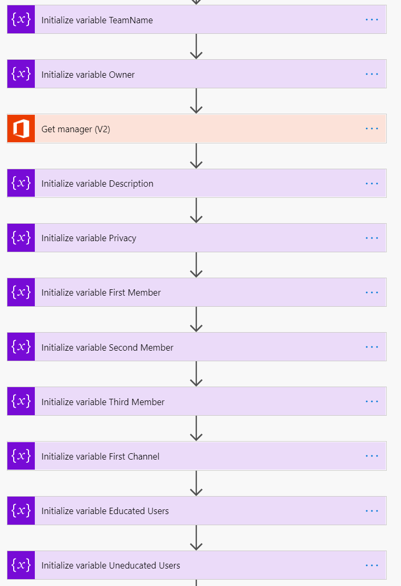
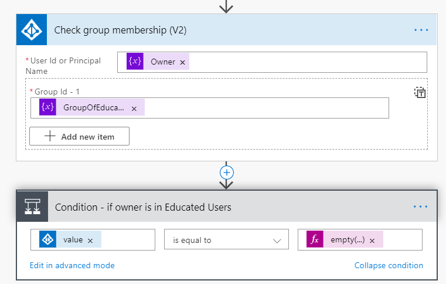
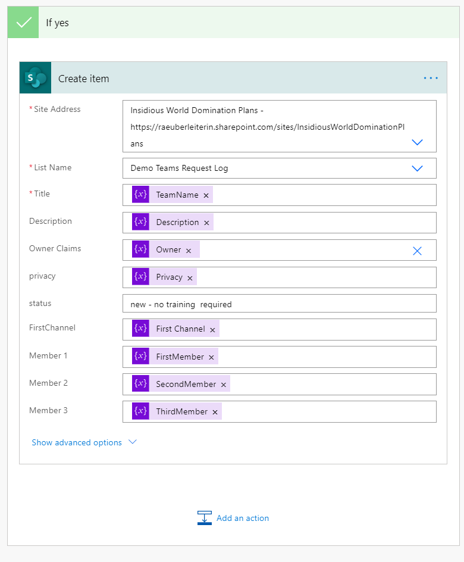
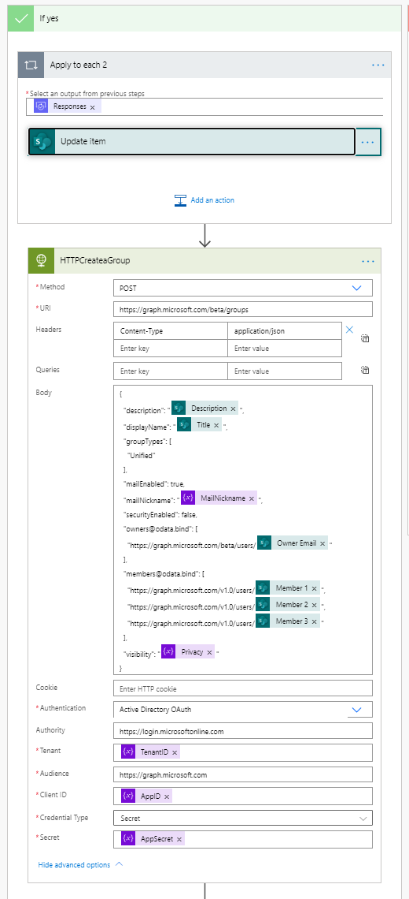

# Should everyone create Teams? A Low Code Provisioning solution

[!INCLUDE [content-disclaimer](includes/content-disclaimer.md)]

This article shall shed a light on two aspects of Modern Workplace: Microsoft Teams Provisioning using a low-code solution while ensuring that Teams Owners are digitally literate enough to be responsible owners.

Uncle Ben was right: With great power comes great responsibility. If we give users great tools with great power, we also need to make sure to properly skill them up. We also need a lean process to deal with common asks.

Everyone wants to work with Teams, as it provides us the collaborative workplace we need to be able to work from anywhere. And with Teams comes the relatively new concept (at least for an end-user) of ownership. Owning a Team empowers users to determine how they want to collaborate, but we should also enable users to make wise decisions so they are literate enough to understand the implications.

Just blocking Microsoft 365 Groups / Teams creation and having an established approval process owned by IT won't meet business needs. Your users will work around that and find shadow IT solutions. Yet allowing everyone to create Groups and Teams will lead to over adoption: too many Teams which should be channels, too many channels which should be chats.

The key therefore is to balance these extremes.

## Solution Overview

A user asks a chatbot for a new Team in natural language. A Power Automate flow picks up this information and checks if the user is already in an Azure AD security group called Educated Users. If the owner to be is already a member in this Educated Users security group, a second Power Automate flow gets the manager's approval and provisions the team. If the user is not a member of this group, the user will be invited for training and testing.

If the user passes the tests, he/she will be added to the group of Educated Users (which means that for the next Team request, he/she doesn't need to pass a test again) and the second flow gets the manager's approval and provisions the Team.

If the user doesn't pass the test OR if the manager doesn't approve, notifications will be sent and the process ends.

## What we need to build before we do the Chatbot

- 2 Security Groups in Azure AD: Educated Users and Uneducated Users
- Events for training in a calendar
- Form for training session invitations in Microsoft Forms
- Flow to send session invitations
- Form to test users
- Flow to log tests in a SharePoint list
- SharePoint list to calculate the result with a few calculated columns
- SharePoint list to log all teams requests

### 2 Security Groups in Azure AD

Go to portal.azure.com, click on GROUPS and then on NEW GROUP. Give the group names like "Educated" and "Uneducated".  Assign your users to the groups. By default, all users should be in the group of Uneducated Users.

### Form for training session invitations in Microsoft Forms

Go to forms.microsoft.com and set up a form to ask which training sessions the user wants to attend.

### Flow to send session invitations

Go to [make.powerautomate.com](https://make.powerautomate.com) and create a new flow without a template. Use the "When a new response is submitted" trigger from Forms, then the  "Get the response details" of the form add a filter query to get the right event from the calendar, then update the event by adding the user to it.

### Form to test users

Forms is able to do surveys (there are no correct answers) and quizzes (there ARE correct answers). Unfortunately, you can't use the score of a quiz in Power Automate to see if a user has passed the test. Therefore, create a normal survey and use a SharePoint list to calculate the result of the test.

### SharePoint list to calculate the result with a few calculated columns

Create a new list in SharePoint with these columns:

- Title
- Given answer 1
- Correct answer 1
- Given answer 2
- Correct answer 2
- is answer 1 correct
- is answer 2 correct
- Total score
- Result

For the calculated columns enter the following information in the **Formula** box.

- **is answer 1 correct:** =IF([Given answer 1])=[Correct answer 1],"5","0")
- **is answer 2 correct:** =IF([Given answer 2])=[Correct answer 2],"5","0")
- **Total score:** =[is answer 1 correct]+[is answer 2 correct]
- **Result:** =IF[Total score]<10,"not educated","educated")

Choose **Number** as the data type for the first three, and **Single line of text** as the data type for Result.

### Flow to log tests in a SharePoint list

This Power Automate flow creates items in our SharePoint list. Go to [make.powerautomate.com](https://make.powerautomate.com) and click TEMPLATES, search for the "Record form responses in SharePoint" template.

### SharePoint list to log Teams requests

Create a new list and add columns Teamname, Description, Owner, Privacy, Status, etc.

## Chatbot in Power Virtual Agents

We will now:

- create a  ChatBot in Power Virtual Agent (PVA)
- create a Power Automate flow that's called from PVA
- create a 2nd Power Automate flow to provision a Team based on the information we got out of the first flow
- add our bot as an App to Teams to publish it

### Create a Bot in Power Virtual Agent

Go to [Power Virtual Agents](https://powerva.microsoft.com) to create a new bot. Create a new topic and enter some trigger phrases. Don't try to be too formal: the chatbot supports natural language understanding powered by LUIS.

Outline the conversation in the Authoring Canvas. Ask all the questions we need to have answered to provision a Team like: team name, description, owner, and visibility. You can also ask for the first members or channel names. Save all inputs as Variables and give them easily recognizable names like VarOwner or VarTeamName.

### A flow that's called from PVA

Click on the + sign to create the next node after your last question / message in Power Virtual Agent and click on CALL AN ACTION and then CREATE A FLOW

The PVA template will open up in a new browser tab. Save this template with a new name.

Initialize your variables for all the information the user gives us so we can provision the team: team name, description, privacy, owner, members and first channel.

After we took care of all variables we need to check the group membership of our owner.

The CHECK GROUP MEMBERSHIP action returns the string of the Group ID if a user is a member of the group and will return NULL if the user isn't member of that group.

Expression: `empty(null)`

If he/she is in the educated group, we can just log the request in the SharePoint list we already prepared.

If the user is still in the Uneducated Group, we need to invite him/her to a training and test him/her (and wait a bit so he/she can complete this).

To invite the user to the training and link him/her to the test, we can use Adaptive Cards. If you never used Adaptive Cards before, just go to [Adaptive Cards](https://adaptivecards.io/designer), select MICROSOFT TEAMS as host applications and replace the text of one of the samples with your text in the visual editor. Below, the Designer auto generates some JSON for you — copy-paste this into a POST YOUR OWN ADAPTIVE CARD AS A FLOW BOT TO A USER action.

This is how our card looks then:

The clickable buttons link directly to the forms for training sessions (remember, we already built a flow to invite users automatically!) and the quiz (yet again, our flow logs the answers and SharePoint calculates the result for us!)

Now we need to know if the user passed the test:

If the user passes the test, he/she will be added to the Educated Group and we log the request in SharePoint. If the user doesn't pass, we will just send notifications and end the process.

### Create a 2nd flow to provision a Team based on the information we got out of the first flow

**Microsoft Graph**
Power Automate doesn't provide an action "Create a Team". Therefore, we will call Microsoft Graph to create teams, add members, create channels, and a lot more, but we first need to authenticate to make this magic happen.

### Register an app in Azure AD

Go to portal.azure.com and click on APP REGISTRATIONS, and click NEW REGISTRATION. Give it a name and save the ID of your tenant and the ID of our App (Client) After that, click on API PERMISSIONS (use APPLICATION) and select MICROSOFT GRAPH. We need to add the `Group.Read.Write.All` permission and grant admin consent for that as well.

To make it work, we also need an App Secret. Please, save this. In this minimal viable product, I just saved it in a variable, better to use Key Vault for that. Regardless where we store the App Secret: You only have ONE chance to save it, as soon as you leave this blade, you can't see it anymore.

### This is what you need to do in the 2nd flow in Power Automate

Your trigger is WHEN A NEW ITEM IS CREATED (remember, the PVA flow will end with this action, so basically, the PVA flow kicks off our second flow).

Now we need to initialize the following variables:

- Tenant ID, App ID, App Secret are strings and we get all these IDs out of the app registration of the previous step
- Group ID is a string as well but is empty for now
- I was so tired of typing the Graph URL over and over that I put it into a var as well — this is optional
- We will later need the MailNickname to provision the Team.Mailnickname is the Displayname of the Team WITHOUT spaces. Use the replace expression: `replace(DISPLAYNAME," ","")` which just means, replace all spaces with nothing.

### Manager's Approval

We will again create an Adaptive Card for this:

Depending on the outcome we let Microsoft Graph create first a group and then update it to a team or we will end the process if the manager doesn't approve. Here is what happens if the Outcome is not Approved:

We update our SharePoint list (status is now rejected) and we post another Adaptive Card to our user to inform him/her and terminate the process.

If the Outcome of the Approval is Approved, we need to update our List as well and add an HTTP Call to first create a Group:

As we do not only want a Microsoft 365 Group but also a Team based on that group, we need the Group ID. To get this ID (remember, we initialized an empty var for that already!), we need the parse JSON action and set our Group ID var to that value:

Now it's time to use another two HTTP calls for creating the Team and adding the channel:

Please keep in mind to expand the SHOW ADVANCED OPTIONS and enter all authentication information as shown in the Create a group step. Now update your SharePoint list (status is no created) and inform your user with another Adaptive Card in Teams:

### Publish our Bot & add it as an App in Teams

To publish your Bot, just click on PUBLISH in PVA and choose Microsoft Teams as Channel. Copy the APP ID and open App Studio in Teams, where you can create apps. Paste in this App ID and fill in Name, Description, and some links for your privacy statement and terms of use. As valid Domain use token.botframework.com. Download your app as a package and then install it from Teams App Catalogue.

This is our result as a gif:

**Coming back to the purpose of solutions like this:**

The goal is to enable users and to give them great powers! We now have an easily maintainable solution for IT and a very lean process for the business side of a company to request common asks. We are more efficient as we only need to involve human working time if needed. We don't need to spend lots of time to make users adopt this system as the interface is easy to understand even for users who are not that tech-savvy, plus we have a good chance to narrow the historical gap between business and IT. It's a #BetterTogether story.

If you don't like the chatbot approach, you can also work with a request form in Microsoft Forms or with Power Apps if you prefer another UI.

## A few words on licensing

Licensing for this solution isn't covered by Microsoft 365 E3 or E5 subscription:

- The HTTP connector is a Premium connector and requires therefore a Power Automate Standalone Plan [Learn more about Power Platform licensing.](/power-platform/admin/powerapps-flow-licensing-faq)
- Power Virtual Agents needs to be purchased separately, [more info here](https://powervirtualagents.microsoft.com/pricing/)
- If you use a Power Apps Canvas App instead of Power Virtual Agents, you will still need a Standalone License because of the HTTP connector.

---

**Principal author**: [Luise Freese](https://www.linkedin.com/in/luisefreese/)

---
