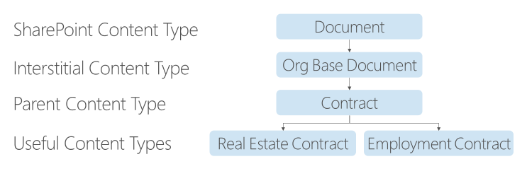

# Taking Advantage of the Content Type Inheritance Model in SharePoint

[!INCLUDE [content-disclaimer](includes/content-disclaimer.md)]

Taking advantage of the Content Type hierarchy is an important part of a powerful information architecture, regardless whether you're working with documents, list items, pages, etc.

Let's use this example to illustrate the points:

SharePoint gives us the ___Document__ Content Type "out of the box". Every Document Library you create in SharePoint (assuming you don't use some fancy template) has the __Document__ Content Type enabled for it. So many people just start dumping their files into the Documents (aka Shared Documents) library with every file becoming a __Document__ and then wonder why no magic is happening.

In the example above, we have two [interstitial](https://www.dictionary.com/browse/interstice) Content Types. (Interstitial - or interstices - means spaces between things.) We can create these interstitial Content Types, but never enable them in a Document Library; they generally only exist to create a strong content hierarchy.

- __Org Base Document__ - When you start setting up the information architecture in a tenant, it makes sense to create a Content Type like this, usually putting the name of the organization in place of "Org". You may never touch this Content Type again after you create it, but it really comes in handy when someone says something like, "let's add X to ALL our custom Content Types".
- __Contract__ - This is also a Content Type which we may not ever enable in a Document Library, but it allows us to search for Content Types which inherit from it.

Most of the time, you'll want to create __Org Base Document__ and __Contract__ at the tenant level (in the Content Type Hub, via the Content Type Gallery in the SharePoint Admin Center). We use that enterprise level capability for Content Types which *may* be used in one or more sites. It gives us a central place to manage our information architecture - where it makes sense to do so. Since we're going to inherit from __Org Base Document__ for all the custom __Document__-derived Content Types, we create it at the tenant level.

When we set up a custom Content Type and inherit from an existing Content Type, there's a brilliant logic under the covers. The out of the box __Document__ Content Type at the tenant level has its `ContentTypeId=0x0101`. `0x0101` represents a __Document__ in every tenant. (See: [Base Content Type Hierarchy](/previous-versions/office/developer/sharepoint-2010/ms452896(v=office.14)) for the full list of base Content Types in SharePoint.)

When we create the __Org Base Document__ Content Type in the Content Type Gallery, it gets a `ContentTypeId` which starts with `0x0101` and then has a unique GUID-like part. Here is an example full hierarchy tree for the Content Types with their `ContentTypeIds` in a tenant. (Your actual `ContentTypeIds` will vary.)

| Content Type | Inherits from | ContentTypeId |
|---|---|---|
| Item | \[System\] | `0x01` |
| Document | Item | `0x0101` |
| Org Base Document | Document | `0x0101002FBDBE6A1A315F438E41F10681463A61` |
| Contract | Org Base Document | `0x0101002FBDBE6A1A315F438E41F10681463A6101` |
| Employment Contract | Contract | `0x0101002FBDBE6A1A315F438E41F10681463A610101` |
| Real Estate Contract | Contract | `0x0101002FBDBE6A1A315F438E41F10681463A610102` |

As you can see, the inheritance model makes a lot of sense. Each inheritance appends something unique to the `ContentTypeId`. Once we've enabled the appropriate Content Types in Document Libraries (in this case), we can take advantage of the hierarchy using queries like:

| Intent | Query |
|---|---|
| Show me all my custom Content Type -based documents | `ContentTypeId:0x0101002FBDBE6A1A315F438E41F10681463A61*` |
| Show me all the Contracts | `ContentTypeId:0x0101002FBDBE6A1A315F438E41F10681463A6101*` |
| Show me all the Employment Contracts | `ContentTypeId:0x0101002FBDBE6A1A315F438E41F10681463A610101*` |

__Show me all the Contracts__ is the really powerful query here. By requesting all content with a `ContentTypeId` which __*starts with*__ the __Contract__ Content Type's `ContentTypeId` (That's what the asterisk does for us.), it doesn't matter if we create a new Content Type inheriting from __Contract__. The query will automagically continue to do what we want because the next Content Type inheriting from __Contract__ will have a `ContentTypeId` of `0x0101002FBDBE6A1A315F438E41F10681463A610103`. In other words, the `ContentTypeId:0x0101002FBDBE6A1A315F438E41F10681463A6101*` query will just pick that new content up for us without any adjustment.

Pair this good information architecture with the [PnP Modern Search](https://microsoft-search.github.io/pnp-modern-search/) Web Parts, and you can build search-driven experiences which are highly specific, easily maintained, and extremely reliable. This is NOT "just Google". It's you building solutions to match the user stories and content needs in YOUR organization. If you extrapolate from these examples, you probably can imagine some potential hierarchies in your information architecture which may help you create more powerful solutions for your end users.

---

Principal author: [Marc D Anderson, MVP](https://www.linkedin.com/in/marcanderson)
