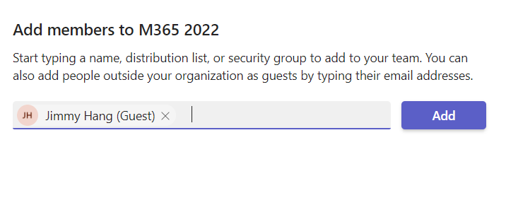
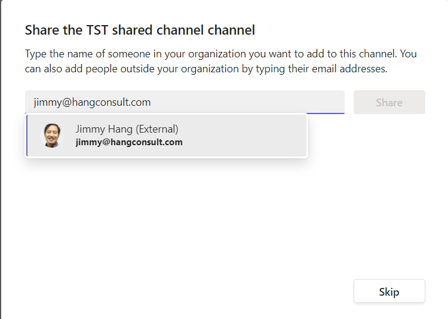
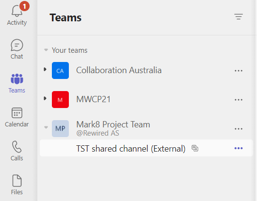
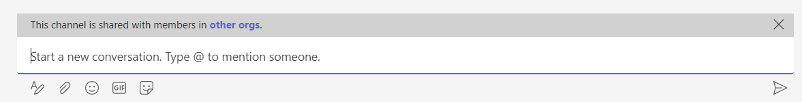
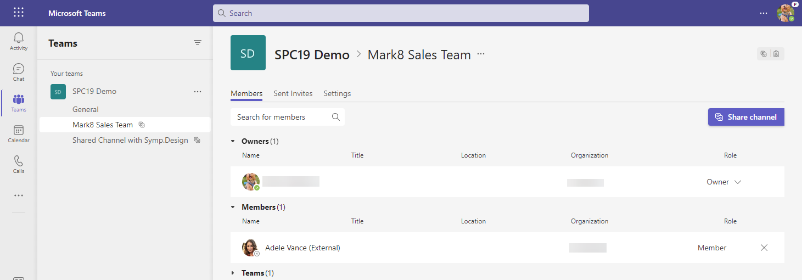
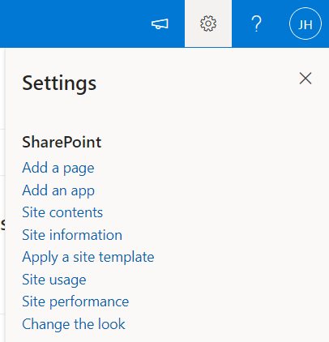
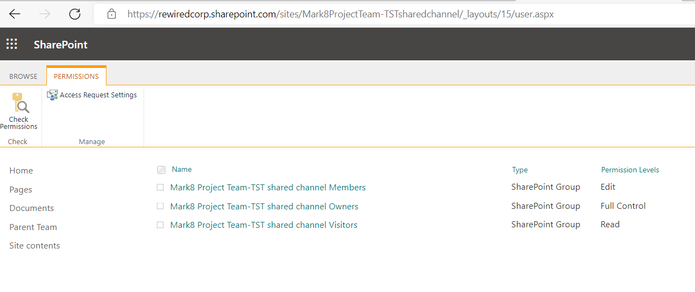
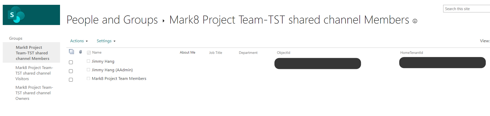

# Teams Shared Channels for Admins

[!INCLUDE [content-disclaimer](includes/content-disclaimer.md)]

Teams "shared channel" is one of the greatest, if not THE Greatest new feature released to Teams in 2022.

## Enabling Shared Channels

To enable and understand more about this feature, follow one of the guides in the [Resources](#resources) section.

After you have enabled shared channels and created your first shared channel, there are a couple of things which are good to know.

> [!NOTE]
> Beware that as this feature is in "Preview" the information below might change.

## The difference between external "Guests" and "External" users

When you add a external user to your Team, you will see that the user is labeled as a "Guest", this is what most of us are doing right now.

When you add the same user to a shared channel, that external user will be labeled with "External", meaning there won't be a "conflict" related to the user for this channel.

After the External user is added, in their Teams client they will receive a notification and the External team will show up. This works almost instantly for the user.

This is also super sweet, as the users don't need to switch tenants.

Collaborating in chats will show an "alert" with a message about the "shared channel".

## Where is the "External" user?

As you may know, when you add a external user in a Microsoft Team, they exist as a "Guest", and the guest record will exist in your [Azure Active Directory (AAD)](glossary.md#azure-active-directory-aad), meaning you can enforce policies, such as [Multi-Factor Authentication (MFA)](glossary.md#multi-factor-authentication-mfa) for the guest account.

But for shared channels, the "External" user only exists as an external user to that shared channel. Currently, there are three places where we can see those external users:

1. In the *Manage channel* settings for the channel
1. In the Teams Admin Center by drilling into the Team and the specific channel
1. In the Site permissions fro the backing SharePoint site - but only if we're a bit tricky, so this may go away in the future.

### Manage channel settings for the channel

In the Manage channel settings, you can see the external users in the Members section.

### Teams Admin Center

In the Teams Admin Center, you can drill into the Team and the shared channel to see the Members.

### SharePoint Site Permissions

In the SharePoint site which is created for the shared channel, you won't have a link option for "Site permissions" in the "Site settings" menu to check there, either.

But it doesn't mean that the permission page is not there. Navigating to your shared channel site with the extra url `/_layouts/15/user.aspx` will take you to the classic permission page you're used to.

Here, you can see your External users with their "ObjectId" and "HomeTenantId".

## Tips and tricks before enabling shared channels for production

1. Review your user training, and make sure everyone knows the difference between "Guest" and "External" users.
2. Beware that currently the External user can't be managed outside the Teams shared channel settings, as far as I know.
3. I presume/hope MS will give us a GUI for external users before GA. If not we can create a PowerShell script to get this information from SharePoint Online, from a governance perspective.
4. If you plan to use Shared Channels, make sure you update your governance policies.

## Resources

* [Andrés Gorzelany - Enabling Teams Shared Channels 101](https://get-itips.capazero.net/posts/shared-channels-101)
* [Shared channels in Microsoft Teams (Preview)](/microsoftteams/shared-channels)
* [B2B direct connect overview (Preview)](/azure/active-directory/external-identities/b2b-direct-connect-overview)

---

**Principal author**: [Jimmy Hang, MCT, MCSE: Productivity](https://www.linkedin.com/in/jimmyhang/)

---
