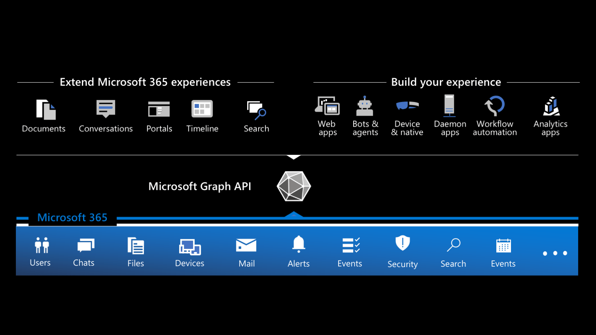
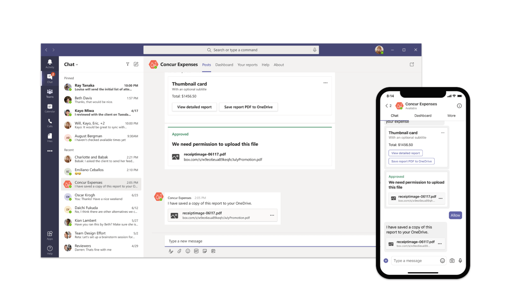
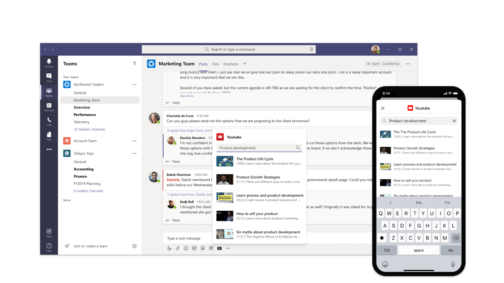
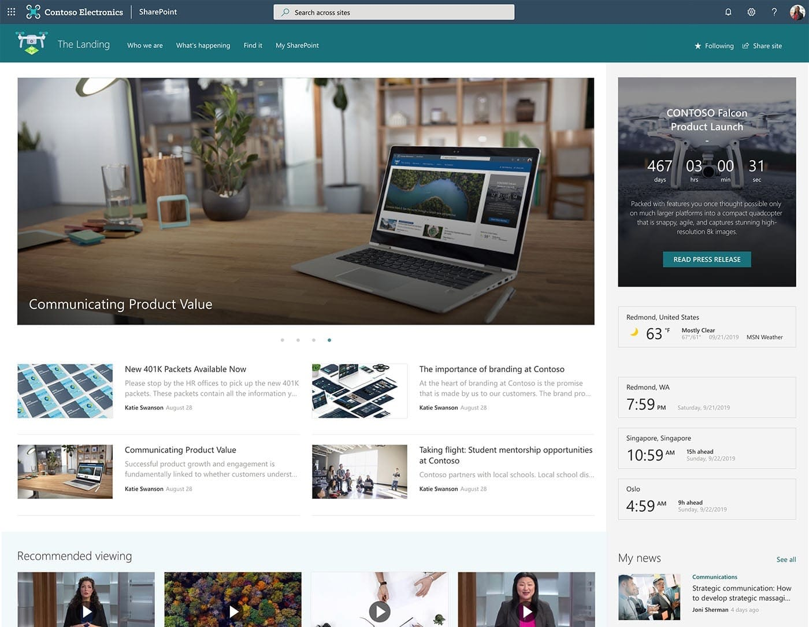
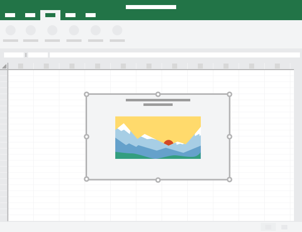

# What kind of apps can you build on Microsoft 365?

Microsoft 365 is a rich platform for building applications. Here are the types of apps you can build on Microsoft 365.

## Why should you build applications on Microsoft 365

Microsoft 365, previously known as Office 365, is Microsoft's productivity cloud, that organizations use for communication and collaboration. 250 million users work with Microsoft 365 creating files, sending emails, meeting, reading information stored in Microsoft 365, and more.

Microsoft 365 is also a highly extensible development platform. All the information about its users as well as the content they create is stored in Microsoft 365 and, bearing the necessary permissions, available for you to interact with in your applications.

## Different types of apps on Microsoft 365

Thinking about building apps on Microsoft 365, you can distinguish between two types of apps: standalone apps and apps that extend Microsoft 365.

### Custom apps: build your experience

First of all, you can build custom apps. These can be mobile apps, web apps, desktop apps, device-native apps, workflow automation, or scheduled processes. You can build these apps using any programming language and run them on any platform you want. You choose how you distribute and operate them. In short: you own the technology stack and the full user experience.

Users start their journey in your app. Because your app is connected to Microsoft 365, you can show relevant information from Microsoft 365 along your app's functionality. And because you can present the data in your app seamlessly, users might not even realize that they're looking at data coming from Microsoft 365.

To get the most out of integrating your custom app with Microsoft 365, you need to allow users to sign in to your app with their Microsoft 365 account. That way, you will be able to retrieve the relevant information on their behalf from Microsoft 365.

## Extend Microsoft 365 experiences

Microsoft 365 offers many extension points to bring your app where your users are. By exposing your app inside Microsoft 365, you make your app a part of people's work. Because your app is available right where they are, they can focus on their work and interact with your app without having to switch the context.

### Extend conversations

[Microsoft Teams](https://developer.microsoft.com/microsoft-teams?WT.mc_id=m365-16324-wmastyka) host conversations on Microsoft 365. You can bring your app as a part of a conversation in several ways.

First of all, you can [build conversational bots](/microsoftteams/platform/bots/what-are-bots?WT.mc_id=m365-16324-wmastyka). Bots help people complete tasks through conversations. They're a great way to expose relevant features of your app and guide users through the scenario like a personal assistant.

Another way to expose your app in a Teams conversation is through [messaging extensions](/microsoftteams/platform/messaging-extensions/what-are-messaging-extensions?WT.mc_id=m365-16324-wmastyka). Messaging extensions help people complete tasks in a visually-compelling way. They're similar to bots but are more visually oriented and ideal for showing rich data

Finally, you can [send notifications](/microsoftteams/platform/webhooks-and-connectors/what-are-webhooks-and-connectors?WT.mc_id=m365-16324-wmastyka) from your app to conversations via webhooks. By using [adaptive cards](/adaptive-cards/?WT.mc_id=m365-16324-wmastyka), you can show the data in a rich and actionable way.

### Extend portals

Many organizations that use Microsoft 365 use [portals](https://lookbook.microsoft.com/?WT.mc_id=m365-16324-wmastyka) to facilitate communication and manage knowledge. Using rich pages, they publish content and build interactive dashboards. These pages consist of reusable building blocks - web parts, that end-users put together.

You can extend portals on Microsoft 365 in two ways. First, you can build widgets, called [web parts](/sharepoint/dev/spfx/web-parts/overview-client-side-web-parts?WT.mc_id=m365-16324-wmastyka). Users, who create pages, can put your web parts on pages to enrich the content. Your web parts can show data from Microsoft 365 as well as any other API.

Another way to extend portals is by building [extensions](/sharepoint/dev/spfx/extensions/overview-extensions?WT.mc_id=m365-16324-wmastyka). SharePoint Framework extensions allow you to execute a piece of code on every page or change how list fields are rendered. Just like with web parts, you can load data from Microsoft 365 or any other API in your extensions.

### Extend documents

When creating documents on Microsoft 365, users can [enrich them with interactive elements](/office/dev/add-ins/overview/office-add-ins?WT.mc_id=m365-16324-wmastyka), like maps or charts. These elements can be connected to APIs and make documents interactive and present data that is always up-to-date.

You can also build [task pane extensions](/office/dev/add-ins/overview/office-add-ins?WT.mc_id=m365-16324-wmastyka) for Microsoft Office applications that help users work with their documents. A task pane could help people lookup their customer information when writing contracts or order information when creating invoices.

## Connect your application to Microsoft 365

There are several types of applications that you can build on Microsoft 365. No matter if you want to develop a custom application or extend Microsoft 365, you can connect your app to Microsoft 365. To get information and insights stored in Microsoft 365, you would connect to [Microsoft Graph](https://developer.microsoft.com/graph?WT.mc_id=m365-16324-wmastyka) - the web API for Microsoft 365. To help you communicate with Microsoft Graph, Microsoft offers [SDKs for the most popular platforms](https://developer.microsoft.com/graph/get-started?WT.mc_id=m365-16324-wmastyka).

Building apps for Microsoft 365 offers a great opportunity to reach millions of users and help them work more effectively. If you want to have a quick look at what kind of data you can retrieve from Microsoft 365, I'd suggest you look at the interactive [Graph Explorer](https://developer.microsoft.com/graph/graph-explorer?WT.mc_id=m365-16324-wmastyka). If you're considering building a web app, I would also recommend that you take a look at [Microsoft Graph Toolkit](/graph/toolkit/overview?WT.mc_id=m365-16324-wmastyka) - a set of web components that make it very easy to show data from Microsoft 365 in your app. When you're ready to start building your app, sign up for the [Microsoft 365 developer program](https://developer.microsoft.com/microsoft-365/dev-program?WT.mc_id=m365-16324-wmastyka) to get a dev environment.

---

**Principal author**: [Waldek Mastykarz](https://blog.mastykarz.nl)

---
