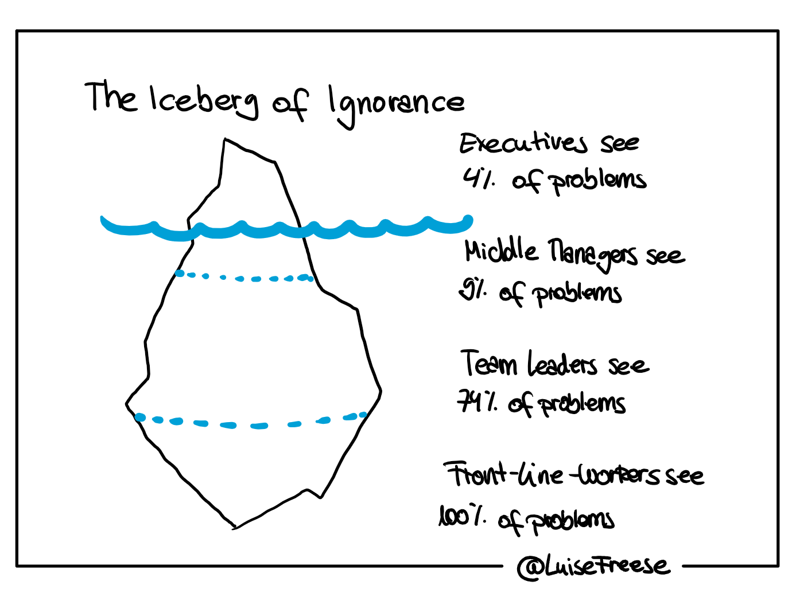

# Why Microsoft 365 adoption projects fail

[!INCLUDE [content-disclaimer](includes/content-disclaimer.md)]

## Intro for the challenge

We see many challenges when it comes to the *people part* of Microsoft 365. We've heard it all before: digitalization is 80% about people and 20% about tech. But what does that mean exactly? How can we face that challenge, and why is it so hard to let people love software? Because Microsoft 365 is not *just* software - it's an approach to change the way we work because it reflects some principles which we will need in the future. We know already that.

* Adoption is hard because people don't understand WHY they need to change their working behavior. Without this, they resist change or only change superficially; they don't stay curious and don't adapt to the evergreen approach.
* Simply explaining Microsoft 365 will increase productivity is not enough because statements like that don't sell anymore. They don't connect to people's experiences, nor do they reflect their beliefs. People easily confuse being productive (adding value in a meaningful way) with being busy (fulfilling tasks somewhat chaotically and under time pressure), so that *increased productivity* is rather perceived as putting even more pressure on them.
* Without a shared vision and common understanding, we will only scratch the surface of what Microsoft 365 can do in an organization.

## VUCA

The necessity of understanding the real challenge isn't that new: In the '90s, the term VUCA (Volatility, Uncertainty, Complexity, Ambiguity) was coined by the US military to describe our modern world and the challenges any organization (not only the military) was facing. This acronym describes a world in which change becomes a new constant, so playability and consistency are not the factors to explain current markets and environments for organizations.

### Volatility

The world is changing faster than ever before, BUT the world will never change as slowly as it is right now. In other words, the pace of change will continue to increase. New challenges, competitors, and different unpredictable factors are something we have to deal with. That means that long term planning and the reliability of this planning won't be sufficient for modern organizations.

### Uncertainty

Predictability and calculability of events are rapidly decreasing; forecasts and experiences from the past due to shaping the future are losing their validity and relevance. Just look at how quickly and comprehensively COVID-19 changed the way we work. Do we have to say more?

### Complexity

We live in a complex and connected world with various connections that are difficult to keep track of, making it challenging to clearly define cause and effect. The world is not just complicated; it's complex.

### Ambiguity

The aspects described above make it clear that decisions today are no longer straightforward. 'One size fits all' is rarely a suitable model anymore. It is often not a question of WHAT, but of HOW and WHY. This leads to the fact that the demands on organizations today are paradoxical, sometimes even contradictory.

## Old world and new world collide

We've build organizations around structures and processes that were invented to deal with different requirements. The way we built up and think about organizations is still based on the idea that markets are predictable, change can be planned, and our world works consistently.

Ultimately, we need a new way of thinking about organizations and the way we work. We need new guidelines and principles that fit the challenges we're facing right now: that fit this new world.

In other words, this new world comes with a need to transform along multiple dimensions.

### Profit into Purpose

Maximizing profit was the main driver for successful businesses for a long time. Yet within a connected world full of information, that isn't the only thing that ensures success nowadays. Customers often have enough information to compare different organizations and can choose who they're engaging with. This appears to customers and employees to the same extent. Now, many factors need to be considered for a successful business: ethics, social responsibility, ecological aspects, etc. Those things often come when an organization has a clear or higher purpose: a WHY. Organizations that know why there are doing something - rather than just relying on how - often have a far better standing in the markets than others: With purpose comes profit, but it doesn't work the other way around. Customers and partners have a pretty good idea of whom they want to deal with, and that's what differentiates a successful organization from an unsuccessful one.

### Hierarchies into Networks

In a world where we have a complicated yet straightforward task with multiple people who can work on that task, we need someone who clearly understands what to do: someone to keep all the strings together and know where to go. With that comes clarity about hierarchy, line of command, and power. Within a world that is changing fast and context isn't to be overseen by one (or a couple) person,  we have the problem that there often isn't THE right way, since that one person likely can't understand all interdependencies. This person has to rely on others to tackle the current task. Yet a clear line of command and a strict hierarchy are opposed to this. Self-organized teams, collaboration between internal and external staff over many borders require a different understanding of leadership and collaboration. Rather than a clear line of command, networks work much better these days to connect to other people and create an exchange that meets the requirements.

### Controlling into Empowering

Let's keep the *Hierarchy into Network* idea in the back of our mind and spin the thought further: If we can connect with different people, regardless of their physical location or their standing within a hierarchy, we still need them to be able to accomplish things. Within strict organizations with constricting processes, built-in communications, and IT departments, people have less chance to make an impact. When we are in the wrong position in the hierarchy, it is difficult to contribute. But what if the earthshaking idea is in the head of somebody who can't contribute? In this modern, ever-changing world, the top person is not necessarily the one with the best ideas. Often it's quite the opposite: how often do people on the front line, interacting with customers and challenges, know precisely how to solve those needs?

### Planning into Experimentation

For ages, planning and the predictability of strategies were a winning factor for organizations, and the one hero-like manager who could foresee what was going to happen was at the top of the hierarchy. But if we know that the VUCA components characterize organizations' environments today, long-term plans aren't sufficient. The opposite of this business model is one that is characterized by short iterations. A short term experiment that might seal the deal, yet isn't a complete catastrophe if it's not.

This comes from every agile approach. Short sprints are way more efficient than the old waterfall approach. Yet, often the structures we find in modern organizations don't allow such a system because they still are solidified around an old mindset.

### Privacy into Transparency

'Intellectual property is good, and if we have or know something, we keep it for ourselves so we can climb up that hierarchy ladder. And of course, we will build up a competitive advantage.' These thoughts don't make sense anymore and don't fit a modern and agile organization: it is impossible to know which information might become useful in the future and which expert we will need to pass an upcoming challenge. Therefore we need to be open-minded, think in networks, and empower people to participate in the meaning of our purpose.

Digitalization needs to be an accelerator for this, but can rarely be the primary driver. We need a new approach to think about work in general.

Microsoft 365 can be one step to achieve transformation, but it is not a goal by itself. Just rolling out Microsoft 365 (or a subset of its tools and services) won't solve our VUCA problems. We need to see the bigger picture to figure out which part of it Microsoft 365 can help with, because we won't solve any problem by assigning licenses to users.

## The Iceberg Model

Before we can change how we do a Microsoft 365 project to solve our old world problems, we first need to understand old and desired new ways of working and get the bigger picture of our situation. An excellent tool to facilitate deeper thinking is the iceberg model.

### Defining the iceberg model

[Find a still of the gif here](media/why-m365-adoption-projects-fail/iceberg-tool.png)

As we know, an iceberg shows only its tip above the water and most of it is hidden underneath; it works as a good metaphor for things that are not obviously visible to us. The iceberg model introduces us to four different stages.

#### Level 1: Events

Very visibly, we see events. An event is the answer to the question *What is happening right now?*

On this level, people only *react* to what just happened and then stop to think about it. For example: "I caught a cold."

#### Level 2: Patterns

Already underneath the surface, we will find patterns: *What has been happening over time? What are the trends?*

On this level, people think about what led to the visible event and try to connect the dots, for example: "I caught a cold more often in the past when I slept less."

#### Level 3: Structures

Digging one level deeper, we see which system supports and influences these patterns:

* What affects these patterns? Where are the connections between practices?
* On this level, people think about what influences these patterns and try to understand the *Why*, for example: "Working crazy hours, worrying about problems at work, and eating late at night affected my quality of sleep."

#### Level 4: Mental models

Finally, we will *investigate* what values, beliefs, or assumptions shape the system and keep it in place?*

We can dig into which thinking generated the structures that are in place. For example: our belief of "work is the most important thing, even more important than health and the more I do, the more valuable I am" leads to behavior (which seemed to be expected, because everyone did it), which resulted in a physical manifestation of unhealthy work ethics that showed as catching colds quickly.

Let's have a look at how this works in the "old world."

### The iceberg model of the old world

#### Level 1: Events - What just happened

People can't focus, experience both a lack of efficiency AND effectiveness, waste their time with tasks they shouldn't do, and are instead more busy than productive.

#### Level 2: Patterns - What was happening over time?

People abuse tools and work around dysfunctional processes, communication patterns, and organizational structures. They are not familiar with the art of collaboration, feel to be under pressure to be always available, and react to everything instantaneously. A high frequency of task-switching while working more next to each other than together is challenging and exhausting.

#### Level 3: Structure- What is influencing these patterns?

Typical organizations look like a pyramid, with a few decision-makers at the top (leadership) and the rest of the workforce at the bottom, resulting from the approach of designing companies like military institutions, with a defined chain of command compartmentalized structures. This led to departments, which don't communicate well and are now rather information silos. The given structure leads to processes that ensure that this structure stays as it is - which conflicts directly with the need to convert from privacy to transparency, from planning to experimentation, and from controlling to empowering.

But segmentation of organizations is not only an issue across departments (horizontally), but also in the hierarchy (vertically), which leads us to another iceberg, that is responsible for lack of understanding of problems of workforce by leadership.

Leadership, who don't generally understand details of issues and a workforce that can not regularly connect to their leadership team lead to processes that do not reflect the work that needs to be done, structures that cement the status quo, and decisions about tools and working methods that serve old principles: privacy, planning and controlling.

#### Level 4 Mental Models

Let's look at which collective beliefs in our culture (which is then only reflected in corporate cultures and way too often reduced to "individual mindset": What do we people believe in, that they design organizations like this? Of course, redesigning takes a tremendous amount of energy (and money), and indeed it is easier to keep the status quo than to change. But why is this status quo, this broken system, still in place? Because we (or at least enough of us in critical positions) believe in "knowledge is power" instead of "Sharing is Caring." The "command and control" approach looks as if it also provides security and predictability, and although we already know better, we stick to this *ego-system* instead of an *eco system*.

What can we now do about it? Make people aware of the broken system that doesn't meet our needs anymore, and that forces people into workarounds, unhealthy work ethics, and poor connection to their organization. Please stop trying to fix users when we need to fix this system.

### iceberg of the desired new world

You see what happens here. When we approach a modern work style mindset as we usually do, we barely go to the root of the problem at all. We're barely scratching the surface of it. And that is all fair and square, but we also know that our solutions won't sustain when we're fixing the symptoms of the problem.

Because in the end, we are confusing cause and effect. If we only focus on the reason and just try to fix the symptoms, we barely fix the underlying issue. We need to work on the cause to end up with a different effect in the end. What we want to achieve in the first place is a sustainable change of habits towards a better work environment and a healthy mindset. If we're going to change people's behavior, which we see in level 1, we will need to change our core beliefs and mental models of level 4.

To give you a little guidance, we will turn the iceberg upside down and start at the bottom:

#### Level 4: New Mental Models

Our core beliefs are a representation of the 'Sharing is caring' - mindset. We don't compete against each other but value and listen to every voice. We are convinced that we can face challenges better together and that Learning, experimenting, and sharing failure and success are essential.

#### Level 3: New Structures

This will automatically lead to organizations that enable work in cross-functional teams, facilitate open communities so people can connect beyond their filter bubble (which makes serendipitous coincidences possible), support tools that foster collaboration and processes that work towards a shared understanding and shared vision of organizational purpose.

#### Level 2: New Patterns and Trends

With this background, people won't abuse tools anymore and don't need to work around processes. They notice that work works and find a good rhythm of collaboration, connecting, and focused work.  

#### Level 1: New Events

Over time, this leads to a healthy understanding of productivity with some very beneficial implications: awareness of mental load, reorganization of priorities, and connectedness to the broader organization. As a result, we can see that people make fair use of their time and do not need to face obstacles that are usually in the way.

## How do we change?

The million-dollar question now is, what needs to be done at Level 4 so that we see the good effect on Level 1? As consultants, we will, of course, say "it depends," but we've identified some core concepts, which of course represent our iceberg.

### Corporate Culture - Mental model

Rather than stating that people need to have the *right* mindset, we need to focus on organizational change, which means that it is not sufficient to write down some fancy leadership principles and work on which behavior we show. People don't do what we tell them to do, but what we offer them by example.

It is time to consciously reflect on corporate values and how they are fulfilled with life in the organization. As an example: We can *say* that we have a culture of being allowed to make mistakes, but if everyone is cc-ing everyone massively to share responsibility / cover themselves, then it is evident that the excellent culture only existed on paper.

Therefore we need to question ourselves about our values and how they resonate for employees, partners, and customers. Without doing this heavy lifting, all approaches to roll out tools, to use champions programs, use case shopping, and end-user training will only scratch the surface and come to nothing or won't be sustainable. This means that we will see perhaps some quick wins, but no long term change.

Some questions to ask could be:

* Do we trust our employees and how much? How many control mechanisms that also interfere with people's productivity and frustrate them do we have in place?
* Do we foster transparency? Which structures and processes did we follow to promote information silos instead and prevent people from connecting dots?
* Do we encourage people to learn and share? Which restrictions prevent employees from doing so actively, and how much time is reserved for that?
* Do we have an organizational purpose? How is this *why* communicated to employees? Is this only one-way communication or a vivid discussion in which everyone's voice matters?

### Corporate Culture - Structure

As the fixed hierarchy in organizations seems to be one of the main drivers to prevent purposeful collaboration within an organization, its deconstruction will be a decisive step towards a modern organization. Based on the answers from above, we will need to ask:

* Do we need to stick to the inherited chain of commands, or can we experiment with other leadership approaches like [holacracy](https://en.wikipedia.org/wiki/Holacracy)?
* Can we institutionalize Learning, failing, sharing, and make this part of our DNA?
* How can we ensure information silos no longer exist?
* How can permissions, access to data and tools, ownership, and responsibilities look when we work with Microsoft 365?

### Corporate Culture - Patterns and Trends

Patterns and trends we can observe once we ensure we are working toward a structure that is aligned with our organizational purpose and reflects its values are, for example:

* [Servant leadership](https://en.wikipedia.org/wiki/Servant_leadership) will result in employees feeling more included in decision-making processes and taking responsibility
* Embracing diversity leads to better products
* Breaking down information silos will lead to serendipitous connections
* A [#LearnItAll](https://www.linkedin.com/pulse/satya-nadella-growth-mindsets-learn-it-all-does-better-jessi-hempel/) mindset will grant future-readiness
* Democratizing access to corporate assets (knowledge, tools, roles) will impact how people feel about their employer
* A respectful climate towards everyone results in consciousness and thoughtfulness

### Corporate Culture - Events

Climbing up our iceberg, we now reach its visible tip, the events that everyone notices. After we do the legwork with core beliefs and organizational values, defined structure and processes that supported these values, and fostered patterns that result in a digitally literate, connected, and aligned workforce, we can now reap what we have sown:

* Frictionless collaboration
* Healthy productivity
* Good working morale

## Next steps

To achieve all this, we will need:

### Advocates

Advocate are people who explain, evangelize, and openly discuss change with their peers. It is essential to include people rather than giving the impression that ongoing change would be a *fait accompli*. Good communication is critical. Just sending an email or printing some posters won't light a fire in an organization. Explain the big picture and elaborate on the *why* of this enterprise. This makes sure that all stakeholders will have an excellent understanding to drive change even further.

### Persistence

Rome wasn't built in a day, and we first need to unlearn the practices from the old world. This is challenging, as we easily fall back into old role patterns. The path requires us to be patient and to make it easier to follow a new approach. [Gamification](https://en.wikipedia.org/wiki/Gamification) can help a lot here, but yet again - if we only work on this level, the effects will quickly fizzle out.

### Guidance and training

Training alone won't be sufficient; people will need examples, discussions, and time to figure out what works best for them.

## Conclusion

To see the bigger picture of adoption and how Microsoft 365 can support our digital transformation efforts, it is important to investigate the corporate mental model, the organizational structures, and patterns. Focusing on visible events only, underestimating the mental model's complexity, and cherry-pick quick-wins will not lead to sustainable change. If we want to evolve from our inherited understanding of work into meaningful collaboration, we need to adopt new working behavior properly. This is only possible if we first care about corporate culture, which will be reflected in all levels above.

## Useful resources

### Iceberg Models

* [Involved in transformation? People love this model](https://glowconsulting.com/wp-content/uploads/2018/04/Iceberg-model_Glow_Mar18.pdf)
* [The Systems Thinking Playbook by Linda Booth Sweeney and Dennis Meadows](https://amzn.to/3qHmKpc)

### Other

* [Satya Nadella on growth mindsets: “The learn-it-all does better than the know-it-all.”](https://www.linkedin.com/pulse/satya-nadella-growth-mindsets-learn-it-all-does-better-jessi-hempel/)
* [Microsoft 365 Maturity model](/microsoft-365/community/microsoft365-maturity-model--intro)
* [Microsoft 365 Adoption guide](https://adoption.microsoft.com)

---

**Principal author**: [Luise Freese, MVP](https://www.linkedin.com/in/LuiseFreese)

---
