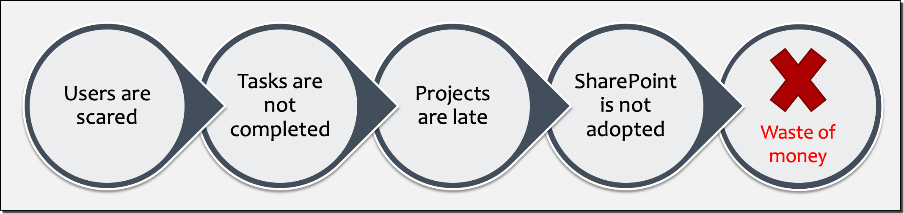

# Why SharePoint Training is Important

[!INCLUDE [content-disclaimer](includes/content-disclaimer.md)]

## Share what?

Yes... We hear that often. So first, let's have a _quick_ introduction. SharePoint is a platform. A product. You collaborate and share information across the organization, quickly and securely. You reduce email traffic, and always have the latest version of a document or file. You can even have a beautiful Intranet!

There are of course, many features available in SharePoint, and that's probably what makes it 'complex'. It's a complex product, no denying. But so are many other platforms, products, software, when we don't spend a minimum amount of time learning them. 😉

In this article, we'll have a look at why having a good understanding of SharePoint is essential for user adoption as well as for the company, how to get you started, and also briefly touch on the different roles and responsibilities from a SharePoint perspective.

>_This article is highly focused on SharePoint Online, but most of it also applies to SharePoint Server (on-premises version)._

## More than a storage location

One of the first reasons that springs to mind is that SharePoint is **not** our good old network shares. It's also not _another_ cloud storage.
Users might be used to their OneDrive (consumer), Dropbox, Google Drive, and so on. They know how to upload or download their files and pictures don't they? So that's already a good start!

But as mentioned above, SharePoint will offer many other features. Amongst them we have:

- Versioning
- Custom metadata
- Audience targeting
- Content types
- Labels (security)
- Sharing
- Workflows
- Alerts
- ........

And we're only scratching the surface!

## Integration with other apps

If you're using Microsoft 365, you've surely heard about [Microsoft Teams](https://www.microsoft.com/microsoft-365/microsoft-teams/group-chat-software), [Power Apps](https://powerapps.microsoft.com/), [Power Automate](https://make.powerautomate.com/), etc... Well, they all integrate with SharePoint. So you can imagine the extent of the possibilities. 🙂

That being said, we also don't want to scare users. The **goal** is to allow them to work efficiently, taking into consideration that 'The Cloud' is likely a new way of working for most of them, with a product that the higher management decided to go for.

## Real world scenario

Let's assume for a moment that you're in this situation: Higher management chose SharePoint Online as the new Document Management System, and migrations will take place over the next few weeks or months. It's all been decided.
You can't just 'throw users into the wild' and hope for the best, can you? Well, below is a little visualization of what could happen...

[Microsoft 365](https://www.microsoft.com/microsoft-365) is a subscription-based platform with multiple products depending on the chosen plan(s). So even if you're not using SharePoint, the price will remain the same. But if you do the same for other services (_i.e.: Microsoft Teams, Power Automate, OneDrive for Business, etc..._), in the long run, it will feel like you're paying a lot of money for only 'sending emails' while **also** paying for third-party products.

## Identify SharePoint Champions

Some users may have some SharePoint experience already, likely from a previous role. Identify those users for two main reasons:

- They could be Site Owners for their team or department,
- They could help with training other users within the organization.

## Users and admin roles

When we speak about SharePoint, we can think of three distinct roles: **Users, Super Users, and Administrators**.
Of course, they won't have the same responsibilities, or see the same interfaces, but even an Admin is likely to be a user or Super User within his or her team, after all!

>_Note: The role of a SharePoint Service Admin is not in scope of this article_

From the **most** privileged to the least:

1. SharePoint Site Collection Administrator
2. SharePoint Site Owner (_also Super User_)
3. SharePoint User (_Members_, _Visitors_, etc...)

## Basic training

Start with basic training per group or per department, a few hours per session. It has to be a compromise between learning fast enough, and _practicing_ the new ways of working to complete their daily tasks. Therefore, plan the topics for each training session to be efficient.

Depending on a user's permissions, the following are considered basic operations within SharePoint:

- Understand Lists and Libraries
- Create, upload, download, delete documents
- Share documents or a Site (_depending on permissions_)
- Find version history
- Understand metadata
- Use the information panel
- Check-in / Check-out documents (_if enabled_)
- Create views
- Restore deleted documents in the user's Recycle Bin
- Minimum understanding of how Search works
- Introduce [OneDrive for Business](https://www.microsoft.com/microsoft-365/onedrive/onedrive-for-business)

>_Note: Regardless of the sites' architecture, or ways of working specific to the organization, the above items are really the basics to understand from a SharePoint perspective._

## Advanced training

If your users already know how to perform the items from the basic training section, then they could potentially act as **Site Owners** for their team or department's site.

This involves more responsibilities as Site Owners will need to also take care of the security aspect by managing site permissions, adding and removing users from their site for example. They may also act as a **support contact** for other site members.

Advanced training _could_ include the following:

- Understand permission inheritance
- Manage permissions (_Site Owners_)
- Manage other settings (_lists, libraries, site_)
- Understand the difference between Site columns and List columns
- Sync a library locally
- Sync OneDrive for Business files locally
- Co-authoring
- Create flows using [Power Automate](https://make.powerautomate.com/)
- Create, edit, and customize Pages (_i.e.: webparts_)
- Create content types
- Create approval workflows
- Customize Views (_i.e.: Group By_)
- Restore deleted items from the Recycle Bin (_second stage_)
- Enabling or disabling site features (_depending on permissions_)
- Introduce [Microsoft 365 Groups](https://support.office.com/article/learn-about-microsoft-365-groups-b565caa1-5c40-40ef-9915-60fdb2d97fa2) (_renamed from Office 365 Groups_) and other integrated apps

Those items are a good starting point, but maybe you'll be asked to customize a SharePoint form using [Power Apps](https://powerapps.microsoft.com)? Who knows! 😉

## Is it really worth it?

Microsoft **and** the Community are making a lot of enhancements for SharePoint to make things easier and more intuitive for users. But we've seen so many times that **training is very valuable** for any type of product. Even a 'simple' product can be challenging for users if they've never seen it!

Having someone explain 'how' to do things in SharePoint will only put users at ease, carry on with their daily tasks, and _subsequently_ make the price of the Microsoft 365 subscription worth it.

## Related Articles

- [Identifying Your SharePoint Champions](identifying-your-sharepoint-champions.md)
- [Empowering Your SharePoint Champions](empowering-your-SharePoint-champions.md)

## Related Resources

- [Microsoft 365 learning pathways](/office365/customlearning/)

---

**Principal author**: [Veronique Lengelle, MVP](https://www.linkedin.com/in/veronique-lengelle-48a71b31)

