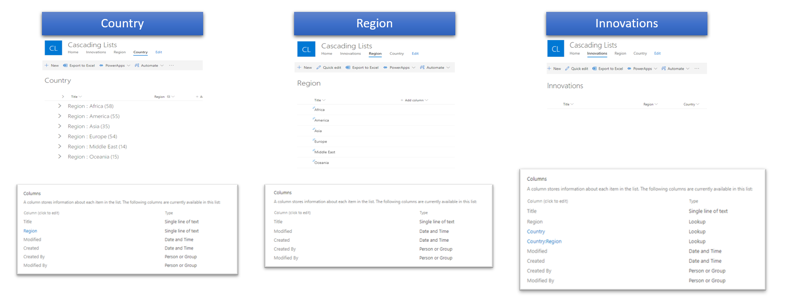
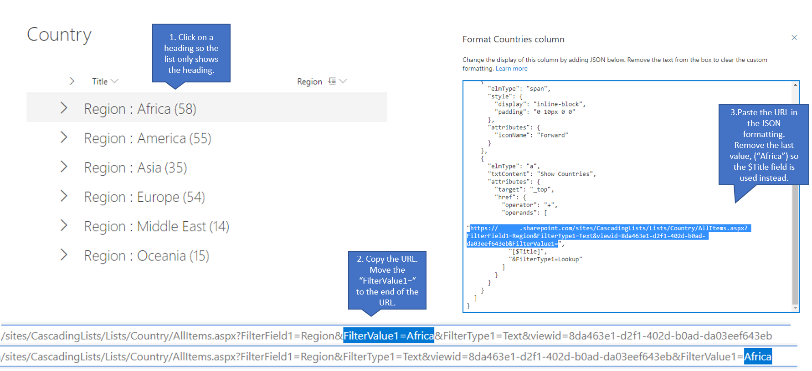
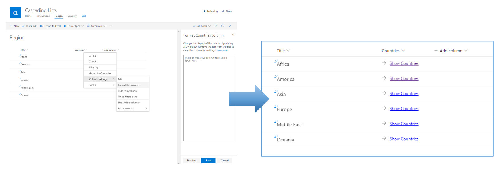
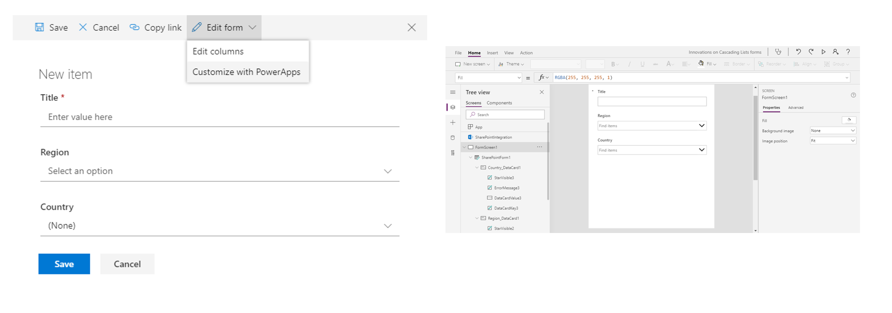
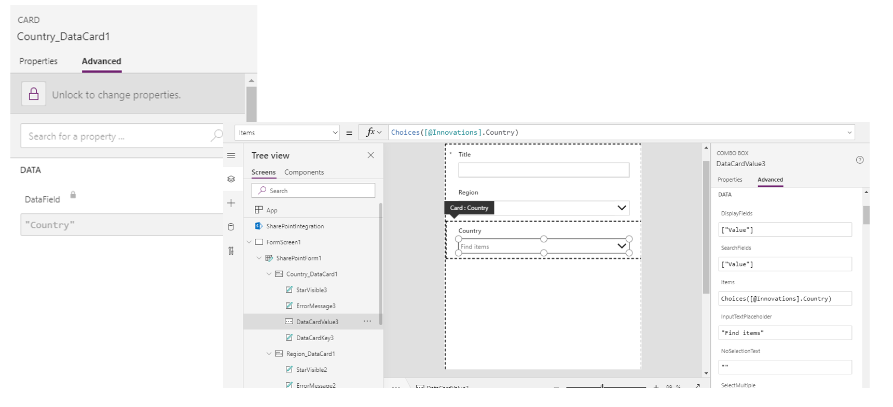
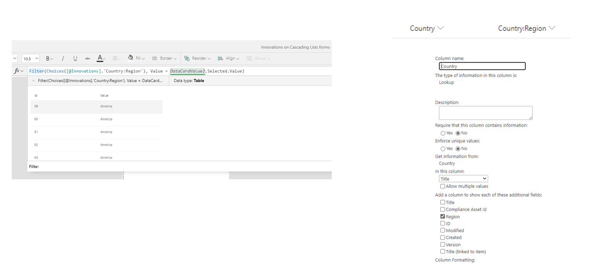
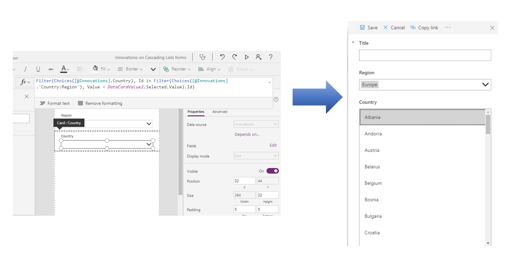

# Working with Cascading Lists in SharePoint and Power Apps

[!INCLUDE [content-disclaimer](includes/content-disclaimer.md)]

This example shows how you can cascade SharePoint lists and only show a subset of the data.


Cascading is useful when you have several lists that are related to each other and you only want to see the relevant options based on a previous selection.

We will illustrate this with a scenario. Our ambition is to create an awesome list of great innovations from various countries and to be able to cascade the innovations based on the choice of region, filtering the countries for the specific region.

## 1. SharePoint Lists

This example uses 3 different SharePoint lists:



**Country:** Contains a single line of text columns for the Title and Region. The list is populated with 231 countries with an associated region. The View used is grouping by Region. The taxonomy of world regions can be found [here](https://almbok.com/taxonomy/world_regions).

**Region:** Using the default Title field for the region title. The additional text field Countries is used as a placeholder for column formatting only.

**Innovations:** The main list in this example, this list is where all the great innovations can be added, using Lookup fields for both Region and Country (and Country:Region) and a single line of text column for Title.

## 2. Column formatting (JSON)

In this step we will construct a JSON object and add it to the [column formatting](/sharepoint/dev/declarative-customization/column-formatting) to customize how the column field in the Region list is displayed. When completed, the column field will show a formatted link to the grouped view in the Country list.

First, we will have to create a navigation link to the grouped view in the Country list.



First, click on a heading so the list only shows the heading. Then copy the URL and move the "FilterValue1=" to the end of the URL.

Navigate to the Region list and select or create a new single text column named "Countries". Click on the Countries column header and select "Column settings" and "Format this Column" in order to show the Column formatting screen.

Finally, paste the URL into the JSON formatting (see code below). Remove the last value, ("Africa") so the $Title field is used instead of the static value. Paste in your custom edited JSON and press Save.

``` json
{
  "$schema": "https://columnformatting.sharepointpnp.com/columnFormattingSchema.json",
  "elmType": "div",
  "style": {
    "display": "inline-block",
    "padding": "10px 0 10px 0",
    "min-height": "auto"
  },
  "children": [
    {
      "elmType": "span",
      "style": {
        "display": "inline-block",
        "padding": "0 10px 0 0"
      },
      "attributes": {
        "iconName": "Forward"
      }
    },
    {
      "elmType": "a",
      "txtContent": "Show Countries",
      "attributes": {
        "target": "_top",
        "href": {
          "operator": "+",
          "operands": [
            "INSERT_URL_HERE",
            "[$Title]",
            "&FilterType1=Lookup"
          ]
        }
      }
    }
  ]
}
```



## 3. Power Apps (Filter, Choices)

Now we will customize the form for the Innovations list by opening Power Apps in a browser. In the Innovations list, create a new list item and choose "Edit form" then "Customize with Power Apps". This may look different depending on your specific environment. If so, read the article [Customize a SharePoint list or library form by using Power Apps](/powerapps/maker/canvas-apps/customize-list-form) for additional information.



In Power Apps, select the Country card and under the Advanced tab select "Unlock to change properties" to open up for edits. Depending on your specific instance the given names for components may be different, so adjust accordingly.



Select the DataCardValue3 (Combo Box) in the Country_DataCard1 (Card), and select the Items function value.

Because the **[Choices](/powerapps/maker/canvas-apps/functions/function-choices)** function only allows for two values (Id, Value) for the lookup to the Countries list, we have to make some additional changes.

Make sure that the "Region" column is checked in the lookup field to the Country list. Basically this shows up in Power Apps as an additional table.



Using the **[Filter](/powerapps/maker/canvas-apps/functions/function-filter-lookup)** function and the **[in](/powerapps/maker/canvas-apps/functions/operators#in-and-exactin-operators)** operator we now can reference the values based in the Id from the Country to show the proper Title value based on the selection of the Region.

``` powerapps
Filter(Choices([@Innovations].Country), Id in Filter(Choices([@Innovations].'Country:Region'), Value = DataCardValue2.Selected.Value).Id)
```



------

**Principal author**: [Henrik Yllemo](https://www.linkedin.com/in/yllemo)

------

