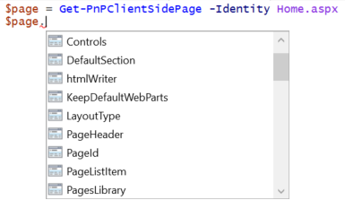
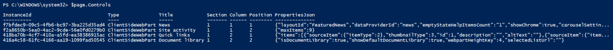
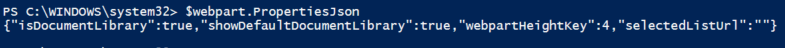
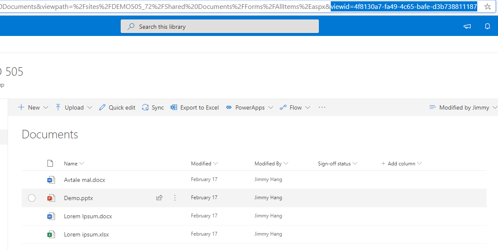
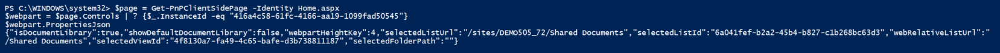
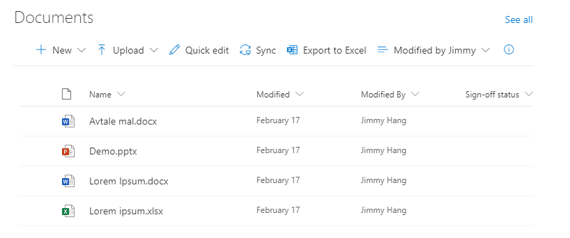
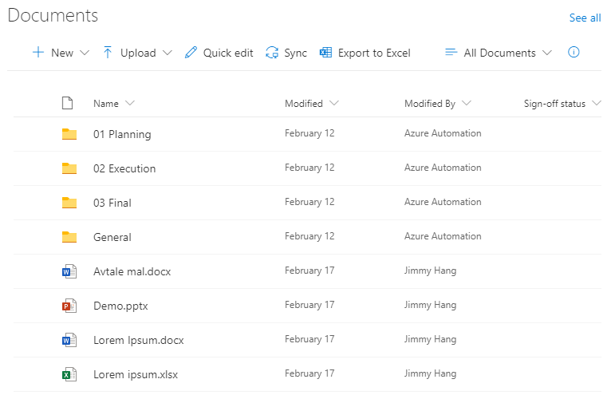
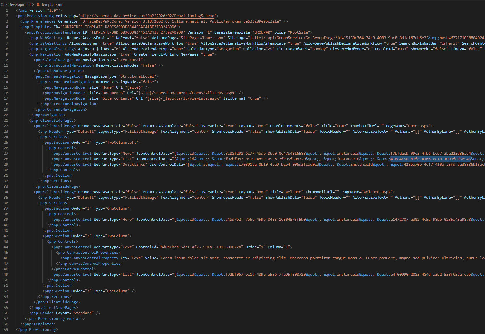

# Working with modern client-side pages using PnP PowerShell

[!INCLUDE [content-disclaimer](includes/content-disclaimer.md)]

If you need to work with SharePoint Online, whether it's doing some minor modifications or building a custom SharePoint provisioning solution, PnP PowerShell is one of the greatest tools there is. It will certainly help you achieve your goals. PnP is a lot more than just PowerShell, but since I'm an IT-Pro at heart, PowerShell is the number one tool I have in my toolkit.

First things first, if you are unfamiliar or new to PnP, head over to the PnP PowerShell overview to get introductions and guidance on how to setup this.

* [PnP PowerShell overview](https://docs.microsoft.com/powershell/sharepoint/sharepoint-pnp/sharepoint-pnp-cmdlets?view=sharepoint-ps) 

Client-side pages is a big topic. In this article I will cover some real world use cases where I've been using PnP PowerShell.

## Some basics

> [!TIP]
>
>* Client-side page is a term we use to tell others that the page we are working with is a SharePoint modern ".aspx" page.
>* Currently Site Designs and Site Scripts don't have support for Client-side pages
>* You should be the owner of the site you are working with as it will make a lot of things easier

## Connecting to SharePoint with PnP

This is the first command we need to know in PnP

``` powershell
    Connect-PnPOnline -Url $siteUrl -UseWebLogin
```

> [!NOTE]
> The switch "UseWebLogin" will make sure you can authenticate if your account is configured with [MFA](glossary.md#multi-factor-authentication-mfa)

After connecting you can start working with the pages you have in the site.

The code below will create a new page named "Welcome" and add some web parts on the page.

``` powershell
    #Set variable pagename  
    $pagename = "Welcome"  

    #Add 3 new sections to the page  
    $page = Add-PnPClientSidePage -Name $pagename -LayoutType Home #Using layouttype Home, removes the title and banner zone

    Add-PnPClientSidePageSection -Page $page -SectionTemplate OneColumn -Order 1 # OneColumnFullWidth is only available if the site is a Communication site

    Add-PnPClientSidePageSection -Page $page -SectionTemplate TwoColumn -Order 2

    Add-PnPClientSidePageSection -Page $page -SectionTemplate OneColumn -Order 3

    #Add Hero webpart to page  
    Add-PnPClientSideWebPart -Page $page -DefaultWebPartType "Hero" -Section 1 -Column 1

    #Add text webpart to page  
    Add-PnPClientSideText -Page $page -Text "Lorem ipsum dolor sit amet, consectetuer adipiscing elit. Maecenas porttitor congue mass a. Fusce posuere, magna sed pulvinar ultricies, purus lectus malesuada libero, sit amet commodo magna eros quis urna." -Section 2 -Column 1

    #Add the list webpart to the page, but stating that it's a document library then add the library GUID  
    Add-PnPClientSideWebPart -Page $page -DefaultWebPartType "List" -Section 2 -Column 2 -WebPartProperties @{isDocumentLibrary="true";selectedListId="6a041fef-b2a2-45b4-b827-c1b268bc63d3"}
```

## Now we want to modify another page Home.aspx

We'll start by creating a $page output containing the details about the page.  

``` powershell
    $page = Get-PnPClientSidePage -Identity home.aspx
```



``` powershell
    $page.controls | will give us a full view of all webpart on the page, and their properties
```



Based on the output above, running the below code will give us the properties of the "Document library" webpart on the page, and you can see that it's linked by default to the default document library.  

``` powershell
    $page = Get-PnPClientSidePage -Identity Home.aspx    
    $webpart = $page.Controls | ? {$_.InstanceId -eq "416a4c58-61fc-4166-aa19-1099fad50545"}  
    $webpart.PropertiesJson  
```



If we in the Document library create a new view and set this as standard for the webpart, then run the above code one more time. Note the "viewid" value in the URL.



The new output will have a lot more details about the new webpart configurations:



> "selectedListUrl":"/sites/DEMO505_72/Shared Documents"  
> "selectedListId":"6a041fef-b2a2-45b4-b827-c1b268bc63d3"  
> "selectedViewId":"4f8130a7-fa49-4c65-bafe-d3b738811187"  

In order to work with the webpart properties through PowerShell, I had to convert the properties from JSON, make changes, convert back to JSON, then update the web part.

For example, if we want to set the default web part view without manually editing the page, first we need to find the view ID. You will find this in the library when you change the view, or by using "Get-PnPView".  

I now have two views in my library:

* AllItems | 43539779-8800-4745-a680-01aca0c43139
* Modified by Jimmy | 4f8130a7-fa49-4c65-bafe-d3b738811187
  
Code to update the webpart  

``` powershell
    $webpartJson = $webpart.PropertiesJson  
    $webpartobj = ConvertFrom-Json -InputObject $webpartJson  
    $webpartobj.selectedViewId = "43539779-8800-4745-a680-01aca0c43139"  
    $webpartJson = ConvertTo-Json $webpartobj  

    $webpart.PropertiesJson = $webpartJson  
    $page.Save()  
    $page.Publish()  
```

Current web part view:



New webpart view:



Above is the technique I use when I want to work with specific pages. When I want to provision SharePoint sites with a certain configuration and pages, normally I combine the above with PnP Provisioning template commands.

Firstly I will create an export of all pages from my template site.

```powershell
    Get-PnPProvisioningTemplate -Out "C:\Development\template.xml" -Force -IncludeAllClientSidePages #includeallclientsidepages will copy all other pages in the site
```

I will then clean the template.xml, by removing all other components that I don't need, and in the "ClientSidePages" node you will find the web parts' instanceIDs that you can reuse later.  



To apply the template to a new site, in your script connect to the new site then run Apply-PnPProvisioningTemplate with the template:

```powershell
    Connect-PnPOnline -Url https://jh365dev.sharepoint.com/sites/$newsite -UseWebLogin
    Apply-PnPProvisioningTemplate -Path "C:\Development\template.xml"
```

Afterward, depending on your needs, add extra code to update the web parts.

Finally, I would like to thank everyone that has contributed and still contribute to PnP, it's super #awesome and it's making my day easier everyday.

## Useful resources

* [PnP PowerShell overview](https://docs.microsoft.com/powershell/sharepoint/sharepoint-pnp/sharepoint-pnp-cmdlets?view=sharepoint-ps)
* [Creating new client-side page](https://hangconsult.com/2017/11/05/creating-a-new-client-side-page-with-pnp-powershell/)

------

**Principal author**: [Jimmy Hang, MCT, MCSE: Productivity](https://www.linkedin.com/in/jimmyhang)
