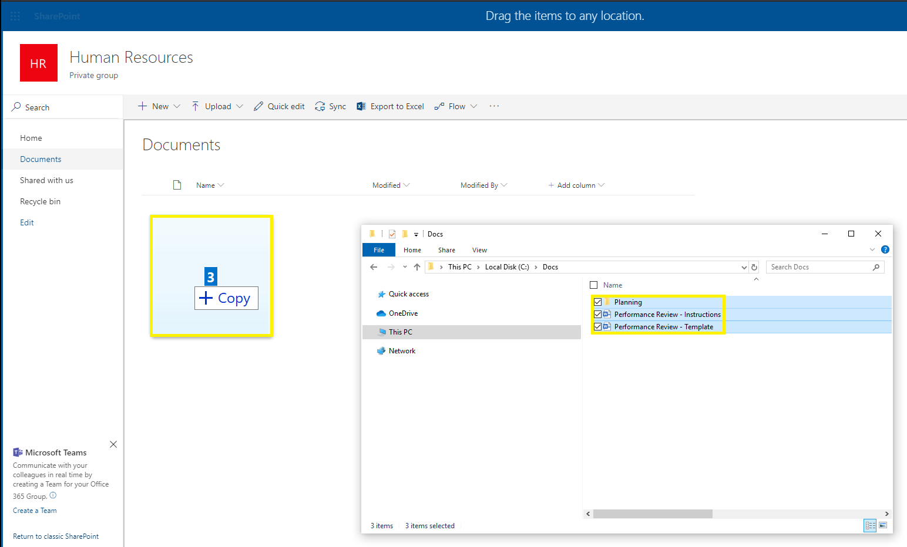
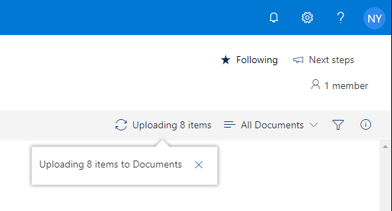
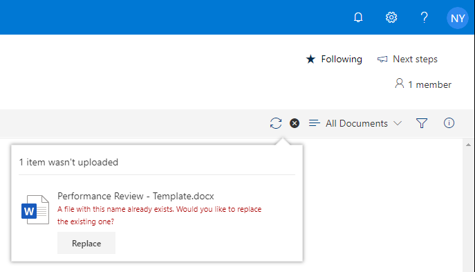
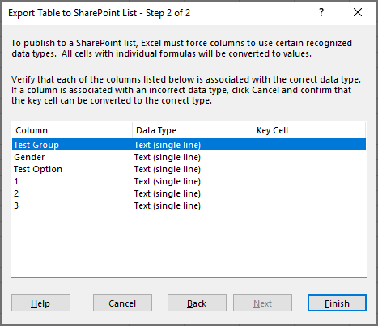
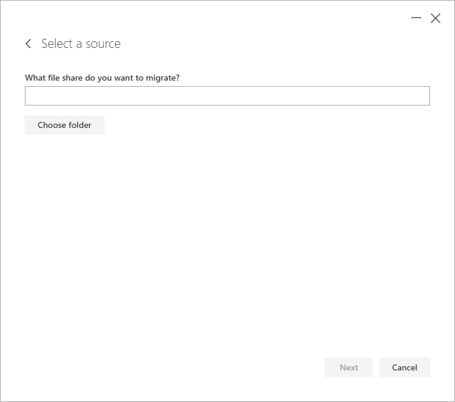
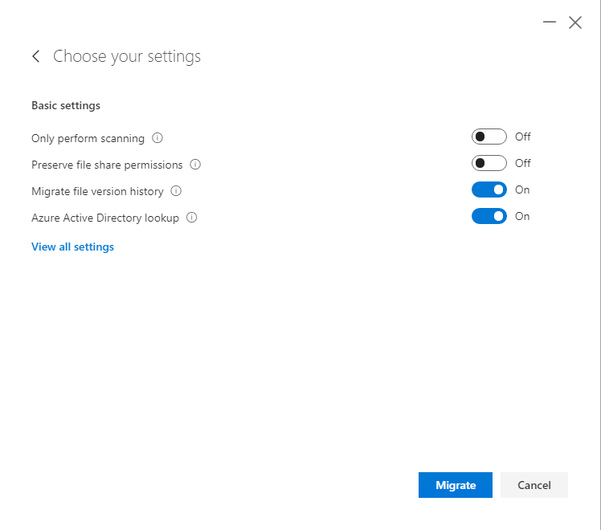

# Importing data into SharePoint

This guide will help users understand the various options available to import files and data into SharePoint. We cover several different approaches:

| Method | Type of User |
| ------ | ------------ |
| [Document Libraries – Drag and drop files and folders](#document-libraries--drag-and-drop-files-and-folders-user)| End user|
| [Document Libraries – SharePoint Migration Tool](#document-libraries--upload-files-and-folders-user) | Power user |
| [Lists – Export Spreadsheet to SharePoint](#lists--export-spreadsheet-to-sharepointpower-user) | Power user |
| [Document Libraries – SharePoint Migration Tool](#document-libraries--sharepoint-migration-tool-power-user) | Power user |

## Document Libraries – Drag and drop files and folders (User)

SharePoint document libraries support the *drag and drop* of files and folders from computer to site. With the target site and document library open:

- Select the source files / folders.

- Drag to the site and release.

- The upload status can be monitored using the “Show progress” button on the document library menu.

- The “Show progress” button will notify you of any errors and when possible provide an intervention.

- Example error image shown below:

## Document Libraries – Upload files and folders (User)

Like the *drag and drop* of files and folders, SharePoint document libraries also support the direct uploading files and folders. With the target site and document library open:

- Click “Upload” and select “Files” or “Folder”.

The **“Files”** option does not allow the uploading of folders. Similarly, the **“Folder”** option does not allow files.

- Select the source files / folders and click “Open”.

- The “Show progress” button will notify you of any errors and when possible provide an intervention.

## Document Libraries – Copy to and Move to (Power user)

SharePoint document libraries support the copying and moving of files / folders to new locations. New locations can include a different folder, document library or site, including OneDrive for Business.

The **“Copy to”** feature will copy the files / folders to the new location while leaving the source files / folders unchanged. With the target site and document library open:

- Select the source files / folders and click “Copy to”.

- Select the target location (i.e. “Your OneDrive”).

- Click “Copy here” to complete the file / folder copy.

- The “Show progress” button will notify you of any errors and when possible provide an intervention.

The **“Move to”** feature will copy the files / folders to the new location and will move the source files / folders to the site “Recycle bin”. With the target site and document library open:

- Select the source files / folders and click “Move to”.

- Select the target location (i.e. “Planning” document library).

- Click the target site (i.e. “Human Resources” site) and then click the target document library (i.e. “Planning”).

- Click “Move here” to complete the file / folder move.

- The “Show progress” button can also be used to view the progress of a copy or upload operation.

## Lists – Export Spreadsheet to SharePoint(Power user)

*Microsoft Excel* supports the exporting of “Tables” from spreadsheets to new SharePoint lists. With the source spreadsheet open:

- Click “Table Design”.

- Click “Export” and select “Export Table to SharePoint List…”.

- Enter the target “Address”; provide a list name and click “Next”.

- Review the list design and click “Finish”.

- Click the URL to view the new SharePoint list. Click “OK” to exit the export wizard.

- Example exported list shown below:

## Document Libraries – SharePoint Migration Tool (Power user)

The *SharePoint Migration Tool (SPMT)* can be used to import files into SharePoint. *SPMT* is especially useful when migrating a large volume of documents from a file share.
Detailed information about *SPMT* can be found on the [Download and install the SharePoint Migration Tool](https://docs.microsoft.com/en-us/sharepointmigration/introducing-the-sharepoint-migration-tool) page.

From your *SPMT* computer:
- Open the “SharePoint Migration Tool”. 

- Click “Start your first migration”.

- Click "File Share".

- Click “Choose folder”.

- Select the source file share and click “OK”.

- Click “Choose folder” to select a specific sub-folder or click “Next” to continue.

- Enter the destination site URL and document library. Click “Next”.

- Name your migration if desired or click “Next” to continue.

- Update *SPMT* settings if required or click “Migrate” to continue. Detailed information on *SPMT* settings can be on the [SharePoint Migration Tool Settings](https://docs.microsoft.com/en-us/sharepointmigration/spmt-settings) page.

- Click “Save” to store the migration or click “No thanks” to continue.

- The summary screen will provide migration details and reports.

---

Principal author: Norm Young

LinkedIn: https://www.linkedin.com/in/norm-young/

Blog: [normyoung.ca](https://normyoung.ca)
