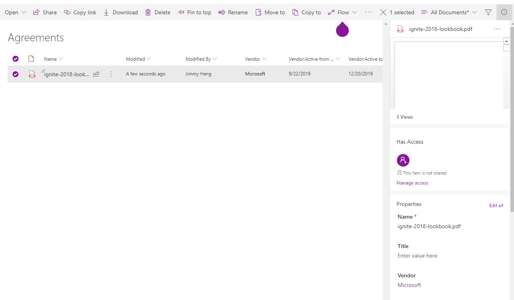
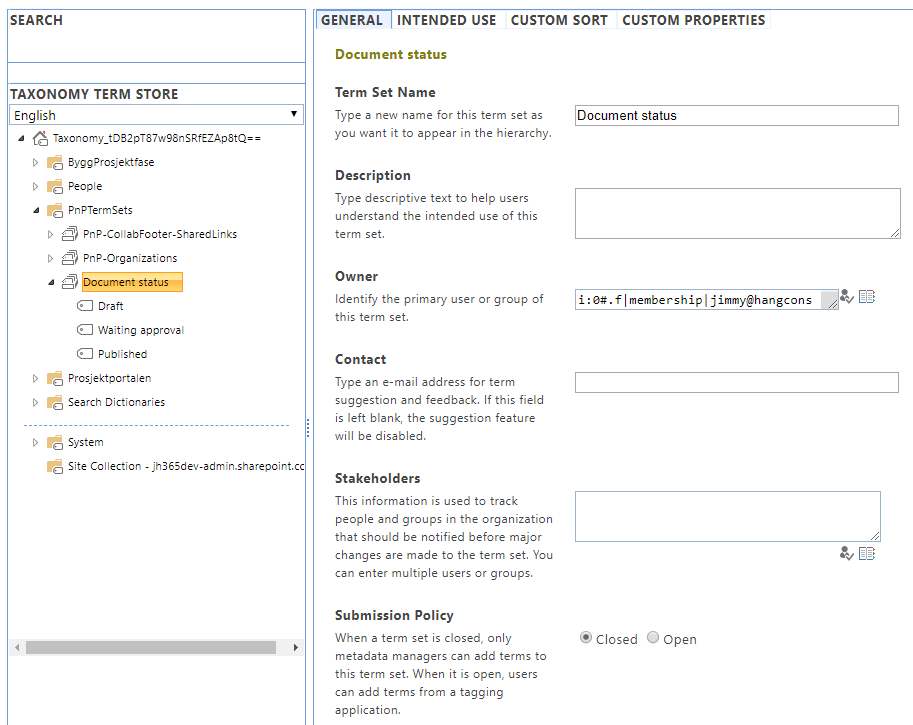
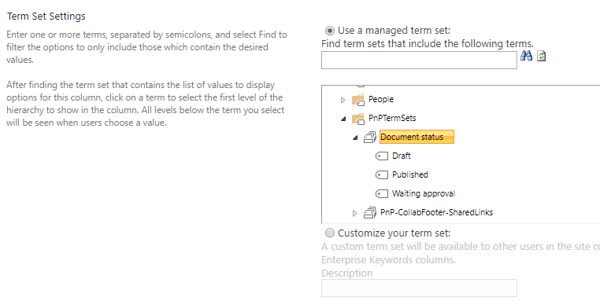
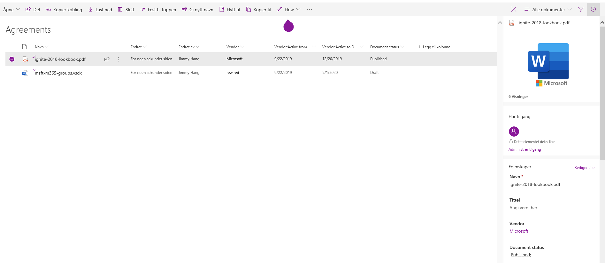

# Information Architecture - Managed Metadata vs Lookup columns

Before we jump to the topic at hand, a little recap of the terminology involved:

* Metadata: means information about something, in SharePoint usually information about documents, pages or list items
* A list column: this a metadata column connected to a list, the column itself can be of different data types: text, numbers, date&time, people picker, managed metadata
* A lookup column: this a column type where we get the data values from another list in the same site. 
* Managed metadata: is a globally available metadata service that can be shared by all site collections in SharePoint Online or SharePoint on-premises 

## How does Lookup columns works?:  

A lookup column is a metadata column that that gets its data from another list in the same site. Before you start creating the columns it's always a good practice to actually think of how your column relationships will be depends on your use case.
Example: I have a document libary where our company stores our vendor agreements, and we will like to "tags" the agreements with the vendor names, that way it's easier for us to track the documents.

* In SharePoint create a library named Agreements
* In the same site create a custom list named Vendors
* You can extend the list to contain more data, but in this case I will create two extra date&time columns to to see if the vendor is still active or not. You can ofcourse use column formatting to make it look better, ;)

* Navigate back to the Agreements library
* In the libary create a new colunm and for the data type choose lookup, point the lookup to the Vendor list and include any extra data you might need from the vendor list. Unfortunately not all data columns are supported.
* After the lookup column is added you can use this to tag any document you have in the library

## Pros of Lookup columns:
* You can create lookup columns as site owner
* You can add more field from the source list as metadata to the destination list
* Members can contribute to the source list, without "messing" up the list setup
* All update to the source list will update the destination list

## Cons of Lookup columns:
* Lookup is only available with source list in the current site
* In order to re-use in another site we have to recreate both the source list and the lookup column
* Beware that deleting items from the source list will "mess up" the destination list, remember to use "Enforce relationship behavior, restrict deleting" when creating the column. 

## How does Managed Metadata columns works?:

Managed Metadata columns depends on SharePoint Taxonomy service and because it's a globally available feature you need to have delegated ownership to at least a termset in order to be able to manage it.

* In this example I've created a termset called document status to track if it's in "draft, wainting approval or published"
* I'm adding this termset as a column to the Agreement library above
* I'm using this column to track the approval of the Documents we have here

## Pros of Managed Metadata columns:
* Managed Metadata is globally available
* Managed Metadata support language translations 
* Changes to the termset will be updated across all sites
* Admins can control who can contribute to the termset
* Combined with search you can achieve a global search center with results refinement from all sites using the termset 

## Cons of Managed Metadata columns:
* Cannot be managed freely by site owners, changes have to be added ot a change policy to avoid failures
* Managed metadata is "singular" meaning you cannot connect other metadata to it, like we can with lookup columns

## My experience:

* There is no single way of doing things in "SharePoint", it all depends on the use case
* I normally use Managed Metadata when dealing with cross site publishing or global search related metadata. Because these metadata are normally managed by a few rolles and used widely across all sites in SharePoint. Especially when building Document Management solutions or Intranet News publishing.
* I use Lookup columns, when I'm building solutions that is locally related to a site, and the lookup data is from multiple list already in the site. Example building custom apps with PowerApps and I'm using SharePoint list as data sources.  

---

**Principal author**: Jimmy Hang, MCT, MCSE: Productivity 

**LinkedIn**: https://www.linkedin.com/in/jimmyhang/

**Blog**: https://hangconsult.com

