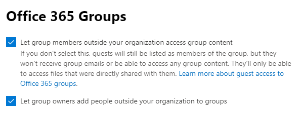
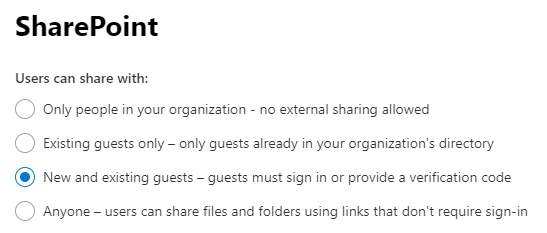
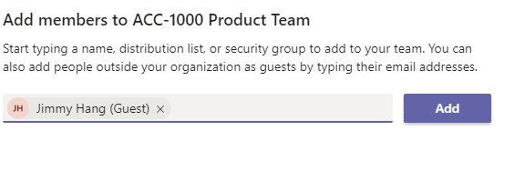

# Managing External Guest in SharePoint vs Teams

"Guest", such a beautiful word, in my humble opinion Guest Users is one of the most valuable assets we have, and learning how to best collaborate with Guest users is an essential skill set. 

Lucky for us Microsoft with the continuous innovations in Office 365 makes the process more seamless everyday.
* Guest Users -> is a user outside of your Office 365 organisation.

## How do you enable it?  
In Office 365 Central Administration center:
1. Verify that Sharing is Enabled for the Tenant in Tenant Admin center 

    

2. Verify Office 365 Group allow users to invite guest

    

3. Verify in SharePoint Admin center guest sharing is on

    

## What is the differences in Permissions and Sharing

At basic level Microsoft Teams have two permissions sets: 
1. Owner | Full control of the Team, and Site Collection Administrator of the backend SharePoint Site
2. Member | Edit permission to the Team, and member with "Edit" rights to the backend SharePoint Site  

SharePoint on the other hand have a lot more:
1. Site Collection Administrator | Full control of the SharePoint site
2. Site Owner | Owner permission to the site but cannot control some feature in the Site Collection
3. Site Members | Edit permissions to the site, this allow the users to also modify lists
4. Site Visitors | Read only permissions to the site

Differences when in use
* It is very easy to see who is a guest in Teams, all guest will have (guest) appended to their user name
* In SharePoint you have to check the email address to verify this
* In Teams, guest cant be owner of the Team
* In SharePoint, a guest can be promoted to Owner of the site
* In SharePoint(Groups) you can't add external guest as a member of the O365 Group, this has to be done through Outlook web app, but you can share the SharePoint site only   

    
    

What about "Permissions inheritance"

* Teams -> the only option to break inheritance in Teams is to create a #PrivateChannel in the Team
* SharePoint -> members and owners are allowed to break inheritance at any level, list, folder, files

Currently there is a number of things you can't do in Teams that force users to "navigate to SharePoint"
1. File versioning, users can't see version history in Teams
2. Edit file metadata
3. Publish a file a major version if major/minor versioning is used
4. Start a Flow from a file
5. Sharing folders or files

## How does it works then?
In most of the use cases I've beeing dealing with lately I have to use a combination of both Teams and SharePoint's sharing features to make it works as it should.

### Use case #1
Imagine you have a "Privat Project Team", that is restricted to members:
* You need owners and members, this can easily be managed by Team
* If you have Guest that are members to the project, you can easily invite them to your Team

    

### Use case #2
Imagine you have a "Privat Project Team", that is restricted to members but have some content that need to be reviewed by someone who is not a member fo the project, and cannot be added as a member to the team for any reason.
* You use Teams to add/remove members as needed to your project, including guest users
* You then use SharePoint to share any content to any other users who is not a member, both internal and guest

    

### Use case #3
Imagine you have a "Privat Project Team", that is restricted to members, and you need to add guest to the project to collaborate on all files but don't want them to have access to the Teams Conversations, and other Teams connected apps.
* You use Teams to add/remove members as needed to your project, including guest users
* You then invite the "others" external guest to the SharePoint site only as members
* You can offcourse share the SharePoint site to visitors to allow read-only access to all content

    

## How to check if you have a lot of external users

* In Teams, just look at the members list, everyone with (guest) is external
* In SharePoint, use the new "External user report" in Site Analytics to verify

 
 
 

Usefull ressources:
* https://docs.microsoft.com/en-us/office365/admin/create-groups/manage-guest-access-in-groups?view=o365-worldwide
* https://support.office.com/en-us/article/adding-guests-to-office-365-groups-bfc7a840-868f-4fd6-a390-f347bf51aff6?WT.mc_id=365AdminCSH&ui=en-US&rs=en-US&ad=US

 

------

**Principal author**: Jimmy Hang, MCT, MCSE: Productivity 

**LinkedIn**: https://www.linkedin.com/in/jimmyhang/

**Blog**: https://hangconsult.com
