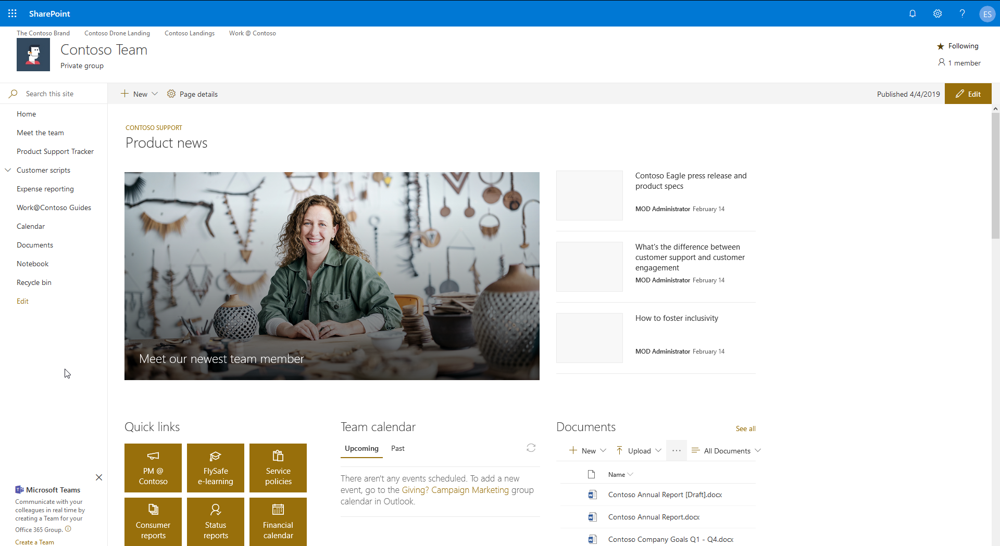
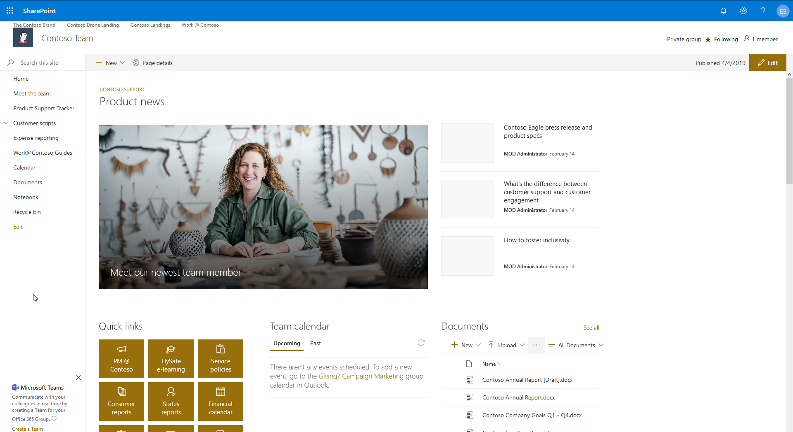
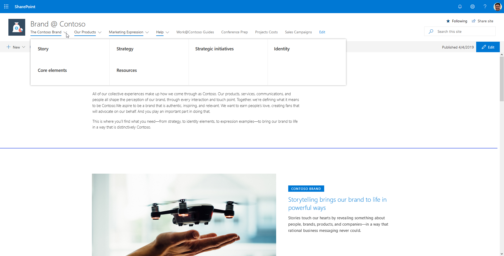

# A Guided Tour Designed to Help You Select an Effective Navigation Strategy
Modern navigation in SharePoint Online can be tricky. There are many different native options provided by Microsoft. Let's take a look at what's available and discuss some more robust alternatives.

# Site Type
A modern site is either a team site or a communication site. Each has its own options for navigation. If you're not sure what type of site to create, check out [Teams Site vs. Communication Site: Which one should I choose?](team-site-or-communication-site.md) for guidance.

## Team Site Navigation Notes
- Top link bar customizable via ~siteUrl/layouts/15/topnav.aspx
  - Hidden from the UI team site connected to an Office 365 Group
- Left navigation supports up to 2 levels
- Header can be standard or compact

## Communication Site Navigation Notes
- Page at ~sitecollection/layouts/15/topnav.aspx has no effect
- Top navigation supports up to 3 levels
- Top navigation can be configured as cascading drop-downs or as a mega menu
- No left navigation
- Header can be standard or compact

# Site Header
The header is one of the places where you'll see your navigation elements, so let's briefly take a look at the options available to configure the header.

The modern header has two states: standard (default) and compact. The difference between the two is minimal, but sometimes a little bit of space can have a significant impact.

## Header Options

## Team Site with a Standard Header

## Team Site with a Compact Header

## Communication Site with a Standard Header

## Communication Site with a Compact Header

# Top Link Bar (applies only to Team sites)

## Top Link Bar Application Page
### https://siteUrl/_layouts/15/topnav.aspx (replace siteUrl with the URL of your site)

Navigate to the Top Link Bar page (see link above) in your team site's settings, you can add a single level of links that will appear above the site logo in the header area.

***Note*** - In a team site connected to an Office 365 group you will not see the "Top link bar" option in the "Look and Feel" section of the Site Settings page. However, you can still get to using the URL above and it will still work.

## Team Site with a Standard Header and the Top Link Bar

## Team Site with a Compact Header and the Top Link Bar

# Site Navigation (applies only to Communication sites)
Communication sites offer the following options for navigation:
- Cascading
- Mega Menu

## Communication Site with a Standard Header and Cascading Navigation

## Communication Site with a Standard Header and Mega Menu Navigation

## Communication Site with a Compact Header and Cascading Navigation

## Communication Site with a Compact Header and Mega Menu Navigation

# Alternatives
Links out to community samples and other options go here.